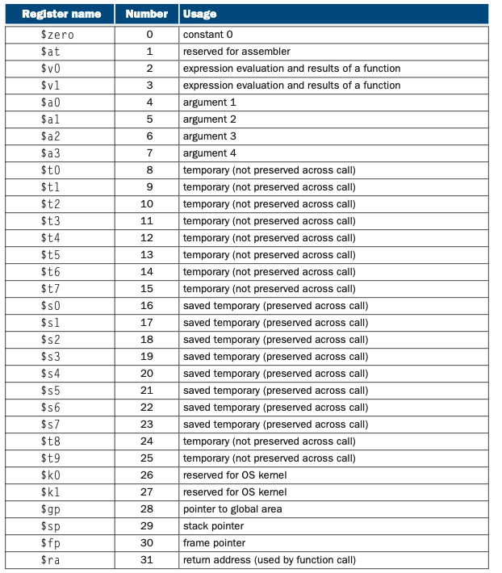
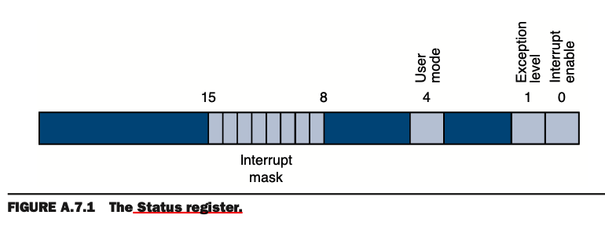
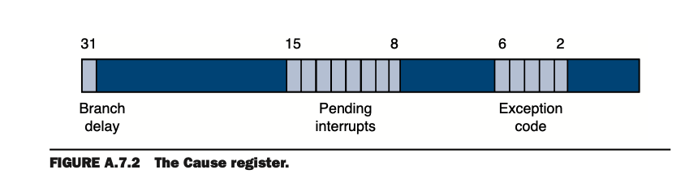

### SPMI simulator:

MIPS的指令全是固定长度的。

在MIPS中，只有子进程调用，加载，存储，指令是指向绝对地址的，需要在link时重新定位。其他和程序相关的地址，如branch，则不需要。

MIPS汇编器会通过硬件指令集合成伪指令，具体在Section2.6和Chapter2。MIPS汇编起会使用专用的寄存器来优化生成的代码。

名词属性解析: 

**machine language**: 以二进制的形式与机器进行交互

**assembler** : 将指令符号转换成二进制文件，即将汇编语言转换成机器语言。

**macro**：模式指令和替换工具，用简单的机制命名一系列的指令

*object file*：由assembler生成，包含计算机指令并记录一些用于组合多个object文件组成一个程序的信息。


**unresolved reference**：需要从外部获得更多信息，它指向了其他boject file或library的lables

**linker**：也称为链接编辑器。 组合独立组装的机器语言程序并将所有未定义标签解析为可执行文件的系统程序。

*labels*：识别与命名保存特殊的指令与与数据的内存字。在编译语言中，以:结尾，如main:, str:命名下一个下一个内存地址。其分为全局lable和本地lable，全局lable可被其他文件reference访问。

modules： 被独立的写，编译，解释。

program library：能提供提前写好的线程


assembler directive: 以 .开头，如.data, .global, 告诉assembler以什么方式来转换程序但是不生成额外的继续指令。

embedded： 高级语言与汇编语言混合。


symbol table: 维持lables的名字-》其指令集在内存中的位置。（如何确定指令所在内存中的位置呢？我猜测是每一个assembly statement 为一个机器指令，由此向下计算出对应lable的所在statement顺序从而知道其在内存中的位置。）


backpatching: 为了加快汇编，一次性汇编所有的source fill，每当有一个global lable被定位时，向前填充对应的lable内存地址。

separate compilation： 将一个程序分割成很多文件，使得它们可以不依赖其他文件单独编译。

external symbol：link时，从其他文件来解决自身的unresolved reference的同名的全局lable。

linker system program basic librarie：包含读写数据，分配与释放内存，数字操作的进程。

stack segment: 

register-use convention： 也被叫做procedure call convention， 是一个软件协议用来规范使用对寄存器的使用管理。方便程序员一起协作避免bug。

caller-saved register：短暂性地用来保存当前线程的数据

callee-saved register：持续性地保存跨调用的值，不希望被改变，所以每一个procedure在运行前都会保存当前的callee-saved register并在返回时赋给同样的值。

procedure call frame：一般也叫做stack fram，保留调用栈信息。保存调用信息，包括调用下一个procedure的参数，调用者不希望被修改的当前寄存器信息，调用者的本地变量。由于在大多数变成语言中，调用和返回都严格遵循LIFO的顺序,所以此内存块一般都分配在栈内，因此也叫做栈帧。所以每一次调用都将扩展一个新的栈帧内存块。

interrupt handler：由异常或者中断结果生成的一系列代码。

---------

#### assembler

有两个作用：

from assembly language statement

1: 通过lable找到对应的内存地址，所以指令可以知道具体的地址。

2:对每一个汇编陈述，将opcode，注册表，标签，组合成一串数字以成为一条合法的指令。

生成 object file， 包含机器指令，数据，记录一些book。由于此文件有unresolved reference，所以此文件无法直接运行。由于需要由linker来解决这些unresolved reference，所以assembler还需要提供一系列的lables和unresolved references。


lables：不像高级语言，lables可以在被定义前使用。这样的关系被称为 forward reference, 会强制assembler将程序转换成两步：先找到所有的lables然后然后生成指令。

步骤：

为了方便起见，assembler对每一个文件都默认从起始地址0开始，而当它们在内存中被分配好位置时，linker会重新进行定位。

1:对每一行汇编语句，打散成由最基本的词素所构成的语句（由单独的文字，数字，标点符号构成），如： ble  $t0, 100, loop.包含操作码ble，寄存器地址 $t0, 一个逗号，数字一百，和一个别名loop。

2:如果一行是以lable开头的，将名称与其指令内存地址记录在symbol table中。由于要知道每个lable指向的指令的具体内存地址，所以需要计算每一个指令占用内存的大小，以此定位一个lable指向的指令的内存地址。由于有些指令时动态长度的，如VAX，需要进行仔细的检查，而一些是动态的，如MIPS的指令，则只需要粗略的检查即可，如mips32系统的每个指令占用32bit，所以可以算出每一行指令占用内存位置。同时也以类似方法计算出每一个data statement所需要的空间。

3:当assembler达到最后时，symbol table记录下当前文件每一个lable与其对应的内存位置。

4: 再次将文件读取一遍，生成机器码。此操作再次检查文件的每一行，对于包含指令的行，assembler结合它的opcode的二进制形式与操作数(寄存器地址或内存地址)为一条合法的机器指令。如果包饭unresolved reference，则不会被完全汇编。


object file format：

在UNIX系统中，由以上操作的生成object file包含6个不同的部分：

1: object file header：链式链接其他的文件的大小与位置。（不确定？）

2: text segment：源文件的机器语言的代码（指令集代码），由.text进行声明。

3: data segment： 源文件的数据的二进制形式，被程序使用的初始化数据，由.data进行声明。

4:  relocation information：标识依赖绝对地址的指令与数据。当程序在内存中进行移动时，引用需要被改变。

5:	symbol table： 关联源文件的labels与其地址，包含一系列的unresolved reference。

6: debugging information： 仔细描述了程序是如何被编译的。


为了更方便地使用汇编语言，assembler增加了一些assembler directive：

1: string directive： .asciiz :将一连串的定义一连串的字符按照asccal方式生成字节，

2: .data: 声明包含数据。

3: .text.声明声明接下来的内容包含指令。

4: .align n：将内容对齐，每一个块最大为n个方字节，未满则向后补0。

5: .global main: 声明全局标签main，可被其他文件访问。

6: .macro： 宏定义重复的动作。

```assembly
.data
int_str: .asciiz"%d"
				.text
				la $a0, int_str 将int_str的地址存在$a0寄存器中
				mov $a1, $7 将$7寄存器的内容拷贝到$a1寄存器中
				jal printf 跳转到printf的地址，参数为$a0,$a1将打印数字
```

宏定义：

```assembly
	.data
int_str: .asciiz "%d"
					.text
					.macro print_int($arg) 将传递到宏中的参数
					la $a0, int_str 将int_str的地址存储到$a0
					mov $a1, $arg 加载宏的参数$arg到$a1中
					jal printf
					.end_macro
print_int($7) //此调用直接被宏定义扩展，不是系统调用，扩展后为

				la $a0, int_str 将int_str的地址存在$a0寄存器中
				mov $a1, $7 将$7寄存器的内容拷贝到$a1寄存器中
				jal printf 跳转到printf的地址，参数为$a0,$a1将打印数字
				
	
	print_int($0) //但其有局限性，此被扩展为
	
				la $a0, int_str 将int_str的地址存在$a0寄存器中
				mov $a1, $a0 将$a0寄存器的内容拷贝到$a1寄存器中
				jal printf 跳转到printf的地址，参数为$a0,$a1将打印数字
				//此时无法正常调用printf，所以调用者需要知道到宏内部细节
```


-------------

#### Linkers

有三个任务：

1:search： 搜索程序的libraries来找到程序所使用的库进程。

2:determine memory location： 决定每个module在内存中占用的地址，并通过调整绝对地址重新定位指令。

3: resolve references：解决各个object file中的引用。


步骤：

由于assembler在汇编时，每个文件的symbol table记录了自己lable。所以首先要确保程序不包含没有定义的lable。然后对external symbol和unresolved references进行匹配。由于程序可能包含一些不在object file中的库线程，所以当linker匹配玩程序所有的symbol后，会搜索程序引用的系统程序库去寻找预定义的字进程与数据结构。如果还是有unresolved reference，则报错且无法link成功。值得注意的是，匹配是一个递归的过程，当一个程序已用了一个库线程时，linker会extract线程的代码到程序的text segment中（会改变指令的内存地址），这些线程也许会依赖其他的库线程，于是会递归解决直到没有unresolved references。

当解决完所有的symbol后，linker会决定每一个module所占用的内存地址。由于文件是独立汇编的，所以assembler不知道如何替换module的指令或数据（参考上一个步骤，module的线程会直接合并到程序的text segment中），所以当匹配替换完成后，linker会重新定位绝对引用的真实地址。由于linker可以通过重定位来标明所有的relocatable references，所以它可以很方便的backpatch这些引用。

最后linker生成一个可在电脑上运行的可执行文件，此可执行文件与object file有相同的格式，但是不存在unresolved references与relocation informati。


--------------

#### Loading

任务：加载可执行程序。

步骤：

1:读取可执行文件的头文件（即 object file header），以确定text和data segment的大小。

2:为程序创建新的地址空间。此空间要足够大，以维持text和data，此外还有stack segment。

3:将可执行文件的指令与data拷贝到新的地址空间。

4:将要传递给程序的arguments拷贝到stack。

5:初始化机器的注册表。通常情况下大多数注册表是清空的，但是栈指针必须被分配第一个free stack的地址。

6:跳转到将参数从栈空间到寄存器并调用程序main线程的线程。

---------

#### Memory usage

作用：内程序的内存空间的分配规范（不唯一的，由大家程序员自发遵守的）

##### MIPS 并不强制以下的一些习惯，只是同意编程者可以按照以下习惯来写，增加不同的工作者一起合作的效率。

通常情况下内存被分为三部分：

1: text segment。保存程序的指令集，在地址空间的最底部(从0x400_000开始)

2: data segment。其保存的数据由可分为static data和dynamic data。static data在汇编时就能直接分配地址，linker会将静态对象分配给data segment并解决这些reference。其起始地址通常为0x10_000_000,静态数据的长度对于编译器和程序的整个生命周期都是已知的。由于load指令和store指令无法直接指向那些与它们偏移16bit的对象（我猜测是为了进行保证数据的完整性，否则可能会中间截取数据，详情看Chapter2的Section2.4）,

如要加载0x10_010_020地址的数据到寄存器$v0:

```assembly
lui $s0, 0x1001 #将0x1001的二进制数据向左偏移16位，相当于16进制偏移4位，然后将结果保存到$s0寄存器中
lw  $v0, 0x0020($s0) #将内存地址0x0020加上寄存器$s0里所保存的值，赋值给寄存器$v0，此时0x10_010_000+0x0_020==0x10_010_020 
```

为了避免在load和store时重复性的使用lui指令，**MIPS**系统特意提供了一个寄存器地址$gp作为全局的指针来指向静态data segment地址，这个注册表包含0x10_08_000地址，其可以访问16^4即64KB内的static data segment所以可以写成：

```assembly
lw $v0, 0x8_020($gp) #0x8020+0x10_008_000=>0x10_010_020
```

由于减少了指令，所以在获得此地址区间的数据要比其他堆地址更快。MIPS编译器通常把全局的可定位的变量存放在此区间。

而dynamic data即动态数据，是在运行时才能确定其大小与位置。动态数据是在静态数据上，向上进行扩展的，通过`sbrk`系统调用来对dynamic data segment短暂的增加的虚拟地址空间页。

3:stack segment：保存在虚拟地址空间的最顶部(从0x7f_fff_fff开始)，也是动态，由程序运行时进行向下扩展。

以上三种内存三部分并不是唯一的一种模式。但它拥有两个重要的特征，即两个动态存放的数据空间应该被隔离得足够大，以防止占满整个程序的内存空间。

--------------

#### Procedure Call Convention 或者 Register use

作用：由程序员自发遵守的对于registers的使用规范。

MIPS有32个通用的registers[0,32]：

$0总是包含硬规定的0值。

$at(1),$k0(26),$k1(27)被预留给汇编器和操作系统使用，程序和编译器永远不要使用这些注册表。

$a0-$a3(4-7)用来传递线程的前四个参数（多余的参数在栈空间传递）

$v0(2)和$v1(3)被用来保存函数的返回值

$t0-$t9(8-15,24,25)，是caller-saved registers，被用来存储短暂的在当前调用的数字。

$s0-$s7(16-23)，是callee-saved registers，用来保存跨调用且持续存在的值，不希望被改变。

$gp(28),为global pointer，可以直接访问中间64k的内存块(最大的偏移量为 0xffff($gp))。

$sp(29),为stack pointer，指向栈空间的最后一个位置。$fp(30),是fram pointer，指向帧（栈）区域的第一个内存地址，由于栈空间是向下扩展的，即从高地址位到低地址位，所以$fp一般大于$sp。`jal`指令保存当前指令的下一行指令的位置到$ra(31),$ra=PC+4，使得调用完成后将返回到此地址。



-----------

#### Procedure Calls

作用：实现procedure作为调用者调用另一个procedure被调者

一般集中在 procedure call frame内存块中，记录调用下一个procedure的参数，调用者的本地参数，调用者的当前寄存器值。

procedure通过$fp的指针来快速获得它自身栈帧的值。


由于在调用发生时有两个时间节点。在调用的发起调用前，以及被调用者执行前。MIPS机器通常使用以下调用流程规范：

在调用者调用发起前：

1: 分配此真空间的内存空间，方法为$sp向下扩展此帧空间的大小。

2: Pass arguments。前四个参数被传给$v0-$v3,剩下的参数被push到栈空间并出现在被调的栈帧空间的起始地方。

3:save caller-saved registers。由于caller-saved registers是保存可改变的短暂的值，所以这些寄存器存储的值在调用后可能会发生改变，如果此调中者想要保留这些值，则需要存储到栈空间。

4:执行`jal`指令，调到被调者的第一个指令并保存返回的地址PC+4到$ra

在被调线程开始运行前，启动其栈帧空间：

1:通过栈指针的地址减去此帧的尺寸，给帧分配内存地址。

2:保存 callee-saved registers，因为调用者是默认这些值不改变的，所以需要把这些值提前保存并在返回时赋值。

3: $sp减去4赋值给$sp，使得$sp指向最后的stack空间地址,,并存储到并将自己的当前帧地址（$sp+帧大小）的指针保存到$fp,

最后被调者执行完以下步骤后返回调用者：
1:如果被调函数有一个返回值，将此值放到$v0中。

2: 将之前保存的callee-saved registers重新保存到寄存器中。

3:弹出栈帧空间，通过$sp=$sp+栈帧大小

4:跳转到$ra所存储的地址。

Procedure call example：

```c
main()
{
	printf("the factorial of 10 is %d\n",fact(10));
}
int fact (int n)
{
	if (n < 1)
		return (1);
	else
		return (n * fact(n-1));
}
```

```assembly
	.text
	.align 4
	.global main
main:
#在调用前先扩展空间并保存
	subu  $sp, $sp, 32 #$sp=$sp-32，栈空间向下扩展32字节
	sw 	  $ra, 20($sp) #20+$sp的地址空间保存$ra的值
	sw 	  $fp, 16($sp) #16+$sp的地址空间保存$fp的值
	addiu $fp, $fp, 28 #$fp=$sp+28
	
	li $a0, 10 #$a0=10
	jal fact 	#jump到fact的第一条instruction，切$ra=PC+4
	
	la $a0, $LC #将$LC低中中的值赋值给$a0
	move	$a1, #v0 #将$v0的值赋值给$a1
	jal printf #jump到printf的第一条指令，并将$ra=PC+4
	
	#在返回前对callee-saved还原
	lw $ra, 20($sp) #20+$sp的地址空间保存的值赋给$ra
	l2 $fp, 16($sp) #16_$sp的地址空间保存的值赋给$fp
	#清除出栈空间
	addiu $sp, $sp, 32 #$sp=$sp+32，栈空间向上弹出32字节
	jr $ra #跳转$ra所指向的地址
	
	.rdata
$LC:
	.acii "the factorial of 10 is %d\n\000"
	
	#fact procedure也和main差不多，但是其会保存被调时的参数
	.text
fact:
	subu $sp, $sp, 32
	sw $ra, 20($sp)
	sw $fp, 16($sp)
	addiu $fp, $sp, 28
	sw $a0, 0($fp) #保存$a0里的参数保存到栈帧第一个位置
	#计算
	lw $v0, 0($fp)将参数加载到$v0
	bgtz $v0,$L2 #如果参数大于0，则跳转到$L2指令，否则执行PC+4指令，即下一个指令
	li $v0, 1 #此时参数小于等于0，将1赋值给返回参数
	jr $L1 #跳转到$L1指令
	
$L2:
	lw $v1, 0($fp) #将参数保存$v1
	subu $v0,$v1, 1 #$v0=$v1-1，即计算n-1
	move $a0, $v0 #将$v0的值拷贝到$a0
	jal fact #调用fact，并将$ra设置为PC+4
	
	lw $v1, 0($fp) #将参数保存到$v1
	mul $v0,$v0,$v1 #$v0 = $v0 * $v1,计算n * fact(n-1)
	
$L1:
#重新还原callee-saved registers，清理栈空间,跳到$ra
	lw $ra, 20($sp) 
	lw $fp, 16($sp)
	addiu $sp, $sp, 32
	jr $ra
	
```

MIPS不怎么使用$fp，所以此寄存器可以被视为callee-saved pointer，$s8。这节省了一些指令，但是增加了生成的困难性，因为一个procedure只能通过$sp来访问其栈帧，但是$sp在procedure执行过程中是随时会变的。

以下代码被广泛用于基准测试。

```c
int tak(int x, int y, int z)
{
  if (y < x)
    return 1 + tak(tak(x -1, y, z),
                   tak(y - 1, z, x),
                   tak(z - 1, x, y));
  else
    return z;
}

int main()
{
  tak(18,12,6);
}
```


---------------

#### Exceptions and Interrupts

任务：负责指令运行时的异常和有I/O设备造成的外部中断。

在MIPS的处理器中，有一部分特殊的CPU成为`coprocessor0`,此处理器记录软件需要处理的异常和中断的信息。但是MIPS的模拟器SPIM并不会实现这些coprocessor0的寄存器，因为有一些事无用的或者与SPIM的内存系统不匹配。SPIM提供以下的coprocessor0寄存器：

| register name | register number | usage                                                        |
| ------------- | --------------- | ------------------------------------------------------------ |
| BadVAddr      | 8               | 当某个引用获得内存地址发生意外时，此寄存器会保存被引用的内存地址 |
| Count         | 9               | 定时器，默认情况位1_000_000次每秒                            |
| Compare       | 11              | 与定时器比较的值，当它们匹配时会导致level5硬件中断           |
| Status        | 12              | interrupt的mask，允许哪种错误中断处理器。机器的配置信息，kernel mod为0，user mod为1.由于SPIM处理器没有实现kernel mod，所以此位为1 |
| Cause         | 13              | 无论是否允许，都会将发生的错误bit记录并且一旦status变更为enable对应的bit，它将会中断处理器。 |
| EPC           | 14              | 记录造成异常的指令地址，但是发生一个错误的jump和branch时，exception handler会查找EPC+4的发生错误的指令。当然，exception handler也可以在任意情况下查找EPC的地址。 |
| Config        | 16              | 机器的配置信息。                                             |
|               |                 |                                                              |

以上7个coprocessor的寄存器可通过`mfc0`和`mtc0`指令获得。






而exception code register描述了异常的原因：

| Number | Name | Cause of exception                  |
| ------ | ---- | ----------------------------------- |
| 0      | Int  | 硬件中断                            |
| 4      | AdEL | 地址错误异常（load或者fetch指令时） |
| 5      | AdES | 地址错误异常（store）               |
| 6      | IBE  | fetch指令时的bus错误                |
| 7      | DBE  | 加载或存储数据时的bus错误           |
| 8      | Sys  | 系统调用异常                        |
| 9      | Bp   | 断点异常                            |
| 10     | RI   | reserved instruction exception      |
| 11     | Cpu  | coprocessor unimplemented           |
| 12     | Ov   | 算术溢出异常                        |
| 13     | Tr   | trap                                |
| 15     | FPE  | floating point                      |

异常和中断会导致MIPS处理器跳转到特定的代码块(0x80_000_180，kernel内部)，此代码块被称为异常处理器。它检查异常的原因并调到操作系统合适的point。操作系统会终止造成异常的process或者执行一些动作。如当运行没有实现的指令时，process直接被kill，当一个process的page请求失败时，系统会尝试从disk重新加载页然后恢复process。当异常由外部设备的中断造成时，操作系统通常会将数据移动或移出I/O设备并恢复中断的process。


