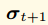是t+1时刻的状态(account trie)。

是状态转换函数，也可以理解为执行引擎。

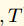 是transaction，一次交易。

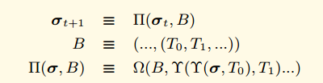

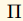  是区块级别的状态转换函数。

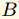  是区块，由很多交易组成。

  0号位置的交易。

 是块终结状态转换函数（一个奖励挖矿者的函数）。

 Ether的标识。

 Ethereum中所用到的各种单位与Wei的换算关系（例如：一个Finney对应10^15个Wei）。

 machine-state

## 一些基本的规则

- 对于大多数的函数来说，都用大写字母来标识。
- 元组一般用大写字母来标识
- 标量或者固定大小的字节数组都用小写字母标识。 比如 n 代表交易的nonce， 有一些可能有例外，比如δ代表 一个给定指令需要的堆栈数据的多少。
- 变长的字节数组一般用加粗的小写字母。 比如 **o** 代表一个message call的输出数据。对于某些重要的也可能使用加粗的大写字母

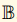 字节序列
 正整数
 32字节长度的字节序列
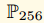 小于 2^256 的正整数
**[ ]** 用于索引数组里面的对应元素
 代表机器堆栈(machine's stack)的第一个对象
 代表了机器内存(machine's memory)里面的前32个元素
 一个占位符号，可以是任意字符代表任意对象

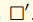 代表这个对象被修改后的值
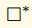 中间状态
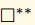 中间状态2
  如果前面的f代表了一个函数， 那么后面的f*代表了一个相似的函数，不过是对内部的元素依次执行f的一个函数。

  代表了列表里面的最后一个元素
  代表了列表里面的最后一个元素
   求x的长度

  a代表某个地址，代表某个账号的nonce
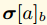 banlance 余额
   storage trie 的 root hash
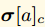 Code的hash。 如果code是b 那么KEC(b)===这个hash

  world state collapse function

  任意的 any
   并集 or
  交集 and

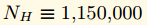 Homestead
## 交易

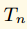 交易的nonce
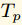 gasPrice
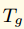 gasLimit
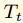 to
 value

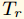通过者三个值可以得到sender的地址

 合约的初始化代码
 方法调用的入参
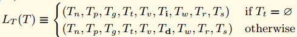

## 区块头

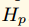ParentHash
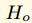OmmersHash
beneficiary矿工地址
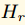stateRoot
transactionRoot
receiptRoot
logsBloom
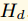难度
number高度
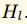gasLimit
gasUsed
timestamp
extraData
mixHash
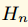nonce
## 回执

 第i个交易的receipt

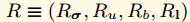
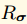 交易执行后的world-state
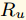交易执行后区块总的gas使用量
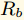本交易执行产生的所有log的布隆过滤数据
交易产生的日志集合

 Log entry Oa日志产生的地址， Ot topic Od 时间

## 交易执行
 substate
 suicide set
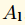 log series
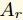 refund balance

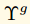 交易过程中使用的总gas数量。
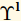	 交易产生的日志。

 执行代码的拥有者
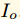 交易的发起者
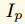 gasPrice
 inputdata
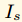 引起代码执行的地址，如果是交易那么是交易的发起人
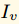 value
 需要执行的代码
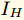 当前的区块头
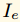 当前的调用深度

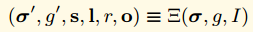 执行模型 s suicide set; l 日志集合 **o** 输出 ; r refund

 执行函数

 当前可用的gas
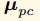 程序计数器
 内存内容
 内存中有效的word数量
 堆栈内容

 w代表当前需要执行的指令

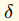 指令需要移除的堆栈对象个数
 指令需要增加的堆栈对象个数
