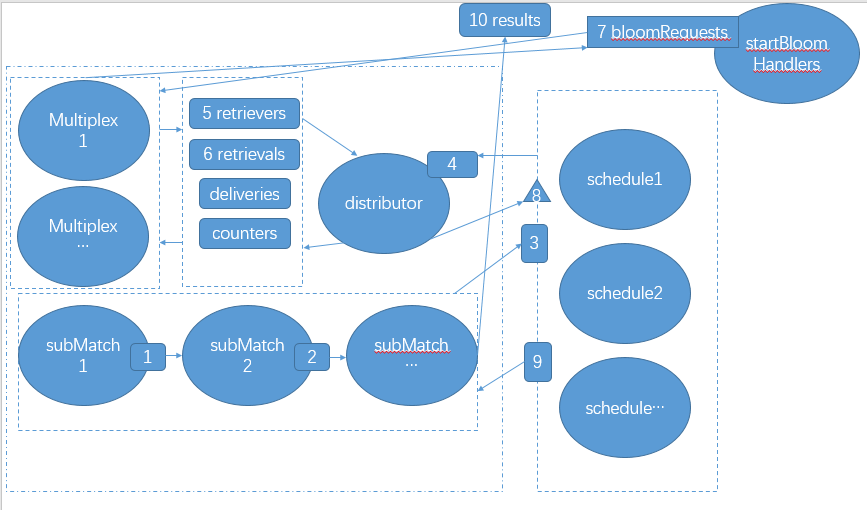

## scheduler.go

scheduler是基于section的布隆过滤器的单个bit值检索的调度。 除了调度检索操作之外，这个结构还可以对请求进行重复数据删除并缓存结果，从而即使在复杂的过滤情况下也可以将网络/数据库开销降至最低。

### 数据结构
request表示一个bloom检索任务，以便优先从本地数据库中或从网络中剪检索。 section 表示区块段号，每段4096个区块， bit代表检索的是布隆过滤器的哪一位(一共有2048位)。这个在之前的(eth-bloombits和filter源码分析.md)中有介绍。
	
	// request represents a bloom retrieval task to prioritize and pull from the local
	// database or remotely from the network.
	
	type request struct {
		section uint64 // Section index to retrieve the a bit-vector from
		bit     uint   // Bit index within the section to retrieve the vector of
	}

response当前调度的请求的状态。 没发送一个请求，会生成一个response对象来最终这个请求的状态。
cached用来缓存这个section的结果。 

	// response represents the state of a requested bit-vector through a scheduler.
	type response struct {
		cached []byte        // Cached bits to dedup multiple requests
		done   chan struct{} // Channel to allow waiting for completion
	}

scheduler

	// scheduler handles the scheduling of bloom-filter retrieval operations for
	// entire section-batches belonging to a single bloom bit. Beside scheduling the
	// retrieval operations, this struct also deduplicates the requests and caches
	// the results to minimize network/database overhead even in complex filtering
	// scenarios.
	type scheduler struct {
		bit       uint                 // Index of the bit in the bloom filter this scheduler is responsible for 布隆过滤器的哪一个bit位(0-2047)
		responses map[uint64]*response // Currently pending retrieval requests or already cached responses 当前正在进行的请求或者是已经缓存的结果。
		lock      sync.Mutex           // Lock protecting the responses from concurrent access
	}

### 构造函数
newScheduler和reset方法

	// newScheduler creates a new bloom-filter retrieval scheduler for a specific
	// bit index.
	func newScheduler(idx uint) *scheduler {
		return &scheduler{
			bit:       idx,
			responses: make(map[uint64]*response),
		}
	}
	// reset cleans up any leftovers from previous runs. This is required before a
	// restart to ensure the no previously requested but never delivered state will
	// cause a lockup.
	reset用法用来清理之前的所有任何请求。
	func (s *scheduler) reset() {
		s.lock.Lock()
		defer s.lock.Unlock()
	
		for section, res := range s.responses {
			if res.cached == nil {
				delete(s.responses, section)
			}
		}
	}

### 运行 run方法
run方法创建了一个流水线， 从sections channel来接收需要请求的sections，通过done channel来按照请求的顺序返回结果。 并发的运行同样的scheduler是可以的，这样会导致任务重复。

	// run creates a retrieval pipeline, receiving section indexes from sections and
	// returning the results in the same order through the done channel. Concurrent
	// runs of the same scheduler are allowed, leading to retrieval task deduplication.
	func (s *scheduler) run(sections chan uint64, dist chan *request, done chan []byte, quit chan struct{}, wg *sync.WaitGroup) {
		// sections 通道类型 这个是用来传递需要检索的section的通道，输入参数
		// dist     通道类型， 属于输出通道(可能是网络发送或者是本地检索)，往这个通道上发送请求， 然后在done上获取回应。
		// done  用来传递检索结果的通道， 可以理解为返回值通道。
	
		// Create a forwarder channel between requests and responses of the same size as
		// the distribution channel (since that will block the pipeline anyway).
		在请求和响应之间创建一个与分发通道大小相同的转发器通道（因为这样会阻塞管道）
		pend := make(chan uint64, cap(dist))
	
		// Start the pipeline schedulers to forward between user -> distributor -> user
		wg.Add(2)
		go s.scheduleRequests(sections, dist, pend, quit, wg)
		go s.scheduleDeliveries(pend, done, quit, wg)
	}

### scheduler的流程图

图中椭圆代表了goroutine. 矩形代表了channel. 三角形代表外部的方法调用。

1. scheduleRequests goroutine从sections接收到section消息
2. scheduleRequests把接收到的section组装成requtest发送到dist channel，并构建对象response[section]
3. scheduleRequests把上一部的section发送给pend队列。scheduleDelivers接收到pend消息，阻塞在response[section].done上面
4. 外部调用deliver方法，把seciton的request请求结果写入response[section].cached.并关闭response[section].done channel
5. scheduleDelivers接收到response[section].done 信息。 把response[section].cached 发送到done channel

### scheduleRequests
	
	// scheduleRequests reads section retrieval requests from the input channel,
	// deduplicates the stream and pushes unique retrieval tasks into the distribution
	// channel for a database or network layer to honour.
	func (s *scheduler) scheduleRequests(reqs chan uint64, dist chan *request, pend chan uint64, quit chan struct{}, wg *sync.WaitGroup) {
		// Clean up the goroutine and pipeline when done
		defer wg.Done()
		defer close(pend)
	
		// Keep reading and scheduling section requests
		for {
			select {
			case <-quit:
				return
	
			case section, ok := <-reqs:
				// New section retrieval requested
				if !ok {
					return
				}
				// Deduplicate retrieval requests
				unique := false
	
				s.lock.Lock()
				if s.responses[section] == nil {
					s.responses[section] = &response{
						done: make(chan struct{}),
					}
					unique = true
				}
				s.lock.Unlock()
	
				// Schedule the section for retrieval and notify the deliverer to expect this section
				if unique {
					select {
					case <-quit:
						return
					case dist <- &request{bit: s.bit, section: section}:
					}
				}
				select {
				case <-quit:
					return
				case pend <- section:
				}
			}
		}
	}

## generator.go
generator用来产生基于section的布隆过滤器索引数据的对象。 generator内部主要的数据结构是 bloom[2048][4096]bit 的数据结构。  输入是4096个header.logBloom数据。  比如第20个header的logBloom存储在  bloom[0:2048][20]

数据结构：

	// Generator takes a number of bloom filters and generates the rotated bloom bits
	// to be used for batched filtering.
	type Generator struct {
		blooms   [types.BloomBitLength][]byte // Rotated blooms for per-bit matching
		sections uint                         // Number of sections to batch together  //一个section包含的区块头的数量。  默认是4096
		nextBit  uint                         // Next bit to set when adding a bloom 当增加一个bloom的时候，需要设置哪个bit位置
	}

构造：

	// NewGenerator creates a rotated bloom generator that can iteratively fill a
	// batched bloom filter's bits.
	// 
	func NewGenerator(sections uint) (*Generator, error) {
		if sections%8 != 0 {
			return nil, errors.New("section count not multiple of 8")
		}
		b := &Generator{sections: sections}
		for i := 0; i < types.BloomBitLength; i++ { //BloomBitLength=2048
			b.blooms[i] = make([]byte, sections/8)  // 除以8是因为一个byte是8个bit
		}
		return b, nil
	}

AddBloom增加一个区块头的logsBloom

	// AddBloom takes a single bloom filter and sets the corresponding bit column
	// in memory accordingly.
	func (b *Generator) AddBloom(index uint, bloom types.Bloom) error {
		// Make sure we're not adding more bloom filters than our capacity
		if b.nextBit >= b.sections { //超过了section的最大数量
			return errSectionOutOfBounds
		}
		if b.nextBit != index {  //index是bloom在section中的下标
			return errors.New("bloom filter with unexpected index")
		}
		// Rotate the bloom and insert into our collection
		byteIndex := b.nextBit / 8  // 查找到对应的byte，需要设置这个byte位置
		bitMask := byte(1) << byte(7-b.nextBit%8) // 找到需要设置值的bit在byte的下标
	
		for i := 0; i < types.BloomBitLength; i++ {
			bloomByteIndex := types.BloomByteLength - 1 - i/8
			bloomBitMask := byte(1) << byte(i%8)
	
			if (bloom[bloomByteIndex] & bloomBitMask) != 0 {
				b.blooms[i][byteIndex] |= bitMask
			}
		}
		b.nextBit++
	
		return nil
	}

Bitset返回

	// Bitset returns the bit vector belonging to the given bit index after all
	// blooms have been added.
	// 在所有的Blooms被添加之后，Bitset返回属于给定位索引的数据。
	func (b *Generator) Bitset(idx uint) ([]byte, error) {
		if b.nextBit != b.sections {
			return nil, errors.New("bloom not fully generated yet")
		}
		if idx >= b.sections {
			return nil, errSectionOutOfBounds
		}
		return b.blooms[idx], nil
	}
	

## matcher.go
Matcher是一个流水线系统的调度器和逻辑匹配器，它们对比特流执行二进制与/或操作，创建一个潜在块的流来检查数据内容。

数据结构
	
	// partialMatches with a non-nil vector represents a section in which some sub-
	// matchers have already found potential matches. Subsequent sub-matchers will
	// binary AND their matches with this vector. If vector is nil, it represents a
	// section to be processed by the first sub-matcher.
	// partialMatches代表了部分匹配的结果。 比入有三个需要过滤的条件 addr1, addr2, addr3 ，需要找到同时匹配这三个条件的数据。 那么我们启动包含了匹配这三个条件的流水线。
	// 第一个匹配的结果会送给第二个，第二个把第一个的结果和自己的结果执行bit与操作，然后作为匹配的结果送给第三个处理。
	type partialMatches struct {
		section uint64
		bitset  []byte
	}
	
	// Retrieval represents a request for retrieval task assignments for a given
	// bit with the given number of fetch elements, or a response for such a request.
	// It can also have the actual results set to be used as a delivery data struct.
	// Retrieval 代表了 一次区块布隆过滤器索引的检索工作， 这个对象被发送给 eth/bloombits.go 里面的 startBloomHandlers来处理， 这个方法从数据库来加载布隆过滤器索引然后放在Bitsets里面返回。
	type Retrieval struct {
		Bit      uint
		Sections []uint64
		Bitsets  [][]byte
	}
	
	// Matcher is a pipelined system of schedulers and logic matchers which perform
	// binary AND/OR operations on the bit-streams, creating a stream of potential
	// blocks to inspect for data content.
	type Matcher struct {
		sectionSize uint64 // Size of the data batches to filter on
	
		filters    [][]bloomIndexes    // Filter the system is matching for
		schedulers map[uint]*scheduler // Retrieval schedulers for loading bloom bits 
	
		retrievers chan chan uint       // Retriever processes waiting for bit allocations  用来传递 检索任务的通道
		counters   chan chan uint       // Retriever processes waiting for task count reports  用来返回当前所有的任务数量
		retrievals chan chan *Retrieval // Retriever processes waiting for task allocations  用来传递 检索任务的分配
		deliveries chan *Retrieval      // Retriever processes waiting for task response deliveries  检索完成的结果传递到这个通道
	
		running uint32 // Atomic flag whether a session is live or not
	}

matcher的大体流程图片，途中椭圆代表goroutine. 矩形代表channel。 三角形代表方法调用。

1. 首先Matcher根据传入的filter的个数 创建了对应个数的 subMatch 。 每一个subMatch对应了一个filter对象。 每一个subMatch会把自己的查找结果和上一个查找结果按照位与的方式得到新的结果。 如果新的结果所有的bit位都有置位，就会把这个查找结果传递给下一个。 这是实现对所有的filter的结果求与的短路算法。  如果前面的计算已经不能匹配任何东西，那么就不用进行下面的条件的匹配了。
2. Matcher会根据fiters的布隆过滤器的组合下标的个数来启动对应个数的schedule。
3. subMatch会把请求发送给对应的schedule。
4. schedule会把请求调度后通过dist发送给distributor， 在distributor中管理起来。
5. 会启动多个(16)Multiplex线程，从distributor中获取请求，然后把请求发送给bloomRequests队列, startBloomHandlers会访问数据库，拿到数据然后返回给Multiplex。
6. Multiplex通过deliveries通道把回答告诉distributor。
7. distributor调用schedule的deliver方法，把结果发送给schedule
8. schedule把结果返回给subMatch。
9. subMatch把结果进行计算后发送给下一个subMatch进行处理。如果是最后一个subMatch，那么结果会进行处理后发送给results通道。

matcher

	filter := New(backend, 0, -1, []common.Address{addr}, [][]common.Hash{{hash1, hash2, hash3, hash4}}) 
	组间是与的关系 组内是或的关系。  (addr && hash1) ||(addr && hash2)||(addr && hash3)||(addr && hash4)
	

构造函数， 需要特别注意的是输入的filters这个参数。 这个参数是一个三维度的数组  [][]bloomIndexes === [第一维度][第二维度][3] 。 

	// 这个是filter.go里面的代码，对于理解filters这个参数比较有用。 filter.go是Matcher的调用者。 
	
	// 可以看到无论有多少个addresses，在filters里面也只占一个位置。 filters[0]=addresses
	// filters[1] = topics[0] = 多个topic
	// filters[2] = topics[1] = 多个topic
	// filters[n] = topics[n] = 多个topic

	// filter 的参数addresses 和 topics 的过滤算法是， (含有addresses中任意一个address) 并且 (含有topics[0]里面的任意一个topic) 并且 (含有topics[1]里面任意一个topic) 并且 (含有topics[n]里面的任意一个topic)

	// 可以看到 对于filter 实行的是  对第一维的数据 执行 与操作， 对于第二维度的数据， 执行或操作。
	
	// 而在NewMatcher方法中，把第三维的具体数据转换成 布隆过滤器的指定三个位置。 所以在filter.go里面的var filters [][][]byte 在Matcher里面的filters变成了 [][][3]
	
	func New(backend Backend, begin, end int64, addresses []common.Address, topics [][]common.Hash) *Filter {
		// Flatten the address and topic filter clauses into a single bloombits filter
		// system. Since the bloombits are not positional, nil topics are permitted,
		// which get flattened into a nil byte slice.
		var filters [][][]byte
		if len(addresses) > 0 {
			filter := make([][]byte, len(addresses))
			for i, address := range addresses {
				filter[i] = address.Bytes()
			}
			filters = append(filters, filter)
		}
		for _, topicList := range topics {
			filter := make([][]byte, len(topicList))
			for i, topic := range topicList {
				filter[i] = topic.Bytes()
			}
			filters = append(filters, filter)
		}

	// NewMatcher creates a new pipeline for retrieving bloom bit streams and doing
	// address and topic filtering on them. Setting a filter component to `nil` is
	// allowed and will result in that filter rule being skipped (OR 0x11...1).
	func NewMatcher(sectionSize uint64, filters [][][]byte) *Matcher {
		// Create the matcher instance
		m := &Matcher{
			sectionSize: sectionSize,
			schedulers:  make(map[uint]*scheduler),
			retrievers:  make(chan chan uint),
			counters:    make(chan chan uint),
			retrievals:  make(chan chan *Retrieval),
			deliveries:  make(chan *Retrieval),
		}
		// Calculate the bloom bit indexes for the groups we're interested in
		m.filters = nil
	
		for _, filter := range filters {
			// Gather the bit indexes of the filter rule, special casing the nil filter
			if len(filter) == 0 {
				continue
			}
			bloomBits := make([]bloomIndexes, len(filter))
			for i, clause := range filter {
				if clause == nil {
					bloomBits = nil
					break
				} 
				// clause 对应了输入的第三维度的数据，可能是一个address或者是一个topic
				// calcBloomIndexes计算了这个数据对应的(0-2048)的布隆过滤器中的三个下标， 就是说如果在布隆过滤器中对应的三位都为1，那么clause这个数据就有可能在这里。
				bloomBits[i] = calcBloomIndexes(clause)
			}
			// Accumulate the filter rules if no nil rule was within
			// 在计算中 如果bloomBits中只要其中的一条能够找到。那么就认为整个成立。
			if bloomBits != nil {
				// 不同的bloomBits 需要同时成立，整个结果才能成立。
				m.filters = append(m.filters, bloomBits)
			}
		}
		// For every bit, create a scheduler to load/download the bit vectors
		for _, bloomIndexLists := range m.filters {
			for _, bloomIndexList := range bloomIndexLists {
				for _, bloomIndex := range bloomIndexList {
					// 对于所有可能出现的下标。 我们都生成一个scheduler来进行对应位置的
					// 布隆过滤数据的检索。
					m.addScheduler(bloomIndex)
				}
			}
		}
		return m
	}

Start 启动

	// Start starts the matching process and returns a stream of bloom matches in
	// a given range of blocks. If there are no more matches in the range, the result
	// channel is closed.
	func (m *Matcher) Start(begin, end uint64, results chan uint64) (*MatcherSession, error) {
		// Make sure we're not creating concurrent sessions
		if atomic.SwapUint32(&m.running, 1) == 1 {
			return nil, errors.New("matcher already running")
		}
		defer atomic.StoreUint32(&m.running, 0)
	
		// Initiate a new matching round
		// 启动了一个session，作为返回值，管理查找的生命周期。
		session := &MatcherSession{
			matcher: m,
			quit:    make(chan struct{}),
			kill:    make(chan struct{}),
		}
		for _, scheduler := range m.schedulers {
			scheduler.reset()
		}
		// 这个运行会建立起流程，返回了一个partialMatches类型的管道表示查询的部分结果。
		sink := m.run(begin, end, cap(results), session)
	
		// Read the output from the result sink and deliver to the user
		session.pend.Add(1)
		go func() {
			defer session.pend.Done()
			defer close(results)
	
			for {
				select {
				case <-session.quit:
					return
	
				case res, ok := <-sink:
					// New match result found
					// 找到返回结果 因为返回值是 section和 section中哪些区块可能有值的bitmap
					// 所以需要遍历这个bitmap，找到那些被置位的区块，把区块号返回回去。
					if !ok {
						return
					}
					// Calculate the first and last blocks of the section
					sectionStart := res.section * m.sectionSize
	
					first := sectionStart
					if begin > first {
						first = begin
					}
					last := sectionStart + m.sectionSize - 1
					if end < last {
						last = end
					}
					// Iterate over all the blocks in the section and return the matching ones
					for i := first; i <= last; i++ {
						// Skip the entire byte if no matches are found inside
						next := res.bitset[(i-sectionStart)/8]
						if next == 0 {
							i += 7
							continue
						}
						// Some bit it set, do the actual submatching
						if bit := 7 - i%8; next&(1<<bit) != 0 {
							select {
							case <-session.quit:
								return
							case results <- i:
							}
						}
					}
				}
			}
		}()
		return session, nil
	}

run方法

	// run creates a daisy-chain of sub-matchers, one for the address set and one
	// for each topic set, each sub-matcher receiving a section only if the previous
	// ones have all found a potential match in one of the blocks of the section,
	// then binary AND-ing its own matches and forwaring the result to the next one.
	//  创建一个子匹配器的流水线，一个用于地址集，一个用于每个主题集，每个子匹配器只有在先前的所有子块都在该部分的一个块中找到可能的匹配时才接收一个部分，然后把接收到的和自己的匹配，并将结果转交给下一个。
	// The method starts feeding the section indexes into the first sub-matcher on a
	// new goroutine and returns a sink channel receiving the results.

	该方法开始section indexer送到第一个子匹配器，并返回接收结果的接收器通道。
	func (m *Matcher) run(begin, end uint64, buffer int, session *MatcherSession) chan *partialMatches {
		// Create the source channel and feed section indexes into
		source := make(chan *partialMatches, buffer)
	
		session.pend.Add(1)
		go func() {
			defer session.pend.Done()
			defer close(source)
	
			for i := begin / m.sectionSize; i <= end/m.sectionSize; i++ {
				// 这个for循环 构造了subMatch的第一个输入源，剩下的subMatch把上一个的结果作为自己的源
				// 这个源的bitset字段都是0xff，代表完全的匹配，它将和我们这一步的匹配进行与操作，得到这一步匹配的结果。
				select {
				case <-session.quit:
					return
				case source <- &partialMatches{i, bytes.Repeat([]byte{0xff}, int(m.sectionSize/8))}:
				}
			}
		}()
		// Assemble the daisy-chained filtering pipeline
		next := source
		dist := make(chan *request, buffer)
	
		for _, bloom := range m.filters {  //构建流水线， 前一个的输出作为下一个subMatch的输入。
			next = m.subMatch(next, dist, bloom, session)
		}
		// Start the request distribution
		session.pend.Add(1)
		// 启动distributor线程。 
		go m.distributor(dist, session)
	
		return next
	}

subMatch函数

	// subMatch creates a sub-matcher that filters for a set of addresses or topics, binary OR-s those matches, then
	// binary AND-s the result to the daisy-chain input (source) and forwards it to the daisy-chain output.
	// The matches of each address/topic are calculated by fetching the given sections of the three bloom bit indexes belonging to
	// that address/topic, and binary AND-ing those vectors together.
	// subMatch创建一个子匹配器，用于过滤一组地址或主题，对这些主题进行bit位或操作，然后将上一个结果与当前过滤结果进行位与操作，如果结果不全位空，就把结果传递给下一个子匹配器。 每个地址/题目的匹配是通过获取属于该地址/题目的三个布隆过滤器位索引的给定部分以及将这些向量二进制AND并在一起来计算的。
	
	subMatch是最重要的一个函数， 把filters [][][3]的 第一维度的与，第二维度的或， 第三维度的与操作 结合在一起。 

	func (m *Matcher) subMatch(source chan *partialMatches, dist chan *request, bloom []bloomIndexes, session *MatcherSession) chan *partialMatches {
		// Start the concurrent schedulers for each bit required by the bloom filter
		// 传入的bloom []bloomIndexes参数是filters的第二,第三维度  [][3]  

		sectionSources := make([][3]chan uint64, len(bloom))
		sectionSinks := make([][3]chan []byte, len(bloom))
		for i, bits := range bloom { // i代表了第二维度的数量
			for j, bit := range bits {  //j 代表了布隆过滤器的下标 肯定只有三个 取值(0-2048)
				sectionSources[i][j] = make(chan uint64, cap(source)) // 创建scheduler的输入channel
				sectionSinks[i][j] = make(chan []byte, cap(source)) // 创建 scheduler的输出channel
				// 对这个bit发起调度请求， 通过sectionSources[i][j]传递需要查询的section
				// 通过sectionSinks[i][j]来接收结果
				// dist 是scheduler传递请求的通道。 这个在scheduler的介绍里面有。
				m.schedulers[bit].run(sectionSources[i][j], dist, sectionSinks[i][j], session.quit, &session.pend)
			}
		}
	
		process := make(chan *partialMatches, cap(source)) // entries from source are forwarded here after fetches have been initiated  中间channel
		results := make(chan *partialMatches, cap(source)) // 返回值channel
	
		session.pend.Add(2)
		go func() {
			// Tear down the goroutine and terminate all source channels
			defer session.pend.Done()
			defer close(process)
	
			defer func() {
				for _, bloomSources := range sectionSources {
					for _, bitSource := range bloomSources {
						close(bitSource)
					}
				}
			}()
			// Read sections from the source channel and multiplex into all bit-schedulers
			// 从source channel读取sections 并把这些数据通过sectionSources传递给scheduler
			for {
				select {
				case <-session.quit:
					return
	
				case subres, ok := <-source:
					// New subresult from previous link
					if !ok {
						return
					}
					// Multiplex the section index to all bit-schedulers
					for _, bloomSources := range sectionSources {
						for _, bitSource := range bloomSources {
							// 传递给上面的所有的scheduler的输入通道。 申请对这些
							// section 的指定bit进行查找。 结果会发送给sectionSinks[i][j]
							select {
							case <-session.quit:
								return
							case bitSource <- subres.section:
							}
						}
					}
					// Notify the processor that this section will become available
					select {
					case <-session.quit:
						return
					case process <- subres: //等到所有的请求都递交给scheduler 给process发送消息。
					}
				}
			}
		}()
	
		go func() {
			// Tear down the goroutine and terminate the final sink channel
			defer session.pend.Done()
			defer close(results)
	
			// Read the source notifications and collect the delivered results
			for {
				select {
				case <-session.quit:
					return
	
				case subres, ok := <-process: 
					// 这里有个问题。 有没有可能乱序。 因为通道都是有缓存的。 可能查询得快慢导致
					// 查看了scheduler的实现， scheduler是保证顺序的。怎么进来，就会怎么出去。
					// Notified of a section being retrieved
					if !ok {
						return
					}
					// Gather all the sub-results and merge them together
					var orVector []byte
					for _, bloomSinks := range sectionSinks {
						var andVector []byte
						for _, bitSink := range bloomSinks { // 这里可以接收到三个值 每个代表了对应下标的 布隆过滤器的值,对这三个值进行与操作，
						就可以得到那些区块可能存在对应的值。
							var data []byte
							select {
							case <-session.quit:
								return
							case data = <-bitSink:
							}
							if andVector == nil {
								andVector = make([]byte, int(m.sectionSize/8))
								copy(andVector, data)
							} else {
								bitutil.ANDBytes(andVector, andVector, data)
							}
						}
						if orVector == nil { 对第一维度的数据执行 Or操作。
							orVector = andVector
						} else {
							bitutil.ORBytes(orVector, orVector, andVector)
						}
					}
	
					if orVector == nil { //可能通道被关闭了。 没有查询到任何值
						orVector = make([]byte, int(m.sectionSize/8))
					}
					if subres.bitset != nil {
						// 和输入的上一次的结果进行与操作。 记得最开始这个值被初始化为全1
						bitutil.ANDBytes(orVector, orVector, subres.bitset)
					}
					if bitutil.TestBytes(orVector) { // 如果不全为0 那么添加到结果。可能会给下一个匹配。或者是返回。
						select {
						case <-session.quit:
							return
						case results <- &partialMatches{subres.section, orVector}:
						}
					}
				}
			}
		}()
		return results
	}

distributor,接受来自scheduler的请求，并把他们放到一个set里面。 然后把这些任务指派给retrievers来填充他们。
	
	// distributor receives requests from the schedulers and queues them into a set
	// of pending requests, which are assigned to retrievers wanting to fulfil them.
	func (m *Matcher) distributor(dist chan *request, session *MatcherSession) {
		defer session.pend.Done()
	
		var (
			requests   = make(map[uint][]uint64) // Per-bit list of section requests, ordered by section number
			unallocs   = make(map[uint]struct{}) // Bits with pending requests but not allocated to any retriever
			retrievers chan chan uint            // Waiting retrievers (toggled to nil if unallocs is empty)
		)
		var (
			allocs   int            // Number of active allocations to handle graceful shutdown requests
			shutdown = session.quit // Shutdown request channel, will gracefully wait for pending requests
		)
	
		// assign is a helper method fo try to assign a pending bit an an actively
		// listening servicer, or schedule it up for later when one arrives.
		assign := func(bit uint) {
			select {
			case fetcher := <-m.retrievers:
				allocs++
				fetcher <- bit
			default:
				// No retrievers active, start listening for new ones
				retrievers = m.retrievers
				unallocs[bit] = struct{}{}
			}
		}
	
		for {
			select {
			case <-shutdown:
				// Graceful shutdown requested, wait until all pending requests are honoured
				if allocs == 0 {
					return
				}
				shutdown = nil
	
			case <-session.kill:
				// Pending requests not honoured in time, hard terminate
				return
	
			case req := <-dist: // scheduler发送来的请求 添加到指定bit位置的queue里面
				// New retrieval request arrived to be distributed to some fetcher process
				queue := requests[req.bit]
				index := sort.Search(len(queue), func(i int) bool { return queue[i] >= req.section })
				requests[req.bit] = append(queue[:index], append([]uint64{req.section}, queue[index:]...)...)
	
				// If it's a new bit and we have waiting fetchers, allocate to them
				// 如果这个bit是一个新的。 还没有被指派，那么我们把他指派给等待的fetchers
				if len(queue) == 0 {
					assign(req.bit)
				}
	
			case fetcher := <-retrievers:
				// New retriever arrived, find the lowest section-ed bit to assign
				// 如果新的retrievers进来了， 那么我们查看是否有任务没有指派
				bit, best := uint(0), uint64(math.MaxUint64)
				for idx := range unallocs {
					if requests[idx][0] < best {
						bit, best = idx, requests[idx][0]
					}
				}
				// Stop tracking this bit (and alloc notifications if no more work is available)
				delete(unallocs, bit)
				if len(unallocs) == 0 { //如果所有任务都被指派。那么停止关注retrievers
					retrievers = nil
				}
				allocs++
				fetcher <- bit
	
			case fetcher := <-m.counters:
				// New task count request arrives, return number of items
				// 来了新的请求，访问request的指定bit的数量。
				fetcher <- uint(len(requests[<-fetcher]))
	
			case fetcher := <-m.retrievals:
				// New fetcher waiting for tasks to retrieve, assign
				// 有人来领取任务。
				task := <-fetcher
				if want := len(task.Sections); want >= len(requests[task.Bit]) {
					task.Sections = requests[task.Bit]
					delete(requests, task.Bit)
				} else {
					task.Sections = append(task.Sections[:0], requests[task.Bit][:want]...)
					requests[task.Bit] = append(requests[task.Bit][:0], requests[task.Bit][want:]...)
				}
				fetcher <- task
	
				// If anything was left unallocated, try to assign to someone else
				// 如果还有任务没有分派完。 尝试分配给其他人。
				if len(requests[task.Bit]) > 0 {
					assign(task.Bit)
				}
	
			case result := <-m.deliveries:
				// New retrieval task response from fetcher, split out missing sections and
				// deliver complete ones
				// 收到了任务的结果。 
				var (
					sections = make([]uint64, 0, len(result.Sections))
					bitsets  = make([][]byte, 0, len(result.Bitsets))
					missing  = make([]uint64, 0, len(result.Sections))
				)
				for i, bitset := range result.Bitsets {
					if len(bitset) == 0 { //如果任务结果有缺失，记录下来
						missing = append(missing, result.Sections[i])
						continue
					}
					sections = append(sections, result.Sections[i])
					bitsets = append(bitsets, bitset)
				}
				// 投递结果
				m.schedulers[result.Bit].deliver(sections, bitsets)
				allocs--
	
				// Reschedule missing sections and allocate bit if newly available
				if len(missing) > 0 { //如果有缺失， 那么重新生成新的任务。
					queue := requests[result.Bit]
					for _, section := range missing {
						index := sort.Search(len(queue), func(i int) bool { return queue[i] >= section })
						queue = append(queue[:index], append([]uint64{section}, queue[index:]...)...)
					}
					requests[result.Bit] = queue
	
					if len(queue) == len(missing) {
						assign(result.Bit)
					}
				}
				// If we're in the process of shutting down, terminate
				if allocs == 0 && shutdown == nil {
					return
				}
			}
		}
	}

任务领取AllocateRetrieval。 任务领取了一个任务。 会返回指定的bit的检索任务。

	// AllocateRetrieval assigns a bloom bit index to a client process that can either
	// immediately reuest and fetch the section contents assigned to this bit or wait
	// a little while for more sections to be requested.
	func (s *MatcherSession) AllocateRetrieval() (uint, bool) {
		fetcher := make(chan uint)
	
		select {
		case <-s.quit:
			return 0, false
		case s.matcher.retrievers <- fetcher:
			bit, ok := <-fetcher
			return bit, ok
		}
	}

AllocateSections,领取指定bit的section查询任务。

	// AllocateSections assigns all or part of an already allocated bit-task queue
	// to the requesting process.
	func (s *MatcherSession) AllocateSections(bit uint, count int) []uint64 {
		fetcher := make(chan *Retrieval)
	
		select {
		case <-s.quit:
			return nil
		case s.matcher.retrievals <- fetcher:
			task := &Retrieval{
				Bit:      bit,
				Sections: make([]uint64, count),
			}
			fetcher <- task
			return (<-fetcher).Sections
		}
	}

DeliverSections，把结果投递给deliveries 通道。

	// DeliverSections delivers a batch of section bit-vectors for a specific bloom
	// bit index to be injected into the processing pipeline.
	func (s *MatcherSession) DeliverSections(bit uint, sections []uint64, bitsets [][]byte) {
		select {
		case <-s.kill:
			return
		case s.matcher.deliveries <- &Retrieval{Bit: bit, Sections: sections, Bitsets: bitsets}:
		}
	}

任务的执行Multiplex,Multiplex函数不断的领取任务，把任务投递给bloomRequest队列。从队列获取结果。然后投递给distributor。 完成了整个过程。

	// Multiplex polls the matcher session for rerieval tasks and multiplexes it into
	// the reuested retrieval queue to be serviced together with other sessions.
	//
	// This method will block for the lifetime of the session. Even after termination
	// of the session, any request in-flight need to be responded to! Empty responses
	// are fine though in that case.
	func (s *MatcherSession) Multiplex(batch int, wait time.Duration, mux chan chan *Retrieval) {
		for {
			// Allocate a new bloom bit index to retrieve data for, stopping when done
			bit, ok := s.AllocateRetrieval()
			if !ok {
				return
			}
			// Bit allocated, throttle a bit if we're below our batch limit
			if s.PendingSections(bit) < batch {
				select {
				case <-s.quit:
					// Session terminating, we can't meaningfully service, abort
					s.AllocateSections(bit, 0)
					s.DeliverSections(bit, []uint64{}, [][]byte{})
					return
	
				case <-time.After(wait):
					// Throttling up, fetch whatever's available
				}
			}
			// Allocate as much as we can handle and request servicing
			sections := s.AllocateSections(bit, batch)
			request := make(chan *Retrieval)
	
			select {
			case <-s.quit:
				// Session terminating, we can't meaningfully service, abort
				s.DeliverSections(bit, sections, make([][]byte, len(sections)))
				return
	
			case mux <- request:
				// Retrieval accepted, something must arrive before we're aborting
				request <- &Retrieval{Bit: bit, Sections: sections}
	
				result := <-request
				s.DeliverSections(result.Bit, result.Sections, result.Bitsets)
			}
		}
	}

