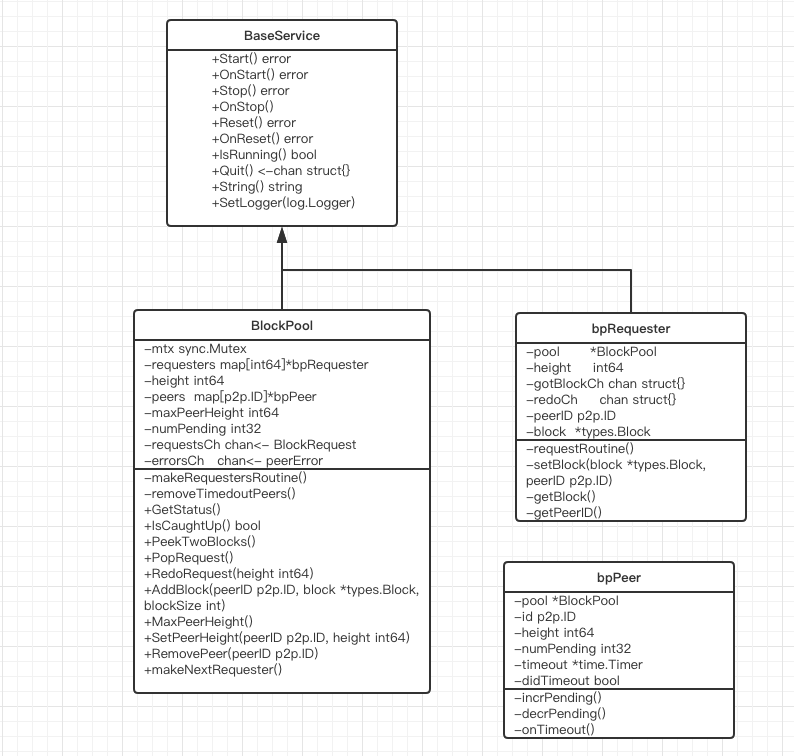
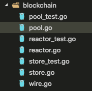
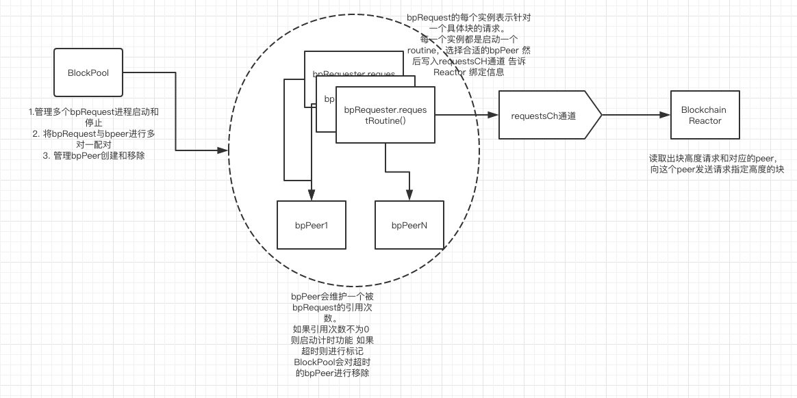
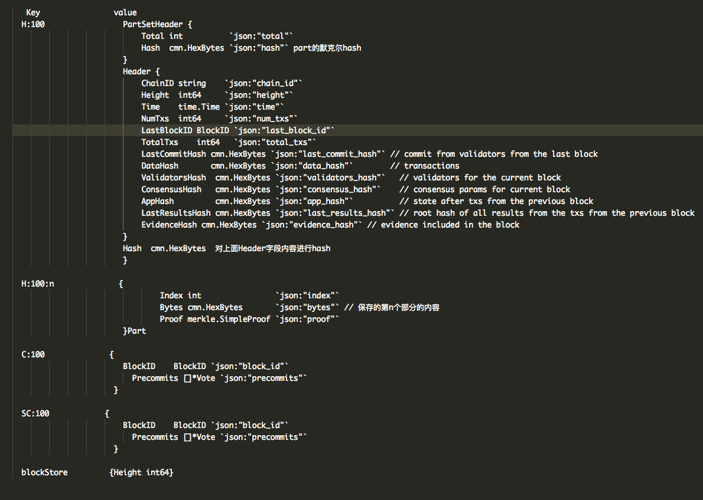

老规矩,先上类图。 (虽然我知道看上去啥也看不出来)


然后顺便看一下blockchain模块的文件目录



也就是说blockchain模块我们只需要看pool.go store.go和reactor.go模块 根据名字猜功能,pool 猜想是存储区块的区块池,对多个区块进行管理的？ store.go应该是和数据库进行相关操作的代码。 reactor.go就显而易见就是和Peer进行通信实现Reactor接口的代码了。
是的当我第一次看这个模块的代码时，就是这样想的。 可是当我仔细看到pool.go的源码时,我真的迷惑了。 代码不到600行，可就是不知道要干什么。 用许三多的话说就是这都写的是啥啥啥？


### pool.go的代码分析
先上一个简单的框图



当你看到上面我画的框图可能也会说这都画的啥啥啥。 是的,我现在真的是在一个只可意会不可言传的阶段。 我尝试去描述整个blockchain模块的流程和功能。 如果到最后您还没有看的太明白, 没关系，你可以再看一遍。😁或许会对上面这个框图有了深一些的理解。

我们先看创建BlockPool做了哪些动作
```go
func NewBlockPool(start int64, requestsCh chan<- BlockRequest, errorsCh chan<- peerError) *BlockPool {
// 初始化一个实例  实现基本NewBaseService接口
// 构造requesters和peers的容器 用map来保存
	bp := &BlockPool{
		peers: make(map[p2p.ID]*bpPeer),

		requesters: make(map[int64]*bpRequester),
		// height字段表示当前应该获取的区块高度
		height:     start,
		// numPending 表示当前正在进行区块请求的request 同时也代表了启动的requesters.requestRoutine()的个数
		numPending: 0,
    // 下面这两个channel是和Reactor进行通信的关键
		requestsCh: requestsCh,
		errorsCh:   errorsCh,
	}
	bp.BaseService = *cmn.NewBaseService(nil, "BlockPool", bp)
	return bp
}
```
接着来看看启动`OnStart`的时候都做了哪些动作?
```go
func (pool *BlockPool) OnStart() error {
	go pool.makeRequestersRoutine()
	pool.startTime = time.Now()
	return nil
}

func (pool *BlockPool) makeRequestersRoutine() {
	for {
		if !pool.IsRunning() {
			break
		}
    // 这个函数是获取当前需要下载的最小的块高度, 进行请求的个数, 已经开启的请求的线程数
    // numPeding 表示当前request正则请求的块,但是还未返回块的reqeust  lenRequester是所有已经启动的request 可能一部分已经返回了块内容
    // 也就是lenRequester>=numPeding
		_, numPending, lenRequesters := pool.GetStatus()
		if numPending >= maxPendingRequests {
			// 如果现在请求的个数大于600个 暂时先不开启新的请求了 并尝试移除哪些被标记为超时的peer
			time.Sleep(requestIntervalMS * time.Millisecond)
			// 注意这个函数 名义上只是移除超时的peer 实际上这个函数处理的时候需要特别小心 因为peer是和request关联的
			// 移除掉它之后 就要把关联的request给取消掉 让request去重新找新的peer去绑定
			// 一会我们追踪它在分析
			pool.removeTimedoutPeers()
		} else if lenRequesters >= maxTotalRequesters {
			// 这个地方感觉和上面类似 lenRequesters其实就是len(requesters)的个数 
			time.Sleep(requestIntervalMS * time.Millisecond)
			// check for timed out peers
			pool.removeTimedoutPeers()
		} else {
			// 如果挂起的请求数量不足600个 那么我们就创建一个routine进行区块请求
			// 从这个我们可以看出来 tendermint是同时默认进行600个区块的下载。
			pool.makeNextRequester()
		}
	}
}
// 也就是说BlockPool启动之后 会一直循环 然后看看是不是有600个routine在进行块请求
// 如果有了 就尝试移除那些被标记为超时的peer，如果没有超过600个routine则继续创建一个请求。
 
 // 我们先追踪makeNextRequester看看它做了什么
 func (pool *BlockPool) makeNextRequester() {
	pool.mtx.Lock()
	defer pool.mtx.Unlock()

 //这个很容易理解  就是接着之前块高度后面继续创建请求 一个请求对应一个块高度
	nextHeight := pool.height + pool.requestersLen()
	request := newBPRequester(pool, nextHeight)
	pool.requesters[nextHeight] = request
	// 注意这句 表明创建一个request pool.numPending就会加一
	atomic.AddInt32(&pool.numPending, 1)

//  启动request任务 这个任务 我下面再说。
	err := request.Start()
	if err != nil {
		request.Logger.Error("Error starting request", "err", err)
	}
}
```
接着我们再看几个BlockPool的重要的成员函数 为了避免代码太长隐藏了主线 我只用文字说明函数的功能。
* `removeTimedoutPeers` 遍历容器中的所有peer 如果已经超时了 则移除掉这个peer 同时将绑定这个peer的所有request进行撤销请求。
* `PeekTwoBlocks`从pool.height和pool.height+1对应的request取出块内容
* `PopRequest` 此时删除pool.height对应的request的routine(通过调用request.Stop()),  更新pool.height+1 也就是说这个函数调用的时候 poo.height这个块高度已经被接收到并处理完成了
* `RedoRequest` 撤销某个块高度对应请求的结果 如果这个request已经绑定了某个peer， 通知绑定这个peer下的所有request均进行撤销请求，然后将这个peer从容器中删除。 这个函数是因为区块交易没通过才会被调用的。 后面会分析到。 request的撤销是通过<redoCh>这个通道置位来标识。后面分析request的routine来解释它是怎么和这个通道进行联系的。
* `AddBlock(peerID p2p.ID, block *types.Block, blockSize int)` 添加一个区块到对应的高度的request。同时将对应的peer超时时间置位。当对应高度的request被添加一个块内容, 说明这个请求的块已经拿到, 这个时候将pool.numPending-1 表示这个请求已经不用挂起了, 同时置位<gotBlockCh>这个通道表示request已经接受到块内容。 注意现在我们已经提到request的两个通道了。 显而易见这个函数应该是在BlockChian的Reactor的Receive函数中会直接或者间接调用的。
* `SetPeerHeight(peerID p2p.ID, height int64)`  其实是更新某个peer对应的最高的区块高度。 这个函数的调用应该也是在Rector的Receive中被调用。 设想一下场景， 本节点向连接的所有peer发送了一个块高度请求， 然后有一些peer回应了自己当前所属的最高块高度。这个时候调用这个函数。
* `RemovePeer` 移除维护的peer 在peer通信出错的时候调用 和RedoRequest做的内容差不多 只是这个是通过peerID来移除对应的peer和撤销所有绑定的request。上面那个函数是根据request来移除对应的peer和撤销内容。
* `pickIncrAvailablePeer` 这个函数就是给一个request找一个合适的peer进行绑定。 同时增加这个peer的numpending值(相当于是引用值)。这个引用值啥用呢，当引用值从0到1 则启动定时器。 当引用值每次减少一个(未减少到0)这个重置定时器。 这个定时器的作用就是为了体现peer是否超时。 也即是表示对于peer的一次块请求是否超时了， 如果超时了我们就在前面的`makeRequestersRoutine`函数中看到了就是把这个peer给移除掉（removeTimedoutPeers）。一会我们分析一下这个peer找超时回调都做了啥。

我们来看看request的启动进程一直在做什么？
```go
func (bpr *bpRequester) requestRoutine() {
OUTER_LOOP:
	for {
		var peer *bpPeer
	PICK_PEER_LOOP:
		for {
			if !bpr.IsRunning() || !bpr.pool.IsRunning() {
				return
			}
			// 这个函数 我们刚才提到了 尝试进行request和peer进行绑定
			peer = bpr.pool.pickIncrAvailablePeer(bpr.height)
			if peer == nil {
				time.Sleep(requestIntervalMS * time.Millisecond)
				continue PICK_PEER_LOOP
			}
			break PICK_PEER_LOOP
		}
		bpr.mtx.Lock()
		bpr.peerID = peer.id
		bpr.mtx.Unlock()
    // 看到最上面的那个框图了吗  就是把{  BlockRequest{height, peerID} 通过requestsCh这个通道发给Reactor 告诉Reactor 找个peer去要块内容  }
		bpr.pool.sendRequest(bpr.height, peer.id)
	WAIT_LOOP:
		for {
			select {
			// 一般这个函数不会调用
			case <-bpr.pool.Quit():
				bpr.Stop()
				return
			// 这个函数就是在PopRequest中调用 说明这个请求的块已经获取并且被验证完保存到数据库中了
			case <-bpr.Quit():
				return
				// 这个 就是对撤销请求的处理
			case <-bpr.redoCh:
			  // 把之前绑定的peer取消掉 pool的numPending加一 
				bpr.reset()
				// 会到循环起始处继续上面的流程
				continue OUTER_LOOP
			case <-bpr.gotBlockCh:
			// 这个通道的置位我上面提到了 说明这个时候request已经添加对呀的区块了 这个时候就是继续等待这个块被处理 然后看是否要撤销请求然后重新进行
			// peer绑定还是说只需要关闭routine就行了。
				continue WAIT_LOOP
			}
		}
	}
}
```
我想如果仔细看到这里，或多或少对这个BlockPool和Peer, request之间的关系稍微有了一些了解。

我们再看一下peer的超时回调做了些什么内容。
```go
// 主要2个事情 一个是向<errorsCh>通道发送了 peerError{err, peerID} 对应的错误信息 由Reactor的来读取 Reactor读到这个内容然后告诉P2P的Switch删除这个peer
// 另一个是pool的routine根据didTimeout将其从容器中移除。
func (peer *bpPeer) onTimeout() {
	peer.pool.mtx.Lock()
	defer peer.pool.mtx.Unlock()

	err := errors.New("peer did not send us anything")
	peer.pool.sendError(err, peer.id)
	peer.logger.Error("SendTimeout", "reason", err, "timeout", peerTimeout)
	peer.didTimeout = true
}
```
pool.go中的内容展示就只分析到这里，如果实在还是不清楚。 没关系， 最后我会以一个场景来说明他们的流转。


### reactor.go源码
先看创建Reactor的代码`NewBlockchainReactor` 
```go
func NewBlockchainReactor(state sm.State, blockExec *sm.BlockExecutor, store *BlockStore,
	fastSync bool) *BlockchainReactor {
  // 接收了三个参数 state是状态组件的状态表示 blockExec 是状态组件中的区块执行器 store 是Blockchain中的store模块
  // state组件我们下次分析 这里暂时人为就是更新区块最新状态 store的功能一会分析
  
  // 判断当前节点最新的区块高度是否和从数据库中加载的一致
	if state.LastBlockHeight != store.Height() {
		panic(fmt.Sprintf("state (%v) and store (%v) height mismatch", state.LastBlockHeight,
			store.Height()))
	}

  // 创建请求通道 和BlockPool的request进行通信
	requestsCh := make(chan BlockRequest, maxTotalRequesters)

	const capacity = 1000                      // must be bigger than peers count
	// 创建和peer出错进行通信的通道
	errorsCh := make(chan peerError, capacity) // so we don't block in #Receive#pool.AddBlock

	pool := NewBlockPool(
		store.Height()+1, // 从未知的块开始下载新的块内容
		requestsCh,
		errorsCh,
	)

	bcR := &BlockchainReactor{
		initialState: state,
		blockExec:    blockExec,
		store:        store,
		pool:         pool,
		fastSync:     fastSync,
		requestsCh:   requestsCh,
		errorsCh:     errorsCh,
	}
	bcR.BaseReactor = *p2p.NewBaseReactor("BlockchainReactor", bcR)
	return bcR
}
```
// 看启动内容 `OnStart`
```go
func (bcR *BlockchainReactor) OnStart() error {
	if bcR.fastSync {
	//  启动创建的BlockPool
		err := bcR.pool.Start()
		if err != nil {
			return err
		}
		// 开启poolRoutine
		go bcR.poolRoutine()
	}
	return nil
}
```
接下来我们看看Reactor的这个主任务在做什么`poolRoutine`
```go
func (bcR *BlockchainReactor) poolRoutine() {
  // 尝试同步时间 10MS
	trySyncTicker := time.NewTicker(trySyncIntervalMS * time.Millisecond)
	// 状态更新时间 10S
	statusUpdateTicker := time.NewTicker(statusUpdateIntervalSeconds * time.Second)
	// 转换到共识时间间隔 1S
	switchToConsensusTicker := time.NewTicker(switchToConsensusIntervalSeconds * time.Second)

	blocksSynced := 0

	chainID := bcR.initialState.ChainID
	state := bcR.initialState

	lastHundred := time.Now()
	lastRate := 0.0

	didProcessCh := make(chan struct{}, 1)

FOR_LOOP:
	for {
	// 开始进行循环 
		select {
		case request := <-bcR.requestsCh:
		  // 说明有请求过来了 查看这个请求想通过那个peer发出
			peer := bcR.Switch.Peers().Get(request.PeerID)
			if peer == nil {
				continue FOR_LOOP // Peer has since been disconnected.
			}
			// 尝试向这个peer发送指定块的内容请求
			msgBytes := cdc.MustMarshalBinaryBare(&bcBlockRequestMessage{request.Height})
			queued := peer.TrySend(BlockchainChannel, msgBytes)
			if !queued {
				// We couldn't make the request, send-queue full.
				// The pool handles timeouts, just let it go.
				continue FOR_LOOP
			}

		case err := <-bcR.errorsCh:
		  // 说明有某个peer回应超时错误了
			peer := bcR.Switch.Peers().Get(err.peerID)
			if peer != nil {
			// 告诉Switch 移除这个peer 代码里默认超时是40S 
			// 这个40s不是开始请求之后的时间 而是从request和peer绑定之后就开始算起
			// 如果40S 仍然木有回应(回应是在Receive中有回调) 就把这个peer标记出错了
			// 如果不是负载过于严重 绑定之后就会立刻读取到requestsCh的内容进行请求了
				bcR.Switch.StopPeerForError(peer, err)
			}

		case <-statusUpdateTicker.C:
			// 每隔10S 向所有的已知peer发送一次 区块高度状态的请求 如果有peer回复了
			// 自己的当前区块高度 就会把高度和对应的peer加入BlockPool的peer容器中 
			// 调用SetPeerHeight  回想一下上面我写的这个函数的功能
			go bcR.BroadcastStatusRequest() // nolint: errcheck

		case <-switchToConsensusTicker.C:
      // 判断是否已经追上了最高块 
			if bcR.pool.IsCaughtUp() {
				bcR.Logger.Info("Time to switch to consensus reactor!", "height", height)
				// 不要被stop迷惑了  BlockPool的Stop啥也没做 之前的routine会依然继续运行
				bcR.pool.Stop()
        // 如果追上最高快 获取共识模块的Reactor 这个SwitchToConsensus 暂时不知做什么  等到阅读共识
        // 模块时在去讨论
				conR := bcR.Switch.Reactor("CONSENSUS").(consensusReactor)
				conR.SwitchToConsensus(state, blocksSynced)

				break FOR_LOOP
			}

		case <-trySyncTicker.C: // chan time
			select {
			case didProcessCh <- struct{}{}:
			default:
			}

		case <-didProcessCh:
		  // 几乎是每10MS就要进入此处 这里才是实际区块处理的地方
		  // 先取出请求的最低的两个区块 也就是当前状态保存的区块下一个和下下一个
			first, second := bcR.pool.PeekTwoBlocks()
			if first == nil || second == nil {
				// 如果没拿到 这继续重新开始
				continue FOR_LOOP
			} else {
				didProcessCh <- struct{}{}
			}
      // 这个函数在types/block.go中 主要实现到的功能就是把Block这个结构序列化 
      // 然后把序列化的内容分隔成多个部分 对分隔的多个部分做默克尔树校验 返回生成的集合对象。
			firstParts := first.MakePartSet(state.ConsensusParams.BlockPartSizeBytes)
			firstPartsHeader := firstParts.Header()
			firstID := types.BlockID{first.Hash(), firstPartsHeader}
     // 对区块进行校验 
			err := state.Validators.VerifyCommit(
				chainID, firstID, first.Height, second.LastCommit)
			if err != nil {
			  // 如果校验失败了 撤销之前的请求块 RedoRequest这个函数上文已有说明
				peerID := bcR.pool.RedoRequest(first.Height)
				peer := bcR.Switch.Peers().Get(peerID)
				if peer != nil {
					// NOTE: we've already removed the peer's request, but we
					// still need to clean up the rest.
					bcR.Switch.StopPeerForError(peer, fmt.Errorf("BlockchainReactor validation error: %v", err))
				}
				continue FOR_LOOP
			} else {
			  // 如果能执行到这里 说明这个块已经被校验通过了 我们需要移除这个块的请求 将块内容进行保存 关于保存的格式和Block的数据结构的定义在store.go分析的时候在去细细研究
				bcR.pool.PopRequest()
				bcR.store.SaveBlock(first, firstParts, second.LastCommit)

				var err error
				// 将这个块提交给blockExec进行重放 猜测这个函数应该会将块的信息给拆解然后通过ABCI提交给APP
				state, err = bcR.blockExec.ApplyBlock(state, firstID, first)
				if err != nil {
					// TODO This is bad, are we zombie?
					cmn.PanicQ(cmn.Fmt("Failed to process committed block (%d:%X): %v",
						first.Height, first.Hash(), err))
				}
				blocksSynced++

				if blocksSynced%100 == 0 {
					lastRate = 0.9*lastRate + 0.1*(100/time.Since(lastHundred).Seconds())
					bcR.Logger.Info("Fast Sync Rate", "height", bcR.pool.height,
						"max_peer_height", bcR.pool.MaxPeerHeight(), "blocks/s", lastRate)
					lastHundred = time.Now()
				}
			}
			continue FOR_LOOP

		case <-bcR.Quit():
			break FOR_LOOP
		}
	}
}
```
总结一下Reactor的主任务应该就是读取区块请求, 向指定的peer发送区块下载, 查询下一个区块是否已经下载，如果已经下载则处理完后进行校验。 如果校验成功则保存到数据库中，同时提交给state组件进行区块重复(猜测它会做一些和ABCI进行交互的事情)。

接着我们分析BlockChain的Reactor的接口其他函数的实现
`GetChannels`返回通道描述 ID为0x40 优先级为10
`AddPeer` 向加入的peer发送一次块高度的请求
`RemovePeer` 调用BlockPool.RemovePeer移除容器中对应的peer 同时撤销绑定的request的请求 需要重新请求 上文有描述过这个函数功能
仔细分析`Receive`
```go
func (bcR *BlockchainReactor) Receive(chID byte, src p2p.Peer, msgBytes []byte) {
	msg, err := decodeMsg(msgBytes)
	if err != nil {
		bcR.Switch.StopPeerForError(src, err)
		return
	}
	switch msg := msg.(type) {
	case *bcBlockRequestMessage:
	  // 有人向我发送了块具体的请求 那我就把我当前保存的块具体内容回应回去 
		if queued := bcR.respondToPeer(msg, src); !queued {
			// Unfortunately not queued since the queue is full.
		}
	case *bcBlockResponseMessage:
		// 说明有人把一个具体的块消息回复了   这个时候就是要调用pool.AddBlock了
		// 看来我们上文的关于这个函数的分析很正确 
		bcR.pool.AddBlock(src.ID(), msg.Block, len(msgBytes))
	case *bcStatusRequestMessage:
		// 有人想问问我们当前的块高度 我们把我们当前块高度告诉别人
		msgBytes := cdc.MustMarshalBinaryBare(&bcStatusResponseMessage{bcR.store.Height()})
		queued := src.TrySend(BlockchainChannel, msgBytes)
		if !queued {
			// sorry
		}
	case *bcStatusResponseMessage:
		// 有peer回应了它自己当前的块高度 我们把它加入我们的peer容器表中进行维护。
		bcR.pool.SetPeerHeight(src.ID(), msg.Height)
	default:
		bcR.Logger.Error(cmn.Fmt("Unknown message type %v", reflect.TypeOf(msg)))
	}
}
```

是的到了这里我就算是把BlockChian的主要功能说完了, 可能读到此处依然不是很明白。 下面我准备以具体场景来描述这个流程。 

现在假设有三个peer 分别是张三 李四 王五。 我们用张三的视角来描述问题。

1. 张三在启动的时候会从数据库中加载自己现在保存的最高区块高度为n=100, 然后张三开始创建了从n+1,n2....n+600个请求任务去请求每一个区块。每个任务标号表示为区块号。
这个时候张三向所有拥有的邻居李四和王五广播请求了。 请求内容就是请大家告诉我你们当前最高的区块高度是多少？

2. 过了一会王五回他了，跟他说自己保存的最高区块高度时600， 这个时候张三就在自己的邻居池中记下了王五高度为600
又过了一会李四也回应他了 高度是500。 然后张三邻居池中记下了李四的高度为500

3. 张三的所有请求任务准备尝试找个邻居进行绑定。 101任务发现自己请求高度在邻居池中的李四的高度下面，符合条件，那就绑定李四。 501号任务发现王五符合条件那就绑定王五。 601号任务发现没有符合条件的邻居，那就过一会再去找找。

4. 经过上面的一些任务绑定， 这个时候张三就收到了一些任务发来的请求。 101号任务请求向李四要101的区块内容。 102号任务向李四要102的区块内容。等等。。。

5. 张三按着上述要求向对应的邻居发送的请求。 可能在接下来的某个时间点， 李四回复了102号区块高度。 那张三就把102的内容放在102号的任务下。 也就是说回复了那个块的内容就放在那个任务下面。

6. 张三时不时的从101号和102号查一查是不是下面有数据了 如果有了 把两个区块内容拿出来， 为啥拿出来两个呢 是因为需要第二个来验证前一个区块。经过一系列的校验发现101这个块没毛病, 那就保存到自己的数据库。提交给相关的组件去做其他操作。此时可以销毁101号任务了。 

7. 这个时候张三就可以更新最高的区块高度n为101了。尝试在任务池中创建n+601这个请求任务， 让区块下载能够往前推进。 这样周而复始的继续下去。

上面的描述可能不够严谨， 但是为了描述清楚这已经是我尽的最大努力了。 我想把文章仔细读一遍，在看看我写的这个场景描述， 我猜应该看得明白的了。


### store.go的源码
store.go中主要就是将区块数据保存到数据库以及从数据库中读取之前的区块内容。 虽然说后端存储使用的是KV数据库，但是保存的时候并不是把区块内容整体序列化后直接放到value中的。这里涉及到几个数据结构，他们在types/目录下面， 我准备列举出来。
```go
/* 为了方便我进行了一些处理*/
type Block struct {
  Header    `json:"header"`
	Data {
  	Txs Txs `json:"txs"`
  	hash cmn.HexBytes
  }       `json:"data"`
	Evidence   EvidenceData `json:"evidence"`
	LastCommit *Commit      `json:"last_commit"`
}
type	Header struct{
  	ChainID string    `json:"chain_id"`
  	Height  int64     `json:"height"`
  	Time    time.Time `json:"time"`
  	NumTxs  int64     `json:"num_txs"`
  
  	// prev block info
  	LastBlockID BlockID `json:"last_block_id"`
  	TotalTxs    int64   `json:"total_txs"`
  
  	// hashes of block data
  	LastCommitHash cmn.HexBytes `json:"last_commit_hash"` // commit from validators from the last block
  	DataHash       cmn.HexBytes `json:"data_hash"`        // transactions
  
  	// hashes from the app output from the prev block
  	ValidatorsHash  cmn.HexBytes `json:"validators_hash"`   // validators for the current block
  	ConsensusHash   cmn.HexBytes `json:"consensus_hash"`    // consensus params for current block
  	AppHash         cmn.HexBytes `json:"app_hash"`          // state after txs from the previous block
  	LastResultsHash cmn.HexBytes `json:"last_results_hash"` // root hash of all results from the txs from the previous block
  	// consensus info
  	EvidenceHash cmn.HexBytes `json:"evidence_hash"` // evidence included in the block
  } 
type Commit struct {
	BlockID    BlockID `json:"block_id"`
	Precommits []*Vote `json:"precommits"`
	firstPrecommit *Vote
	hash           cmn.HexBytes
	bitArray       *cmn.BitArray
}
type BlockMeta struct {
	BlockID BlockID `json:"block_id"` // the block hash and partsethash
	Header  Header  `json:"header"`   // The block's Header
}

type BlockID struct {
	Hash        cmn.HexBytes  `json:"hash"`
	PartsHeader PartSetHeader `json:"parts"`
}

type PartSet struct {
	total int
	hash  []byte
	mtx           sync.Mutex
	parts         []*Part
	partsBitArray *cmn.BitArray
	count         int
}
type Part struct {
	Index int                `json:"index"`
	Bytes cmn.HexBytes       `json:"bytes"`
	Proof merkle.SimpleProof `json:"proof"`

	// Cache
	hash []byte
}

type PartSetHeader struct {
	Total int          `json:"total"`
	Hash  cmn.HexBytes `json:"hash"`
}
```

先分析从Block数据生成PartSet的函数`NewPartSetFromData`
```go
// data是Block进行序列化后的内容 partSize代表每个部分几个字节
func NewPartSetFromData(data []byte, partSize int) *PartSet {
	// divide data into 4kb parts.
	total := (len(data) + partSize - 1) / partSize
	parts := make([]*Part, total)
	parts_ := make([]merkle.Hasher, total)
	partsBitArray := cmn.NewBitArray(total)
	
	// 将data分隔成total份 放入part中
	for i := 0; i < total; i++ {
		part := &Part{
			Index: i,
			Bytes: data[i*partSize : cmn.MinInt(len(data), (i+1)*partSize)],
		}
		parts[i] = part
		parts_[i] = part
		partsBitArray.SetIndex(i, true)
	}
	将所有的part进行一次默克尔计算
	// Compute merkle proofs
	root, proofs := merkle.SimpleProofsFromHashers(parts_)
	for i := 0; i < total; i++ {
		parts[i].Proof = *proofs[i]
	}
	// 返回分隔处理后的集合
	return &PartSet{
	//  total表示分隔个数 hash为默克尔计算的结果  这两个字段和Header内容组成了BlockMeta
		total:         total,
		hash:          root,
		parts:         parts,
		partsBitArray: partsBitArray,
		count:         total,
	}
}
```
看一看如何将区块内容保存到数据库中
```go
func (bs *BlockStore) SaveBlock(block *types.Block, blockParts *types.PartSet, seenCommit *types.Commit) {

	height := block.Height
	//  bs.Height() 表示数据库中已经保存的区块高度 保证连续性 没有毛病
	if g, w := height, bs.Height()+1; g != w {
		cmn.PanicSanity(cmn.Fmt("BlockStore can only save contiguous blocks. Wanted %v, got %v", w, g))
	}
	if !blockParts.IsComplete() {
		cmn.PanicSanity(cmn.Fmt("BlockStore can only save complete block part sets"))
	}

	// 首先保存元数据 BlockMeta上面说了就是有PartSet.total PartSet.hash Header 组成
	blockMeta := types.NewBlockMeta(block, blockParts)
	metaBytes := cdc.MustMarshalBinaryBare(blockMeta)
	bs.db.Set(calcBlockMetaKey(height), metaBytes)  对应的key格式为 H:height

	// 开始保存分隔成的部分key格式为P:height:index 内容就是Part的序列化结果
	for i := 0; i < blockParts.Total(); i++ {
		part := blockParts.GetPart(i)
		bs.saveBlockPart(height, i, part)
	}

	// 保存对上一个区块的确认 key格式为C:height-1
	blockCommitBytes := cdc.MustMarshalBinaryBare(block.LastCommit)
	bs.db.Set(calcBlockCommitKey(height-1), blockCommitBytes)

  // 保存预确认的Commit 因为每一个区块的确认是在下一个区块中的
	seenCommitBytes := cdc.MustMarshalBinaryBare(seenCommit)
	bs.db.Set(calcSeenCommitKey(height), seenCommitBytes)

	// 可以更新数据库最新的区块高度了
	BlockStoreStateJSON{Height: height}.Save(bs.db)

	// Done!
	bs.mtx.Lock()
	bs.height = height
	bs.mtx.Unlock()

	// Flush
	bs.db.SetSync(nil, nil)
}
```
我准备简单列一下一个区块内容在数据中保存的所有信息  假设区块高度为100


  

同理从数据库中加载一个区块就比较明白了, 先加载BlockMeta, 根据BlockMeta加载多个Part,将Part的内容拼装完成后直接进行反序列化既是Block的结构内容。
函数是`LoadBlock` 代码就不贴了。 


大致到这里， 关于BlockChain的内容就算分析完了。 总结起来BlockChian功能就是向其他peer下载新区块，当然也给别的peer提供下载功能。 然后验证区块，保存到数据库中。 里面和其他组件有交互的地方就是state组件和p2p了。 和P2P之间的交互应该比较清楚了， 和State之间的交互等到分析state组件的源码时再进行分析。
