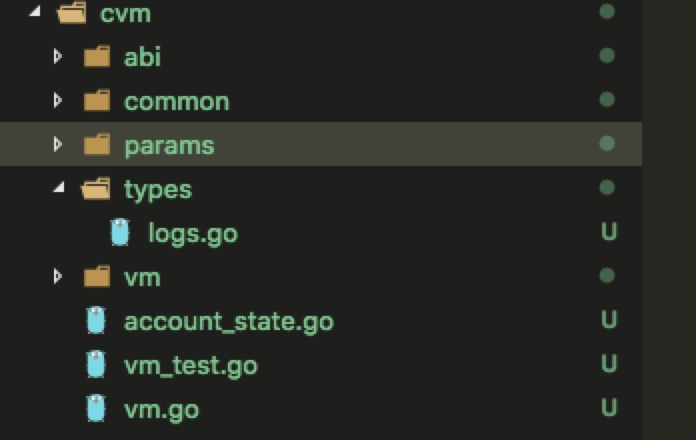
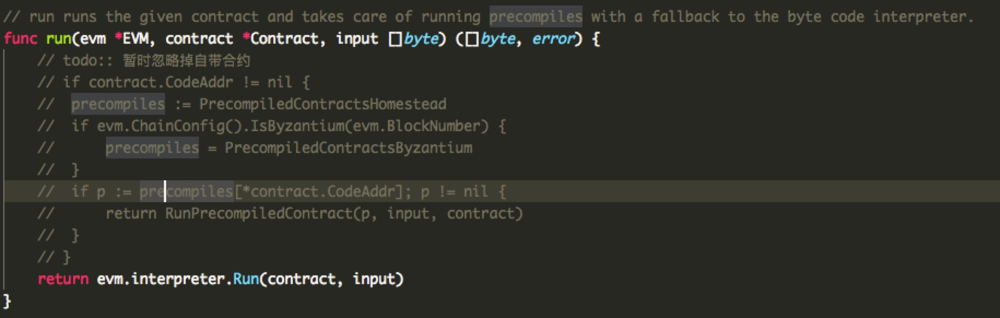
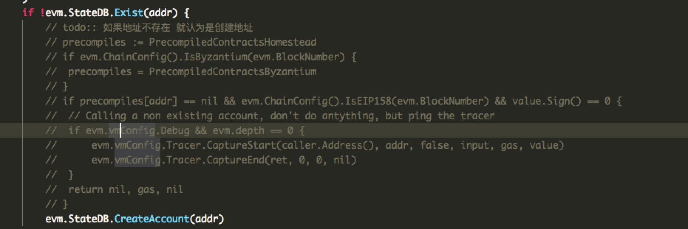

### 简述
前面我们从一个智能合约的部署流程，到智能合约的字节码流程分析，再到evm虚拟机的源码分析。 整个分析其实就是为了移植虚拟机做基础。 如果看了前面几篇文章在来进行代码移植就会跟得心应手一些。 

### 说明
因为涉及到的代码会比较多， 不可能把所有代码都列举出来。 所以也只是挑关键的部分进行讲解说明。 整个移植的代码我已经合到之前的那个简单(无用)[demo](https://github.com/blockchainworkers/conch)版本的公链项目上了。
移植的以太坊版本为v1.8.12.

### 开始移植
首先先创建一个go的新项目, 将go-ethereum项目下core/vm文件夹下的代码全部拷贝到新项目下，我们为新的文件夹名称为cvm。 保存之后， 假设你用的是vscode(带上了go的周边插件)或者goland，这个时候你会发现有大量的报错。 没有关系， 因为很多以太坊包还没有被导入进来。 但是呢， 既然我们只想移植虚拟机部分，又不引入以太坊的其他模块。 这个时候我们就把需要的包直接拷贝到我们的项目中。 彻底分离和go-ethereum的关系。这里需要说明一下， 虽然是开源项目， 拷贝和使用别人的开源代码也要注意license的。 

1. 主要需要拷贝的包如下
 *  go-ethereum/common这个文件夹， 我们也将其这个内容均拷贝到cvm这个文件夹下。 
 *  go-ethereum/params这个文件夹中的gas_tables.go, protocol_params.go两个文件拷贝到cvm/params文件夹下。
 *  创建log.go文件在cvm/types/下， 该文件中主要是智能合约emit提交事件时使用的log对象。
 内容如下
 ```go
 type Log struct {
	// Consensus fields:
	// address of the contract that generated the event
	Address common.Address `json:"address" gencodec:"required"`
	// list of topics provided by the contract.
	Topics []common.Hash `json:"topics" gencodec:"required"`
	// supplied by the contract, usually ABI-encoded
	Data []byte `json:"data" gencodec:"required"`

	// Derived fields. These fields are filled in by the node
	// but not secured by consensus.
	// block in which the transaction was included
	BlockNumber uint64 `json:"blockNumber"`
	// hash of the transaction
	TxHash common.Hash `json:"transactionHash" gencodec:"required"`
	// index of the transaction in the block
	TxIndex uint `json:"transactionIndex" gencodec:"required"`
	// hash of the block in which the transaction was included
	BlockHash common.Hash `json:"blockHash"`
	// index of the log in the receipt
	Index uint `json:"logIndex" gencodec:"required"`

	// The Removed field is true if this log was reverted due to a chain reorganisation.
	// You must pay attention to this field if you receive logs through a filter query.
	Removed bool `json:"removed"`
}
 ```

2. 在cvm目录下创建vm.go文件， 主要是生成evm的上下文对象。
```
// NewEVMContext creates a new context for use in the EVM.
func NewEVMContext(from common.Address, blockNum, timeStamp, difficulty int64) vm.Context {
	// If we don't have an explicit author (i.e. not mining), extract from the header
	return vm.Context{
		CanTransfer: CanTransfer,
		Transfer:    Transfer,
		GetHash:     GetHashFn(),
		Origin:      from,
		Coinbase:    common.Address{},
		BlockNumber: new(big.Int).Set(big.NewInt(blockNum)),
		Time:        new(big.Int).Set(big.NewInt(timeStamp)),
		Difficulty:  new(big.Int).Set(big.NewInt(difficulty)),
		GasLimit:    0xfffffffffffffff, //header.GasLimit,
		GasPrice:    new(big.Int).Set(big.NewInt(10)),
	}
}

// GetHashFn returns a GetHashFunc which retrieves header hashes by number 获取块号码对于的块hash
func GetHashFn() func(n uint64) common.Hash {

	return func(n uint64) common.Hash {
		// If there's no hash cache yet, make one
		// if cache == nil {
		// 	cache = map[uint64]common.Hash{
		// 		ref.Number.Uint64() - 1: ref.ParentHash,
		// 	}
		// }
		// // Try to fulfill the request from the cache
		// if hash, ok := cache[n]; ok {
		// 	return hash
		// }
		// // Not cached, iterate the blocks and cache the hashes
		// for header := chain.GetHeader(ref.ParentHash, ref.Number.Uint64()-1); header != nil; header = chain.GetHeader(header.ParentHash, header.Number.Uint64()-1) {
		// 	cache[header.Number.Uint64()-1] = header.ParentHash
		// 	if n == header.Number.Uint64()-1 {
		// 		return header.ParentHash
		// 	}
		// }
		return common.Hash{}
	}
}

// CanTransfer checks wether there are enough funds in the address' account to make a transfer.
// This does not take the necessary gas in to account to make the transfer valid.
func CanTransfer(db vm.StateDB, addr common.Address, amount *big.Int) bool {
	return db.GetBalance(addr).Cmp(amount) >= 0
}

// Transfer subtracts amount from sender and adds amount to recipient using the given Db
func Transfer(db vm.StateDB, sender, recipient common.Address, amount *big.Int) {
	db.SubBalance(sender, amount)
	db.AddBalance(recipient, amount)
}
```

3. 接着我们把go-ethereum/account文件夹下的abi内容拷贝到cvm文件夹下。

> abi/bind文件内容可以直接删除掉。此文件夹下是对智能合约进行函数调用进行编码的包。换句话调用智能合约构建的交易中的input内容就是需要此包中函数来生成的。当然如果你看了前面的文章，对智能合约调用了解的话，此处自然就理解这个包的作用了。

到了这里整个需要拷贝的文件就齐全了， 目录结构如下:



4. 接下来我们需要修改evm的部分代码了。

> vm/contracts.go文件我们直接删除掉。  这个是自带的智能合约， 内部主要是一些内置函数， 注意实际使用的时候记得还是要实现的， 
evm.go文件中run函数忽略掉所有内置的合约函数。





修改evm.go文件中的Call函数 当地址不存在时我们直接认为是创建地址， 忽略掉掉内置合约。



5. 接着我们要实现evm.StateDB接口的内容了， 因为此接口涉及涉及的主要是个账户状态相关的内容， 也即是说可整个区块的存储是有关联的， 暂时我也只能以一个示例来说明是如何简单的实现这些接口。 

我们在cvm文件夹下创建一个account_state.go的文件。 定义的数据结构格式如下：
```go
type accountObject struct {
	Address      common.Address              `json:"address,omitempty"`
	AddrHash     common.Hash                 `json:"addr_hash,omitempty"` // hash of ethereum address of the account
	ByteCode     []byte                      `json:"byte_code,omitempty"`
	Data         accountData                 `json:"data,omitempty"`
	CacheStorage map[common.Hash]common.Hash `json:"cache_storage,omitempty"` // 用于缓存存储的变量
}

type accountData struct {
	Nonce    uint64      `json:"nonce,omitempty"`
	Balance  *big.Int    `json:"balance,omitempty"`
	Root     common.Hash `json:"root,omitempty"` // merkle root of the storage trie
	CodeHash []byte      `json:"code_hash,omitempty"`
}

//AccountState 实现vm的StateDB的接口 用于进行测试
type AccountState struct {
	Accounts map[common.Address]*accountObject `json:"accounts,omitempty"`
}


```

6. 接下来我们实现StateDB接口:

```go
// CreateAccount 创建账户接口 
func (accSt *AccountState) CreateAccount(addr common.Address) {
	if accSt.getAccountObject(addr) != nil {
		return
	}
	obj := newAccountObject(addr, accountData{})
	accSt.setAccountObject(obj)
}

// SubBalance 减去某个账户的余额
func (accSt *AccountState) SubBalance(addr common.Address, amount *big.Int) {
	stateObject := accSt.getOrsetAccountObject(addr)
	if stateObject != nil {
		stateObject.SubBalance(amount)
	}
}

// AddBalance 增加某个账户的余额
func (accSt *AccountState) AddBalance(addr common.Address, amount *big.Int) {
	stateObject := accSt.getOrsetAccountObject(addr)
	if stateObject != nil {
		stateObject.AddBalance(amount)
	}
}

//// GetBalance 获取某个账户的余额
func (accSt *AccountState) GetBalance(addr common.Address) *big.Int {
	stateObject := accSt.getOrsetAccountObject(addr)
	if stateObject != nil {
		return stateObject.Balance()
	}
	return new(big.Int).SetInt64(0)
}
//GetNonce 获取nonce
func (accSt *AccountState) GetNonce(addr common.Address) uint64 {
	stateObject := accSt.getAccountObject(addr)
	if stateObject != nil {
		return stateObject.Nonce()
	}
	return 0
}

// SetNonce 设置nonce
func (accSt *AccountState) SetNonce(addr common.Address, nonce uint64) {
	stateObject := accSt.getOrsetAccountObject(addr)
	if stateObject != nil {
		stateObject.SetNonce(nonce)
	}
}

// GetCodeHash 获取代码的hash值
func (accSt *AccountState) GetCodeHash(addr common.Address) common.Hash {
	stateObject := accSt.getAccountObject(addr)
	if stateObject == nil {
		return common.Hash{}
	}
	return common.BytesToHash(stateObject.CodeHash())
}

//GetCode 获取智能合约的代码
func (accSt *AccountState) GetCode(addr common.Address) []byte {
	stateObject := accSt.getAccountObject(addr)
	if stateObject != nil {
		return stateObject.Code()
	}
	return nil
}

//SetCode 设置智能合约的code
func (accSt *AccountState) SetCode(addr common.Address, code []byte) {
	stateObject := accSt.getOrsetAccountObject(addr)
	if stateObject != nil {
		stateObject.SetCode(crypto.Sha256(code), code)
	}
}

// GetCodeSize 获取code的大小
func (accSt *AccountState) GetCodeSize(addr common.Address) int {
	stateObject := accSt.getAccountObject(addr)
	if stateObject == nil {
		return 0
	}
	if stateObject.ByteCode != nil {
		return len(stateObject.ByteCode)
	}
	return 0
}

// AddRefund 暂时先忽略补偿
func (accSt *AccountState) AddRefund(uint64) {
	return
}

//GetRefund ...
func (accSt *AccountState) GetRefund() uint64 {
	return 0
}

// GetState 和SetState 是用于保存合约执行时 存储的变量是否发生变化 evm对变量存储的改变消耗的gas是有区别的
func (accSt *AccountState) GetState(addr common.Address, key common.Hash) common.Hash {
	stateObject := accSt.getAccountObject(addr)
	if stateObject != nil {
		return stateObject.GetStorageState(key)
	}
	return common.Hash{}
}

// SetState 设置变量的状态
func (accSt *AccountState) SetState(addr common.Address, key common.Hash, value common.Hash) {
	stateObject := accSt.getOrsetAccountObject(addr)
	if stateObject != nil {
		fmt.Printf("SetState key: %x value: %s", key, new(big.Int).SetBytes(value[:]).String())
		stateObject.SetStorageState(key, value)
	}
}

// Suicide 暂时禁止自杀
func (accSt *AccountState) Suicide(common.Address) bool {
	return false
}

// HasSuicided ...
func (accSt *AccountState) HasSuicided(common.Address) bool {
	return false
}

// Exist 检查账户是否存在
func (accSt *AccountState) Exist(addr common.Address) bool {
	return accSt.getAccountObject(addr) != nil
}

//Empty 是否是空账户
func (accSt *AccountState) Empty(addr common.Address) bool {
	so := accSt.getAccountObject(addr)
	return so == nil || so.Empty()
}

// RevertToSnapshot ...
func (accSt *AccountState) RevertToSnapshot(int) {

}

// Snapshot ...
func (accSt *AccountState) Snapshot() int {
	return 0
}

// AddLog 添加事件触发日志
func (accSt *AccountState) AddLog(log *types.Log) {
	fmt.Printf("log: %v", log)
}

// AddPreimage 
func (accSt *AccountState) AddPreimage(common.Hash, []byte) {

}

// ForEachStorage  暂时没发现vm调用这个接口
func (accSt *AccountState) ForEachStorage(common.Address, func(common.Hash, common.Hash) bool) {

}

// Commit 进行持久存储 这里我们只将其简单的json话之后保存到本地磁盘中。
func (accSt *AccountState) Commit() error {
	// 将bincode写入文件
	file, err := os.Create("./account_sate.db")
	if err != nil {
		return err
	}
	err = json.NewEncoder(file).Encode(accSt)
	//fmt.Println("len(binCode): ", len(binCode), " code: ", binCode)
	// bufW := bufio.NewWriter(file)
	// bufW.Write(binCode)
	// // bufW.WriteByte('\n')
	// bufW.Flush()
	file.Close()
	return err
}

//TryLoadFromDisk  尝试从磁盘加载AccountState
func TryLoadFromDisk() (*AccountState, error) {
	file, err := os.Open("./account_sate.db")
	if err != nil && os.IsNotExist(err) {
		return NewAccountStateDb(), nil
	}
	if err != nil {
		return nil, err
	}

	// stat, _ := file.Stat()
	// // buf := stat.Size()
	var accStat AccountState

	err = json.NewDecoder(file).Decode(&accStat)
	return &accStat, err
}

```


7. 接下来尝试部署两份智能合约进行测试:
```js
pragma solidity ^0.4.21;
interface BaseInterface {
    function CurrentVersion() external view returns(string);
}

contract Helloworld {
    uint256 balance;
    event Triggle(address, string);
    mapping(address=>uint256) _mapamount; 
    
    constructor() public {
        balance = 6000000000;
        _mapamount[0] = 100;
        _mapamount[1] = 200;
    }
    
    function getbalance() public  returns (address, uint256) {
        emit Triggle(msg.sender, "funck");
        return (msg.sender, balance--);
    }
    
    function onlytest() public{
        _mapamount[1] = 100;
        emit Triggle(msg.sender, "onlytest");
    }
    
    function setBalance(uint256 tmp) public {
        balance = tmp;
    }
    
    function getVersion(address contractAddr) public view returns (string) {
        BaseInterface baseClass = BaseInterface(contractAddr);
       return baseClass.CurrentVersion();
    }
    
}

pragma solidity ^0.4.21;

contract BaseContract {
  address public owner;
 // 
 function CurrentVersion() pure public returns(string)  {
     return "BaseContractV0.1";
 }
}
```

通过这两个合约我们就可以测试到一些view 类型的函数调用， 一些对数据状态有修改的合约调用， 和跨合约的调用。 
我们可以将上面的两个合约通过ethereum官方出品的remix进行编译，得到字节码。因为BaseContract没有涉及初始化的内容 所以我们可以直接使用runtime的bytecode。 
不过我们直接使用Create函数去部署合约。
```
runtimeBytecode, contractAddr, leftgas, err := vmenv.Create(vm.AccountRef(normalAccount), helloCode, 10000000000, big.NewInt(0))
```
第一个返回值其实就是需要部署的runtime字节码 ， 我们调用```stateDb.SetCode(helloWorldcontactAccont, runtimeBytecode)```将其部署。

```go
var normalAddress, _ = hex.DecodeString("123456abc")
var hellWorldcontractAddress, _ = hex.DecodeString("987654321")
var baseContractAddress, _ = hex.DecodeString("038f160ad632409bfb18582241d9fd88c1a072ba")
var normalAccount = common.BytesToAddress(normalAddress)
var helloWorldcontactAccont = common.BytesToAddress(hellWorldcontractAddress)
var baseContractAccont = common.BytesToAddress(baseContractAddress)

// 基本账户字节码
var baseCodeStr = "608060405260043610610062576000357c0100000000000000000000000000000000000000000000000000000000900463ffffffff1680632b225f29146100675780638afc3605146100f75780638da5cb5b1461010e578063f2fde38b14610165575b600080fd5b34801561007357600080fd5b5061007c6101a8565b6040518080602001828103825283818151815260200191508051906020019080838360005b838110156100bc5780820151818401526020810190506100a1565b50505050905090810190601f1680156100e95780820380516001836020036101000a031916815260200191505b509250505060405180910390f35b34801561010357600080fd5b5061010c6101e5565b005b34801561011a57600080fd5b50610123610227565b604051808273ffffffffffffffffffffffffffffffffffffffff1673ffffffffffffffffffffffffffffffffffffffff16815260200191505060405180910390f35b34801561017157600080fd5b506101a6600480360381019080803573ffffffffffffffffffffffffffffffffffffffff16906020019092919050505061024c565b005b60606040805190810160405280601081526020017f42617365436f6e747261637456302e3100000000000000000000000000000000815250905090565b336000806101000a81548173ffffffffffffffffffffffffffffffffffffffff021916908373ffffffffffffffffffffffffffffffffffffffff160217905550565b6000809054906101000a900473ffffffffffffffffffffffffffffffffffffffff1681565b6000809054906101000a900473ffffffffffffffffffffffffffffffffffffffff1673ffffffffffffffffffffffffffffffffffffffff163373ffffffffffffffffffffffffffffffffffffffff161415156102a757600080fd5b600073ffffffffffffffffffffffffffffffffffffffff168173ffffffffffffffffffffffffffffffffffffffff16141515156102e357600080fd5b806000806101000a81548173ffffffffffffffffffffffffffffffffffffffff021916908373ffffffffffffffffffffffffffffffffffffffff1602179055508073ffffffffffffffffffffffffffffffffffffffff166000809054906101000a900473ffffffffffffffffffffffffffffffffffffffff1673ffffffffffffffffffffffffffffffffffffffff167f8be0079c531659141344cd1fd0a4f28419497f9722a3daafe3b4186f6b6457e060405160405180910390a3505600a165627a7a723058208c3064096245894122f6bcf5e2ee12e30d4775a3b8dca0b21f10d5a5bc386e8b0029"

// hellworld 账户字节码
var hellCodeStr = "6080604052600436106100615763ffffffff7c01000000000000000000000000000000000000000000000000000000006000350416634d9b3d5d81146100665780637e8800a7146100ab578063c3f82bc3146100c2578063fb1669ca14610165575b600080fd5b34801561007257600080fd5b5061007b61017d565b6040805173ffffffffffffffffffffffffffffffffffffffff909316835260208301919091528051918290030190f35b3480156100b757600080fd5b506100c06101fa565b005b3480156100ce57600080fd5b506100f073ffffffffffffffffffffffffffffffffffffffff6004351661028f565b6040805160208082528351818301528351919283929083019185019080838360005b8381101561012a578181015183820152602001610112565b50505050905090810190601f1680156101575780820380516001836020036101000a031916815260200191505b509250505060405180910390f35b34801561017157600080fd5b506100c0600435610389565b60408051338152602081018290526005818301527f66756e636b0000000000000000000000000000000000000000000000000000006060820152905160009182917f08c31d20d5c3a5f2cfe0adf83909e6411f43fe97eb091e15c12f3e5a203e8fde9181900360800190a150506000805460001981019091553391565b600080526001602090815260647fa6eef7e35abe7026729641147f7915573c7e97b47efa546f5f6e3230263bcb4955604080513381529182018190526008828201527f6f6e6c79746573740000000000000000000000000000000000000000000000006060830152517f08c31d20d5c3a5f2cfe0adf83909e6411f43fe97eb091e15c12f3e5a203e8fde9181900360800190a1565b606060008290508073ffffffffffffffffffffffffffffffffffffffff16632b225f296040518163ffffffff167c0100000000000000000000000000000000000000000000000000000000028152600401600060405180830381600087803b1580156102fa57600080fd5b505af115801561030e573d6000803e3d6000fd5b505050506040513d6000823e601f3d908101601f19168201604052602081101561033757600080fd5b81019080805164010000000081111561034f57600080fd5b8201602081018481111561036257600080fd5b815164010000000081118282018710171561037c57600080fd5b5090979650505050505050565b6000555600a165627a7a72305820c63a859d93a3512b52ccaec75bb9aa146648c41b21c8a0cd0cd2e2c1aede35ed0029"

var helloCode, _ = hex.DecodeString(hellCodeStr)
var baseCode, _ = hex.DecodeString(baseCodeStr)

func updateContract() {
	// 加载账户State
	stateDb, err := cvm.TryLoadFromDisk()
	if err != nil {
		panic(err)
	}
	stateDb.SetCode(helloWorldcontactAccont, helloCode)
	stateDb.SetCode(baseContractAccont, baseCode)
	fmt.Println(stateDb.Commit())
}
```

当我们调用一个智能合约比如getbalance函数， 代码类似下面这样:

```go
// 4d9b3d5d : getbalance  7e8800a7: onlytest fb1669ca000000000000000000000000000000000000000000000000000000000000029a: setbalance 666
var input, _ = hex.DecodeString("7e8800a7")

func main() {
	// updateContract()
	// return
	// 创建账户State
	stateDb, err := cvm.TryLoadFromDisk()
	if err != nil {
		panic(err)
	}

	evmCtx := cvm.NewEVMContext(normalAccount, 100, 1200000, 1)
	vmenv := vm.NewEVM(evmCtx, stateDb, vm.Config{})

	ret, leftgas, err := vmenv.Call(vm.AccountRef(normalAccount), helloWorldcontactAccont, input, 1000000, big.NewInt(0))
	fmt.Printf("ret: %v, usedGas: %v, err: %v, len(ret): %v, hexret: %v, ", ret, 1000000-leftgas, err, len(ret), hex.EncodeToString(ret))

	abiObjet, _ := abi.JSON(strings.NewReader(hellWorldContractABIJson))

	// begin, length, _ := lengthPrefixPointsTo(0, ret)
	addr := new(common.Address)

	value := big.NewInt(0) //new(*big.Int)
	restult := []interface{}{addr, &value}
	fmt.Println(abiObjet.Unpack(&restult, "getbalance", ret))
	//fmt.Println(unpackAtomic(&restult, string(ret[begin:begin+length])))
	println(restult[0].(*common.Address).String(), (*restult[1].(**big.Int)).String())
	fmt.Println(stateDb.Commit())

}
```

### 最后

到了这里， evm移植流程就算完成了。 如果理解evm执行的原理， 大部分的工作其实就是拷贝， 出错的任务。 当然这个移植后的代码肯定是不能在生产中使用的， 但是需要修改和添加的代码主要也就是上文提到的内容。 最后还是想说明白原理和流程就是成功了一大半， 后面的部分主要就是调试和排错的过程了。


