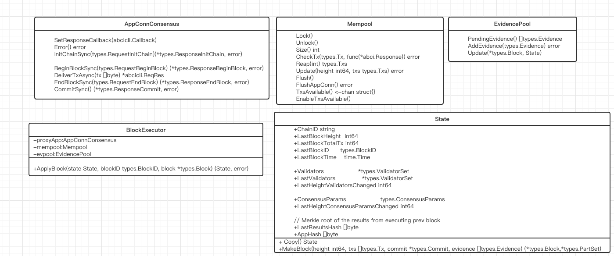

传统习惯 上高清无码自制大图:

不需要理解图中各个类的功能, 大致扫一眼留一下印象。
State组件中有三个比较重要的地方，一个是State这个结构， 一个是BlockExector，还有一个是Store。

我们先看State结构。 它代表了区块的状态。 看一下它的详情数据结构:
```go
type State struct {
	//链ID 整个链中都是不会变化的
	ChainID string
	// 表示上一个区块的高度
	LastBlockHeight  int64
	// 距离上一个区块高度 已经打包的交易数量
	LastBlockTotalTx int64
	// 上一个区块ID (这个是一个复合类型 上一张我们列举过里面的字段)
	LastBlockID      types.BlockID
	LastBlockTime    time.Time

	// LastValidators is used to validate block.LastCommit.
	// Validators are persisted to the database separately every time they change,
	// so we can query for historical validator sets.
	// Note that if s.LastBlockHeight causes a valset change,
	// we set s.LastHeightValidatorsChanged = s.LastBlockHeight + 1
	// 代表当前验证者集合 
	Validators                  *types.ValidatorSet
	// 上一个区块的验证者集合
	LastValidators              *types.ValidatorSet
	LastHeightValidatorsChanged int64

	// Consensus parameters used for validating blocks.
	// 共识参数的配置 主要是 一个区块的大小 一个交易的大小 区块每个部分的大小
	ConsensusParams                  types.ConsensusParams
	LastHeightConsensusParamsChanged int64

	// Merkle root of the results from executing prev block
	LastResultsHash []byte

	// The latest AppHash we've received from calling abci.Commit()
	AppHash []byte
}
```
State的成员变量应用的直接是一个值拷贝，意思很明确，成员函数都不会修改State成员属性。列一下主要函数功能:
`Copy` 拷贝一个新的State数据返回
`GetValidators` 获取当前验证者集合和上一个区块的验证者集合
看一下根据State内容创建区块`MakeBlock`这个函数。
```go
func (state State) MakeBlock(
	height int64,
	txs []types.Tx,
	commit *types.Commit,
	evidence []types.Evidence,
) (*types.Block, *types.PartSet) {

	// 根据高度 交易列表  commit内容 创建一个区块结构
	block := types.MakeBlock(height, txs, commit, evidence)

	// 把状态内容赋值给区块信息
	block.ChainID = state.ChainID

	block.LastBlockID = state.LastBlockID
	block.TotalTxs = state.LastBlockTotalTx + block.NumTxs

	block.ValidatorsHash = state.Validators.Hash()
	block.ConsensusHash = state.ConsensusParams.Hash()
	block.AppHash = state.AppHash
	block.LastResultsHash = state.LastResultsHash
	return block, block.MakePartSet(state.ConsensusParams.BlockGossip.BlockPartSizeBytes)
}
```

State就是这些内容, 我们主要分析的是BlockExector的ApplyBlock这个函数。 先看一下state/execution.go前几行的注释。
```go
// BlockExecutor handles block execution and state updates.
// It exposes ApplyBlock(), which validates & executes the block, updates state w/ ABCI responses,
// then commits and updates the mempool atomically, then saves state.
BlockExector暴露ApplyBlock这个函数 验证和执行区块信息并且更新状态信息， 同时根据APP的回应更新APPHASH。
```
之前我们在BlockChain中看到了这个函数的调用, 我们是一笔带过， 没有具体分析。 现在我们想一想上次分析BlockChain调用此函数的情况, 也即是当我们下载了一个新的区块时，先进行区块校验`state.Validators.VerifyCommit`(这个函数我们也会分析到) 然后校验通过之后调用`ApplyBlock`更新状态。返回下一个区块的状态。 现在我们就具体看一下ApplyBlock都做了哪些工作。

```go
func (blockExec *BlockExecutor) ApplyBlock(state State, blockID types.BlockID, block *types.Block) (State, error) {

  // 对区块进行详细的验证 下面专门追踪这个函数
	if err := blockExec.ValidateBlock(state, block); err != nil {
		return state, ErrInvalidBlock(err)
	}
  
  // 将区块内容提交给ABCI应用层 这里涉及了ABCI的好几个接口函数 BeginBlock, DeliverTx, EndBlock 
  // 返回ABCI返回的结果
	abciResponses, err := execBlockOnProxyApp(blockExec.logger, blockExec.proxyApp, block, state.LastValidators, blockExec.db)
	if err != nil {
		return state, ErrProxyAppConn(err)
	}

	fail.Fail() // XXX

	// 把返回的结果保存到数据中
	saveABCIResponses(blockExec.db, block.Height, abciResponses)

	fail.Fail() // XXX

	// 根据当前状态, 以及ABCI的返回结果和当前区块的内容 返回下一个状态信息
	state, err = updateState(state, blockID, &block.Header, abciResponses)
	if err != nil {
		return state, fmt.Errorf("Commit failed for application: %v", err)
	}

	// 调用ABCI的Commi函数返回APPhash 同时更新内存池中的交易
	appHash, err := blockExec.Commit(block)
	if err != nil {
		return state, fmt.Errorf("Commit failed for application: %v", err)
	}

	// 更新证据池的内容
	blockExec.evpool.Update(block, state)

	fail.Fail() // XXX

	// update the app hash and save the state
	state.AppHash = appHash
	// 将此次状态的内容持久化保存
	SaveState(blockExec.db, state)

	fail.Fail() // XXX

	// events are fired after everything else
	// NOTE: if we crash between Commit and Save, events wont be fired during replay
	fireEvents(blockExec.logger, blockExec.eventBus, block, abciResponses)

	return state, nil
}
```

总结一下ApplyBlock的功能:
1. 根据当前状态和区块内容来验证当前区块是否符合要求
2. 提交区块内容到ABCI的应用层, 返回应用层的回应
3. 根据当前区块的信息，ABCI回应的内容，生成下一个State
4. 再次调用ABCI的Commit返回当前APPHASH
5. 持久化此处状态同时返回下一次状态的内容。

具体分析上述的每一个函数的流程。
`validateBlock` 验证区块是否合法
```go
func validateBlock(stateDB dbm.DB, state State, block *types.Block) error {
	/*
	func (b *Block) ValidateBasic() error {
	if b == nil {
		return errors.New("Nil blocks are invalid")
	}
	b.mtx.Lock()
	defer b.mtx.Unlock()

	newTxs := int64(len(b.Data.Txs))
	if b.NumTxs != newTxs {
		return fmt.Errorf("Wrong Block.Header.NumTxs. Expected %v, got %v", newTxs, b.NumTxs)
	}
	if !bytes.Equal(b.LastCommitHash, b.LastCommit.Hash()) {
		return fmt.Errorf("Wrong Block.Header.LastCommitHash.  Expected %v, got %v", b.LastCommitHash, b.LastCommit.Hash())
	}
	if b.Header.Height != 1 {
		if err := b.LastCommit.ValidateBasic(); err != nil {
			return err
		}
	}
	if !bytes.Equal(b.DataHash, b.Data.Hash()) {
		return fmt.Errorf("Wrong Block.Header.DataHash.  Expected %v, got %v", b.DataHash, b.Data.Hash())
	}
	if !bytes.Equal(b.EvidenceHash, b.Evidence.Hash()) {
		return errors.New(cmn.Fmt("Wrong Block.Header.EvidenceHash.  Expected %v, got %v", b.EvidenceHash, b.Evidence.Hash()))
	}
	return nil
}
	*/
	
	// 先对区块数据结构进行验证 看看是否参数都已经正确 为了方便 我把函数列举在上面
	if err := block.ValidateBasic(); err != nil {
		return err
	}

	// 验证链ID 高度 上一个区块ID 区块交易的数量
	if block.ChainID != state.ChainID {
		return fmt.Errorf("Wrong Block.Header.ChainID. Expected %v, got %v", state.ChainID, block.ChainID)
	}
	if block.Height != state.LastBlockHeight+1 {
		return fmt.Errorf("Wrong Block.Header.Height. Expected %v, got %v", state.LastBlockHeight+1, block.Height)
	}
	if !block.LastBlockID.Equals(state.LastBlockID) {
		return fmt.Errorf("Wrong Block.Header.LastBlockID.  Expected %v, got %v", state.LastBlockID, block.LastBlockID)
	}
	newTxs := int64(len(block.Data.Txs))
	if block.TotalTxs != state.LastBlockTotalTx+newTxs {
		return fmt.Errorf("Wrong Block.Header.TotalTxs. Expected %v, got %v", state.LastBlockTotalTx+newTxs, block.TotalTxs)
	}
	if !bytes.Equal(block.AppHash, state.AppHash) {
		return fmt.Errorf("Wrong Block.Header.AppHash.  Expected %X, got %v", state.AppHash, block.AppHash)
	}
	if !bytes.Equal(block.ConsensusHash, state.ConsensusParams.Hash()) {
		return fmt.Errorf("Wrong Block.Header.ConsensusHash.  Expected %X, got %v", state.ConsensusParams.Hash(), block.ConsensusHash)
	}
	if !bytes.Equal(block.LastResultsHash, state.LastResultsHash) {
		return fmt.Errorf("Wrong Block.Header.LastResultsHash.  Expected %X, got %v", state.LastResultsHash, block.LastResultsHash)
	}
	if !bytes.Equal(block.ValidatorsHash, state.Validators.Hash()) {
		return fmt.Errorf("Wrong Block.Header.ValidatorsHash.  Expected %X, got %v", state.Validators.Hash(), block.ValidatorsHash)
	}

	// Validate block LastCommit.
	if block.Height == 1 {
		if len(block.LastCommit.Precommits) != 0 {
			return errors.New("Block at height 1 (first block) should have no LastCommit precommits")
		}
	} else {
	  // LastValidators 表示上次的所有验证者合集
		if len(block.LastCommit.Precommits) != state.LastValidators.Size() {
			return fmt.Errorf("Invalid block commit size. Expected %v, got %v",
				state.LastValidators.Size(), len(block.LastCommit.Precommits))
		}
		// 注意这个地方 我们是根据此次提交的区块信息 来验证上一个块的内容  
		// 迭代上一个区块保存的所有验证者 确保每一个验证者签名正确 
		// 最后确认所有的有效的区块验证者的投票数要大于整个票数的2/3
		err := state.LastValidators.VerifyCommit(
			state.ChainID, state.LastBlockID, block.Height-1, block.LastCommit)
		if err != nil {
			return err
		}
	}
	for _, ev := range block.Evidence.Evidence {
		if err := VerifyEvidence(stateDB, state, ev); err != nil {
			return types.NewEvidenceInvalidErr(ev, err)
		}
	}

	return nil
}
```

接下来看看`execBlockOnProxyApp` 是向ABCI提交了哪些内容。
```go
func execBlockOnProxyApp(logger log.Logger, proxyAppConn proxy.AppConnConsensus,
	block *types.Block, lastValSet *types.ValidatorSet, stateDB dbm.DB) (*ABCIResponses, error) {
	var validTxs, invalidTxs = 0, 0

	txIndex := 0
	// 首先构建Response
	abciResponses := NewABCIResponses(block)

	// 注意这个是执行ABCI后的回调 之前在Mempool也分析过回调
	// 这里不在进行追踪 直接说结论 也就是在提交每一个交易给ABCI之后 然后在调用此函数 
	// 这个回调只是统计了哪些交易在应用层被任务是无效的交易
	// 从这里我们也可以看出来 应用层无论决定提交的交易是否有效 tendermint都会将其打包到区块链中
	proxyCb := func(req *abci.Request, res *abci.Response) {
		switch r := res.Value.(type) {
		case *abci.Response_DeliverTx:
			txRes := r.DeliverTx
			if txRes.Code == abci.CodeTypeOK {
				validTxs++
			} else {
				logger.Debug("Invalid tx", "code", txRes.Code, "log", txRes.Log)
				invalidTxs++
			}
			abciResponses.DeliverTx[txIndex] = txRes
			txIndex++
		}
	}
	proxyAppConn.SetResponseCallback(proxyCb)

  // 从区块中加载出整个验证者和错误验证者
	signVals, byzVals := getBeginBlockValidatorInfo(block, lastValSet, stateDB)

	// 开始调用ABCI的BeginBlock 同时向其提交区块hash 区块头信息 上一个区块的验证者  出错的验证者
	_, err := proxyAppConn.BeginBlockSync(abci.RequestBeginBlock{
		Hash:   block.Hash(),
		Header: types.TM2PB.Header(&block.Header),
		LastCommitInfo: abci.LastCommitInfo{
			CommitRound: int32(block.LastCommit.Round()),
			Validators:  signVals,
		},
		ByzantineValidators: byzVals,
	})
	if err != nil {
		logger.Error("Error in proxyAppConn.BeginBlock", "err", err)
		return nil, err
	}

	// 迭代提交每一个交易给应用层
	for _, tx := range block.Txs {
		proxyAppConn.DeliverTxAsync(tx)
		if err := proxyAppConn.Error(); err != nil {
			return nil, err
		}
	}

	// 通知ABCI应用层此次区块已经提交完毕了  注意这个步骤是可以更新验证者的 更新的验证者也就是下一个区块的所有验证者
	abciResponses.EndBlock, err = proxyAppConn.EndBlockSync(abci.RequestEndBlock{Height: block.Height})
	if err != nil {
		logger.Error("Error in proxyAppConn.EndBlock", "err", err)
		return nil, err
	}

	logger.Info("Executed block", "height", block.Height, "validTxs", validTxs, "invalidTxs", invalidTxs)

	valUpdates := abciResponses.EndBlock.ValidatorUpdates
	if len(valUpdates) > 0 {
		logger.Info("Updates to validators", "updates", abci.ValidatorsString(valUpdates))
	}

	return abciResponses, nil
}
```

到了这里也就是说应用层也已经执行了这个区块的内容， 接下来我们根据当前State, Block, APPResponse来产生下次的状态。
`updateState`
```go
func updateState(state State, blockID types.BlockID, header *types.Header,
	abciResponses *ABCIResponses) (State, error) {
  // 先记一下当前所有的验证者
	prevValSet := state.Validators.Copy()
	nextValSet := prevValSet.Copy()

	// 根据abciResponses返回的验证者来更新当前的验证者集合
	// 更新原则是这样：
	// 如果当前不存在则直接加入一个验证者
	// 如果当前存在并且投票权为0则删除
	// 如果当前存在其投票权不为0则更新
	lastHeightValsChanged := state.LastHeightValidatorsChanged
	if len(abciResponses.EndBlock.ValidatorUpdates) > 0 {
		err := updateValidators(nextValSet, abciResponses.EndBlock.ValidatorUpdates)
		if err != nil {
			return state, fmt.Errorf("Error changing validator set: %v", err)
		}
		// change results from this height but only applies to the next height
		lastHeightValsChanged = header.Height + 1
	}

	// Update validator accums and set state variables
	nextValSet.IncrementAccum(1)

	// 根据返回结果更新一下共识参数
	nextParams := state.ConsensusParams
	lastHeightParamsChanged := state.LastHeightConsensusParamsChanged
	if abciResponses.EndBlock.ConsensusParamUpdates != nil {
		// NOTE: must not mutate s.ConsensusParams
		nextParams = state.ConsensusParams.Update(abciResponses.EndBlock.ConsensusParamUpdates)
		err := nextParams.Validate()
		if err != nil {
			return state, fmt.Errorf("Error updating consensus params: %v", err)
		}
		// change results from this height but only applies to the next height
		lastHeightParamsChanged = header.Height + 1
	}

	//返回此次区块被验证成功之后的State 此State也就是为了验证下一个区块 
	//注意APPHASH还没有更新 因为还有一步没有做
	return State{
		ChainID:                          state.ChainID,
		LastBlockHeight:                  header.Height,
		LastBlockTotalTx:                 state.LastBlockTotalTx + header.NumTxs,
		LastBlockID:                      blockID,
		LastBlockTime:                    header.Time,
		Validators:                       nextValSet,
		LastValidators:                   state.Validators.Copy(),
		LastHeightValidatorsChanged:      lastHeightValsChanged,
		ConsensusParams:                  nextParams,
		LastHeightConsensusParamsChanged: lastHeightParamsChanged,
		LastResultsHash:                  abciResponses.ResultsHash(),
		AppHash:                          nil,
	}, nil
}
```
接着就是向ABCI提交commit 告诉ABCI此次区块已经完全确认了。 具体内容比较简单，不在分析，就是调用ABCI的Commit 返回APPHASH，
调用mempool的Update 移除掉此次被打包的交易.
接下来保存当前状态`SaveState`
```go
func saveState(db dbm.DB, state State, key []byte) {
	nextHeight := state.LastBlockHeight + 1
	// 保存下一个区块的所有验证者信息  key为validatorsKey:height  
	// value为所有验证者信息
	saveValidatorsInfo(db, nextHeight, state.LastHeightValidatorsChanged, state.Validators)
	// 保存下一个区块的共识参数 key为consensusParamsKey:height
	saveConsensusParamsInfo(db, nextHeight, state.LastHeightConsensusParamsChanged, state.ConsensusParams)
	// State的key为`stateKey` value为State的二进制序列化
	db.SetSync(stateKey, state.Bytes())
}
```
到了这个地方， State的主要功能就算分析完了，State其实就是代表本节点执行的区块链的最新状态，它同时也是下一个区块执行的验证基础。 
这个组件里非常重要的函数就是ApplyBlock了, 基于tendermint来创建自己的区块链， 我们要实现的几个重要接口函数中， 如果从数量上来说这里调用的最多， 从开始一个新区块，到提交交易，再到接收这个区块，最终确认区块。可以说重要的步骤都是在这里完成的。也就是说当tendermint的一个区块被生成之后，此函数是必须被调用的。 因为之后这个函数被调用之后，APP层才算完成了打包区块的。 想象一下一个新区块被生成也就两个地方， 如果他不是验证者，那么它只能是一个同步者，也即是只能下载区块。 这个我们已经见到过就是在Blockchain中下载新区块的地方， 如果他是一个验证者， 那么应该在共识模块被调用。 后面我们去分析共识算法的地方在执行去看看。


整体来说， State的代码量不是很多，注释也非常明确。 如果看到这里你还有一些疑问， 或者感觉总是有些说不上来的不明白的地方，其实也没关系 因为我们还没有看完所有的代码, 整个流程还没打通。 但是不管怎么变化， 一个区块链项目总是少不了这些东西， P2P, 区块数据结构， 交易， 内存池， 共识引擎等等。 如果明白他们所有组件的结合方式，数据流转方向应该整个流程就会通了。 让我们继续前行！


