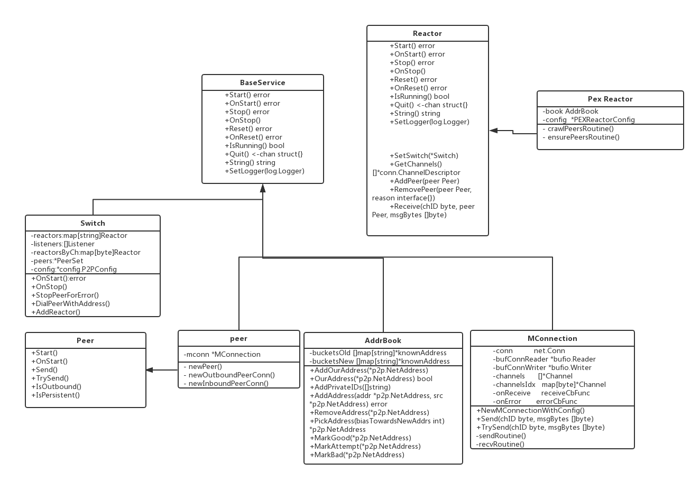

# Tendermint P2P

## 几个重要模块

switch   直译是交换机的意思，将网络数据进行互相的交换 控制着peer中所有add到reactor中的服务。

peer    p2p对等体 连接reactor通信

mconnnect 维护了网络连接，进行底层的网络数据传输功能 实现了peer和其他节点的多工通信。对于每一个通信有一个通道和通道ID

addrbook 维护peer信息，记录连接的peer, 查找可用的peer

transport, MultiplexTransport  监听26656的p2p端口 peer通信

reactor  异步式数据处理组件

## Seeds 和 PersistentPeer 的区别

seeds 和 PersistentPeer在 config.toml文件中均有配置项，seeds 是新节点的第一个接触点。它们返回已知peer(其他peer)活动对等点的列表，到达数量后便断开连接。

seed_mode为true时，当前就节点就会变成seed节点。

seeds类似一个中继节点，在PEX反应器中以“爬虫”模式运行全节点，来爬取获得更多的可用节点，并把获取到的节点地址保存起来，以便后续能够直接连接这些节点，并且在获取到设置的节点数量之后就关闭这个中继节点的连接。并且只有链第一次启动的时候需要用到。

peresistent peer 是可信任的持久节点, 可以持久连接的节点。默认情况下，所有peer节点都会转发已知的peer并存储各个peer地址到addrbook中，这叫pex协议，如果启动时使用了 peresistent peer就不需要上面的seeds了, 如果addrbook中的peer地址无效那么此peer将变为seeds中继节点 重复上面seeds查找peer的动作。

## flow



每一个peer 都有一个NetAddress 根据每个peer的nodeid的不同而不同，格式如下 `062034a0c9e4b4cc7b696793ac45cdb6d47da732@0.0.0.0:26656`

在 NewNode 方法初始化各种服务和参数之后，其OnStart方法里继续将各种服务启动并串联起来，其中主要是启动p2p网络服务将各peer连接，主要有两步: ` start transport` 和 `  start switch` 前者负责启动监听p2p服务端口并启动goroutine来接受其他peer的node数据，将数据传至 mt.acceptc channel

```
ln, err := net.Listen("tcp", addr.DialString())
	...
	...
	go mt.acceptPeers()
```

之后 start switch

```
// 启动NewNode中 统一注册5个的 reactor
	for _, reactor := range sw.reactors {
		err := reactor.Start()
		if err != nil {
			return errors.Wrapf(err, "failed to start %v", reactor)
		}
	}

	// 启动goroutine来接受peer接入
	go sw.acceptRoutine()
```

acceptRoutine 逻辑

```
func (sw *Switch) acceptRoutine() {
	for {
		// 在前面start switch 之前已经调用了 transport 的Listen来监听peer数据
		// 这里返回一个新创建经过包装的peer来负责通信
		/*
			peer结构体中 主要和通信相关的是peerConn以及mconn， peerConn维护了一个连接
			mconn 实现了peer和其他节点的多工通信。对于每一个通信有一个通道和通道ID，还有onReceive和onError的回调方法, onReceive回调方法在 MConnection onstart的时候 p2p/conn/connection.go:639处被调用
		*/
		p, err := sw.transport.Accept(peerConfig{
			chDescs:      sw.chDescs,
			onPeerError:  sw.StopPeerForError,
			reactorsByCh: sw.reactorsByCh,
			metrics:      sw.metrics,
			isPersistent: sw.IsPeerPersistent,
		})
		// 下面是一些创建peer的错误判断
		if err != nil {
			switch err := err.(type) {
			...
			...
		}

		if !sw.IsPeerUnconditional(p.NodeInfo().ID()) {
			// Ignore connection if we already have enough peers.
			_, in, _ := sw.NumPeers()
			// 移除不必要的peer
			if in >= sw.config.MaxNumInboundPeers {
				sw.Logger.Info(
					"Ignoring inbound connection: already have enough inbound peers",
					"address", p.SocketAddr(),
					"have", in,
					"max", sw.config.MaxNumInboundPeers,
				)

				sw.transport.Cleanup(p)

				continue
			}

		}
		// 将创建好的peer对象 加入到switch中
		if err := sw.addPeer(p); err != nil {
			sw.transport.Cleanup(p)
			if p.IsRunning() {
				_ = p.Stop()
			}
			sw.Logger.Info(
				"Ignoring inbound connection: error while adding peer",
				"err", err,
				"id", p.ID(),
			)
		}
	}
}
// 启动peer并将peer加入到switch中
func (sw *Switch) addPeer(p Peer) error {
	if err := sw.filterPeer(p); err != nil {
		return err
	}

	p.SetLogger(sw.Logger.With("peer", p.SocketAddr()))

	// Handle the shut down case where the switch has stopped but we're
	// concurrently trying to add a peer.
	if !sw.IsRunning() {
		// XXX should this return an error or just log and terminate?
		sw.Logger.Error("Won't start a peer - switch is not running", "peer", p)
		return nil
	}

	// 初始化一些peer数据 以满足各个raector的需要， 状态之类的
	for _, reactor := range sw.reactors {
		p = reactor.InitPeer(p)
	}

	// Start the peer's send/recv routines.
	// Must start it before adding it to the peer set
	// to prevent Start and Stop from being called concurrently.
	// 启动peer 的通信属性 MConnection
	// MConnection 中OnStart主要逻辑 启动了两个goroutine 分别来发送和接受数据
  //	go c.sendRoutine()
	//  go c.recvRoutine() 
	err := p.Start()
	if err != nil {
		// Should never happen
		sw.Logger.Error("Error starting peer", "err", err, "peer", p)
		return err
	}

	// Add the peer to PeerSet. Do this before starting the reactors
	// so that if Receive errors, we will find the peer and remove it.
	// Add should not err since we already checked peers.Has().
	// 往switch添加 peer
	if err := sw.peers.Add(p); err != nil {
		return err
	}
	sw.metrics.Peers.Add(float64(1))

	// Start all the reactor protocols on the peer.
	// 启动peer上的所有reactor
	for _, reactor := range sw.reactors {
		reactor.AddPeer(p)
	}

	sw.Logger.Info("Added peer", "peer", p)

	return nil
}
```


