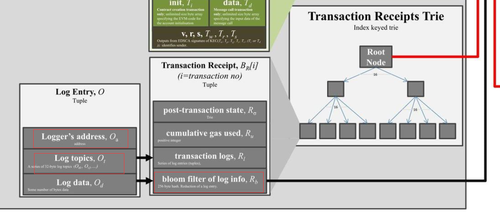
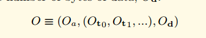
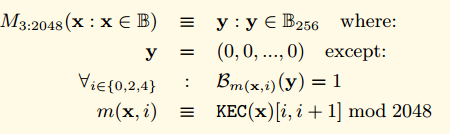
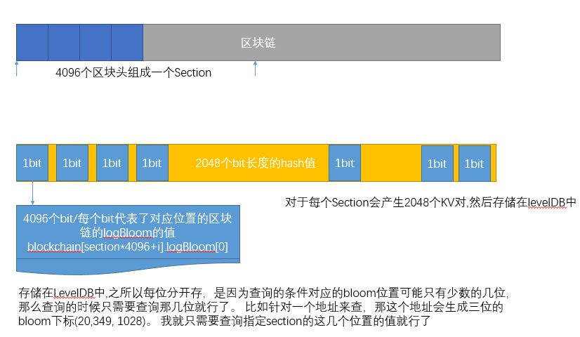

## 以太坊的布隆过滤器

以太坊的区块头中包含了一个叫做logsBloom的区域。 这个区域存储了当前区块中所有的收据的日志的布隆过滤器，一共是2048个bit。也就是256个字节。

而我们的一个交易的收据包含了很多的日志记录。 每个日志记录包含了 合约的地址， 多个Topic。 而在我们的收据中也存在一个布隆过滤器，这个布隆过滤器记录了所有的日志记录的信息。

如果我们看黄皮书里面对日志记录的形式化定义。

O代表我们的日志记录，Oa代表logger的地址，Oto,Ot1代表日志的Topics， Od代表时间。

Oa是20个字节，Ot是32个字节，Od是很多字节

我们定义了一个布隆过滤器函数M，用来把一个日志对象转换成256字节的hash

M3:2045是一个特别的函数，用来设置2048个bit位中的三位为1。 具体的方法请参考下面的公式。

对于任意的输入值，首先求他的KEC输出， 然后通过取KEC输出的 [0,1] [2,3],[4,5] 这几位的值 对2048取模， 得到三个值， 这三个值就是输出的2048中需要置位的下标。 也就是说对于任何一个输入，如果它对应的三个下标的值不都为1，那么它肯定不在这个区块中。 当如如果对应的三位都为1，也不能说明一定在这个区块中。 这就是布隆过滤器的特性。

收据中的布隆过滤器就是所有的日志的布隆过滤器输出的并集。

同时区块头中的logBloom，就是所有的收据的布隆过滤器的并集。

## ChainIndexer 和 BloomIndexer
最开始看到ChainIndexer，不是很明白是什么功能。 其实从名字中可以看到，是Chain的索引。 在 eth中我们有看到BloomIndexer,这个就是布隆过滤器的索引。

在我们的协议中提供了查找指定Log的功能。 

用户可以通过传递下面的参数来查找指定的Log,开始的区块号，结束的区块号， 根据合约 Addresses指定的地址过滤，根据指定的Topics来过滤。

	// FilterCriteria represents a request to create a new filter.
	type FilterCriteria struct {
		FromBlock *big.Int
		ToBlock   *big.Int
		Addresses []common.Address
		Topics    [][]common.Hash
	}

如果开始和结束之间间隔很大，那么如果直接依次检索每个区块头的logBloom区域是比较低效的。 因为每个区块头都是分开存储的， 可能需要非常多的磁盘随机访问。

所以以太坊协议在本地维护了一套索引，用来加速这个过程。 

大致原理是。 每4096个区块称为一个Section，一个Section里面的logBloom会存储在一起。对于每个Section, 用一个二维数据，A[2048][4096]来存储。 第一维2048代表了bloom过滤器的长度2048个字节。 第二维4096代表了一个Section里面的所有区块，每一个位置按照顺序代表了其中的一个区块。

- A[0][0]=blockchain[section*4096+0].logBloom[0],
- A[0][1]=blockchain[section*4096+1].logBloom[0],
- A[0][4096]=blockchain[section*4096+1].logBloom[0],
- A[1][0]=blockchain[section*4096+0].logBloom[1],
- A[1][1024]=blockchain[section*4096+1024].logBloom[1],
- A[2047][1]=blockchain[section*4096+1].logBloom[2047],

如果Section填充完毕，那么会写成2048个KV。 

## bloombit.go 代码分析

这个代码相对不是很独立，如果单独看这个代码，有点摸不着头脑的感觉， 因为它只是实现了一些接口，具体的处理逻辑并不在这里，而是在core里面。 不过这里我先结合之前讲到的信息分析一下。 后续更详细的逻辑在分析core的代码的时候再详细分析。

服务线程startBloomHandlers,这个方法是为了响应具体的查询请求， 给定指定的Section和bit来从levelDB里面查询然后返回出去。 单独看这里有点摸不着头脑。 这个方法的调用比较复杂。 涉及到core里面的很多逻辑。 这里先不细说了。 直到有这个方法就行了。

	type Retrieval struct {
		Bit      uint			//Bit的取值 0-2047 代表了想要获取哪一位的值
		Sections []uint64		// 那些Section
		Bitsets  [][]byte		// 返回值 查询出来的结果。
	}
	// startBloomHandlers starts a batch of goroutines to accept bloom bit database
	// retrievals from possibly a range of filters and serving the data to satisfy.
	func (eth *Ethereum) startBloomHandlers() {
		for i := 0; i < bloomServiceThreads; i++ {
			go func() {
				for {
					select {
					case <-eth.shutdownChan:
						return
	
					case request := <-eth.bloomRequests: // request是一个通道
						task := <-request //从通道里面获取一个task
	
						task.Bitsets = make([][]byte, len(task.Sections))
						for i, section := range task.Sections {
							head := core.GetCanonicalHash(eth.chainDb, (section+1)*params.BloomBitsBlocks-1)
							blob, err := bitutil.DecompressBytes(core.GetBloomBits(eth.chainDb, task.Bit, section, head), int(params.BloomBitsBlocks)/8)
							if err != nil {
								panic(err)
							}
							task.Bitsets[i] = blob
						}
						request <- task //通过request通道返回结果
					}
				}
			}()
		}
	}

### 数据结构
BloomIndexer对象主要用户构建索引的过程，是core.ChainIndexer的一个接口实现，所以只实现了一些必须的接口。对于创建索引的逻辑还在core.ChainIndexer里面。

	
	// BloomIndexer implements a core.ChainIndexer, building up a rotated bloom bits index
	// for the Ethereum header bloom filters, permitting blazing fast filtering.
	type BloomIndexer struct {
		size uint64 // section size to generate bloombits for
	
		db  ethdb.Database       // database instance to write index data and metadata into
		gen *bloombits.Generator // generator to rotate the bloom bits crating the bloom index
	
		section uint64      // Section is the section number being processed currently  当前的section
		head    common.Hash // Head is the hash of the last header processed
	}

	// NewBloomIndexer returns a chain indexer that generates bloom bits data for the
	// canonical chain for fast logs filtering.
	func NewBloomIndexer(db ethdb.Database, size uint64) *core.ChainIndexer {
		backend := &BloomIndexer{
			db:   db,
			size: size,
		}
		table := ethdb.NewTable(db, string(core.BloomBitsIndexPrefix))
	
		return core.NewChainIndexer(db, table, backend, size, bloomConfirms, bloomThrottling, "bloombits")
	}

Reset实现了ChainIndexerBackend的方法，启动一个新的section

	// Reset implements core.ChainIndexerBackend, starting a new bloombits index
	// section.
	func (b *BloomIndexer) Reset(section uint64) {
		gen, err := bloombits.NewGenerator(uint(b.size))
		if err != nil {
			panic(err)
		}
		b.gen, b.section, b.head = gen, section, common.Hash{}
	}

Process实现了ChainIndexerBackend， 增加一个新的区块头到index
	
	// Process implements core.ChainIndexerBackend, adding a new header's bloom into
	// the index.
	func (b *BloomIndexer) Process(header *types.Header) {
		b.gen.AddBloom(uint(header.Number.Uint64()-b.section*b.size), header.Bloom)
		b.head = header.Hash()
	}

Commit方法实现了ChainIndexerBackend，持久化并写入数据库。
	
	// Commit implements core.ChainIndexerBackend, finalizing the bloom section and
	// writing it out into the database.
	func (b *BloomIndexer) Commit() error {
		batch := b.db.NewBatch()
	
		for i := 0; i < types.BloomBitLength; i++ {
			bits, err := b.gen.Bitset(uint(i))
			if err != nil {
				return err
			}
			core.WriteBloomBits(batch, uint(i), b.section, b.head, bitutil.CompressBytes(bits))
		}
		return batch.Write()
	}

## filter/api.go 源码分析

eth/filter 包 包含了给用户提供过滤的功能，用户可以通过调用对交易或者区块进行过滤，然后持续的获取结果，如果5分钟没有操作，这个过滤器会被删除。

过滤器的结构。

	var (
		deadline = 5 * time.Minute // consider a filter inactive if it has not been polled for within deadline
	)
	
	// filter is a helper struct that holds meta information over the filter type
	// and associated subscription in the event system.
	type filter struct {
		typ      Type			// 过滤器的类型， 过滤什么类型的数据
		deadline *time.Timer // filter is inactiv when deadline triggers 当计时器响起的时候，会触发定时器。
		hashes   []common.Hash //过滤出来的hash结果
		crit     FilterCriteria	//过滤条件
		logs     []*types.Log    //过滤出来的Log信息
		s        *Subscription // associated subscription in event system 事件系统中的订阅器。
	}

构造方法

	// PublicFilterAPI offers support to create and manage filters. This will allow external clients to retrieve various
	// information related to the Ethereum protocol such als blocks, transactions and logs.
	// PublicFilterAPI用来创建和管理过滤器。 允许外部的客户端获取以太坊协议的一些信息，比如区块信息，交易信息和日志信息。
	type PublicFilterAPI struct {
		backend   Backend
		mux       *event.TypeMux
		quit      chan struct{}
		chainDb   ethdb.Database
		events    *EventSystem
		filtersMu sync.Mutex
		filters   map[rpc.ID]*filter
	}
	
	// NewPublicFilterAPI returns a new PublicFilterAPI instance.
	func NewPublicFilterAPI(backend Backend, lightMode bool) *PublicFilterAPI {
		api := &PublicFilterAPI{
			backend: backend,
			mux:     backend.EventMux(),
			chainDb: backend.ChainDb(),
			events:  NewEventSystem(backend.EventMux(), backend, lightMode),
			filters: make(map[rpc.ID]*filter),
		}
		go api.timeoutLoop()
	
		return api
	}

### 超时检查
	
	// timeoutLoop runs every 5 minutes and deletes filters that have not been recently used.
	// Tt is started when the api is created.
	// 每隔5分钟检查一下。 如果过期的过滤器，删除。
	func (api *PublicFilterAPI) timeoutLoop() {
		ticker := time.NewTicker(5 * time.Minute)
		for {
			<-ticker.C
			api.filtersMu.Lock()
			for id, f := range api.filters {
				select {
				case <-f.deadline.C:
					f.s.Unsubscribe()
					delete(api.filters, id)
				default:
					continue
				}
			}
			api.filtersMu.Unlock()
		}
	}

NewPendingTransactionFilter,用来创建一个PendingTransactionFilter。  这种方式是用来给那种无法创建长连接的通道使用的(比如HTTP), 如果对于可以建立长链接的通道(比如WebSocket)可以使用rpc提供的发送订阅模式来处理，就不用持续的轮询了
	
	// NewPendingTransactionFilter creates a filter that fetches pending transaction hashes
	// as transactions enter the pending state.
	//
	// It is part of the filter package because this filter can be used throug the
	// `eth_getFilterChanges` polling method that is also used for log filters.
	//
	// https://github.com/ethereum/wiki/wiki/JSON-RPC#eth_newpendingtransactionfilter
	func (api *PublicFilterAPI) NewPendingTransactionFilter() rpc.ID {
		var (
			pendingTxs   = make(chan common.Hash)
			// 在事件系统订阅这种消息
			pendingTxSub = api.events.SubscribePendingTxEvents(pendingTxs)
		)
	
		api.filtersMu.Lock()
		api.filters[pendingTxSub.ID] = &filter{typ: PendingTransactionsSubscription, deadline: time.NewTimer(deadline), hashes: make([]common.Hash, 0), s: pendingTxSub}
		api.filtersMu.Unlock()
	
		go func() {
			for {
				select {
				case ph := <-pendingTxs: // 接收到pendingTxs，存储在过滤器的hashes容器里面。
					api.filtersMu.Lock()
					if f, found := api.filters[pendingTxSub.ID]; found {
						f.hashes = append(f.hashes, ph)
					}
					api.filtersMu.Unlock()
				case <-pendingTxSub.Err():
					api.filtersMu.Lock()
					delete(api.filters, pendingTxSub.ID)
					api.filtersMu.Unlock()
					return
				}
			}
		}()
	
		return pendingTxSub.ID
	}

轮询: GetFilterChanges
	
	// GetFilterChanges returns the logs for the filter with the given id since
	// last time it was called. This can be used for polling.
	// GetFilterChanges 用来返回从上次调用到现在的所有的指定id的所有过滤信息。这个可以用来轮询。
	// For pending transaction and block filters the result is []common.Hash.
	// (pending)Log filters return []Log.
	// 对于pending transaction和block的过滤器，返回结果类型是[]common.Hash. 对于pending Log 过滤器，返回的是 []Log
	// https://github.com/ethereum/wiki/wiki/JSON-RPC#eth_getfilterchanges
	func (api *PublicFilterAPI) GetFilterChanges(id rpc.ID) (interface{}, error) {
		api.filtersMu.Lock()
		defer api.filtersMu.Unlock()
	
		if f, found := api.filters[id]; found {
			if !f.deadline.Stop() { // 如果定时器已经触发，但是filter还没有移除，那么我们先接收定时器的值，然后重置定时器
				// timer expired but filter is not yet removed in timeout loop
				// receive timer value and reset timer
				<-f.deadline.C
			}
			f.deadline.Reset(deadline)
	
			switch f.typ {
			case PendingTransactionsSubscription, BlocksSubscription:
				hashes := f.hashes
				f.hashes = nil
				return returnHashes(hashes), nil
			case LogsSubscription:
				logs := f.logs
				f.logs = nil
				return returnLogs(logs), nil
			}
		}
	
		return []interface{}{}, fmt.Errorf("filter not found")
	}

对于可以建立长连接的通道，可以直接使用rpc的发送订阅模式， 这样客户端就可以直接接收到过滤信息，不用调用轮询的方式了。 可以看到这种模式下面并没有添加到filters这个容器，也没有超时管理了。也就是说支持两种模式。

	// NewPendingTransactions creates a subscription that is triggered each time a transaction
	// enters the transaction pool and was signed from one of the transactions this nodes manages.
	func (api *PublicFilterAPI) NewPendingTransactions(ctx context.Context) (*rpc.Subscription, error) {
		notifier, supported := rpc.NotifierFromContext(ctx)
		if !supported {
			return &rpc.Subscription{}, rpc.ErrNotificationsUnsupported
		}
	
		rpcSub := notifier.CreateSubscription()
	
		go func() {
			txHashes := make(chan common.Hash)
			pendingTxSub := api.events.SubscribePendingTxEvents(txHashes)
	
			for {
				select {
				case h := <-txHashes:
					notifier.Notify(rpcSub.ID, h)
				case <-rpcSub.Err():
					pendingTxSub.Unsubscribe()
					return
				case <-notifier.Closed():
					pendingTxSub.Unsubscribe()
					return
				}
			}
		}()
	
		return rpcSub, nil
	}

日志过滤功能，根据FilterCriteria指定的参数，来对日志进行过滤，开始区块，结束区块，地址和Topics，这里面引入了一个新的对象filter
	
	// FilterCriteria represents a request to create a new filter.
	type FilterCriteria struct {
		FromBlock *big.Int
		ToBlock   *big.Int
		Addresses []common.Address
		Topics    [][]common.Hash
	}
		
	// GetLogs returns logs matching the given argument that are stored within the state.
	//
	// https://github.com/ethereum/wiki/wiki/JSON-RPC#eth_getlogs
	func (api *PublicFilterAPI) GetLogs(ctx context.Context, crit FilterCriteria) ([]*types.Log, error) {
		// Convert the RPC block numbers into internal representations
		if crit.FromBlock == nil {
			crit.FromBlock = big.NewInt(rpc.LatestBlockNumber.Int64())
		}
		if crit.ToBlock == nil {
			crit.ToBlock = big.NewInt(rpc.LatestBlockNumber.Int64())
		}
		// Create and run the filter to get all the logs
		// 创建了一个Filter对象 然后调用filter.Logs
		filter := New(api.backend, crit.FromBlock.Int64(), crit.ToBlock.Int64(), crit.Addresses, crit.Topics)
	
		logs, err := filter.Logs(ctx)
		if err != nil {
			return nil, err
		}
		return returnLogs(logs), err
	}

## filter.go
fiter.go里面定义了一个Filter对象。这个对象主要用来根据 区块的BloomIndexer和布隆过滤器等来执行日志的过滤功能。

### 数据结构
	// 后端， 这个后端其实是在core里面实现的。 布隆过滤器的主要算法在core里面实现了。
	type Backend interface {
		ChainDb() ethdb.Database
		EventMux() *event.TypeMux
		HeaderByNumber(ctx context.Context, blockNr rpc.BlockNumber) (*types.Header, error)
		GetReceipts(ctx context.Context, blockHash common.Hash) (types.Receipts, error)
	
		SubscribeTxPreEvent(chan<- core.TxPreEvent) event.Subscription
		SubscribeChainEvent(ch chan<- core.ChainEvent) event.Subscription
		SubscribeRemovedLogsEvent(ch chan<- core.RemovedLogsEvent) event.Subscription
		SubscribeLogsEvent(ch chan<- []*types.Log) event.Subscription
	
		BloomStatus() (uint64, uint64)
		ServiceFilter(ctx context.Context, session *bloombits.MatcherSession)
	}
	
	// Filter can be used to retrieve and filter logs.
	type Filter struct {
		backend Backend				// 后端
	
		db         ethdb.Database	// 数据库
		begin, end int64			// 开始结束区块
		addresses  []common.Address	// 筛选地址
		topics     [][]common.Hash	// 筛选主题
	
		matcher *bloombits.Matcher	// 布隆过滤器的匹配器
	}

构造函数把address和topic都加入到filters容器。然后构建了一个bloombits.NewMatcher(size, filters)。这个函数在core里面实现， 暂时不会讲解。

	// New creates a new filter which uses a bloom filter on blocks to figure out whether
	// a particular block is interesting or not.
	func New(backend Backend, begin, end int64, addresses []common.Address, topics [][]common.Hash) *Filter {
		// Flatten the address and topic filter clauses into a single bloombits filter
		// system. Since the bloombits are not positional, nil topics are permitted,
		// which get flattened into a nil byte slice.
		var filters [][][]byte
		if len(addresses) > 0 {
			filter := make([][]byte, len(addresses))
			for i, address := range addresses {
				filter[i] = address.Bytes()
			}
			filters = append(filters, filter)
		}
		for _, topicList := range topics {
			filter := make([][]byte, len(topicList))
			for i, topic := range topicList {
				filter[i] = topic.Bytes()
			}
			filters = append(filters, filter)
		}
		// Assemble and return the filter
		size, _ := backend.BloomStatus()
	
		return &Filter{
			backend:   backend,
			begin:     begin,
			end:       end,
			addresses: addresses,
			topics:    topics,
			db:        backend.ChainDb(),
			matcher:   bloombits.NewMatcher(size, filters),
		}
	}

Logs 执行过滤

	// Logs searches the blockchain for matching log entries, returning all from the
	// first block that contains matches, updating the start of the filter accordingly.
	func (f *Filter) Logs(ctx context.Context) ([]*types.Log, error) {
		// Figure out the limits of the filter range
		header, _ := f.backend.HeaderByNumber(ctx, rpc.LatestBlockNumber)
		if header == nil {
			return nil, nil
		}
		head := header.Number.Uint64()
	
		if f.begin == -1 {
			f.begin = int64(head)
		}
		end := uint64(f.end)
		if f.end == -1 {
			end = head
		}
		// Gather all indexed logs, and finish with non indexed ones
		var (
			logs []*types.Log
			err  error
		)
		size, sections := f.backend.BloomStatus()
		// indexed 是指创建了索引的区块的最大值。 如果过滤的范围落在了创建了索引的部分。
		// 那么执行索引搜索。
		if indexed := sections * size; indexed > uint64(f.begin) {
			if indexed > end {
				logs, err = f.indexedLogs(ctx, end)
			} else {
				logs, err = f.indexedLogs(ctx, indexed-1)
			}
			if err != nil {
				return logs, err
			}
		}
		// 对于剩下的部分执行非索引的搜索。
		rest, err := f.unindexedLogs(ctx, end)
		logs = append(logs, rest...)
		return logs, err
	}

索引搜索

	// indexedLogs returns the logs matching the filter criteria based on the bloom
	// bits indexed available locally or via the network.
	func (f *Filter) indexedLogs(ctx context.Context, end uint64) ([]*types.Log, error) {
		// Create a matcher session and request servicing from the backend
		matches := make(chan uint64, 64)
		// 启动matcher
		session, err := f.matcher.Start(uint64(f.begin), end, matches)
		if err != nil {
			return nil, err
		}
		defer session.Close(time.Second)
		// 进行过滤服务。 这些都在core里面。后续分析core的代码会进行分析。
		
		f.backend.ServiceFilter(ctx, session)
	
		// Iterate over the matches until exhausted or context closed
		var logs []*types.Log
	
		for {
			select {
			case number, ok := <-matches:
				// Abort if all matches have been fulfilled
				if !ok {  // 没有接收到值并且channel已经被关闭
					f.begin = int64(end) + 1  //更新begin。以便于下面的非索引搜索
					return logs, nil
				}
				// Retrieve the suggested block and pull any truly matching logs
				header, err := f.backend.HeaderByNumber(ctx, rpc.BlockNumber(number))
				if header == nil || err != nil {
					return logs, err
				}
				found, err := f.checkMatches(ctx, header) //查找匹配的值
				if err != nil {
					return logs, err
				}
				logs = append(logs, found...)
	
			case <-ctx.Done():
				return logs, ctx.Err()
			}
		}
	}

checkMatches,拿到所有的收据，并从收据中拿到所有的日志。 执行filterLogs方法。
	
	// checkMatches checks if the receipts belonging to the given header contain any log events that
	// match the filter criteria. This function is called when the bloom filter signals a potential match.
	func (f *Filter) checkMatches(ctx context.Context, header *types.Header) (logs []*types.Log, err error) {
		// Get the logs of the block
		receipts, err := f.backend.GetReceipts(ctx, header.Hash())
		if err != nil {
			return nil, err
		}
		var unfiltered []*types.Log
		for _, receipt := range receipts {
			unfiltered = append(unfiltered, ([]*types.Log)(receipt.Logs)...)
		}
		logs = filterLogs(unfiltered, nil, nil, f.addresses, f.topics)
		if len(logs) > 0 {
			return logs, nil
		}
		return nil, nil
	}

filterLogs,这个方法从给定的logs里面找到能够匹配上的。并返回。

	// filterLogs creates a slice of logs matching the given criteria.
	func filterLogs(logs []*types.Log, fromBlock, toBlock *big.Int, addresses []common.Address, topics [][]common.Hash) []*types.Log {
		var ret []*types.Log
	Logs:
		for _, log := range logs {
			if fromBlock != nil && fromBlock.Int64() >= 0 && fromBlock.Uint64() > log.BlockNumber {
				continue
			}
			if toBlock != nil && toBlock.Int64() >= 0 && toBlock.Uint64() < log.BlockNumber {
				continue
			}
	
			if len(addresses) > 0 && !includes(addresses, log.Address) {
				continue
			}
			// If the to filtered topics is greater than the amount of topics in logs, skip.
			if len(topics) > len(log.Topics) {
				continue Logs
			}
			for i, topics := range topics {
				match := len(topics) == 0 // empty rule set == wildcard
				for _, topic := range topics {
					if log.Topics[i] == topic {
						match = true
						break
					}
				}
				if !match {
					continue Logs
				}
			}
			ret = append(ret, log)
		}
		return ret
	}

unindexedLogs,非索引查询，循环遍历所有的区块。 首先用区块里面的header.Bloom来看是否有可能存在，如果有可能存在， 再使用checkMatches来检索所有的匹配。
	
	// indexedLogs returns the logs matching the filter criteria based on raw block
	// iteration and bloom matching.
	func (f *Filter) unindexedLogs(ctx context.Context, end uint64) ([]*types.Log, error) {
		var logs []*types.Log
	
		for ; f.begin <= int64(end); f.begin++ {
			header, err := f.backend.HeaderByNumber(ctx, rpc.BlockNumber(f.begin))
			if header == nil || err != nil {
				return logs, err
			}
			if bloomFilter(header.Bloom, f.addresses, f.topics) {
				found, err := f.checkMatches(ctx, header)
				if err != nil {
					return logs, err
				}
				logs = append(logs, found...)
			}
		}
		return logs, nil
	}

## 总结
filter源码包主要实现了两个功能， 
- 提供了 发布订阅模式的filter RPC。用来给rpc客户端提供实时的交易，区块，日志等的过滤
- 提供了 基于bloomIndexer的日志过滤模式，这种模式下，可以快速的对大量区块执行布隆过滤操作。 还提供了历史的日志的过滤操作。 