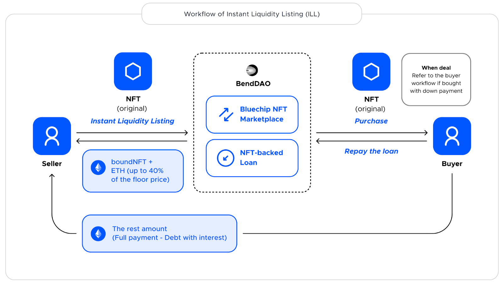

# BendDAO-analysis

BendDAO 是一个蓝筹 NFT 流动性协议，支持 NFT 借贷，抵押，抵押品挂单和 NFT 首付购买。

1. 官网：https://www.benddao.xyz/
2. 文档：https://docs.benddao.xyz/
3. 中文文档（一部分内容已经不再适用于最新版本）：https://github.com/cgq0123/bend-gitbook-portal/blob/chinese-v2/SUMMARY.md
4. 开发者文档：https://docs.benddao.xyz/developers/
5. 测试网站地址：https://goerli.benddao.xyz/

这里对他的业务和合约进行了解析。

- [BendDAO-analysis](#benddao-analysis)
  - [业务](#业务)
    - [Liquidity Listing](#liquidity-listing)
    - [boundNFT 的用途](#boundnft-的用途)
    - [预言机](#预言机)
  - [合约解析](#合约解析)
    - [Exchange Protocol](#exchange-protocol)
      - [Order](#order)
      - [成单方法](#成单方法)
        - [matchAskWithTakerBid](#matchaskwithtakerbid)
        - [matchAskWithTakerBidUsingETHAndWETH](#matchaskwithtakerbidusingethandweth)
        - [matchBidWithTakerAsk](#matchbidwithtakerask)
      - [事件](#事件)
      - [Execution Strategy（执行策略）](#execution-strategy执行策略)
      - [AuthorizationManager](#authorizationmanager)
      - [CurrencyManager](#currencymanager)
    - [Lending Protocol](#lending-protocol)
      - [Main Contracts 和 Supporting Contracts](#main-contracts-和-supporting-contracts)
      - [LendPool](#lendpool)
        - [重要属性](#重要属性)
        - [方法](#方法)
      - [LendPoolLoan](#lendpoolloan)
        - [属性](#属性)
        - [方法](#方法-1)
      - [BToken](#btoken)
      - [DebtToken](#debttoken)
      - [BoundNFT](#boundnft)
      - [Down Payment](#down-payment)

## 业务
### Liquidity Listing



#### 卖方视角

通过抵押品挂单，NFT 持有人/卖家可以选择接受即时 NFT 支持的贷款，并在挂单时即时获得最高达 40% 的地板价。用户可以随时在 BendDAO 上挂单抵押品。

1. 卖家创建 Liquidity Listing
2. 挂单的同时获取最多 40% 该系列 NFT 地板价 的 eth 和 一个作为抵押品的 boundNFT
3. 卖家可以随时卖出抵押品 boundNFT
4. 买方将在交易后偿还包括利息在内的贷款。扣除债务与利息后的余额将在交易后转给借款人（卖方）
5. 卖方将获得的金额 = 总价 - 含息债务

#### 买方视角

买家可以根据实际价格，支付最低为 60% 的首付来购买蓝筹 NFT，同时启动 AAVE 的闪电贷款来支付剩余部分。如果 NFT 的总价远远高于系列地板价，首付的比例会增加。闪电贷的借款金额将通过 BendDAO 上的即时 NFT 支持的贷款来偿还。

具体来说，BendDAO NFT 首付的流程如下。

1. 买家至少支付 60% 的首付款；
2. 启动闪电贷，从第三方平台（如 AAVE）借出剩余的资金；
3. 新购买的 NFT 将被用作 BendDAO 的抵押品以获得即时的流动性；
4. 该闪电贷将用从 BendDAO 借出的 ETH 来偿还。
5. 买家将在支付首付款时自动成为借款人。而借款人也可以在 BendDAO 市场上挂出他们抵押的 NFT 进行销售。

### boundNFT 的用途

1. 作为债务的 NFT：在借贷时被铸造，在偿还时被烧毁；
2. 通过不可转移和不可授权的方式保护 NFT 所有者免受黑客攻击；
3. 与用作 Twitter Blue PFP 同样的元数据；
4. 通过它获得任何空投、可领取的和可铸造的资产；

%20(1).png)

### 预言机

Bend 协议使用来自 OpenSea 和 LooksRare 的 NFT 地板价作为 NFT 抵押品的价格推送数据。Bend 协议只支持蓝筹 NFT 资产的地板价，用于链上价格推送。蓝筹 NFT 的地板价不容易被操纵。此外，Bend 协议计算地板价的 TWAP（时间加权均价），以过滤来自 OpenSea 和 LooksRare 交易市场的价格波动。

Bend 的预言机设计和运行机制：

1. 链下节点从 OpenSea 和 Looksrare 交易市场获得 NFT 的原始地板价；
2. 过滤原始地板价数据，如 Opensea 和 Lookrare 之间的地板价差异太大；
3. 根据 Opensea 和 Looksrare 的交易量计算出地板价；
4. 比较链上价格和最新地板价之间的差异，以决定是否需要将地板价上传到链上；
5. 调用合约接口，将地板价上传至链上合约，并计算链上时间加权平均价格（TWAP）以对地板价进行加权，确保价格合理；
6. twap 的算法在链上合约上是开源的，每个人都可以验证数据的有效性；


## 合约解析

https://docs.benddao.xyz/developers/


BendDAO 的协议包含两部分，分别是 Lending Protocol 包含了借贷相关的业务逻辑，Exchange Protocol 包含了交易相关的业务逻辑。

### Exchange Protocol

https://github.com/BendDAO/bend-exchange-protocol

Bend 交易所的核心合约是 BendExchange [0x7e832eC8ad6F66E6C9ECE63acD94516Dd7fC537A](https://etherscan.io/address/0x7e832eC8ad6F66E6C9ECE63acD94516Dd7fC537A)，它也是交易协议的主要入口点。大多数交互将通过 BendExchange 进行。

#### Order

Bend 交易所建立在混合系统（链下/链上）之上，该系统包含链下签名（称为 Maker Orders）和链上订单（称为 Taker Orders）。

* MakerBid——一种存在于链下的被动订单，用户希望使用特定的 ERC-20 代币获得 NFT。
* MakerAsk——一种存在于链下的被动订单，用户希望为特定的 ERC-20 代币出售 NFT。
* TakerBid — 在链上执行的与 MakerAsk 匹配的订单，例如，接受者接受 maker 的报价并为指定的 ERC-20 代币购买 NFT。
* TakerAsk — 在链上执行的与 MakerBid 匹配的订单，例如，接受者接受 maker 的报价并出售指定的 ERC-20 代币的 NFT。

##### Maker order

```solidity
struct MakerOrder {
        bool isOrderAsk; // true --> ask / false --> bid
        address maker; // maker of the maker order
        address collection; // collection address
        uint256 price; // The price of the order. The price is expressed in BigNumber based on the number of decimals of the “currency”. For Dutch auction, it is the minimum price at the end of the auction.
        uint256 tokenId; // id of the token,For collection orders, this field is not used in the execution and set it at 0.
        uint256 amount; // amount of tokens to sell/purchase (must be 1 for ERC721, 1+ for ERC1155)
        address strategy; // strategy for trade execution (e.g. StandardSaleForFixedPrice) 订单的执行策略
        address currency;
        uint256 nonce; // order nonce (must be unique unless new maker order is meant to override existing one e.g., lower ask price)
        uint256 startTime; // startTime in timestamp
        uint256 endTime; // endTime in timestamp
        uint256 minPercentageToAsk; // slippage protection， The minimum percentage required to be transferred to the ask or the trade is rejected (e.g., 8500 = 85% of the trade price).
        bytes params; // additional parameters, Can contain additional parameters that are not used for standard orders (e.g., maximum price for a Dutch auction, recipient address for a private sale, or a Merkle root... for future advanced order types!). If it doesn't, it is displayed "0x"
        address interceptor; // This field is only avaiable for ask order and used to execute specific logic before transferring the collection, For BNFT, it is used to repay the debt and redeeming the original NFT.
        bytes interceptorExtra; // Additional parameters when executing interceptor
        uint8 v; // v: parameter (27 or 28)
        bytes32 r; // r: parameter
        bytes32 s; // s: parameter
    }
```

##### Taker order

```solidity
struct TakerOrder {
        bool isOrderAsk; // true --> ask / false --> bid
        address taker; // msg.sender
        uint256 price; // final price for the purchase
        uint256 tokenId; // id of the token
        uint256 minPercentageToAsk; // // slippage protection
        bytes params; // other params (e.g., tokenId)
        address interceptor;
        bytes interceptorExtra;
    }
```

##### isOrderAsk

Ask 表示用户正在出售 NFT，而 Bid 表示用户正在购买 NFT（使用 WETH 等可替代货币）。

##### strategy

执行交易的执行策略地址。只有被 ExecutionManager 合约列入白名单的策略才能在 Bend 交易所中有效。如果执行策略未列入白名单，则交易不会发生。

##### currency

执行交易的货币地址。只有被 CurrencyManager 合约列入白名单的货币才能在 Bend 交易所中有效。如果货币未列入白名单，则无法进行交易。

##### minPercentageToAsk​

minPercentageToAsk 保护询问用户免受版税费用的潜在意外变化。当交易在链上执行时，如果平台总价格的特定百分比没有询问用户，交易将无法进行。

例如，如果 Alice 用 minPercentageToAsk = 8500 签署了她的收藏订单。如果协议费用为 2%，而版税更新为 16%，则该交易将无法在链上执行，因为 18% > 15 %。

##### params

此字段用于特定于不太频繁的复杂订单的附加参数（例如，私人销售、荷兰式拍卖和更复杂的订单类型）。附加参数集以字节表示，其中参数是连接在一起的。

##### interceptor（拦截器）

该字段仅对询单（ask order）可用，用于在转收之前执行特定的逻辑。比如对于BNFT，用于偿还债务和赎回原始NFT。

#### 成单方法

##### matchAskWithTakerBid

撮合成交一个卖单。

订单成交后悔发出 `TakerBid` 的事件。

```solidity
function matchAskWithTakerBid(
        OrderTypes.TakerOrder calldata takerBid,
        OrderTypes.MakerOrder calldata makerAsk
    ) external payable override nonReentrant
```

##### matchAskWithTakerBidUsingETHAndWETH

撮合成交一个以 eth 支付的卖单。

订单成交后悔发出 `TakerBid` 的事件。

```solidity
function matchAskWithTakerBidUsingETHAndWETH(
        OrderTypes.TakerOrder calldata takerBid,
        OrderTypes.MakerOrder calldata makerAsk
    )
```

##### matchBidWithTakerAsk

撮合成交一个买单。

订单成交后悔发出 `TakerAsk` 的事件。

```solidity
function matchBidWithTakerAsk(OrderTypes.TakerOrder calldata takerAsk, OrderTypes.MakerOrder calldata makerBid)
        external
        override
        nonReentrant
```

#### 事件

卖单成交后发出的事件。

```solidity
event TakerAsk(
        bytes32 makerOrderHash, // bid hash of the maker order
        uint256 orderNonce, // user order nonce
        address indexed taker, // sender address for the taker ask order
        address indexed maker, // maker address of the initial bid order
        address indexed strategy, // strategy that defines the execution
        address currency, // currency address
        address collection, // collection address
        uint256 tokenId, // tokenId transferred
        uint256 amount, // amount of tokens transferred
        uint256 price // final transacted price
    );
```

买单成交后发出的事件。

```solidity
event TakerBid(
        bytes32 makerOrderHash, // ask hash of the maker order
        uint256 orderNonce, // user order nonce
        address indexed taker, // sender address for the taker bid order
        address indexed maker, // maker address of the initial ask order
        address indexed strategy, // strategy that defines the execution
        address currency, // currency address
        address collection, // collection address
        uint256 tokenId, // tokenId transferred
        uint256 amount, // amount of tokens transferred
        uint256 price // final transacted price
    );
```

#### Execution Strategy（执行策略）

每个订单中都有 strategy 这个属性，来描述订单具体的执行策略对应的合约的地址。

在成单方法中会调用指定的 strategy 的 `canExecuteTakerAsk()` 或者 `canExecuteTakerBid()` 方法来检查是否符合指定的策略。

BendExchange 合约有个属性 executionManager 就是用来管理所有执行策略的。

##### 1. StrategyStandardSaleForFixedPrice

以固定价格执行订单的策略，可以通过买盘或卖盘来执行。

canExecuteTaker 方法会校验价格，token id 以及订单的时间。

##### 2. StrategyPrivateSale

与上面的策略类似，不同的是 StrategyPrivateSale 策略的订单额外通过订单的 params 指定 接收者的地址。

##### 3. StrategyDutchAuction

拍卖的时候执行的策略。会根据时间计算出当前价价格 currentAuctionPrice。

需要注意的是该策略只有 `canExecuteTakerAsk()` 方法永远返回 false 。

##### 4. StrategyAnyItemInASetForFixedPrice

以固定价格发送订单的策略，可由一组 tokenIds 中的任何 tokenId 匹配。

与 Seaport 中基于标准的订单一样，都是通过 Merkle Tree 来实现具体的逻辑的。

##### 5. StrategyAnyItemFromCollectionForFixedPrice

以固定价格发送订单的策略，该订单可由集合的任何 tokenId 匹配。

同样类似于 Seaport 中基于标准的订单中不指定具体的 tokenId。

#### AuthorizationManager

用于注册授权代理，每个用户都有自己独立的代理。类似于 Wyvern Protocol。

用户将自己的资产授权给生成的代理合约。然后具体执行的时候由代理合约进行资产转移。

#### CurrencyManager

它允许添加/删除用于在 Bend 交易所进行交易的货币。

### Lending Protocol

https://github.com/BendDAO/bend-lending-protocol

#### Main Contracts 和 Supporting Contracts

Lending Protocol 中的合约分为两类，Main Contracts 和 Supporting Contracts。

Main Contracts 包含:

1. `LendPool` : Bend 借贷协议的主要入口。与 Bend 的大多数借贷相关交互将通过 LendPool 进行
2. `LendPoolLoan` : NFT 借贷管理者，在借贷中使用 NFT 作为抵押品时生成唯一的借贷，并维护 NFT 与借贷之间的关系。
3. `LendPoolAddressesProvider` : 协议的用于特定市场主要地址。应通过适当的调用从该合约中检索最新的合约地址。
4. `LendPoolAddressesProviderRegistry` : 包含针对不同市场的活动 LendPoolAddressesProvider 地址列表。
5. `bTokens` : 一种特殊的 ERC20 代币。用于协议中的计息、代币化存款。
6. `debtTokens` : 一种特殊的 ERC20 代币。协议中使用的代币化债务。转移方法被禁用
7. `boundNFTs`: 一种特殊的 ERC721 代币本票，协议中使用的代币化抵押品。大多数标准的 ERC721 方法被禁用，因为 boundNFT 是不可转让的。

Supporting Contracts 一般不应直接与之交互，但通过合同调用在整个 Bend 协议中使用。

Supporting Contracts 包含:

1. `LendPoolConfigurator` : 为 LendPool 提供配置功能。
2. `InterestRate` : 保存了计算和更新特定储备的利率所需的信息。每份合同都使用每种货币的相应参数存储优化的基础曲线。这意味着有一个数学函数决定了每个资产池的利率，利率根据借入资金的数量和资产池的总流动性（即利用率）而变化。
3. `NFTOracle`: 提供整个协议所需的储备和 NFTs 资产价格数据。

#### LendPool

LendPool 是 Bend 借贷协议的主要入口，它暴露了所有面向用户的行动。与 Bend 的大多数借贷相关交互将通过 LendPool 进行。

> LendPool 的入金、借款、取款和还款方法只适用于 ERC20 和 ERC721，如果你想使用原生 ETH 入金、取款、借款或还款，请使用 WETHGateway 代替，如果你想使用 CryptoPunks 作为抵押品借款或还款，请使用 PunkGateway。

##### 重要属性

所有 LendPool 的属性都在 LendPoolStorage 合约中定义。

###### 1. _reserves(储备金)

存储储备金配置的字典。key 是储备金资产对应的合约地址。value 是具体的配置信息。

```solidity
  mapping(address => DataTypes.ReserveData) internal _reserves;
```

```solidity
struct ReserveData {
    //stores the reserve configuration 
    // 储备金的一些配置
    ReserveConfigurationMap configuration;
    //the liquidity index. Expressed in ray
    // 流动性指数，用向量表示
    uint128 liquidityIndex;
    //variable borrow index. Expressed in ray
    // 浮动借贷指数，用向量表示
    uint128 variableBorrowIndex;
    //the current supply rate. Expressed in ray
    // 当前的供应率，用向量表示
    uint128 currentLiquidityRate;
    //the current variable borrow rate. Expressed in ray
    // 当前的可变借款利率，用向量表示
    uint128 currentVariableBorrowRate;
    uint40 lastUpdateTimestamp;
    //tokens addresses
    // bToken 代币的地址
    address bTokenAddress;
    // 债务代币的地址
    address debtTokenAddress;
    //address of the interest rate strategy
    // 利息策略
    address interestRateAddress;
    //the id of the reserve. Represents the position in the list of the active reserves
    // 储备的ID。代表在活动的储备列表中的位置
    uint8 id;
  }
```

```solidity
// 不同的位置表示不同的配置项
struct ReserveConfigurationMap {
    //bit 0-15: LTV
    //bit 16-31: Liq. threshold
    //bit 32-47: Liq. bonus
    //bit 48-55: Decimals
    //bit 56: Reserve is active
    //bit 57: reserve is frozen
    //bit 58: borrowing is enabled
    //bit 59: stable rate borrowing enabled
    //bit 60-63: reserved
    //bit 64-79: reserve factor
    uint256 data;
  }
```

###### 2. _reservesList

存储的是储备金对应资产的合约地址。key 是储备金对应的 id

```solidity
  mapping(uint256 => address) internal _reservesList;
```

###### 3. _reservesCount

存储的是所有储备金的类型数量

```solidity
  uint256 internal _reservesCount;
```

###### 4. _nfts

存储的是可以进行借贷的 NFT 的信息。

key 是 NFT 的合约地址，value 是对应 NFT 的配置信息。

```solidity
  mapping(address => DataTypes.NftData) internal _nfts;
```

```solidity
struct NftData {
    //stores the nft configuration
    // 配置信息
    NftConfigurationMap configuration;
    //address of the bNFT contract
    // bNFT 的合约地址
    address bNftAddress;
    //the id of the nft. Represents the position in the list of the active nfts
    uint8 id;
    uint256 maxSupply;
    uint256 maxTokenId;
  }
```

```solidity
struct NftConfigurationMap {
    //bit 0-15: LTV
    //bit 16-31: Liq. threshold
    //bit 32-47: Liq. bonus
    //bit 56: NFT is active
    //bit 57: NFT is frozen
    uint256 data;
  }
```

###### 5. _nftsList

```solidity
  mapping(uint256 => address) internal _nftsList;
```

###### 6. _nftsCount

```solidity
  uint256 internal _nftsCount;
```

##### 方法

###### 1. deposit（存款）

向储备金存入一定数量的相关资产，获得相关的 bTokens 作为债权证明。例如，用户存入 100 USDC，得到 100 bUSDC。

```solidity
function deposit(
    address asset, // 存入资产的合约地址
    uint256 amount, // 数量
    address onBehalfOf, // 收到 btoken 的地址
    uint16 referralCode // 用于注册发起该操作的集成商的代码，以获得潜在的奖励。如果该操作是由用户直接执行的，没有任何中间人，则为0
  )
```

这个方法的具体逻辑在 `SupplyLogic` 的 `executeDeposit()` 方法中。

```solidity
function executeDeposit(
    mapping(address => DataTypes.ReserveData) storage reservesData,
    DataTypes.ExecuteDepositParams memory params
  ) external {
    // onBehalfOf 是接收 bTokens 的地址，如果用户想在自己的钱包上接收 bTokens，则与 msg.sender相同，如果 bTokens 的受益人是其他的钱包，则是不同的地址。
    require(params.onBehalfOf != address(0), Errors.VL_INVALID_ONBEHALFOF_ADDRESS);

    DataTypes.ReserveData storage reserve = reservesData[params.asset];
    address bToken = reserve.bTokenAddress;
    require(bToken != address(0), Errors.VL_INVALID_RESERVE_ADDRESS);

    ValidationLogic.validateDeposit(reserve, params.amount);

    // 更新 reserve (储备金)的状态
    reserve.updateState();
    // 更新 reserve (储备金)的利率
    reserve.updateInterestRates(params.asset, bToken, params.amount, 0);

    // 将资产转移到 bToken 的合约中
    IERC20Upgradeable(params.asset).safeTransferFrom(params.initiator, bToken, params.amount);

    // 铸造 Btoken 给用户
    IBToken(bToken).mint(params.onBehalfOf, params.amount, reserve.liquidityIndex);

    // 发出事件
    emit Deposit(params.initiator, params.asset, params.amount, params.onBehalfOf, params.referralCode);
  }
```

存入的资产会转移到 bToken 对应的合约中。同时指定数量的 bToken 将会被铸造。

需要注意的是 `reserve.updateState()`， 这个方法用来更新流动资金累积指数和可变借贷指数。

每个涉及到借贷的方法都会首先调用这个方法来更新储备金的各种指数。

```solidity
// ReserveLogic.sol => updateState()

function updateState(DataTypes.ReserveData storage reserve) internal {
    // 缩放的可变债务
    uint256 scaledVariableDebt = IDebtToken(reserve.debtTokenAddress).scaledTotalSupply();
    // 之前的变量借贷指数
    uint256 previousVariableBorrowIndex = reserve.variableBorrowIndex;
    // 之前的流动性指数
    uint256 previousLiquidityIndex = reserve.liquidityIndex;
    // 上次更新时间
    uint40 lastUpdatedTimestamp = reserve.lastUpdateTimestamp;

    // 更新储备指数和更新的时间戳
    (uint256 newLiquidityIndex, uint256 newVariableBorrowIndex) = _updateIndexes(
      reserve,
      scaledVariableDebt,
      previousLiquidityIndex,
      previousVariableBorrowIndex,
      lastUpdatedTimestamp
    );

    // 以特定资产的储备系数为函数，将部分偿还的利息存入储备金库。
    _mintToTreasury(
      reserve,
      scaledVariableDebt,
      previousVariableBorrowIndex,
      newLiquidityIndex,
      newVariableBorrowIndex,
      lastUpdatedTimestamp
    );
  }
```

```solidity
// ReserveLogic.sol => _updateIndexes()

function _updateIndexes(
    DataTypes.ReserveData storage reserve,
    uint256 scaledVariableDebt,
    uint256 liquidityIndex,
    uint256 variableBorrowIndex,
    uint40 timestamp
  ) internal returns (uint256, uint256) {
    // 当前的供应率
    uint256 currentLiquidityRate = reserve.currentLiquidityRate;

    // 新的清算指数设置为之前的流动性指数
    uint256 newLiquidityIndex = liquidityIndex;
    // 新的借贷指数设置为之前的变量借贷指数
    uint256 newVariableBorrowIndex = variableBorrowIndex;

    //only cumulating if there is any income being produced
    // 只有在当前的流动性率大于 0 的情况下才会进行累积
    if (currentLiquidityRate > 0) {
      // 计算距离上次计算后累积的流动性资金利息
      uint256 cumulatedLiquidityInterest = MathUtils.calculateLinearInterest(currentLiquidityRate, timestamp);
      // 计算新的流动性指数
      newLiquidityIndex = cumulatedLiquidityInterest.rayMul(liquidityIndex);
      // 防止溢出
      require(newLiquidityIndex <= type(uint128).max, Errors.RL_LIQUIDITY_INDEX_OVERFLOW);

      reserve.liquidityIndex = uint128(newLiquidityIndex);

      //as the liquidity rate might come only from stable rate loans, we need to ensure
      //that there is actual variable debt before accumulating
      // 由于存款的利息完全来自于贷款的利息，因此要确保债务必须大于 0
      if (scaledVariableDebt != 0) {
        // 计算距离上次计算后累积的流动借贷的利息
        uint256 cumulatedVariableBorrowInterest = MathUtils.calculateCompoundedInterest(
          reserve.currentVariableBorrowRate,
          timestamp
        );
        // 计算新的借贷指数
        newVariableBorrowIndex = cumulatedVariableBorrowInterest.rayMul(variableBorrowIndex);
        require(newVariableBorrowIndex <= type(uint128).max, Errors.RL_VARIABLE_BORROW_INDEX_OVERFLOW);
        reserve.variableBorrowIndex = uint128(newVariableBorrowIndex);
      }
    }

    //solium-disable-next-line
    // 修改更新时间
    reserve.lastUpdateTimestamp = uint40(block.timestamp);
    return (newLiquidityIndex, newVariableBorrowIndex);
  }
```

```solidity
// ReserveLogic.sol => _mintToTreasury()

function _mintToTreasury(
    DataTypes.ReserveData storage reserve,
    uint256 scaledVariableDebt,
    uint256 previousVariableBorrowIndex,
    uint256 newLiquidityIndex,
    uint256 newVariableBorrowIndex,
    uint40 timestamp
  ) internal {
    timestamp;
    MintToTreasuryLocalVars memory vars;

    vars.reserveFactor = reserve.configuration.getReserveFactor();

    // 如果储备指数等于0直接返回
    if (vars.reserveFactor == 0) {
      return;
    }

    //calculate the last principal variable debt
    // 计算上一次的债务
    vars.previousVariableDebt = scaledVariableDebt.rayMul(previousVariableBorrowIndex);

    //calculate the new total supply after accumulation of the index
    // 计算当前的债务
    vars.currentVariableDebt = scaledVariableDebt.rayMul(newVariableBorrowIndex);

    //debt accrued is the sum of the current debt minus the sum of the debt at the last update
    // 计算新增的债务
    vars.totalDebtAccrued = vars.currentVariableDebt - (vars.previousVariableDebt);

    // 根据准备金因子计算需要增发的 BToken 数量
    vars.amountToMint = vars.totalDebtAccrued.percentMul(vars.reserveFactor);

    // amountToMint 大于 0 的时候进行铸造 BToken 到储备金库，来计算利息。
    if (vars.amountToMint != 0) {
      IBToken(reserve.bTokenAddress).mintToTreasury(vars.amountToMint, newLiquidityIndex);
    }
  }
```

###### 2. withdraw（提取）

从储备中提取一定数量的质押资产，销毁所拥有的等值 bToken。

```solidity
function withdraw(
    address asset, // 取出的资产合约地址
    uint256 amount, // 数量
    address to 
  )
```

这个方法的具体逻辑在 `SupplyLogic` 的 `executeWithdraw()` 方法中。

```solidity
function executeWithdraw(
    mapping(address => DataTypes.ReserveData) storage reservesData,
    DataTypes.ExecuteWithdrawParams memory params
  ) external returns (uint256) {
    require(params.to != address(0), Errors.VL_INVALID_TARGET_ADDRESS);

    DataTypes.ReserveData storage reserve = reservesData[params.asset];
    address bToken = reserve.bTokenAddress;
    require(bToken != address(0), Errors.VL_INVALID_RESERVE_ADDRESS);

    // 查看用户的 bToken 余额
    uint256 userBalance = IBToken(bToken).balanceOf(params.initiator);

    uint256 amountToWithdraw = params.amount;

    if (params.amount == type(uint256).max) {
      amountToWithdraw = userBalance;
    }

    ValidationLogic.validateWithdraw(reserve, amountToWithdraw, userBalance);

    // 更新储备金状态
    reserve.updateState();

    reserve.updateInterestRates(params.asset, bToken, 0, amountToWithdraw);

    // 销毁 BToken，并将指定数量的资产转移给用户
    IBToken(bToken).burn(params.initiator, params.to, amountToWithdraw, reserve.liquidityIndex);

    emit Withdraw(params.initiator, params.asset, amountToWithdraw, params.to);

    return amountToWithdraw;
  }
```

指定数量的 bToken 将会被销毁，然后将对应数量的资产转移给指定的地址。

###### 3. borrow（借）

允许抵押资产的用户借入特定数量的储备基础资产。例如。用户借入 100 USDC，在钱包中收到 100 USDC 并锁定合约中的抵押资产。

```solidity
function borrow(
    address asset, // 要借的资产合约地址
    uint256 amount,
    address nftAsset, // 用作抵押品的 NFT 的地址
    uint256 nftTokenId, // 用作抵押品的 NFT 的代币 ID
    address onBehalfOf, // 将收到贷款的用户的地址。如果他想用自己的抵押品借款，应该是借款人自己调用函数的地址
    uint16 referralCode 
  ) 
```

这个方法的具体逻辑在 `BorrowLogic` 中的 `_borrow()`。

```solidity
function _borrow(
    ILendPoolAddressesProvider addressesProvider,
    mapping(address => DataTypes.ReserveData) storage reservesData,
    mapping(address => DataTypes.NftData) storage nftsData,
    DataTypes.ExecuteBorrowParams memory params
  ) internal {
    // onBehalfOf 是收到贷款的地址，不能为空。如果是借款人想用自己的抵押品借款，那 onBehalfOf 应该是借款人本身的地址
    require(params.onBehalfOf != address(0), Errors.VL_INVALID_ONBEHALFOF_ADDRESS);

    ExecuteBorrowLocalVars memory vars;
    // initiator 是调用者的地址
    vars.initiator = params.initiator;

    // 获取要借贷的货币对应储备金的数据
    DataTypes.ReserveData storage reserveData = reservesData[params.asset];
    // 获取要进行抵押的 NFT 相关数据
    DataTypes.NftData storage nftData = nftsData[params.nftAsset];

    // update state MUST BEFORE get borrow amount which is depent on latest borrow index
    // 更新 reserve (储备金)的状态
    reserveData.updateState();

    // Convert asset amount to ETH
    vars.reserveOracle = addressesProvider.getReserveOracle();
    vars.nftOracle = addressesProvider.getNFTOracle();
    vars.loanAddress = addressesProvider.getLendPoolLoan();

    // 根据抵押品 NFT 的信息来获取借贷是否已经存在
    vars.loanId = ILendPoolLoan(vars.loanAddress).getCollateralLoanId(params.nftAsset, params.nftTokenId);

    vars.totalSupply = IERC721EnumerableUpgradeable(params.nftAsset).totalSupply();
    require(vars.totalSupply <= nftData.maxSupply, Errors.LP_NFT_SUPPLY_NUM_EXCEED_MAX_LIMIT);
    require(params.nftTokenId <= nftData.maxTokenId, Errors.LP_NFT_TOKEN_ID_EXCEED_MAX_LIMIT);

    // 校验借款参数
    ValidationLogic.validateBorrow(
      params.onBehalfOf,
      params.asset,
      params.amount,
      reserveData,
      params.nftAsset,
      nftData,
      vars.loanAddress,
      vars.loanId,
      vars.reserveOracle,
      vars.nftOracle
    );

    // 如果借贷不存在则创建借贷，铸造 bNFT 给用户
    if (vars.loanId == 0) {
      IERC721Upgradeable(params.nftAsset).safeTransferFrom(vars.initiator, address(this), params.nftTokenId);

      vars.loanId = ILendPoolLoan(vars.loanAddress).createLoan(
        vars.initiator,
        params.onBehalfOf,
        params.nftAsset,
        params.nftTokenId,
        nftData.bNftAddress,
        params.asset,
        params.amount,
        reserveData.variableBorrowIndex
      );
    } else { // 如果借贷存在则更新借贷信息
      ILendPoolLoan(vars.loanAddress).updateLoan(
        vars.initiator,
        vars.loanId,
        params.amount,
        0,
        reserveData.variableBorrowIndex
      );
    }

    // 铸造指定数量的 debtToken（债务代币）给借款人或者贷款接收者
    IDebtToken(reserveData.debtTokenAddress).mint(
      vars.initiator,
      params.onBehalfOf,
      params.amount,
      reserveData.variableBorrowIndex
    );

    // update interest rate according latest borrow amount (utilizaton)
    // 更新 reserve (储备金)的利率
    reserveData.updateInterestRates(params.asset, reserveData.bTokenAddress, 0, params.amount);

    // 将 BToken 中的锚定的资产转移给借款人
    IBToken(reserveData.bTokenAddress).transferUnderlyingTo(vars.initiator, params.amount);

    // 发出 `Borrow` 事件
    emit Borrow(
      vars.initiator,
      params.asset,
      params.amount,
      params.nftAsset,
      params.nftTokenId,
      params.onBehalfOf,
      reserveData.currentVariableBorrowRate,
      vars.loanId,
      params.referralCode
    );
  }
```

###### 4. repay（还款）

偿还特定储备的借入金额，销毁所拥有的等值贷款。例如。用户偿还 100 USDC，销毁贷款并获得抵押资产。

```solidity
function repay(
    address nftAsset, // 用作抵押品的 NFT 的合约地址
    uint256 nftTokenId,
    uint256 amount // 还款的数量
  ) external override nonReentrant whenNotPaused returns (uint256, bool) 
```

这个方法的具体逻辑在 `BorrowLogic` 中的 `_repay()`。

```solidity
function _repay(
    ILendPoolAddressesProvider addressesProvider,
    mapping(address => DataTypes.ReserveData) storage reservesData,
    mapping(address => DataTypes.NftData) storage nftsData,
    DataTypes.ExecuteRepayParams memory params
  ) internal returns (uint256, bool) {
    RepayLocalVars memory vars;
    // initiator 是调用者的地址
    vars.initiator = params.initiator;

    vars.poolLoan = addressesProvider.getLendPoolLoan();

    // 获取借贷的id，借贷必须已经存在
    vars.loanId = ILendPoolLoan(vars.poolLoan).getCollateralLoanId(params.nftAsset, params.nftTokenId);
    require(vars.loanId != 0, Errors.LP_NFT_IS_NOT_USED_AS_COLLATERAL);

    // 获取借贷的具体信息
    DataTypes.LoanData memory loanData = ILendPoolLoan(vars.poolLoan).getLoan(vars.loanId);

    // 获取借贷的货币对应储备金的数据
    DataTypes.ReserveData storage reserveData = reservesData[loanData.reserveAsset];
    // 获取进行抵押的 NFT 相关数据
    DataTypes.NftData storage nftData = nftsData[loanData.nftAsset];

    // update state MUST BEFORE get borrow amount which is depent on latest borrow index
    // 更新储备金的状态
    reserveData.updateState();

    // 获取借款数量
    (, vars.borrowAmount) = ILendPoolLoan(vars.poolLoan).getLoanReserveBorrowAmount(vars.loanId);

    ValidationLogic.validateRepay(reserveData, nftData, loanData, params.amount, vars.borrowAmount);

    vars.repayAmount = vars.borrowAmount;
    vars.isUpdate = false;
    if (params.amount < vars.repayAmount) { // 部分偿还
      vars.isUpdate = true;
      vars.repayAmount = params.amount;
    }

    if (vars.isUpdate) { // 只偿还部分借贷时候会去更新借贷信息
      ILendPoolLoan(vars.poolLoan).updateLoan(
        vars.initiator,
        vars.loanId,
        0,
        vars.repayAmount,
        reserveData.variableBorrowIndex
      );
    } else { // 全部偿还则调用偿还借贷的方法
      ILendPoolLoan(vars.poolLoan).repayLoan(
        vars.initiator,
        vars.loanId,
        nftData.bNftAddress,
        vars.repayAmount,
        reserveData.variableBorrowIndex
      );
    }

    // 销毁 DebtToken
    IDebtToken(reserveData.debtTokenAddress).burn(loanData.borrower, vars.repayAmount, reserveData.variableBorrowIndex);

    // update interest rate according latest borrow amount (utilizaton)
    // 更新 reserve (储备金)的利率
    reserveData.updateInterestRates(loanData.reserveAsset, reserveData.bTokenAddress, vars.repayAmount, 0);

    // transfer repay amount to bToken
    // 将还的资产转移给 bToken
    IERC20Upgradeable(loanData.reserveAsset).safeTransferFrom(
      vars.initiator,
      reserveData.bTokenAddress,
      vars.repayAmount
    );

    // transfer erc721 to borrower
    // 全部还清贷款的时候将 NFT 归还给用户
    if (!vars.isUpdate) { 
      IERC721Upgradeable(loanData.nftAsset).safeTransferFrom(address(this), loanData.borrower, params.nftTokenId);
    }

    // 发出 `Repay` 事件
    emit Repay(
      vars.initiator,
      loanData.reserveAsset,
      vars.repayAmount,
      loanData.nftAsset,
      loanData.nftTokenId,
      loanData.borrower,
      vars.loanId
    );

    return (vars.repayAmount, !vars.isUpdate);
  }
```

###### 5. auction（拍卖）

拍卖非健康的借贷。调用者（清算人）想要购买被清算用户的抵押资产。

Bend 的拍卖机制是英式拍卖，出价最高的人将成为获胜者。

```solidity
function auction(
    address nftAsset,
    uint256 nftTokenId,
    uint256 bidPrice,
    address onBehalfOf // 获得 NFT 的用户的地址，如果用户想在自己的钱包上接收，则与 msg.sender 相同，否则是不同的地址
  )
```

具体逻辑的实现在 `LiquidateLogic` 的 `executeAuction()`

```solidity
function executeAuction(
    ILendPoolAddressesProvider addressesProvider,
    mapping(address => DataTypes.ReserveData) storage reservesData,
    mapping(address => DataTypes.NftData) storage nftsData,
    DataTypes.ExecuteLendPoolStates memory poolStates,
    DataTypes.ExecuteAuctionParams memory params
  ) external {
    // onBehalfOf 是获得 NFT 的用户的地址
    require(params.onBehalfOf != address(0), Errors.VL_INVALID_ONBEHALFOF_ADDRESS);

    AuctionLocalVars memory vars;
    // initiator 是调用者地址
    vars.initiator = params.initiator;

    vars.loanAddress = addressesProvider.getLendPoolLoan();
    vars.reserveOracle = addressesProvider.getReserveOracle();
    vars.nftOracle = addressesProvider.getNFTOracle();

    // 获得 loanId，并且 loanId 不能为空
    vars.loanId = ILendPoolLoan(vars.loanAddress).getCollateralLoanId(params.nftAsset, params.nftTokenId);
    require(vars.loanId != 0, Errors.LP_NFT_IS_NOT_USED_AS_COLLATERAL);

    DataTypes.LoanData memory loanData = ILendPoolLoan(vars.loanAddress).getLoan(vars.loanId);

    DataTypes.ReserveData storage reserveData = reservesData[loanData.reserveAsset];
    DataTypes.NftData storage nftData = nftsData[loanData.nftAsset];

    // 校验拍卖信息
    ValidationLogic.validateAuction(reserveData, nftData, loanData, params.bidPrice);

    // update state MUST BEFORE get borrow amount which is depent on latest borrow index
    // 更新 reserve (储备金)的状态
    reserveData.updateState();

    // 计算价格信息
    (vars.borrowAmount, vars.thresholdPrice, vars.liquidatePrice) = GenericLogic.calculateLoanLiquidatePrice(
      vars.loanId,
      loanData.reserveAsset,
      reserveData,
      loanData.nftAsset,
      nftData,
      vars.loanAddress,
      vars.reserveOracle,
      vars.nftOracle
    );

    // first time bid need to burn debt tokens and transfer reserve to bTokens
    // 上面这个注释好像有问题，因为并没有销毁 debt token
    if (loanData.state == DataTypes.LoanState.Active) {
      // loan's accumulated debt must exceed threshold (heath factor below 1.0)
      // 健康因子必须小于 1 的才能进行拍卖
      require(vars.borrowAmount > vars.thresholdPrice, Errors.LP_BORROW_NOT_EXCEED_LIQUIDATION_THRESHOLD);

      // bid price must greater than borrow debt
      // 出价必须大于借款债务
      require(params.bidPrice >= vars.borrowAmount, Errors.LPL_BID_PRICE_LESS_THAN_BORROW);

      // bid price must greater than liquidate price
      // 出价必须大于清算价格
      require(params.bidPrice >= vars.liquidatePrice, Errors.LPL_BID_PRICE_LESS_THAN_LIQUIDATION_PRICE);
    } else {
      // bid price must greater than borrow debt
      require(params.bidPrice >= vars.borrowAmount, Errors.LPL_BID_PRICE_LESS_THAN_BORROW);

      if ((poolStates.pauseDurationTime > 0) && (loanData.bidStartTimestamp <= poolStates.pauseStartTime)) {
        vars.extraAuctionDuration = poolStates.pauseDurationTime;
      }
      vars.auctionEndTimestamp =
        loanData.bidStartTimestamp +
        vars.extraAuctionDuration +
        (nftData.configuration.getAuctionDuration() * 1 hours);
      require(block.timestamp <= vars.auctionEndTimestamp, Errors.LPL_BID_AUCTION_DURATION_HAS_END);

      // bid price must greater than highest bid + delta
      // 拍卖价格必须大于最大的出价的区间
      vars.minBidDelta = vars.borrowAmount.percentMul(PercentageMath.ONE_PERCENT);
      require(params.bidPrice >= (loanData.bidPrice + vars.minBidDelta), Errors.LPL_BID_PRICE_LESS_THAN_HIGHEST_PRICE);
    }

    // 执行拍卖
    ILendPoolLoan(vars.loanAddress).auctionLoan(
      vars.initiator,
      vars.loanId,
      params.onBehalfOf,
      params.bidPrice,
      vars.borrowAmount,
      reserveData.variableBorrowIndex
    );

    // lock highest bidder bid price amount to lend pool
    // 将出价最高者的资产转移到当前地址
    IERC20Upgradeable(loanData.reserveAsset).safeTransferFrom(vars.initiator, address(this), params.bidPrice);

    // transfer (return back) last bid price amount to previous bidder from lend pool
    // 归还之前出价者的资产
    if (loanData.bidderAddress != address(0)) {
      IERC20Upgradeable(loanData.reserveAsset).safeTransfer(loanData.bidderAddress, loanData.bidPrice);
    }

    // update interest rate according latest borrow amount (utilizaton)
    reserveData.updateInterestRates(loanData.reserveAsset, reserveData.bTokenAddress, 0, 0);

    // 发出 Auction 事件
    emit Auction(
      vars.initiator,
      loanData.reserveAsset,
      params.bidPrice,
      params.nftAsset,
      params.nftTokenId,
      params.onBehalfOf,
      loanData.borrower,
      vars.loanId
    );
  }
```

###### 6. redeem（赎回）

用于赎回处于拍卖状态的非健康 NFT 贷款的功能。调用者必须是借款人。借款人可以在赎回时间到期前赎回自己的东西。

```solidity
function redeem(
    address nftAsset,
    uint256 nftTokenId,
    uint256 amount,
    uint256 bidFine // 罚款的金额
  ) external override nonReentrant whenNotPaused returns (uint256) 
```

具体逻辑的实现在 `LiquidateLogic` 的 `executeRedeem()`

```solidity
function executeRedeem(
    ILendPoolAddressesProvider addressesProvider,
    mapping(address => DataTypes.ReserveData) storage reservesData,
    mapping(address => DataTypes.NftData) storage nftsData,
    DataTypes.ExecuteLendPoolStates memory poolStates,
    DataTypes.ExecuteRedeemParams memory params
  ) external returns (uint256) {
    RedeemLocalVars memory vars;
    // initiator 是调用者
    vars.initiator = params.initiator;

    vars.poolLoan = addressesProvider.getLendPoolLoan();
    vars.reserveOracle = addressesProvider.getReserveOracle();
    vars.nftOracle = addressesProvider.getNFTOracle();

    vars.loanId = ILendPoolLoan(vars.poolLoan).getCollateralLoanId(params.nftAsset, params.nftTokenId);
    require(vars.loanId != 0, Errors.LP_NFT_IS_NOT_USED_AS_COLLATERAL);

    DataTypes.LoanData memory loanData = ILendPoolLoan(vars.poolLoan).getLoan(vars.loanId);

    DataTypes.ReserveData storage reserveData = reservesData[loanData.reserveAsset];
    DataTypes.NftData storage nftData = nftsData[loanData.nftAsset];

    // 校验赎回的参数
    ValidationLogic.validateRedeem(reserveData, nftData, loanData, params.amount);

    if ((poolStates.pauseDurationTime > 0) && (loanData.bidStartTimestamp <= poolStates.pauseStartTime)) {
      vars.extraRedeemDuration = poolStates.pauseDurationTime;
    }
    vars.redeemEndTimestamp = (loanData.bidStartTimestamp +
      vars.extraRedeemDuration +
      nftData.configuration.getRedeemDuration() *
      1 hours);
    
    // 必须在可赎回时间内赎回
    require(block.timestamp <= vars.redeemEndTimestamp, Errors.LPL_BID_REDEEM_DURATION_HAS_END);

    // update state MUST BEFORE get borrow amount which is depent on latest borrow index
    // 更新状态
    reserveData.updateState();

    (vars.borrowAmount, , ) = GenericLogic.calculateLoanLiquidatePrice(
      vars.loanId,
      loanData.reserveAsset,
      reserveData,
      loanData.nftAsset,
      nftData,
      vars.poolLoan,
      vars.reserveOracle,
      vars.nftOracle
    );

    // check bid fine in min & max range
    // 检查罚息在正确的范围内
    (, vars.bidFine) = GenericLogic.calculateLoanBidFine(
      loanData.reserveAsset,
      reserveData,
      loanData.nftAsset,
      nftData,
      loanData,
      vars.poolLoan,
      vars.reserveOracle
    );

    // check bid fine is enough
    // 检查罚息主够
    require(vars.bidFine <= params.bidFine, Errors.LPL_INVALID_BID_FINE);

    // check the minimum debt repay amount, use redeem threshold in config
    // 计算最小偿还价格
    vars.repayAmount = params.amount;
    vars.minRepayAmount = vars.borrowAmount.percentMul(nftData.configuration.getRedeemThreshold());
    require(vars.repayAmount >= vars.minRepayAmount, Errors.LP_AMOUNT_LESS_THAN_REDEEM_THRESHOLD);

    // check the maxinmum debt repay amount, 90%?
    // 检查最大偿还价格
    vars.maxRepayAmount = vars.borrowAmount.percentMul(PercentageMath.PERCENTAGE_FACTOR - PercentageMath.TEN_PERCENT);
    require(vars.repayAmount <= vars.maxRepayAmount, Errors.LP_AMOUNT_GREATER_THAN_MAX_REPAY);

    // 调用开始偿还贷款
    ILendPoolLoan(vars.poolLoan).redeemLoan(
      vars.initiator,
      vars.loanId,
      vars.repayAmount,
      reserveData.variableBorrowIndex
    );

    // 销毁 DebtToken
    IDebtToken(reserveData.debtTokenAddress).burn(loanData.borrower, vars.repayAmount, reserveData.variableBorrowIndex);

    // update interest rate according latest borrow amount (utilizaton)
    // 更新 reserve (储备金)的利率
    reserveData.updateInterestRates(loanData.reserveAsset, reserveData.bTokenAddress, vars.repayAmount, 0);

    // transfer repay amount from borrower to bToken
    // 将资产转移给 bToken
    IERC20Upgradeable(loanData.reserveAsset).safeTransferFrom(
      vars.initiator,
      reserveData.bTokenAddress,
      vars.repayAmount
    );

    if (loanData.bidderAddress != address(0)) {
      // transfer (return back) last bid price amount from lend pool to bidder
      // 返还之前出价者的资金
      IERC20Upgradeable(loanData.reserveAsset).safeTransfer(loanData.bidderAddress, loanData.bidPrice);

      // transfer bid penalty fine amount from borrower to the first bidder
      // 转移给之前出价者的奖金
      IERC20Upgradeable(loanData.reserveAsset).safeTransferFrom(
        vars.initiator,
        loanData.firstBidderAddress,
        vars.bidFine
      );
    }

    // 发出事件
    emit Redeem(
      vars.initiator,
      loanData.reserveAsset,
      vars.repayAmount,
      vars.bidFine,
      loanData.nftAsset,
      loanData.nftTokenId,
      loanData.borrower,
      vars.loanId
    );

    return (vars.repayAmount + vars.bidFine);
  }
```

###### 7. liquidate（清算）

清算处于拍卖状态的非健康 NFT 贷款的功能。调用者（清算人）购买被清算用户的抵押资产，并收到抵押资产。

```solidity
function liquidate(
    address nftAsset,
    uint256 nftTokenId,
    uint256 amount
  ) external override nonReentrant whenNotPaused returns (uint256) 
```

具体逻辑的实现在 `LiquidateLogic` 的 `executeLiquidate()`

```solidity
function executeLiquidate(
    ILendPoolAddressesProvider addressesProvider,
    mapping(address => DataTypes.ReserveData) storage reservesData,
    mapping(address => DataTypes.NftData) storage nftsData,
    DataTypes.ExecuteLendPoolStates memory poolStates, // 当前流动池的状态，主要是流动池暂停的开始时间和暂停时间
    DataTypes.ExecuteLiquidateParams memory params
  ) external returns (uint256) {
    LiquidateLocalVars memory vars;
    vars.initiator = params.initiator;

    vars.poolLoan = addressesProvider.getLendPoolLoan();
    vars.reserveOracle = addressesProvider.getReserveOracle();
    vars.nftOracle = addressesProvider.getNFTOracle();

    vars.loanId = ILendPoolLoan(vars.poolLoan).getCollateralLoanId(params.nftAsset, params.nftTokenId);
    require(vars.loanId != 0, Errors.LP_NFT_IS_NOT_USED_AS_COLLATERAL);

    DataTypes.LoanData memory loanData = ILendPoolLoan(vars.poolLoan).getLoan(vars.loanId);

    DataTypes.ReserveData storage reserveData = reservesData[loanData.reserveAsset];
    DataTypes.NftData storage nftData = nftsData[loanData.nftAsset];

    ValidationLogic.validateLiquidate(reserveData, nftData, loanData);

    // 如果当前流动池是暂停时长大于0且清算的NFT拍卖开始时间小于暂停开始时间
    if ((poolStates.pauseDurationTime > 0) && (loanData.bidStartTimestamp <= poolStates.pauseStartTime)) {
      // 拍卖的额外时长设置为暂停时长
      // 就是说如果拍卖开始之后当前流动池暂停了一段时间，则拍卖时长要加上这个暂停时长
      vars.extraAuctionDuration = poolStates.pauseDurationTime;
    }

    // 拍卖结束时间等于拍卖开始时间加上额外拍卖时长加上nft配置拍卖的时间
    vars.auctionEndTimestamp =
      loanData.bidStartTimestamp +
      vars.extraAuctionDuration +
      (nftData.configuration.getAuctionDuration() * 1 hours);

    // 当前时间要大于拍卖结束时间
    require(block.timestamp > vars.auctionEndTimestamp, Errors.LPL_BID_AUCTION_DURATION_NOT_END);

    // update state MUST BEFORE get borrow amount which is depent on latest borrow index
    // 更新状态
    reserveData.updateState();

    (vars.borrowAmount, , ) = GenericLogic.calculateLoanLiquidatePrice(
      vars.loanId,
      loanData.reserveAsset,
      reserveData,
      loanData.nftAsset,
      nftData,
      vars.poolLoan,
      vars.reserveOracle,
      vars.nftOracle
    );

    // Last bid price can not cover borrow amount
    // 拍卖价格小于借出的价格的时候需要清算人加上这个额外的金额
    if (loanData.bidPrice < vars.borrowAmount) {
      vars.extraDebtAmount = vars.borrowAmount - loanData.bidPrice;
      require(params.amount >= vars.extraDebtAmount, Errors.LP_AMOUNT_LESS_THAN_EXTRA_DEBT);
    }

    // 拍卖金额大于借款金额，算出剩余的金额
    if (loanData.bidPrice > vars.borrowAmount) {
      vars.remainAmount = loanData.bidPrice - vars.borrowAmount;
    }

    // 清算借贷
    ILendPoolLoan(vars.poolLoan).liquidateLoan(
      loanData.bidderAddress,
      vars.loanId,
      nftData.bNftAddress,
      vars.borrowAmount,
      reserveData.variableBorrowIndex
    );

    // 销毁 debtToken
    IDebtToken(reserveData.debtTokenAddress).burn(
      loanData.borrower,
      vars.borrowAmount,
      reserveData.variableBorrowIndex
    );

    // update interest rate according latest borrow amount (utilizaton)
    reserveData.updateInterestRates(loanData.reserveAsset, reserveData.bTokenAddress, vars.borrowAmount, 0);

    // transfer extra borrow amount from liquidator to lend pool
    // 将额外的债务金额转到流动池中
    if (vars.extraDebtAmount > 0) {
      IERC20Upgradeable(loanData.reserveAsset).safeTransferFrom(vars.initiator, address(this), vars.extraDebtAmount);
    }

    // transfer borrow amount from lend pool to bToken, repay debt
    // 归还借款金额到 bToken 的合约中
    IERC20Upgradeable(loanData.reserveAsset).safeTransfer(reserveData.bTokenAddress, vars.borrowAmount);

    // transfer remain amount to borrower
    // 额外拍卖多出来的转给借贷者
    if (vars.remainAmount > 0) {
      IERC20Upgradeable(loanData.reserveAsset).safeTransfer(loanData.borrower, vars.remainAmount);
    }

    // transfer erc721 to bidder
    // 将 nft 转移给拍卖出价者
    IERC721Upgradeable(loanData.nftAsset).safeTransferFrom(address(this), loanData.bidderAddress, params.nftTokenId);

    emit Liquidate(
      vars.initiator,
      loanData.reserveAsset,
      vars.borrowAmount,
      vars.remainAmount,
      loanData.nftAsset,
      loanData.nftTokenId,
      loanData.borrower,
      vars.loanId
    );

    return (vars.extraDebtAmount);
  }
```

#### LendPoolLoan

协议的 NFT 借贷管理者，在借贷中使用 NFT 作为抵押品时生成唯一的借贷，并维护 NFT 与借贷之间的关系。

##### 属性

###### 1. _loanIdTracker

当前生成借贷的 id 索引。

```solidity
  CountersUpgradeable.Counter private _loanIdTracker;
```

###### 2. _loans

存储的是所有借贷的具体信息。key 是借贷的 id，value 是借贷的具体信息。

```solidity
mapping(uint256 => DataTypes.LoanData) private _loans;
```

```solidity
struct LoanData {
    //the id of the nft loan
    uint256 loanId;
    //the current state of the loan
    LoanState state;
    //address of borrower
    // 借款人
    address borrower;
    //address of nft asset token
    address nftAsset;
    //the id of nft token
    uint256 nftTokenId;
    //address of reserve asset token
    // 储备金的合约地址，也就是要借出资产的合约地址
    address reserveAsset;
    //scaled borrow amount. Expressed in ray
    // 按比例的借款金额
    uint256 scaledAmount;
    //start time of first bid time
    // 清算时间
    uint256 bidStartTimestamp;
    //bidder address of higest bid
    address bidderAddress;
    //price of higest bid
    uint256 bidPrice;
    //borrow amount of loan
    uint256 bidBorrowAmount;
    //bidder address of first bid
    address firstBidderAddress;
  }
```

###### 3. _nftToLoanIds

以 nft 的合约地址和token id 存储对应的借贷 loanId，存储某个 nft 的具体某个 id 对应的 loanId。

```solidity
mapping(address => mapping(uint256 => uint256)) private _nftToLoanIds;
```

```solidity
_nftToLoanIds[nftAsset][nftTokenId] = loanId;
```

###### 4. _nftTotalCollateral

存储某个 nft 抵押品的数量。

```solidity
mapping(address => uint256) private _nftTotalCollateral;
```

###### 5. _userNftCollateral

记录某个用户的某种 nft 下抵押品的数量。

```solidity
mapping(address => mapping(address => uint256)) private _userNftCollateral;
```

```solidity
_userNftCollateral[loan.borrower][loan.nftAsset] -= 1;
```

##### 方法

###### 1. createLoan

```solidity
function createLoan(
    address initiator,
    address onBehalfOf,
    address nftAsset,
    uint256 nftTokenId,
    address bNftAddress,
    address reserveAsset,
    uint256 amount,
    uint256 borrowIndex
  ) external override onlyLendPool returns (uint256) 
```

该方法中有以下操作

1. 生成 loanid
2. 根据抵押的 nft 的合约地址和 tokenId 保存 loanid
3. 将抵押的 nft 转移到当前 pool 合约
4. 铸造 bNFT 给用户
5. 保存信息
6. 发出 `LoanCreated` 事件

###### 2. updateLoan

```solidity
function updateLoan(
    address initiator,
    uint256 loanId,
    uint256 amountAdded,
    uint256 amountTaken,
    uint256 borrowIndex
  )
```

根据传入的 `amountAdded` 和 `amountTaken` 来调节对应 loanId 的借贷信息。

发出 `LoanUpdated` 事件。

###### 3. repayLoan(偿还贷款)

```solidity
function repayLoan(
    address initiator,
    uint256 loanId,
    address bNftAddress,
    uint256 amount,
    uint256 borrowIndex
  )
```

该方法中有以下操作

1. 首先修改存储的 loan 状态，防止重入攻击
2. 将 `_nftToLoanIds` 中对应的 loanId 置为 0
3. `_userNftCollateral` 和 `_nftTotalCollateral` 中对应的数量减去 1
4. 销毁债务 bNFT
5. 将质押的 NFT 转移给用户
6. 发出 `LoanRepaid` 事件

###### 4. auctionLoan（拍卖）

```solidity
function auctionLoan(
    address initiator,
    uint256 loanId,
    address onBehalfOf,
    uint256 bidPrice,
    uint256 borrowAmount,
    uint256 borrowIndex
  )
```

1. 获取 loan 的信息
2. 如果 `bidStartTimestamp` 是 0，则说明还没开始拍卖，设置对应的状态和数据
3. 如果 loan 当前的状态不是 Auction ，则报错
4. 如果 当前传入的 `bidPrice` 小于等于 loan 的 `bidPrice`，也报错
5. 设置 loan 的状态
6. 发出 `LoanAuctioned` 的事件

###### 5. redeemLoan（赎回）

```solidity
function redeemLoan(
    address initiator,
    uint256 loanId,
    uint256 amountTaken,
    uint256 borrowIndex
  ) 
```

1. 只有 Auction 状态的才能进行赎回
2. 传入的 `amountTaken` 必须满足要求的数量
3. 清除 loan 的状态
4. 发出 `LoanRedeemed` 的事件

###### 6. liquidateLoan（清算）

```solidity
function liquidateLoan(
    address initiator,
    uint256 loanId,
    address bNftAddress,
    uint256 borrowAmount,
    uint256 borrowIndex
  ) 
```

1. 只有 Auction 状态的才能进行清算
2. 更改 loan 的状态，防止重入攻击
3. 将 `_nftToLoanIds` 中对应的 loanId 置为 0
4. `_userNftCollateral` 和 `_nftTotalCollateral` 中对应的数量减去 1
5. 销毁债务 bNFT
6. 将质押的 NFT 转移给用户
7. 发出 `LoanLiquidated` 事件

#### BToken

BToken（比如 bendETH）是在存款和取款时铸造和烧毁的计息代币。 BToken 的价值与相应存入资产的价值以 1:1 的比例挂钩，可以安全地存储、转移或交易。

存款的时候会铸造对应数量的 BToken，并将用户存入的资产转到 BToken 的合约中。

取款的时候会销毁对应数量的 BToken，并将 BToken 合约中的资产转移给用户。

抵押借贷的时候会将 BToken 合约中对应数量的资产转移给借贷者。而如果在两次更新储备金状态的时候有新增的贷款，需要铸造指定数量的 BToken 给国库来收取利息。

归还贷款的时候会将对应数量的资产转移给 BToken 合约中，这个归还资产的数量是本金加利息的总和。其中利息的数量对应着转给国库的 BToken 数量。

通过上面的这些操作，保证了 BToken 与锚定资产的动态平衡。

最后 BToken 储备收集的所有利息通过不断增加其钱包余额直接分配给 BToken 持有者。

#### DebtToken

债务代币是在借款和偿还时铸造和燃烧的计息代币，代表代币持有人所欠的债务。

#### BoundNFT

boundNFT 是本票代币，在借款和偿还时铸造和销毁，代表代币持有者用作抵押品的 NFT，具有相同的代币 ID。

boundNFT 的代币与对应的 NFT 抵押品的代币 1:1 挂钩。绑定 NFT 持有者拥有的所有代币都可以很容易地集成到 NFT 钱包和社交媒体中。

#### Down Payment

https://github.com/BendDAO/bend-downpayment

这是首付的入口合约。

买家可以根据实际价格支付最低 60% 的首付来购买蓝筹 NFT，同时从 AAVE 发起闪电贷以支付剩余部分。如果 NFT 的总价远高于收藏底价，则首付比例会增加。闪贷的借入金额将通过 BendDAO 上的即时 NFT 支持贷款偿还。

具体来说，工作流程如下。

1. 买方支付最低60%的首付；
2. 启动闪电贷以从第三方平台借入剩余资金，例如AAVE；
3. 新购买的 NFT 将用作 BendDAO 的抵押品，以获得即时流动性；
4. 闪电贷将用从 BendDAO 借来的 ETH 偿还。

买家将自动成为首付的借款人。借款人也可以在 BendDAO 市场上出售他们抵押的 NFT。

目前支持的 NFT 集合是 BAYC、CryptoPunks、MAYC、Doodles、Space Doodles、CloneX 和 Azuki。首付的百分比由 BendDAO 上的 LTV 决定。
