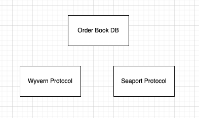
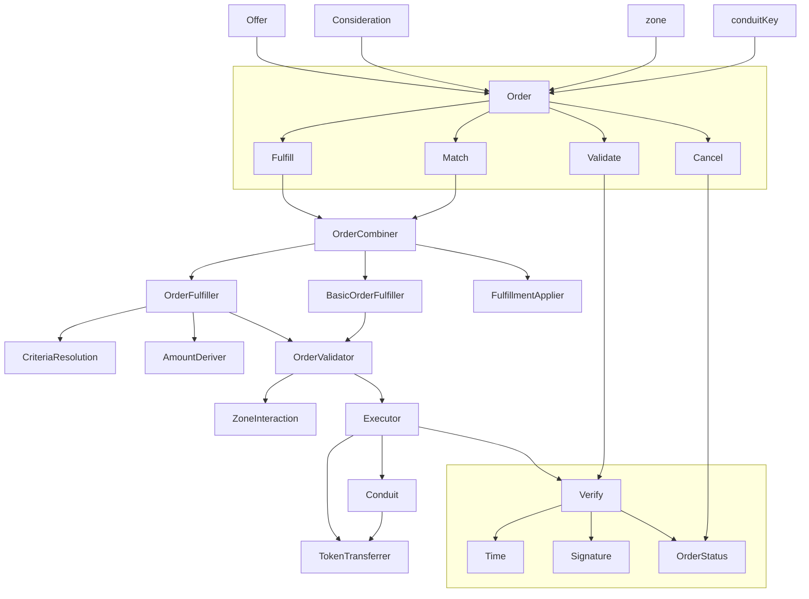
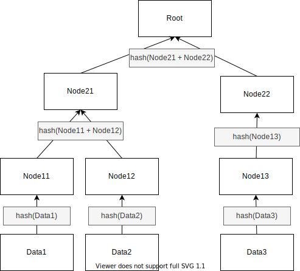
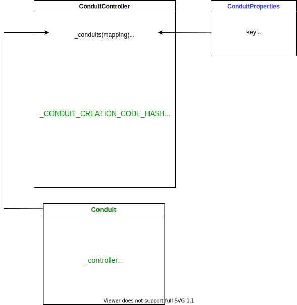

# Seaport Analysis


- [Seaport Analysis](#seaport-analysis)
  - [概述](#概述)
    - [对比](#对比)
  - [结构](#结构)
  - [Order](#order)
    - [1. offer 和 consideration](#1-offer-和-consideration)
    - [2. offerer](#2-offerer)
    - [3. startTime 和 endTime](#3-starttime-和-endtime)
    - [4. orderType](#4-ordertype)
    - [5. zone](#5-zone)
    - [6. zoneHash](#6-zonehash)
    - [7. conduitKey](#7-conduitkey)
    - [8. counter](#8-counter)
  - [Order Fulfillment Method](#order-fulfillment-method)
    - [fulfill](#fulfill)
    - [match](#match)
    - [Advanced](#advanced)
    - [Conduit（管道）](#conduit管道)
    - [fulfillBasicOrder](#fulfillbasicorder)
    - [fulfillOrder 和 fulfillAdvancedOrder](#fulfillorder-和-fulfilladvancedorder)
    - [fulfillAvailableOrders 和 fulfillAvailableAdvancedOrders](#fulfillavailableorders-和-fulfillavailableadvancedorders)
    - [matchOrders 和 matchAdvancedOrders](#matchorders-和-matchadvancedorders)
  - [订单成交的流程](#订单成交的流程)
    - [Seaport 流程图](#seaport-流程图)
    - [当通过 fulfillOrder 或 fulfillAdvancedOrder 完成一个订单时](#当通过-fulfillorder-或-fulfilladvancedorder-完成一个订单时)
    - [Match Orders](#match-orders)
  - [总结](#总结)
    - [1. zone 和 受限制订单（Restricted order）](#1-zone-和-受限制订单restricted-order)
    - [2. 部分填充（Partial fills）](#2-部分填充partial-fills)
    - [3. 基于标准的订单（Criteria-based orders）](#3-基于标准的订单criteria-based-orders)
    - [4. 管道（Conduit）和通道（Channel）](#4-管道conduit和通道channel)
  - [参考](#参考)

## 概述

Seaport 的交易模型跟之前的 Wyvern Protocol 一样，依旧是中央订单簿的交易模型。都是由链下的中心化的订单簿和链上的交易组成。



其中链下的订单簿负责存储用户的挂单信息，并对订单进行撮合。最终的成交和转移 NFT 是由 Seaport Protocol 来负责的。

### 对比

我们都知道 Opensea 之前用的合约是 Wyvern Protocol。但是随着生态的发展 Wyvern Protocol 的各种问题开始暴露了出来。

1. 多年前开发的，代码最后维护的时间都是 4 年前了。
2. 不是专门为 Opensea 专门量身定做的，有大量的资源浪费。
3. gas 消耗多，280000 左右（单个）。
4. 不支持直接使用代币购买 NFT，购买的时候需要转换。进一步提高了 gas 消耗和购买成本。

也正是为了解决这些问题 Seaport Protocol 被开发出来了。他有以下特性：

1. 支持批量购买，批量卖出。
2. 支持不同币种来购买。
3. 支持混合支付，比如订单可以设置成以一些 ERC20 代币加上某些 ERC721 代币来支付。主要目的是去除不同币种相互转换带来的损耗，进一步降低用户的额外费用。
4. 使用大量的内联汇编来降低 gas 消耗，目前测试来看是 134000 左右（单个）

我们可以看出 Seaport Protocol 最重要的目的就是降低用户的 gas 消耗并且降低购买流程的复杂度。

## 结构



上图是官方给出的简化的流程图。

大致可以分为以下几个部分：

1. Order，订单相关数据结构
2. Order Fulfillment，订单撮合成交的方法
3. Verify，订单的校验
4. Transferrer，token 的转移

我们下面会大致按照这个顺序来进行分析。有些内容可能会穿插到一起。

## Order

这里先分析 `order` 的数据结构，一些功能的具体实现后面再详细叙述。

### 1. offer 和 consideration

目前大多数 NFT 市场只允许一方同意提供 NFT，另一方同意提供支付代币的 listing。Seaport 采取了一种不同的方法：`offerer` 可以同意提供一定数量的 ETH/ERC20/ERC721/ERC1155 项目--这就是 `offer`。为了使该`offer`被接受，`offerer`必须收到一定数量的物品，这就是 `consideration`。

也就是说 Seaport 中没有明确的买家和卖家的概念了。

1. 当 `offer` 是 ERC721/ERC1155 的时候，`offerer` 就是卖家，卖出 ERC721/ERC1155 来换取 ETH/ERC20。
2. 当 `offer` 是 ETH/ERC20 的时候，`offerer` 就是买家，买入 ERC721/ERC1155，支付 ETH/ERC20。
3. 当 `offer` 和 `consideration` 都是 是 ERC721/ERC1155 的时候就是 NFT 的互换了，这种情况下就无所谓买家和卖家了。

需要注意的是 **ETH/ERC20 在 Seaport 中充当的是货币（currency），ERC721/ERC1155 充当的是商品。** 这一点很重要。

还有一点需要注意的是 `order` 中 `offer` 和 `consideration` 都是数组类型。数组的元素个数可以是任意数量的。也就是说 订单中 `offer` 或者 `consideration` 中的一个可以是空的。

```solidity
// ConsiderationStructs.sol => OfferItem

struct OfferItem {
    ItemType itemType;
    address token;
    uint256 identifierOrCriteria;
    uint256 startAmount;
    uint256 endAmount;
}

struct ConsiderationItem {
    ItemType itemType;
    address token;
    uint256 identifierOrCriteria;
    uint256 startAmount;
    uint256 endAmount;
    address payable recipient;
}
```

#### 1) itemType

```solidity
// ConsiderationEnums.sol => ItemType

enum ItemType {
    // 0: ETH on mainnet, MATIC on polygon, etc.
    NATIVE,

    // 1: ERC20 items (ERC777 and ERC20 analogues could also technically work)
    ERC20,

    // 2: ERC721 items
    ERC721,

    // 3: ERC1155 items
    ERC1155,

    // 4: ERC721 items where a number of tokenIds are supported
    ERC721_WITH_CRITERIA,

    // 5: ERC1155 items where a number of ids are supported
    ERC1155_WITH_CRITERIA
}
```

需要注意的是 `ERC721_WITH_CRITERIA` 和 `ERC1155_WITH_CRITERIA`。表示基于标准的 ERC721/ERC1155。

配合 `identifierOrCriteria` 可以用来表示一个标准，代表一个或者多个 NFT 的集合。

还有一点需要注意的是在 `OrderFulfilled` 事件中 `ERC721_WITH_CRITERIA` 和 `ERC1155_WITH_CRITERIA` 类型的元素会被转换为对应的 `ERC721` 和 `ERC1155` 类型。

#### 2) token

具体 token 的合约地址，空地址表示原生代币。

#### 3) identifierOrCriteria

对于 ETH/ERC20 类型的 token，这个属性会被忽略。

对于 ERC721/ERC1155 类型的项目，表示 token id。

对于 ERC721_WITH_CRITERIA/ERC1155_WITH_CRITERIA 类型的项目， 该值表示的是一个 merkle tree 的 root 值。这个 merkle tree 由指定的 token id 集合来生成。

简单来说就是卖家拥有一个 collection 的多个 NFT。这时候他就可以提供一个 `offer`，这个 `offer` 里的 `identifierOrCriteria` 是通过他所拥有的 NFT 对应的 token id 组成的集合生成的。这样这个 `offer` 就包含了他拥有的所有 NFT 对应的 token id 的信息。买家在交易的时候可以选择某一个 token id 的 NFT 进行交易，如果验证通过就能进行成交。具体实现过程后面再详细说明。

`identifierOrCriteria` 可以为 0，表示买家提供该 collection 下所有 NFT 的 offer。买家在成交的时候可以选择该 collection 下 `offerer` 所拥有的任意 NFT。

需要注意的是，这个特性在 Opensea 目前的前端界面中还不支持。

#### 4) startAmount 和 endAmount

普通情况下这两个值是相同的。表示 token 的数量。

在进行荷兰式拍卖和英格兰式拍卖的时候，这两个值是不同的。然后订单根据当前这个两个属性并结合当前区块时间以及订单的 startTime、endTime 来确定当前的价格。

```solidity
// AmountDeriver.sol =>  _locateCurrentAmount()

// Derive the duration for the order and place it on the stack.
duration = endTime - startTime;

// Derive time elapsed since the order started & place on stack.
elapsed = block.timestamp - startTime;

// Derive time remaining until order expires and place on stack.
remaining = duration - elapsed;
```

#### 5) recipient

`consideration` 需要指明 `recipient`。代表 token 的接收者地址。

### 2. offerer

`order` 里的 `offer` 的提供者。

需要注意的是，订单要是想要成交或者说想要转移 `offerer` 提供的 `offer`，必须是下面三个情况中的一个。

1. `msg.sender == offerer`，也就是 `offerer` 自己操作
2. 通过签名进行授权，标准的 65-byte EDCSA, 64-byte EIP-2098, 或者通过 EIP-1271 `isValidSignature()` 的校验。大部分情况下是这种。
3. offerer 通过调用 `validate()` 进行链上挂单的。这种情况下订单成交的时候可以跳过签名的校验。

```solidity
// Consideration.sol => validate()

function validate(Order[] calldata orders)
        external
        override
        returns (bool validated)
    {
        // Validate the orders.
        validated = _validate(orders);
    }
```

### 3. startTime 和 endTime

订单的开始和结束时间。还可以配合 `offer` 或者 `consideration` 的 `startAmount`/`endAmount` 来确定拍卖的价格。

### 4. orderType

订单有四种类型，是两种类型选项的组合。

#### 1) FULL 和 PARTIAL

`FULL` 表示订单不支持部分填充，而 `PARTIAL` 允许填充订单的某些部分。部分填充一般用于 ERC1155 的 NFT。买方可以购买 offer 中的一部分。

#### 2) OPEN 和 RESTRICTED

`OPEN` 表示执行订单的调用可以由任何帐户提交，而 `RESTRICTED` 是限制性的订单，要求由 `offerer` 或订单 `zone` 执行订单，或者调用 zone 的 `isValidOrder()`或 `isValidOrderIncludingExtraData()` 方法来查看返回的 magic value。这个 magic value 表示订单是否已被批准。

```solidity
// ConsiderationEnums.sol => OrderType

enum OrderType {
    // 0: no partial fills, anyone can execute
    FULL_OPEN,

    // 1: partial fills supported, anyone can execute
    PARTIAL_OPEN,

    // 2: no partial fills, only offerer or zone can execute
    FULL_RESTRICTED,

    // 3: partial fills supported, only offerer or zone can execute
    PARTIAL_RESTRICTED
}
```

### 5. zone

zone 是可选的辅助帐户，一般情况下是一个合约。

具有两个附加权限：

1. `zone` 可以通过调用 `cancel()` 来取消对应的的订单。（注意，`offerer` 也可以取消自己的订单，可以单独取消，也可以通过调用 `incrementCounter()` 立即取消与当前计数器签署的所有订单）。
2. `RESTRICTED` 类型的订单必须由 `zone` 或 `offerer` 执行，或者调用 `zone` 的 `isValidOrder()`或 `isValidOrderIncludingExtraData()` 方法来查看返回的 magic value。这个 magic value 表示订单是否已被批准。

简单来说 `zone` 是在成单前做额外校验的，并且可以取消 `offerer` 的 listing。`offerer` 可以利用 `zone` 来做一些交易过滤相关的操作。

### 6. zoneHash

`zoneHash` 代表一个任意的 32 字节的值，在履行限制性订单时，该值将被提供给 `zone` ，`zone` 在决定是否授权该订单时可以利用该值。

### 7. conduitKey

`conduitKey` 是一个 bytes32 的值，表示在执行代币转移时，应该利用什么 conduit（渠道） 作为代币批准的来源。默认情况下（即当 `conduitKey` 被设置为 0 时），`offerer` 将直接向 Seaport 授权 ERC20、ERC721 和 ERC1155 代币，这样它就可以在执行期间执行订单指定的转移。相反，`offerer` 将代币批准给对应的 `conduit`，然后 Seaport 将指示该 `conduit` 转移各自的代币。

`conduitKey` 跟 `conduit` 是密切关联的。项目方，拥有者或者平台可以通过 `conduit` 来管理 NFT 的交易。提供了更大的灵活性。

### 8. counter

计数器，要与 `offerer` 的计数器相同。

`offerer` 可以通过调用 `incrementCounter()` 立即取消与当前计数器签署的所有订单。

## Order Fulfillment Method

在 Wyvern Protocol 中所有的订单都是通过 `orderMatch()` 方法来最终成交的。Seaport 与之不同，提供了 7 个方法来执行交易。

这些方法可以分为两类：

### fulfill

包括所有以 fulfill 开头的方法。

1. fulfillBasicOrder => 0xfb0f3ee1
2. fulfillOrder => 0xb3a34c4c
3. fulfillAdvancedOrder => 0xe7acab24
4. fulfillAvailableOrders => 0xed98a574
5. fulfillAvailableAdvancedOrders => 0x87201b41

调用这些方法的时候，第二个隐含订单将被构建，调用者为 `offerer`，将要履行的订单的 `offer` 为 `consideration`，将要履行订单的 `consideration` 为 `offer`。将要履行订单的 `offer` 项目将从订单的 `offerer` 转移到履行者，然后所有 `consideration` 项目将从履行者转移到指定的接受者。

目前大部分成交都调用的这些方法。

### match

包括 match 开头的方法。

1. matchOrders => 0xa8174404
2. matchAdvancedOrders => 0x55944a42

这些方法将多个订单（大于等于 2）匹配起来，Seaport 将简单地确保每个订单的需求重合。

以这种方式履行的订单没有一个明确的履行者。交易成功的事件中 recipient 为空。

目前发现的有一种使用场景：

1. 在挂单的时候指定某个地址购买。这个指定的地址在购买的时候。

后面应该会有更多的使用场景。

### Advanced

Advanced 分两个维度

一个是订单：订单分为 Order / AdvancedOrder

二是方法：方法也有 普通方法 和 Advanced 方法

总结下来 Advanced 主要体现在下面几点：

#### 1. 部分填充（Partial fills）

上面我们了解到 `orderType` 中有 FULL 和 PARTIAL 的分别。 FULL 表示完全填充，也就是买方必须购买全部的 `offer`。 PARTIAL 则表示允许买方购买部分的 `offer`。

因此在使用部分填充的时候 `orderType` 必须是 1 或者 3。

AdvancedOrder 相较于 Order 多了 `numerator`（分子）和 `denominator`（分母）两个参数。通过他们计算出来一个比率，这个比率就是买方希望获取数量占 `offer` 总数量的比率。分子、分母都是 1 则表示要全部购买。（其实在 Advanced 的方法中 Order 都会被转化为 AdvancedOrder，分子、分母都是 1）

一个 PARTIAL 类型的 `offer` 支持多次部分填充。也就是说如果一次交易没有完全卖出，订单还是有效的。后续还可以进行购买。

有几点需要注意：

1. 部分填充的比率是原订单 `offer` 数量为基准的。
   1. 比如说 `offer` 中有 10 个。
   2. 第一次成交 3/10，还剩余 7 个。
   3. 第二次成交 1/2 ，买方获得的数量是 `1 / 2 * 10 = 5`。
2. 如果总数量是 `amount`，那么 `amount * (numerator / denominator)` 必须是个整数，否则会报 `InexactFraction` 的错误。
3. 如果买方想要获取的比率乘以总数量大于剩余数量的话将会获取剩余的全部。
4. 如果 numerator > denominator 或者 numerator == 0，会报 `BadFraction` 的错误。

#### 2. 基于标准的订单（Criteria-based orders）

前面介绍 `identifierOrCriteria` 的时候，我们大致了解了基于标准的订单的基本逻辑。现在看看是怎么实现的。

这里面涉及到一个我们都很熟悉的数据结构： Merkle Tree。



我们通过一个例子来具体说明实现过程。

1. 首先一个 `offerer` 拥有某个 collection 的三个 ERC721 token。tokend id 分别是 1、2、6。
2. `offerer` 挂出他的 token。挂单的时候要生成一个 Merkle Tree。Data1 = 1， Data1 = 2， Data1 = 6。最终得到 Root 的值。然后生成订单信息，`offer` 的 `identifierOrCriteria` = `Root`。
3. 某个买家想要购买 tokend id 为 1 的 token。需要调用 Advanced 方法。
4. Advanced 方法需要传入 `criteriaResolvers` 参数。具体类型如下

```solidity
// ConsiderationStructs.sol => CriteriaResolver

struct CriteriaResolver {
    uint256 orderIndex; // 用于一次成交多个订单的情况，表明需要校验哪个订单
    Side side;  // offer 或者 consideration，具体订单中的哪一方
    uint256 index; // offer 或者 consideration 中的元素索引，找出具体哪个元素
    uint256 identifier; // 想要成交的 tokend id， 上面例子中就是 1
    bytes32[] criteriaProof; // 证明所需的数据，比如上面的例子中就是 Node12 和 Node22 组成的集合。
}
```

5. 执行订单的时候要先进行证明，证明买家要买的 token 包含在 `offerer` 的 `offer` 之中。

```solidity
// CriteriaResolution.sol => _verifyProof()

/**
     * @dev Internal pure function to ensure that a given element is contained
     *      in a merkle root via a supplied proof.
     *
     * @param leaf  The element for which to prove inclusion. 上面的例子中就是 1
     * @param root  The merkle root that inclusion will be proved against. offer 中的 identifierOrCriteria
     * @param proof The merkle proof. 买方成单的时候传入的 criteriaProof
     */
    function _verifyProof(
        uint256 leaf,
        uint256 root,
        bytes32[] memory proof
    )
    // 省略具体代码
    // 大致证明逻辑如下
    // 1. 根据 leaf 生成 Node11
    // 2. 根据 Node11 和传入的 Node12 生成 Node21
    // 3. 根据 Node21 和传入的 Node22 生成 Root
    // 4. 如果 Root == root 就说明通过了证明
```

6. 将 `offerer` 对应 token id 的 token 转移给买家，完成交易。

还有一点需要注意的是 如果 `offerer` 的 `offer` 中 `identifierOrCriteria` 是 0 的话，表示买家可以购买 `offerer` 的任意 token id 的 token。

#### 3. 受限订单和额外数据（Restricted order and Extra data）

所谓受限制（RESTRICTED）的订单就是在成单前检查订单的时候需要进行额外的校验，只有通过校验的订单才能进行成交。

受限订单是所有方法都有的，额外数据是 Advanced 特有的。我们看看具体实现。

```solidity
// ZoneInteraction.sol => _assertRestrictedAdvancedOrderValidity()

    function _assertRestrictedAdvancedOrderValidity(
        AdvancedOrder memory advancedOrder,
        CriteriaResolver[] memory criteriaResolvers,
        bytes32[] memory priorOrderHashes,
        bytes32 orderHash,
        bytes32 zoneHash,
        OrderType orderType,
        address offerer,
        address zone
    ) internal view {
        // Order type 2-3 require zone or offerer be caller or zone to approve.
        // 如果是受限订单且不是由 offerer 或者 zone 执行的时候需要进行校验
        if (
            uint256(orderType) > 1 &&
            msg.sender != zone &&
            msg.sender != offerer
        ) {
            // If no extraData or criteria resolvers are supplied...
            // 如果不是基于标准处理的订单且 extraData 为空
            if (
                advancedOrder.extraData.length == 0 &&
                criteriaResolvers.length == 0
            ) {
                // Perform minimal staticcall to the zone.
                // 调用 zone 的 isValidOrder 方法，进行校验
                _callIsValidOrder(zone, orderHash, offerer, zoneHash);
            } else {
                // Otherwise, extra data or criteria resolvers were supplied; in
                // that event, perform a more verbose staticcall to the zone.
                // 其他情况下：基于标准处理的订单或者 extra data 存在。调用 zone 的 isValidOrderIncludingExtraData 方法
                bool success = _staticcall(
                    zone,
                    abi.encodeWithSelector(
                        ZoneInterface.isValidOrderIncludingExtraData.selector,
                        orderHash,
                        msg.sender,
                        advancedOrder,
                        priorOrderHashes,
                        criteriaResolvers
                    )
                );

                // Ensure call was successful and returned correct magic value.
                // 确保调用成功且返回的 magic value 是正确的。否则报错。
                _assertIsValidOrderStaticcallSuccess(success, orderHash);
            }
        }
    }
```

#### 4. 可以指定 recipient

fulfillOrder 和 fulfillAvailableOrders 方法只能指定 `msg.sender` 作为 `recipient`。fulfillAdvancedOrder 和 fulfillAvailableAdvancedOrders 可以指定任意的 `recipient`。

### Conduit（管道）

Conduit 是一个合约，发售者通过他来设置代币授权。Conduit 的所有者可以为 Conduit 添加和删除 "channel"，而注册的 channel 可以指示 Conduit 如何转移代币。Conduit 以完全 "选择 "的方式实现了可扩展性和可升级性，给创造者、收集者和平台提供了额外的能力，使他们能够利用 Seaport 做出自己的选择，同时保持与协议上其他挂单的广泛兼容性。

`order` 中的 `conduitKey` 就与此相关。我们看看具体是怎么实现的。

#### ConduitController 和 Conduit

首先来了解一下 ConduitController 和 Conduit 这两个合约。



#### ConduitController

地址（[00000000F9490004C11Cef243f5400493c00Ad63](https://etherscan.io/address/0x00000000F9490004C11Cef243f5400493c00Ad63#code)）。

ConduitController 用来管理所有 Conduit 的合约。可以创建和查询对应的 Conduit 具体信息。

所有被管理的 Conduit 都放在 `_conduits` 这一个 map 类型的属性里。key 是 Conduit 的地址， value 是 ConduitProperties 类型。包含了 Conduit 的基本信息。

##### ConduitProperties

```solidity
// ConduitControllerInterface.sol => ConduitProperties

struct ConduitProperties {
        bytes32 key; // conduitKey
        address owner; // 当前的管理者
        address potentialOwner; // 将要转移给的管理者
        address[] channels; // 管理的 channel
        mapping(address => uint256) channelIndexesPlusOne; // channel 在 channels 中的indexe + 1
    }
```

##### createConduit

`createConduit()` 是创建 Conduit 的方法。

`conduitKey` 是 bytes32 类型的数据。前 20 个字节是该方法的调用者的地址。后面的字节补 0。也就是说 `conduitKey` 其实就是由创建 Conduit 的账户地址转换而来的。

`initialOwner` 是要创建的 Conduit 的 Owner。不能为空。

```solidity
// ConduitController.sol => createConduit()

function createConduit(bytes32 conduitKey, address initialOwner)
        external
        override
        returns (address conduit)
    {
        // Ensure that an initial owner has been supplied.
        // initialOwner 不能为空
        if (initialOwner == address(0)) {
            revert InvalidInitialOwner();
        }

        // If the first 20 bytes of the conduit key do not match the caller...
        // conduitKey 必须与 msg.sender 想匹配，否则报错
        if (address(uint160(bytes20(conduitKey))) != msg.sender) {
            // Revert with an error indicating that the creator is invalid.
            revert InvalidCreator();
        }

        // Derive address from deployer, conduit key and creation code hash.
        // 推算 conduit 的地址
        conduit = address(
            uint160(
                uint256(
                    keccak256(
                        abi.encodePacked(
                            bytes1(0xff),
                            address(this),
                            conduitKey,
                            _CONDUIT_CREATION_CODE_HASH
                        )
                    )
                )
            )
        );

        // If derived conduit exists, as evidenced by comparing runtime code...
        // 如果 conduit 已经存在，报错
        if (conduit.codehash == _CONDUIT_RUNTIME_CODE_HASH) {
            // Revert with an error indicating that the conduit already exists.
            revert ConduitAlreadyExists(conduit);
        }

        // Deploy the conduit via CREATE2 using the conduit key as the salt.
        // 使用 CREATE2 方法创建合约
        new Conduit{ salt: conduitKey }();

        // Initialize storage variable referencing conduit properties.
        // 创建 conduitProperties
        ConduitProperties storage conduitProperties = _conduits[conduit];

        // Set the supplied initial owner as the owner of the conduit.
        conduitProperties.owner = initialOwner;

        // Set conduit key used to deploy the conduit to enable reverse lookup.
        conduitProperties.key = conduitKey;

        // Emit an event indicating that the conduit has been deployed.
        // 发送 NewConduit 事件
        emit NewConduit(conduit, conduitKey);

        // Emit an event indicating that conduit ownership has been assigned.
        // 发送 OwnershipTransferred 事件
        emit OwnershipTransferred(conduit, address(0), initialOwner);
    }
```

#### updateChannel

通过调用 `updateChannel()` 来管理 Conduit 的 channel。需要注意的是虽然 Conduit 合约有 `updateChannel()` 方法，但是 Conduit 的 channel 必须由 ConduitController 来管理，不能直接调用。

```solidity
// ConduitController.sol => updateChannel()

function updateChannel(
        address conduit,
        address channel,
        bool isOpen
    ) external override {
        // Ensure the caller is the current owner of the conduit in question.
        // 只有 owner 才能调用
        _assertCallerIsConduitOwner(conduit);

        // Call the conduit, updating the channel.
        // 调用 conduit 的 updateChannel 方法
        ConduitInterface(conduit).updateChannel(channel, isOpen);

        // Retrieve storage region where channels for the conduit are tracked.
        // 查找 conduit 对应的 conduitProperties 信息
        ConduitProperties storage conduitProperties = _conduits[conduit];

        // Retrieve the index, if one currently exists, for the updated channel.
        // 查找 channel 的 索引，如果不存在默认是是 0
        uint256 channelIndexPlusOne = (
            conduitProperties.channelIndexesPlusOne[channel]
        );

        // Determine whether the updated channel is already tracked as open.
        // 判断 channel 状态是否是 open，
        bool channelPreviouslyOpen = channelIndexPlusOne != 0;

        // If the channel has been set to open and was previously closed...
        // 如果是要打开且当前状态不是打开的
        if (isOpen && !channelPreviouslyOpen) {
            // Add the channel to the channels array for the conduit.
            // 更新 conduitProperties 里 channels 的数据
            conduitProperties.channels.push(channel);

            // Add new open channel length to associated mapping as index + 1.
            // 更新 conduitProperties 里 channelIndexesPlusOne 的数据
            conduitProperties.channelIndexesPlusOne[channel] = (
                conduitProperties.channels.length
            );
        } else if (!isOpen && channelPreviouslyOpen) {
            // 如果是要关闭且当前状态是打开

            // Set a previously open channel as closed via "swap & pop" method.
            // Decrement located index to get the index of the closed channel.
            uint256 removedChannelIndex;

            // Skip underflow check as channelPreviouslyOpen being true ensures
            // that channelIndexPlusOne is nonzero.
            // 跳过下溢检查，因为 channelPreviouslyOpen 为真已经确保了 channelIndexPlusOne 不为零。
            unchecked {
                removedChannelIndex = channelIndexPlusOne - 1;
            }

            // Use length of channels array to determine index of last channel.
            // 获得 channels 数组中最后一个元素的索引
            uint256 finalChannelIndex = conduitProperties.channels.length - 1;

            // If closed channel is not last channel in the channels array...
            // 如果要关闭的 channel 不是最后一个元素
            if (finalChannelIndex != removedChannelIndex) {
                // Retrieve the final channel and place the value on the stack.
                // 获得最后一个 channel 的值
                address finalChannel = (
                    conduitProperties.channels[finalChannelIndex]
                );

                // Overwrite the removed channel using the final channel value.
                // 将最后一个 channel 的值赋值给要关闭的 channel 的位置
                conduitProperties.channels[removedChannelIndex] = finalChannel;

                // Update final index in associated mapping to removed index.
                // 更新 conduitProperties 数据
                conduitProperties.channelIndexesPlusOne[finalChannel] = (
                    channelIndexPlusOne
                );
            }

            // Remove the last channel from the channels array for the conduit.
            // 删除最后一个元素
            conduitProperties.channels.pop();

            // Remove the closed channel from associated mapping of indexes.
            // 删除 channelIndexesPlusOne 中的数据
            delete conduitProperties.channelIndexesPlusOne[channel];
        }
    }
```

##### Ownership

涉及到权限管理的方法有三个 `transferOwnership()`、`cancelOwnershipTransfer()` 和 `acceptOwnership()`。

`transferOwnership()` 必须是对应 Conduit 的 owner 发起的。发起后并不会直接将权限给对应的地址。而是将对应的地址赋值给 ConduitProperties 中的 potentialOwner。 对应的地址调用 `acceptOwnership()` 后才会成为对应 Conduit 的 owner。

#### 订单成交中涉及 token 转移的逻辑

在进一步了解 Conduit 之前需要先对订单中的 token 转移的逻辑有个进本了解。

##### 1. 指定 Conduit Key

在调用成单方法的时候可以指定 Conduit Key。

对于 fulfillBasicOrder()：

通过 `offererConduitKey` 指定 `offer` Token 转移用到的 Conduit Key。
通过 `fulfillerConduitKey` 指定 `consideration` Token 转移用到的 Conduit Key。

对于 fulfillOrder()、fulfillAdvancedOrder()、fulfillAvailableOrders()、fulfillAvailableAdvancedOrders()：

通过 `conduitKey` 指定 `offer` 中的 token 转移用到的 Conduit Key。
通过 fulfillerConduitKey 指定 `consideration` 中的 token 转移用到的 Conduit Key。

对于 matchOrders()、matchAdvancedOrders()：

通过 `conduitKey` 指定对应 order 中的 token 转移用到的 Conduit Key。

##### 2. 处理 order 中的 offer 和 consideration

所有成单方法最终会调用两个方法来处理 token 转移。分别是 `_applyFractionsAndTransferEach()` 和 `_performFinalChecksAndExecuteOrders()`。涉及到 conduit 的基本逻辑都一样。我们这里以 `_applyFractionsAndTransferEach()` 来进行分析(省略部分代码)。

```solidity
// OrderFulfiller.sol => _applyFractionsAndTransferEach()

function _applyFractionsAndTransferEach(
        OrderParameters memory orderParameters,
        uint256 numerator,
        uint256 denominator,
        bytes32 fulfillerConduitKey,
        address recipient
    ) internal {

        ...

        // 初始化一个数组，用来存储转移 token 的时候用到的数据
        bytes memory accumulator = new bytes(AccumulatorDisarmed);

        unchecked {

            ...

            uint256 totalOfferItems = orderParameters.offer.length;

            for (uint256 i = 0; i < totalOfferItems; ++i) {
                // Retrieve the offer item.
                OfferItem memory offerItem = orderParameters.offer[i];

                ...

                // 转移 offer 中的 token
                _transferOfferItem(
                    offerItem,
                    orderParameters.offerer,
                    orderParameters.conduitKey,
                    accumulator
                );
            }
        }

        // Put ether value supplied by the caller on the stack.
        uint256 etherRemaining = msg.value;

        unchecked {

            ...

            uint256 totalConsiderationItems = orderParameters
                .consideration
                .length;

            for (uint256 i = 0; i < totalConsiderationItems; ++i) {
                // Retrieve the consideration item.
                ConsiderationItem memory considerationItem = (
                    orderParameters.consideration[i]
                );

                ...

                // 转移 consideration 中的 token
                _transferConsiderationItem(
                    considerationItem,
                    msg.sender,
                    fulfillerConduitKey,
                    accumulator
                );
            }
        }

        // 通过调用 conduit 来触发剩余积累下来的转账
        _triggerIfArmed(accumulator);

        // 如果还有剩余 eth，就转移回给 caller
        if (etherRemaining != 0) {
            _transferEth(payable(msg.sender), etherRemaining);
        }
    }
```

需要特别注意的是 `accumulator` 这个字节数组。它用来存储所有将要进行转移的 token 的相关信息。

`_transferOfferItem()` 和 `_transferConsiderationItem()` 最后都被转化为 `_transferReceivedItem()` 方法。这个方法最终又指向 `_transfer()` 方法。而由于当前合约 OrderFulfiller 继承自 Executor，所以这两个函数最终都会调用 `Executor` 里的 `_transfer()` 方法。在 `_transfer()` 方法中如果 `conduitKey` 没有指定就直接进行转移。否则，就将转移需要的数据插入到 accumulator 中。

`_triggerIfArmed()` 方法最终会调用 `_trigger()`方法。接收一个 accumulator。将使用里面的 token 数据调用对应 Conduit 合约的 `execute()` 方法来完成最终的转移。

##### 3. \_transfer()

这个方法简单来说就是根据 token 的类型来调用对应的方法。具体实现如下。

```solidity
// Executor.sol => _transfer()

function _transfer(
        ReceivedItem memory item,
        address from,
        bytes32 conduitKey,
        bytes memory accumulator
    ) internal {
        // If the item type indicates Ether or a native token...
        if (item.itemType == ItemType.NATIVE) {
            // Ensure neither the token nor the identifier parameters are set.
            if ((uint160(item.token) | item.identifier) != 0) {
                revert UnusedItemParameters();
            }

            // transfer the native tokens to the recipient.
            _transferEth(item.recipient, item.amount);
        } else if (item.itemType == ItemType.ERC20) {
            // Ensure that no identifier is supplied.
            if (item.identifier != 0) {
                revert UnusedItemParameters();
            }

            // Transfer ERC20 tokens from the source to the recipient.
            _transferERC20(
                item.token,
                from,
                item.recipient,
                item.amount,
                conduitKey,
                accumulator
            );
        } else if (item.itemType == ItemType.ERC721) {
            // Transfer ERC721 token from the source to the recipient.
            _transferERC721(
                item.token,
                from,
                item.recipient,
                item.identifier,
                item.amount,
                conduitKey,
                accumulator
            );
        } else {
            // Transfer ERC1155 token from the source to the recipient.
            _transferERC1155(
                item.token,
                from,
                item.recipient,
                item.identifier,
                item.amount,
                conduitKey,
                accumulator
            );
        }
    }
```

##### 4. \_transferERC721()

各种类型转移方法逻辑都很类似，选取 `_transferERC721()` 来看一下具体的逻辑。

```solidity
// Executor.sol => _transferERC721()

function _transferERC721(
        address token,
        address from,
        address to,
        uint256 identifier,
        uint256 amount,
        bytes32 conduitKey,
        bytes memory accumulator
    ) internal {
        // Trigger accumulated transfers if the conduits differ.
        // 如果当前传入的 conduitKey 跟之前存储在 accumulator 里的数据的 conduitKey 不同，则先将之前累积的转移全部执行。
        // 这种情况一般是 offer 和 consideration 的 conduitKey 都进行了指定，而且由于他们不相同。
        // 所以要先把 offer 里的 token 转移都进行执行，然后在执行 consideration 里的 token 转移。
        _triggerIfArmedAndNotAccumulatable(accumulator, conduitKey);

        // If no conduit has been specified...
        // 未指定 conduit
        if (conduitKey == bytes32(0)) {
            // Ensure that exactly one 721 item is being transferred.
            if (amount != 1) {
                revert InvalidERC721TransferAmount();
            }

            // Perform transfer via the token contract directly.
            // 直接进行转移，调用的是 TokenTransferrer 合约里实现的方法
            _performERC721Transfer(token, from, to, identifier);
        } else {
            // Insert the call to the conduit into the accumulator.
            // 将 conduit 信息插入到 accumulator 中
            _insert(
                conduitKey,
                accumulator,
                ConduitItemType.ERC721,
                token,
                from,
                to,
                identifier,
                amount
            );
        }
    }
```

##### 5. \_insert()

`_insert()` 方法负责组织调用 conduit 合约方法的 data 数据。

```solidity
function _insert(
        bytes32 conduitKey,
        bytes memory accumulator,
        ConduitItemType itemType,
        address token,
        address from,
        address to,
        uint256 identifier,
        uint256 amount
    ) internal pure {
        uint256 elements;
        // "Arm" and prime accumulator if it's not already armed. The sentinel
        // value is held in the length of the accumulator array.
        // 利用 accumulator.length 来充当哨兵值，AccumulatorDisarmed 表示初始化状态
        if (accumulator.length == AccumulatorDisarmed) {
            elements = 1;
            // 从这里可以看出最后调用的是 Conduit 合约的 execute() 方法。
            bytes4 selector = ConduitInterface.execute.selector;
            assembly {
                mstore(accumulator, AccumulatorArmed) // "arm" the accumulator. 修改状态。
                mstore(add(accumulator, Accumulator_conduitKey_ptr), conduitKey)
                mstore(add(accumulator, Accumulator_selector_ptr), selector)
                mstore(
                    add(accumulator, Accumulator_array_offset_ptr),
                    Accumulator_array_offset
                )
                mstore(add(accumulator, Accumulator_array_length_ptr), elements)
            }
        } else {
            // Otherwise, increase the number of elements by one.
            assembly {
                elements := add(
                    mload(add(accumulator, Accumulator_array_length_ptr)),
                    1
                )
                mstore(add(accumulator, Accumulator_array_length_ptr), elements)
            }
        }

        // Insert the item.
        assembly {
            let itemPointer := sub(
                add(accumulator, mul(elements, Conduit_transferItem_size)),
                Accumulator_itemSizeOffsetDifference
            )
            mstore(itemPointer, itemType)
            mstore(add(itemPointer, Conduit_transferItem_token_ptr), token)
            mstore(add(itemPointer, Conduit_transferItem_from_ptr), from)
            mstore(add(itemPointer, Conduit_transferItem_to_ptr), to)
            mstore(
                add(itemPointer, Conduit_transferItem_identifier_ptr),
                identifier
            )
            mstore(add(itemPointer, Conduit_transferItem_amount_ptr), amount)
        }
    }
```

##### 6. \_trigger()

`_trigger()` 方法触发 `conduitKey` 对应的 conduit 的调用，将所有积累的项目转移。转移完成后将 accumulator 状态重置。

```solidity
// Executor.sol => _trigger()

    function _trigger(bytes32 conduitKey, bytes memory accumulator) internal {
        // Declare variables for offset in memory & size of calldata to conduit.
        uint256 callDataOffset;
        uint256 callDataSize;

        // Call the conduit with all the accumulated transfers.
        assembly {
            // Call begins at third word; the first is length or "armed" status,
            // and the second is the current conduit key.
            callDataOffset := add(accumulator, TwoWords)

            // 68 + items * 192
            callDataSize := add(
                Accumulator_array_offset_ptr,
                mul(
                    mload(add(accumulator, Accumulator_array_length_ptr)),
                    Conduit_transferItem_size
                )
            )
        }

        // Call conduit derived from conduit key & supply accumulated transfers.
        _callConduitUsingOffsets(conduitKey, callDataOffset, callDataSize);

        // Reset accumulator length to signal that it is now "disarmed".
        assembly {
            mstore(accumulator, AccumulatorDisarmed)
        }
    }

    function _callConduitUsingOffsets(
        bytes32 conduitKey,
        uint256 callDataOffset,
        uint256 callDataSize
    ) internal {
        // Derive the address of the conduit using the conduit key.
        address conduit = _deriveConduit(conduitKey);

        bool success;
        bytes4 result;

        // call the conduit.
        assembly {
            // Ensure first word of scratch space is empty.
            mstore(0, 0)

            // Perform call, placing first word of return data in scratch space.
            success := call(
                gas(),
                conduit,
                0,
                callDataOffset,
                callDataSize,
                0,
                OneWord
            )

            // Take value from scratch space and place it on the stack.
            result := mload(0)
        }

        // If the call failed...
        if (!success) {
            // Pass along whatever revert reason was given by the conduit.
            _revertWithReasonIfOneIsReturned();

            // Otherwise, revert with a generic error.
            revert InvalidCallToConduit(conduit);
        }

        // Ensure result was extracted and matches EIP-1271 magic value.
        if (result != ConduitInterface.execute.selector) {
            revert InvalidConduit(conduitKey, conduit);
        }
    }
```

##### 6. 订单成交中涉及 token 转移的逻辑的总结

总结一下在转移 token 的逻辑。

1. 对于没有指定 `conduitKey` 的 token， 直接进行转移。
2. 对于指定 `conduitKey` 的 token，将使用同一个 `conduitKey` 的 token 相关数据组织成一个调用 Couduit 合约 `execute()` 方法的 data 数据。
3. 使用 data 数据调用 Couduit 合约 `execute()` 方法，来完成 token 的转移。

#### Conduit

前面铺垫了这么多，我们来看看 Conduit 合约。

Conduit 合约继承自 TokenTransferrer。也就是说 Conduit 合约负责的是 Token 的转移。里面有各种转移 token 的方法。

其实在订单中如果不使用 Conduit 的话，最终调用的转移 token 的方法就是 TokenTransferrer 合约里的方法。使用 Conduit 的目的就是可以通过设置 `channel` 和 `channel` 的状态来控制 token 的转移。

##### 1. onlyOpenChannel

这一切个关键就在于 `onlyOpenChannel` 这个函数修饰器上。通过它来确保调用者是一个注册在 Conduit 上的 `channel`， 并且该 `channel` 是打开的。

```solidity
// Conduit.sol => onlyOpenChannel

modifier onlyOpenChannel() {
        // Utilize assembly to access channel storage mapping directly.
        // 直接访问存储 channel 的 mapping
        assembly {
            // Write the caller to scratch space.
            mstore(ChannelKey_channel_ptr, caller())

            // Write the storage slot for _channels to scratch space.
            mstore(ChannelKey_slot_ptr, _channels.slot)

            // Derive the position in storage of _channels[msg.sender]
            // and check if the stored value is zero.
            // 推导出 _channels[msg.sender] 的存储位置，并检查是否是 0， 如果是 0 则表示 channel 不是打开的，报 ChannelClosed 的错误
            if iszero(
                sload(keccak256(ChannelKey_channel_ptr, ChannelKey_length))
            ) {
                // The caller is not an open channel; revert with
                // ChannelClosed(caller). First, set error signature in memory.
                mstore(ChannelClosed_error_ptr, ChannelClosed_error_signature)

                // Next, set the caller as the argument.
                mstore(ChannelClosed_channel_ptr, caller())

                // Finally, revert, returning full custom error with argument.
                revert(ChannelClosed_error_ptr, ChannelClosed_error_length)
            }
        }
```

##### 2. execute

`execute()` 方法是用来执行批量 token 转移的。它有 `onlyOpenChannel` 的函数修饰器。确保该方法的调用者是一个注册在 Conduit 上的 channel， 并且该 channel 是打开的。在成单方法中对于有 `conduitKey` 的 token 最终调用该方法进行转移。

```solidity
// Conduit.sol => execute()

 function execute(ConduitTransfer[] calldata transfers)
        external
        override
        onlyOpenChannel
        returns (bytes4 magicValue)
    {
        // Retrieve the total number of transfers and place on the stack.
        uint256 totalStandardTransfers = transfers.length;

        // Iterate over each transfer.
        for (uint256 i = 0; i < totalStandardTransfers; ) {
            // Retrieve the transfer in question and perform the transfer.
            _transfer(transfers[i]);

            // Skip overflow check as for loop is indexed starting at zero.
            unchecked {
                ++i;
            }
        }

        // Return a magic value indicating that the transfers were performed.
        magicValue = this.execute.selector;
    }
```

##### 3. \_transfer

`_transfer()` 方法跟 Executor 合约中的方法类似。都是根据 token 的类型调用不同的方法。

这些执行 token 转移的方法就是 TokenTransferrer 合约里实现的方法。跟上面没有指定 `conduitKey` 的时候的转移方法是一个方法。

```solidity
// Conduit.sol => _transfer()

function _transfer(ConduitTransfer calldata item) internal {
        // Determine the transfer method based on the respective item type.
        if (item.itemType == ConduitItemType.ERC20) {
            // Transfer ERC20 token. Note that item.identifier is ignored and
            // therefore ERC20 transfer items are potentially malleable — this
            // check should be performed by the calling channel if a constraint
            // on item malleability is desired.
            _performERC20Transfer(item.token, item.from, item.to, item.amount);
        } else if (item.itemType == ConduitItemType.ERC721) {
            // Ensure that exactly one 721 item is being transferred.
            if (item.amount != 1) {
                revert InvalidERC721TransferAmount();
            }

            // Transfer ERC721 token.
            _performERC721Transfer(
                item.token,
                item.from,
                item.to,
                item.identifier
            );
        } else if (item.itemType == ConduitItemType.ERC1155) {
            // Transfer ERC1155 token.
            _performERC1155Transfer(
                item.token,
                item.from,
                item.to,
                item.identifier,
                item.amount
            );
        } else {
            // Throw with an error.
            revert InvalidItemType();
        }
    }
```

#### Conduit 总结

总结起来 Conduit 就是提供了一个权限管理的功能，通过设置 `conduitKey`，来限制代币的转移。只允许注册在 ConduitController 管理的 Conduit 上的 channel 才有权限进行转移 token。这样无疑为创造者、收集者和平台提供了额外的能力。NFT 市场也许会出现一些新的玩法。

### fulfillBasicOrder

```solidity
// 说明：为了更容易查看，我将方法的 ABI 中的 tuple 标识符删除了，换成这个 tuple 对应的参数名称。
// 比如正常情况下 parameters 的位置应该是 tuple ，parameters 在最后面。
// 下同。

function fulfillBasicOrder(
    parameters(
        address considerationToken,
        uint256 considerationIdentifier,
        uint256 considerationAmount,
        address offerer,
        address zone,
        address offerToken,
        uint256 offerIdentifier,
        uint256 offerAmount,
        uint8 basicOrderType,
        uint256 startTime,
        uint256 endTime,
        bytes32 zoneHash,
        uint256 salt,
        bytes32 offererConduitKey,
        bytes32 fulfillerConduitKey,
        uint256 totalOriginalAdditionalRecipients,
        additionalRecipients(
            uint256 amount,
            address recipient
            )[] ,
        bytes signature
        )
    )

    payable

    returns (bool fulfilled)
```

#### 通过 fulfillBasicOrder 执行的订单要满足的条件

1. 该订单只包含一个 `offer` 项目，并且至少包含一个 `consideration` 项目。
2. 该订单只包含一个 ERC721 或 ERC1155 项目，并且该项目不是基于标准的（Criteria-based）。
3. 该订单的 `offerer` 会收到 `consideration` 中第一个项目。
4. 用作货币（currency）的 token 必须是同一种。也就是说要么是原生代币作为支付货币 要么是 ERC20 的 token 作为支付货币，不能混合支付。
5. offer 不能是原生代币。
6. 每个项目的 `startAmount` 必须与该项目的 `endAmount` 一致（即项目不能有升/降金额）。
7. 所有 "被忽略 "的项目字段（即本地项目的 `token` 和 `identifierOrCriteria` 以及 ERC20 项目的 `identifierOrCriteria`）被设置为空地址或零。
8. 原生货币项目上的 token 需要设置为空地址，货币上的标识符需要为 0，ERC721 项目上的数量要为 1。
9. 如果订单有多个对价项目，并且除第一个对价项目外的所有对价项目与被提供的项目类型相同，则被提供的项目金额不低于除第一个对价项目金额外的所有对价项目金额之和。

#### BasicOrderRouteType and BasicOrderType

```solidity
// ConsiderationEnums.sol => BasicOrderRouteType

enum BasicOrderRouteType {
    // 0: provide Ether (or other native token) to receive offered ERC721 item.
    ETH_TO_ERC721,

    // 1: provide Ether (or other native token) to receive offered ERC1155 item.
    ETH_TO_ERC1155,

    // 2: provide ERC20 item to receive offered ERC721 item.
    ERC20_TO_ERC721,

    // 3: provide ERC20 item to receive offered ERC1155 item.
    ERC20_TO_ERC1155,

    // 4: provide ERC721 item to receive offered ERC20 item.
    ERC721_TO_ERC20,

    // 5: provide ERC1155 item to receive offered ERC20 item.
    ERC1155_TO_ERC20
}
```

这里有个 `BasicOrderRouteType` 的概念。也就是交换路径。表示支付什么类型的代币获取什么类型的代币。

注意：上面说过 `offer` 不能是原生代币，因此没有 `ERC721_TO_ETH` 或者 `ERC1155_TO_ETH` 的类型。

还有一点 BasicOrder 的订单的类型不是最上面我们讲到的 `OrderType`。 他有自己的 `BasicOrderType`。

`basicOrderType = orderType + (4 * basicOrderRoute)`

```solidity
// ConsiderationEnums.sol => BasicOrderType

enum BasicOrderType {
    // 0: no partial fills, anyone can execute
    ETH_TO_ERC721_FULL_OPEN,

    // 1: partial fills supported, anyone can execute
    ETH_TO_ERC721_PARTIAL_OPEN,

    // 2: no partial fills, only offerer or zone can execute
    ETH_TO_ERC721_FULL_RESTRICTED,

    // 3: partial fills supported, only offerer or zone can execute
    ETH_TO_ERC721_PARTIAL_RESTRICTED,

    // 4: no partial fills, anyone can execute
    ETH_TO_ERC1155_FULL_OPEN,

    // 5: partial fills supported, anyone can execute
    ETH_TO_ERC1155_PARTIAL_OPEN,

    // 6: no partial fills, only offerer or zone can execute
    ETH_TO_ERC1155_FULL_RESTRICTED,

    // 7: partial fills supported, only offerer or zone can execute
    ETH_TO_ERC1155_PARTIAL_RESTRICTED,

    // 8: no partial fills, anyone can execute
    ERC20_TO_ERC721_FULL_OPEN,

    // 9: partial fills supported, anyone can execute
    ERC20_TO_ERC721_PARTIAL_OPEN,

    // 10: no partial fills, only offerer or zone can execute
    ERC20_TO_ERC721_FULL_RESTRICTED,

    // 11: partial fills supported, only offerer or zone can execute
    ERC20_TO_ERC721_PARTIAL_RESTRICTED,

    // 12: no partial fills, anyone can execute
    ERC20_TO_ERC1155_FULL_OPEN,

    // 13: partial fills supported, anyone can execute
    ERC20_TO_ERC1155_PARTIAL_OPEN,

    // 14: no partial fills, only offerer or zone can execute
    ERC20_TO_ERC1155_FULL_RESTRICTED,

    // 15: partial fills supported, only offerer or zone can execute
    ERC20_TO_ERC1155_PARTIAL_RESTRICTED,

    // 16: no partial fills, anyone can execute
    ERC721_TO_ERC20_FULL_OPEN,

    // 17: partial fills supported, anyone can execute
    ERC721_TO_ERC20_PARTIAL_OPEN,

    // 18: no partial fills, only offerer or zone can execute
    ERC721_TO_ERC20_FULL_RESTRICTED,

    // 19: partial fills supported, only offerer or zone can execute
    ERC721_TO_ERC20_PARTIAL_RESTRICTED,

    // 20: no partial fills, anyone can execute
    ERC1155_TO_ERC20_FULL_OPEN,

    // 21: partial fills supported, anyone can execute
    ERC1155_TO_ERC20_PARTIAL_OPEN,

    // 22: no partial fills, only offerer or zone can execute
    ERC1155_TO_ERC20_FULL_RESTRICTED,

    // 23: partial fills supported, only offerer or zone can execute
    ERC1155_TO_ERC20_PARTIAL_RESTRICTED
}
```

fulfillBasicOrder 方法更像是为了兼容 Wyvern Protocol。

### fulfillOrder 和 fulfillAdvancedOrder

在测试用例中 fulfillOrder 和 fulfillAdvancedOrder 被称作标准方法（Stand）。也是使用最多的方法。

大部分功能给我们都在上面分析过了，看看他们需要传递的参数就行了。

```solidity
function fulfillOrder(
    order(
        parameters(
            address offerer,
            address zone,
            offer(
                uint8 itemType,
                address token,
                uint256 identifierOrCriteria,
                uint256 startAmount,
                uint256 endAmount
            )[] ,
            consideration(
                uint8 itemType,
                address token,
                uint256 identifierOrCriteria,
                uint256 startAmount,
                uint256 endAmount,
                address recipient
            )[] ,
            uint8 orderType,
            uint256 startTime,
            uint256 endTime,
            bytes32 zoneHash,
            uint256 salt,
            bytes32 conduitKey,
            uint256 totalOriginalConsiderationItems
        ) ,
        bytes signature
    ) ,
    bytes32 fulfillerConduitKey
    )

    payable

    returns (bool fulfilled)
```

```solidity
function fulfillAdvancedOrder(
    advancedOrder(
        parameters(
            address offerer,
            address zone,
            offer(
                uint8 itemType,
                address token,
                uint256 identifierOrCriteria,
                uint256 startAmount,
                uint256 endAmount
            )[],
            consideration(
                uint8 itemType,
                address token,
                uint256 identifierOrCriteria,
                uint256 startAmount,
                uint256 endAmount,
                address recipient
            )[],
            uint8 orderType,
            uint256 startTime,
            uint256 endTime,
            bytes32 zoneHash,
            uint256 salt,
            bytes32 conduitKey,
            uint256 totalOriginalConsiderationItems
        ),
        uint120 numerator, // 分子
        uint120 denominator, // 分母
        bytes signature,
        bytes extraData
    ),
    criteriaResolvers(
        uint256 orderIndex,
        uint8 side,
        uint256 index,
        uint256 identifier,
        bytes32[] criteriaProof
    )[],
    bytes32 fulfillerConduitKey,
    address recipient
)

payable

returns(bool fulfilled)
```

### fulfillAvailableOrders 和 fulfillAvailableAdvancedOrders

这两个方法用来批量成交订单，一次性购买多个订单。类似于 gem 这类聚合器起到的作用。

具体方法参数的结构

```solidity

function fulfillAvailableOrders(
    orders(
        parameters(
            address offerer,
            address zone,
            offer(
                uint8 itemType,
                address token,
                uint256 identifierOrCriteria,
                uint256 startAmount,
                uint256 endAmount
                )[] ,
            consideration(
                uint8 itemType,
                address token,
                uint256 identifierOrCriteria,
                uint256 startAmount,
                uint256 endAmount,
                address recipient
                )[] ,
            uint8 orderType,
            uint256 startTime,
            uint256 endTime,
            bytes32 zoneHash,
            uint256 salt,
            bytes32 conduitKey,
            uint256 totalOriginalConsiderationItems
            ) ,
        bytes signature
        )[] ,
    offerFulfillments(
        uint256 orderIndex,
        uint256 itemIndex
        )[][] , // 所有尝试进行成交的所有 offer 详情
    considerationFulfillments(
        uint256 orderIndex,
        uint256 itemIndex
        )[][] , // 所有尝试进行成交的 consideration 详情
    bytes32 fulfillerConduitKey,
    uint256 maximumFulfilled
    )

    payable

    returns (
        bool[] availableOrders,
        executions(
            item(
                uint8 itemType,
                address token,
                uint256 identifier,
                uint256 amount,
                address recipient
                ) ,
            address offerer,
            bytes32 conduitKey
            )[]
        )
```

```solidity
function fulfillAvailableAdvancedOrders(
    advancedOrders(
        parameters(
            address offerer,
            address zone,
            offer(
                uint8 itemType,
                address token,
                uint256 identifierOrCriteria,
                uint256 startAmount,
                uint256 endAmount
            )[],
            consideration(
                uint8 itemType,
                address token,
                uint256 identifierOrCriteria,
                uint256 startAmount,
                uint256 endAmount,
                address recipient
            )[],
            uint8 orderType,
            uint256 startTime,
            uint256 endTime,
            bytes32 zoneHash,
            uint256 salt,
            bytes32 conduitKey,
            uint256 totalOriginalConsiderationItems
        ),
        uint120 numerator,
        uint120 denominator,
        bytes signature,
        bytes extraData
    )[],
    criteriaResolvers(
        uint256 orderIndex,
        uint8 side,
        uint256 index,
        uint256 identifier,
        bytes32[] criteriaProof
    )[],
    offerFulfillments(
        uint256 orderIndex,
        uint256 itemIndex
    )[][],
    considerationFulfillments(
        uint256 orderIndex,
        uint256 itemIndex
    )[][],
    bytes32 fulfillerConduitKey,
    address recipient,
    uint256 maximumFulfilled
)

payable

returns(
    bool[] availableOrders,
    executions(
        item(
            uint8 itemType,
            address token,
            uint256 identifier,
            uint256 amount,
            address recipient
        ),
        address offerer,
        bytes32 conduitKey
    )[]
)
```

#### orders

`orders` 是要进行成交的订单信息。跟上面的 fulfillOrder 方法中一样。

#### maximumFulfilled

`maximumFulfilled` 表示最多要执行多少个订单。因为订单可能因为已取消，或者已经被购买等等原因失效了。这个时候这些失效的订单就会被跳过，执行剩下的订单，直到完成的订单达到 `maximumFulfilled` 这个数量。

#### offerFulfillments 和 considerationFulfillments

`offerFulfillments` 是所有尝试进行成交的所有 `offer` 详情。
`considerationFulfillments` 是所有尝试进行成交的 `consideration` 详情。

他们都是二维数组的结构。

```solidity
(
  uint256 orderIndex,
  uint256 itemIndex
)[][]
```

##### 外层数组

外层的数组是将满足同一条件的 token 进行归类。

对于所有的 `offer` 来说满足以下条件的会被归类到一个数组：

1. 提供者相同
2. `token` 的合约地址相同
3. `identifierOrCriteria` 相同
4. 操作转移 token 的地址相同，也就是上面提到的 Conduit 的 channel 相同。

对于所有的 offer 来说满足以下条件的会被归类到一个数组：

1. 接收者相同
2. token 的合约地址相同
3. `identifierOrCriteria` 相同

需要注意的是一个 ERC721 类型的 token 会单独归类到一个数组中去。也就是说就算多个 ERC721 的 token 上面的参数相同，也依然会被归类到不同的数组中去。

##### 内层数组

内层的数组表示 token 的具体在哪一个订单里的哪一个位置的 token。

举个例子：

现在有三个 ERC721 的订单。第一个订单和第二个订单 `offer` 中的 ERC721 token 的合约地址相同，但 token id 不同。第三个订单 `offer` 中的 ERC721 token 的合约地址跟前两个不相同。

```solidity
//=============firstOrder
{
    "parameters": {
        "offerer": "0xf39Fd6e51aad88F6F4ce6aB8827279cffFb92266",
        "zone": "0x0000000000000000000000000000000000000000",
        "zoneHash": "0x3000000000000000000000000000000000000000000000000000000000000000",
        "startTime": "1657519219",
        "endTime": "115792089237316195423570985008687907853269984665640564039457584007913129639935",
        "orderType": 0,
        "offer": [{
            "itemType": 2,
            "token": "0x9fE46736679d2D9a65F0992F2272dE9f3c7fa6e0",
            "identifierOrCriteria": "1",
            "startAmount": "1",
            "endAmount": "1"
        }],
        "consideration": [{
            "itemType": 0,
            "token": "0x0000000000000000000000000000000000000000",
            "identifierOrCriteria": "0",
            "startAmount": "9750000000000000000",
            "endAmount": "9750000000000000000",
            "recipient": "0xf39Fd6e51aad88F6F4ce6aB8827279cffFb92266"
        }, {
            "itemType": 0,
            "token": "0x0000000000000000000000000000000000000000",
            "identifierOrCriteria": "0",
            "startAmount": "250000000000000000",
            "endAmount": "250000000000000000",
            "recipient": "0x3C44CdDdB6a900fa2b585dd299e03d12FA4293BC"
        }],
        "totalOriginalConsiderationItems": 2,
        "salt": "0x6fb7c4776742796d7ba9fe1a630f1a4c",
        "conduitKey": "0x0000000000000000000000000000000000000000000000000000000000000000",
        "counter": 0
    },
    "signature": "0x421bcc8050743c99d1d8af480177e65ca5d83abd8c7aff5e51cf68a9095e3651e2b930d29ba9dec0526abc01a1703f2feaaed967bf75521d1bb5cc3da625edc5"
}
//=============secondOrder
{
    "parameters": {
        "offerer": "0xf39Fd6e51aad88F6F4ce6aB8827279cffFb92266",
        "zone": "0x0000000000000000000000000000000000000000",
        "zoneHash": "0x3000000000000000000000000000000000000000000000000000000000000000",
        "startTime": "1657519219",
        "endTime": "115792089237316195423570985008687907853269984665640564039457584007913129639935",
        "orderType": 0,
        "offer": [{
            "itemType": 2,
            "token": "0x9fE46736679d2D9a65F0992F2272dE9f3c7fa6e0",
            "identifierOrCriteria": "2",
            "startAmount": "1",
            "endAmount": "1"
        }],
        "consideration": [{
            "itemType": 0,
            "token": "0x0000000000000000000000000000000000000000",
            "identifierOrCriteria": "0",
            "startAmount": "9750000000000000000",
            "endAmount": "9750000000000000000",
            "recipient": "0xf39Fd6e51aad88F6F4ce6aB8827279cffFb92266"
        }, {
            "itemType": 0,
            "token": "0x0000000000000000000000000000000000000000",
            "identifierOrCriteria": "0",
            "startAmount": "250000000000000000",
            "endAmount": "250000000000000000",
            "recipient": "0x3C44CdDdB6a900fa2b585dd299e03d12FA4293BC"
        }],
        "totalOriginalConsiderationItems": 2,
        "salt": "0xce67e28590d7932188406e545107101c",
        "conduitKey": "0x0000000000000000000000000000000000000000000000000000000000000000",
        "counter": 0
    },
    "signature": "0xab6f9e873db8181d96204868f342984e3e33f8ff1c923e367c71447d07c9b902f33e053cdcb7bee17f5bdc3e63f9bb2d4de1c18fe503cdafb38ac07a6fa83d21"
}
//=============thirdOrder
{
    "parameters": {
        "offerer": "0x70997970C51812dc3A010C7d01b50e0d17dc79C8",
        "zone": "0x0000000000000000000000000000000000000000",
        "zoneHash": "0x3000000000000000000000000000000000000000000000000000000000000000",
        "startTime": "1657519219",
        "endTime": "115792089237316195423570985008687907853269984665640564039457584007913129639935",
        "orderType": 0,
        "offer": [{
            "itemType": 2,
            "token": "0x0165878A594ca255338adfa4d48449f69242Eb8F",
            "identifierOrCriteria": "1",
            "startAmount": "1",
            "endAmount": "1"
        }],
        "consideration": [{
            "itemType": 0,
            "token": "0x0000000000000000000000000000000000000000",
            "identifierOrCriteria": "0",
            "startAmount": "9750000000000000000",
            "endAmount": "9750000000000000000",
            "recipient": "0x70997970C51812dc3A010C7d01b50e0d17dc79C8"
        }, {
            "itemType": 0,
            "token": "0x0000000000000000000000000000000000000000",
            "identifierOrCriteria": "0",
            "startAmount": "250000000000000000",
            "endAmount": "250000000000000000",
            "recipient": "0x3C44CdDdB6a900fa2b585dd299e03d12FA4293BC"
        }],
        "totalOriginalConsiderationItems": 2,
        "salt": "0x05528b16957ba28bad1482008ff4022a",
        "conduitKey": "0x0000000000000000000000000000000000000000000000000000000000000000",
        "counter": 0
    },
    "signature": "0x76dc309eddbc068ccd322c2d97f181c0559f9788a787e2578f31ca9bffcb2e9ba64bce8b3247402a30af3700963271d1b8cd4dc990f6536e449f95712c68f1df"
}
```

这种情况下传入的 `offerComponents` 和 `considerationComponents` 分别是

```solidity
//==========offerFulfillments
// ERC721 类型的 token 每个都单独归类到一个数组，如果是 ERC1155 的 token 相同地址和 id 的token
[
    // 第1个订单中第1个 offer 的 ERC721 代币
    [{
        "orderIndex": 0,
        "itemIndex": 0
    }],
    // 第2个订单中第1个 offer 的 ERC721 代币
    [{
        "orderIndex": 1,
        "itemIndex": 0
    }],
    // 第3个订单中第1个 offer 的 ERC721 代币
    [{
        "orderIndex": 2,
        "itemIndex": 0
    }]
]
//==========considerationFulfillments
//
[
    // 0xf39Fd6e51aad88F6F4ce6aB8827279cffFb92266 接收的 ETH 在 consideration 的位置
    [{
        "orderIndex": 0,
        "itemIndex": 0
    }, {
        "orderIndex": 1,
        "itemIndex": 0
    }],
    // 0x3C44CdDdB6a900fa2b585dd299e03d12FA4293BC 接收的 ETH 在 consideration 的位置
    [{
        "orderIndex": 0,
        "itemIndex": 1
    }, {
        "orderIndex": 1,
        "itemIndex": 1
    }, {
        "orderIndex": 2,
        "itemIndex": 1
    }],
    // 0x70997970C51812dc3A010C7d01b50e0d17dc79C8 接收的 ETH 在 consideration 的位置
    [{
        "orderIndex": 2,
        "itemIndex": 0
    }]
]
```

#### 返回值 availableOrders

返回订单是否成功执行。

比如上面三个订单全都执行成功，返回如下

```solidity
[
  true,
  true,
  true
]
```

#### 返回值 executions

`executions` 是最终执行的货币转移的具体信息。

比如上面的订单总共执行了 6 次 token 的转移。

```solidity
[
    [
        [
            2,
            "0x9fE46736679d2D9a65F0992F2272dE9f3c7fa6e0",
            {
                "type": "BigNumber",
                "hex": "0x01"
            },
            {
                "type": "BigNumber",
                "hex": "0x01"
            },
            "0x90F79bf6EB2c4f870365E785982E1f101E93b906"
        ],
        "0xf39Fd6e51aad88F6F4ce6aB8827279cffFb92266",
        "0x0000000000000000000000000000000000000000000000000000000000000000"
    ],
    [
        [
            2,
            "0x9fE46736679d2D9a65F0992F2272dE9f3c7fa6e0",
            {
                "type": "BigNumber",
                "hex": "0x02"
            },
            {
                "type": "BigNumber",
                "hex": "0x01"
            },
            "0x90F79bf6EB2c4f870365E785982E1f101E93b906"
        ],
        "0xf39Fd6e51aad88F6F4ce6aB8827279cffFb92266",
        "0x0000000000000000000000000000000000000000000000000000000000000000"
    ],
    [
        [
            2,
            "0x0165878A594ca255338adfa4d48449f69242Eb8F",
            {
                "type": "BigNumber",
                "hex": "0x01"
            },
            {
                "type": "BigNumber",
                "hex": "0x01"
            },
            "0x90F79bf6EB2c4f870365E785982E1f101E93b906"
        ],
        "0x70997970C51812dc3A010C7d01b50e0d17dc79C8",
        "0x0000000000000000000000000000000000000000000000000000000000000000"
    ],
    [
        [
            0,
            "0x0000000000000000000000000000000000000000",
            {
                "type": "BigNumber",
                "hex": "0x00"
            },
            {
                "type": "BigNumber",
                "hex": "0x010e9deaaf401e0000"
            },
            "0xf39Fd6e51aad88F6F4ce6aB8827279cffFb92266"
        ],
        "0x90F79bf6EB2c4f870365E785982E1f101E93b906",
        "0x0000000000000000000000000000000000000000000000000000000000000000"
    ],
    [
        [
            0,
            "0x0000000000000000000000000000000000000000",
            {
                "type": "BigNumber",
                "hex": "0x00"
            },
            {
                "type": "BigNumber",
                "hex": "0x0a688906bd8b0000"
            },
            "0x3C44CdDdB6a900fa2b585dd299e03d12FA4293BC"
        ],
        "0x90F79bf6EB2c4f870365E785982E1f101E93b906",
        "0x0000000000000000000000000000000000000000000000000000000000000000"
    ],
    [
        [
            0,
            "0x0000000000000000000000000000000000000000",
            {
                "type": "BigNumber",
                "hex": "0x00"
            },
            {
                "type": "BigNumber",
                "hex": "0x874ef557a00f0000"
            },
            "0x70997970C51812dc3A010C7d01b50e0d17dc79C8"
        ],
        "0x90F79bf6EB2c4f870365E785982E1f101E93b906",
        "0x0000000000000000000000000000000000000000000000000000000000000000"
    ]
]
```

### matchOrders 和 matchAdvancedOrders

对一组订单（大于等于 2 个）进行匹配。以这种方式履行的订单没有一个明确的履行者。因此交易成功的事件中 recipient 为空。要想获取到这种成单方式的 recipient。需要根据多个订单综合考虑。

具体方法参数的结构

```solidity
function matchOrders(
    orders(
        parameters(
            address offerer,
            address zone,
            offer(
                uint8 itemType,
                address token,
                uint256 identifierOrCriteria,
                uint256 startAmount,
                uint256 endAmount
                )[] ,
            consideration(
                uint8 itemType,
                address token,
                uint256 identifierOrCriteria,
                uint256 startAmount,
                uint256 endAmount,
                address recipient
                )[] ,
            uint8 orderType,
            uint256 startTime,
            uint256 endTime,
            bytes32 zoneHash,
            uint256 salt,
            bytes32 conduitKey,
            uint256 totalOriginalConsiderationItems
            ) ,
        bytes signature
        )[] ,
    fulfillments(
        offerComponents(
            uint256 orderIndex,
            uint256 itemIndex
            )[] ,
        considerationComponents(
            uint256 orderIndex,
            uint256 itemIndex
            )[]
        )[]
    )

    payable

    returns(
        executions(
            item(
                uint8 itemType,
                address token,
                uint256 identifier,
                uint256 amount,
                address recipient
                ) ,
            address offerer,
            bytes32 conduitKey
        )[]
        )

```

```solidity
function matchAdvancedOrders(
    advancedOrders(
        parameters(
            address offerer,
            address zone,
            offer(
                uint8 itemType,
                address token,
                uint256 identifierOrCriteria,
                uint256 startAmount,
                uint256 endAmount
                )[] ,
            consideration(
                uint8 itemType,
                address token,
                uint256 identifierOrCriteria,
                uint256 startAmount,
                uint256 endAmount,
                address recipient
                )[] ,
            uint8 orderType,
            uint256 startTime,
            uint256 endTime,
            bytes32 zoneHash,
            uint256 salt,
            bytes32 conduitKey,
            uint256 totalOriginalConsiderationItems
            ) ,
        uint120 numerator,
        uint120 denominator,
        bytes signature,
        bytes extraData
        )[] ,
    criteriaResolvers(
        uint256 orderIndex,
        uint8 side,
        uint256 index,
        uint256 identifier,
        bytes32[] criteriaProof
        )[] ,
    fulfillments(
        tuple(
            uint256 orderIndex,
            uint256 itemIndex
            )[] offerComponents,
        tuple(
            uint256 orderIndex,
            uint256 itemIndex
            )[] considerationComponents
        )[]
    )

    payable

    returns
    (
        executions(
            item(
                uint8 itemType,
                address token,
                uint256 identifier,
                uint256 amount,
                address recipient
                ) ,
            address offerer,
            bytes32 conduitKey
            )[]
        )
```

#### fulfillments

`fulfillments` 参数跟是对订单进行撮合后组织成的最终 token 的提供者和接收者信息的集合。

数据结构如下

```solidity
fulfillments(
  offerComponents(
    uint256 orderIndex,
    uint256 itemIndex
  )[],
  considerationComponents(
    uint256 orderIndex,
    uint256 itemIndex
  )[]
)[]
```

现在举个例子：

订单 1 提供了两个不同 token id 的 ERC1155 的 offer，consideration 中有三个项目，一个是给 offerer， 一个是手续费，一个是给某个地址的 tips（小费）。

订单 2 提供了一个 eth 的 offer，consideration 中有两个 ERC1155 的 项目。

```solidity
//===============order1
{
  "parameters": {
    "offerer": "0x62D2A72d3978c95B05c696cBa8AdA8f81Be032a5",
    "zone": "0xCa31f21525C0DEE86F773F520180cC3C42c770f3",
    "offer": [{
      "itemType": 3,
      "token": "0xB95791a07B1c3Ed679c4EFb14eBF9B261ea95019",
      "identifierOrCriteria": {
        "type": "BigNumber",
        "hex": "0x0eb139b562cba6f2287d359fa27bc451"
      },
      "startAmount": {
        "type": "BigNumber",
        "hex": "0x9ba5f830"
      },
      "endAmount": {
        "type": "BigNumber",
        "hex": "0x9ba5f830"
      }
    }, {
      "itemType": 3,
      "token": "0xB95791a07B1c3Ed679c4EFb14eBF9B261ea95019",
      "identifierOrCriteria": {
        "type": "BigNumber",
        "hex": "0x142b26b9c3e2ae0fd3e6abb227312a5a"
      },
      "startAmount": {
        "type": "BigNumber",
        "hex": "0x7e873f62"
      },
      "endAmount": {
        "type": "BigNumber",
        "hex": "0x7e873f62"
      }
    }],
    "consideration": [{
      "itemType": 0,
      "token": "0x0000000000000000000000000000000000000000",
      "identifierOrCriteria": {
        "type": "BigNumber",
        "hex": "0x00"
      },
      "startAmount": {
        "type": "BigNumber",
        "hex": "0x8ac7230489e80000"
      },
      "endAmount": {
        "type": "BigNumber",
        "hex": "0x8ac7230489e80000"
      },
      "recipient": "0x62D2A72d3978c95B05c696cBa8AdA8f81Be032a5"
    }, {
      "itemType": 0,
      "token": "0x0000000000000000000000000000000000000000",
      "identifierOrCriteria": {
        "type": "BigNumber",
        "hex": "0x00"
      },
      "startAmount": {
        "type": "BigNumber",
        "hex": "0x0de0b6b3a7640000"
      },
      "endAmount": {
        "type": "BigNumber",
        "hex": "0x0de0b6b3a7640000"
      },
      "recipient": "0xCa31f21525C0DEE86F773F520180cC3C42c770f3"
    }, {
      "itemType": 0,
      "token": "0x0000000000000000000000000000000000000000",
      "identifierOrCriteria": {
        "type": "BigNumber",
        "hex": "0x00"
      },
      "startAmount": {
        "type": "BigNumber",
        "hex": "0x0de0b6b3a7640000"
      },
      "endAmount": {
        "type": "BigNumber",
        "hex": "0x0de0b6b3a7640000"
      },
      "recipient": "0x1F64195527D6f6Af820bFC826778B7D1f0F097f0"
    }],
    "totalOriginalConsiderationItems": 3,
    "orderType": 0,
    "zoneHash": "0x0000000000000000000000000000000000000000000000000000000000000000",
    "salt": "0x774eaa9accb20a0ff328dc1e2fdb2296469904dc68441753543aced68b284646",
    "conduitKey": "0x0000000000000000000000000000000000000000000000000000000000000000",
    "startTime": 0,
    "endTime": {
      "type": "BigNumber",
      "hex": "0xff00000000000000000000000000"
    }
  },
  "signature": "0x29f06c925e86ded2dd40e8db5f039e57db1777977defc58bc654592a8efc11531df12b249efb921db1ddf4db874cbe08d86ac584f7bc9006522e8b9989059de71c",
  "numerator": 1,
  "denominator": 1,
  "extraData": "0x"
}
//===============order2
{
  "parameters": {
    "offerer": "0x0e57dFB17A6420e85784F5Cf946c8A2900F4Ac23",
    "zone": "0xCa31f21525C0DEE86F773F520180cC3C42c770f3",
    "offer": [{
      "itemType": 0,
      "token": "0x0000000000000000000000000000000000000000",
      "identifierOrCriteria": {
        "type": "BigNumber",
        "hex": "0x00"
      },
      "startAmount": {
        "type": "BigNumber",
        "hex": "0xa688906bd8b00000"
      },
      "endAmount": {
        "type": "BigNumber",
        "hex": "0xa688906bd8b00000"
      },
      "recipient": "0x62D2A72d3978c95B05c696cBa8AdA8f81Be032a5"
    }],
    "consideration": [{
      "itemType": 3,
      "token": "0xB95791a07B1c3Ed679c4EFb14eBF9B261ea95019",
      "identifierOrCriteria": {
        "type": "BigNumber",
        "hex": "0x0eb139b562cba6f2287d359fa27bc451"
      },
      "startAmount": {
        "type": "BigNumber",
        "hex": "0x9ba5f830"
      },
      "endAmount": {
        "type": "BigNumber",
        "hex": "0x9ba5f830"
      },
      "recipient": "0x0e57dFB17A6420e85784F5Cf946c8A2900F4Ac23"
    }, {
      "itemType": 3,
      "token": "0xB95791a07B1c3Ed679c4EFb14eBF9B261ea95019",
      "identifierOrCriteria": {
        "type": "BigNumber",
        "hex": "0x142b26b9c3e2ae0fd3e6abb227312a5a"
      },
      "startAmount": {
        "type": "BigNumber",
        "hex": "0x7e873f62"
      },
      "endAmount": {
        "type": "BigNumber",
        "hex": "0x7e873f62"
      },
      "recipient": "0x0e57dFB17A6420e85784F5Cf946c8A2900F4Ac23"
    }],
    "totalOriginalConsiderationItems": 2,
    "orderType": 0,
    "zoneHash": "0x0000000000000000000000000000000000000000000000000000000000000000",
    "salt": "0x9a942141e192f27df840bd0fdb9262b54ec695f4059aae6a37ac84f7c7ec3222",
    "conduitKey": "0x0000000000000000000000000000000000000000000000000000000000000000",
    "startTime": 0,
    "endTime": {
      "type": "BigNumber",
      "hex": "0xff00000000000000000000000000"
    }
  },
  "signature": "0x7e1fcdc7da6dd36a234e0f9ca45bfc388c3fb621a29bd6cbf571834fde9d9be0094d8ea2320017201776503c4d164849d3047ca5495307dc25ae08b406d422921b",
  "numerator": 1,
  "denominator": 1,
  "extraData": "0x"
}
```

fulfillments 是 具体 每个订单 offer 中的项目与另外一个订单中具体哪一个项目进行匹配的信息。

比如上面这种情况下传入的 fulfillments。

```solidity
[{ // 第 1 个订单的 offer 中第 1 个项目与第 2 个订单的 consideration 的第 1 个项目匹配
  "offerComponents": [{
    "orderIndex": 0,
    "itemIndex": 0
  }],
  "considerationComponents": [{
    "orderIndex": 1,
    "itemIndex": 0
  }]
},
{ // 第 1 个订单的 offer 中第 2 个项目与第 2 个订单的 consideration 的第 2 个项目匹配
  "offerComponents": [{
    "orderIndex": 0,
    "itemIndex": 1
  }],
  "considerationComponents": [{
    "orderIndex": 1,
    "itemIndex": 1
  }]
},
{ // 第 2 个订单的 offer 中第 1 个项目与第 1 个订单的 consideration 的第 1 个项目匹配
  "offerComponents": [{
    "orderIndex": 1,
    "itemIndex": 0
  }],
  "considerationComponents": [{
    "orderIndex": 0,
    "itemIndex": 0
  }]
},
{ // 第 2 个订单的 offer 中第 1 个项目与第 1 个订单的 consideration 的第 2 个项目匹配
  "offerComponents": [{
    "orderIndex": 1,
    "itemIndex": 0
  }],
  "considerationComponents": [{
    "orderIndex": 0,
    "itemIndex": 1
  }]
},
{ // 第 2 个订单的 offer 中第 1 个项目与第 1 个订单的 consideration 的第 3 个项目匹配
  "offerComponents": [{
    "orderIndex": 1,
    "itemIndex": 0
  }],
  "considerationComponents": [{
    "orderIndex": 0,
    "itemIndex": 2
  }]
}]
```

#### 返回值 executions

返回值 executions 跟 fulfillAvailableOrders 中的一样。都是最终进行转移的 token 的具体信息

```solidity
[
    [
        [
            3,
            "0xB95791a07B1c3Ed679c4EFb14eBF9B261ea95019",
            {
                "type": "BigNumber",
                "hex": "0x0eb139b562cba6f2287d359fa27bc451"
            },
            {
                "type": "BigNumber",
                "hex": "0x9ba5f830"
            },
            "0x0e57dFB17A6420e85784F5Cf946c8A2900F4Ac23"
        ],
        "0x62D2A72d3978c95B05c696cBa8AdA8f81Be032a5",
        "0x0000000000000000000000000000000000000000000000000000000000000000"
    ],
    [
        [
            3,
            "0xB95791a07B1c3Ed679c4EFb14eBF9B261ea95019",
            {
                "type": "BigNumber",
                "hex": "0x142b26b9c3e2ae0fd3e6abb227312a5a"
            },
            {
                "type": "BigNumber",
                "hex": "0x7e873f62"
            },
            "0x0e57dFB17A6420e85784F5Cf946c8A2900F4Ac23"
        ],
        "0x62D2A72d3978c95B05c696cBa8AdA8f81Be032a5",
        "0x0000000000000000000000000000000000000000000000000000000000000000"
    ],
    [
        [
            0,
            "0x0000000000000000000000000000000000000000",
            {
                "type": "BigNumber",
                "hex": "0x00"
            },
            {
                "type": "BigNumber",
                "hex": "0x8ac7230489e80000"
            },
            "0x62D2A72d3978c95B05c696cBa8AdA8f81Be032a5"
        ],
        "0x0e57dFB17A6420e85784F5Cf946c8A2900F4Ac23",
        "0x0000000000000000000000000000000000000000000000000000000000000000"
    ],
    [
        [
            0,
            "0x0000000000000000000000000000000000000000",
            {
                "type": "BigNumber",
                "hex": "0x00"
            },
            {
                "type": "BigNumber",
                "hex": "0x0de0b6b3a7640000"
            },
            "0xCa31f21525C0DEE86F773F520180cC3C42c770f3"
        ],
        "0x0e57dFB17A6420e85784F5Cf946c8A2900F4Ac23",
        "0x0000000000000000000000000000000000000000000000000000000000000000"
    ],
    [
        [
            0,
            "0x0000000000000000000000000000000000000000",
            {
                "type": "BigNumber",
                "hex": "0x00"
            },
            {
                "type": "BigNumber",
                "hex": "0x0de0b6b3a7640000"
            },
            "0x1F64195527D6f6Af820bFC826778B7D1f0F097f0"
        ],
        "0x0e57dFB17A6420e85784F5Cf946c8A2900F4Ac23",
        "0x0000000000000000000000000000000000000000000000000000000000000000"
    ]
]
```

## 订单成交的流程

### Seaport 流程图


### 当通过 fulfillOrder 或 fulfillAdvancedOrder 完成一个订单时

1. Hash order

- 为 `offer` 项目和 `consideration` 项目导出哈希值
- 检索 `offerer` 的当前计数器
- 推导订单的哈希值

2. 执行初始验证

- 确保当前时间是在订单范围内
- 确保订单类型的有效调用者；如果订单类型是限制性的，并且调用者不是 `offer` 或 `Zone`，则调用 `Zone` 的校验方法以确定订单是否有效。

3. 检索并更新订单状态

- 确保订单没有被取消
- 确保订单没有被完全填充
  - 如果订单被部分填充，必要时减少所提供的填充量，使订单不被过度填充。
- 如果尚未验证，则验证订单签名
- 根据偏好+可用金额，确定要填充的部分
- 更新订单状态（已验证+填充部分）。

4. 确定每个项目的金额

- 比较 startAmount 和 endAmount
  - 如果它们相等：项目的金额就是其中的一个，如果是部分填充，项目的金额就是其乘以一定比率后的结果。
  - 如果不相等：根据当前区块的时间开确认当前的项目金额。

5. 应用标准解析器（criteria resolvers）

- 确保每个标准解析器都指向一个基于标准的订单项目
- 如果项目有一个非零的 criteria root，确保为每个项目提供的标识符通过包含证明是有效的
- 更新每个项目的类型和标识符
- 确保所有剩余的项目都不是基于标准的

6. 触发 OrderFulfilled 事件

- 包括更新的信息（比如每个项目的金额和经过解析后的项目的 token id）。

7. 将 `offer` 项目从 `offerer` 转移到调用者

- 根据订单类型，直接使用 conduit 或 Seaport 来进行转移。

8. 将 `consideration` 项目从调用者转移到各自的接受者

- 根据调用者的声明，使用 conduit 或 Seaport 来进行转移。

### Match Orders

当通过 matchOrders 或 matchAdvancedOrders 匹配一组订单时，步骤 1 到 6 几乎是相同的，但从对每个提供的订单进行执行这里开始，实现方式与标准的履行方式不同了。

7. 执行交易

- 确保每个 `fulfillment` 指的是一个或多个 `offer` 项目和一个或多个 `consideration` 项目，他们都具有相同的类型和 id ，并且每个 `offer` 项目具有相同的批准来源，每个 `consideration` 项目具有相同的接收者
- 将每个 `offer` 项目和每个 `consideration` 项目的数量减少到零，并跟踪每个项目减少的总金额
- 比较每个项目的总金额，并将剩余的金额加到订单相应一侧的第一个项目上。
- 为每项 `fulfillment` 返回一个单一的执行结果

8. 扫描每个 `consideration` 项目，确保没有一个项目的剩余金额为零
9. 进行转账

- 根据最初的订单类型，直接使用 conduit 或 Seaport 进行转移。
- 忽略 to == from 或 amount == 0 的 fulfillment

## 总结

总结上面的逻辑，有几个关键的概念需要理解。

### 1. zone 和 受限制订单（Restricted order）

`RESTRICTED` 类型的订单必须由 `zone` 或 `offerer` 执行，或者调用 `zone` 的 `isValidOrder()`或 `isValidOrderIncludingExtraData()` 方法来查看返回的 magic value。这个 magic value 表示订单是否已被批准。

### 2. 部分填充（Partial fills）

Advanced 类型的成交方式中可以通过 `numerator`（分子）和 `denominator`（分母）两个参数来决定 PARTIAL 类型的订单最终成交的个数。这样就实现了部分填充订单。

### 3. 基于标准的订单（Criteria-based orders）

卖家在挂出订单的时候可以选择挂出基于标准的订单。也就是说用户可以将一系列的 token id 的集合设置为标准。当买家购买的具体某个 NFT 的 token id 包含在标准之中，就可以批准成单。

### 4. 管道（Conduit）和通道（Channel）

Conduit 就提供了一个权限管理的功能，通过设置 `conduitKey`，来限制代币的转移。只允许注册在 ConduitController 管理的 Conduit 上的 channel 才有权限进行转移 token。

说在最后。

通过梳理 Seaport 的逻辑我们可以看出，相较于 Wyvern Protocol，Seaport 提供了更多的权限控制的功能，以及聚合交易，多币种交易的功能。这些功能有些能通过当前的前端界面来完成，但是大部分的功能是目前前端界面不能支持的。比如聚合交易，部分填充，基于标准的订单等等。因此 Opensea 的新的前端界面也许正在开发之中，很快将会与我们见面。到时候的这些功能也许会给 NFT 交易市场带来更多的惊喜。拭目以待了。

## 参考

1. Seaport Overview: [https://docs.opensea.io/v2.0/reference/seaport-overview](https://docs.opensea.io/v2.0/reference/seaport-overview)
2. ProjectOpenSea/seaport: [https://github.com/ProjectOpenSea/seaport](https://github.com/ProjectOpenSea/seaport)
3. Introducing Seaport Protocol: [https://opensea.io/blog/announcements/introducing-seaport-protocol/](https://opensea.io/blog/announcements/introducing-seaport-protocol/)
4. Opensea 悬赏 100 万美金找 bug: [https://www.youtube.com/watch?v=knLGJ2M3f1o](https://www.youtube.com/watch?v=knLGJ2M3f1o)
