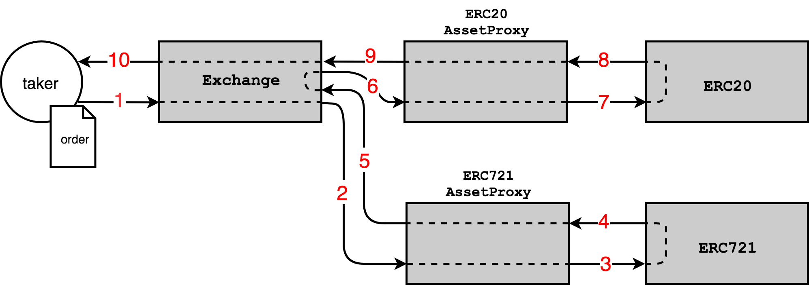
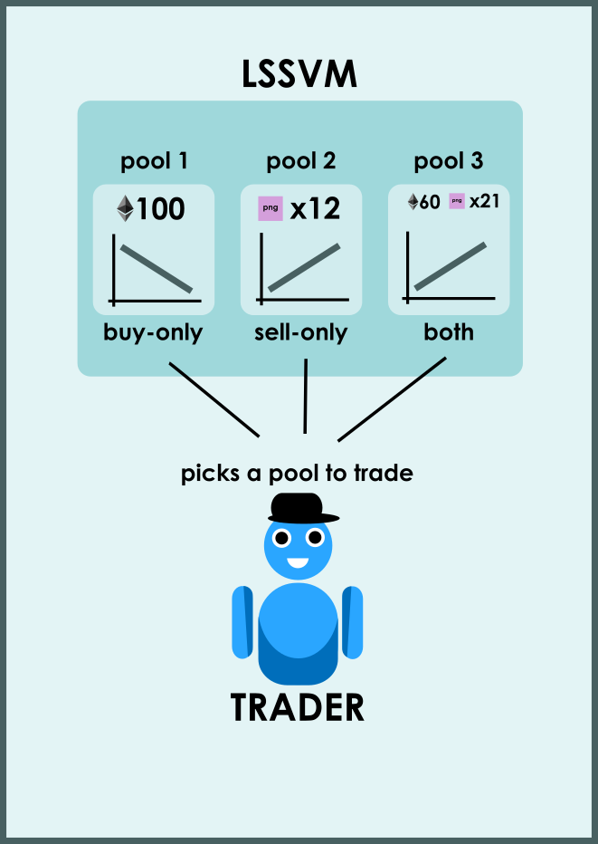
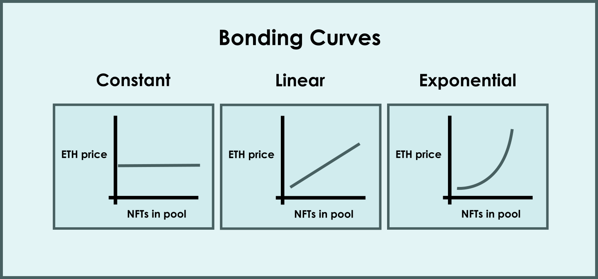

# sudoswap-analysis

- [sudoswap-analysis](#sudoswap-analysis)
  - [sudoswap OTC](#sudoswap-otc)
    - [解析](#解析)
    - [例子](#例子)
  - [sudoswap AMM](#sudoswap-amm)
    - [解析](#解析-1)
      - [LSSVMPairFactory](#lssvmpairfactory)
      - [LSSVMPair](#lssvmpair)
      - [LSSVMRouter](#lssvmrouter)
        - [NFT\<\>Token](#nfttoken)
        - [NFT\<\>NFT](#nftnft)
      - [Bonding Curve](#bonding-curve)
        - [线性曲线 Linear Curve](#线性曲线-linear-curve)
        - [指数曲线 Exponential Curve](#指数曲线-exponential-curve)
        - [fee](#fee)
        - [spotPrice](#spotprice)
    - [如何获取某个 NFT 的所有流动池](#如何获取某个-nft-的所有流动池)
    - [如何获取某个 NFT 的交易数据](#如何获取某个-nft-的交易数据)
    - [获取某个 NFT 的交易数据的其他办法](#获取某个-nft-的交易数据的其他办法)
  - [参考](#参考)

sudoswap 大致分为 2个阶段：OTC 和 AMM
## sudoswap OTC

[https://otc.sudoswap.xyz](https://otc.sudoswap.xyz)

sudoswap OTC 阶段支持的是一种可以自定义的点对点交易形式。它可以选择指定对手方地址和到期日，然后点击「create swap」即可生成一个交易链接，当你把这个链接分享给你的交易对手时，对方可以通过链接进入交易。当然对方也可以链接自己的钱包到 sudoswap OTC 网站后在平台内看到这笔交易。简单来说就是一种场外交易的形式。这个阶段的 sudoswap 仅提供订单撮合的功能。

特点：
1. 基于 0x v2 协议构建（[0x080bf510fcbf18b91105470639e9561022937712](https://etherscan.io/address/0x080bf510fcbf18b91105470639e9561022937712)）
2. 自定义的点对点交易形式
3. 支持 ERC20、ERC721、ERC1155 等代币任意组合的交易
4. 无交易手续费和版税

### 解析

0x 协议的 v2 版本，跟 opensea 的 seaport 协议一样，是中央订单簿的交易模型。都是由链下的中心化的订单簿和链上的交易组成。

其中链下的订单簿负责存储用户的挂单信息，并对订单进行撮合。最终的成交和转移 NFT 是由 exchange 合约来负责的。

#### order

其中订单在合约中的对应下面的结构：

```
struct Order {
        address makerAddress;           // Address that created the order.      
        address takerAddress;           // Address that is allowed to fill the order. If set to 0, any address is allowed to fill the order.          
        address feeRecipientAddress;    // Address that will recieve fees when order is filled.      
        address senderAddress;          // Address that is allowed to call Exchange contract methods that affect this order. If set to 0, any address is allowed to call these methods.
        uint256 makerAssetAmount;       // Amount of makerAsset being offered by maker. Must be greater than 0.        
        uint256 takerAssetAmount;       // Amount of takerAsset being bid on by maker. Must be greater than 0.        
        uint256 makerFee;               // Amount of ZRX paid to feeRecipient by maker when order is filled. If set to 0, no transfer of ZRX from maker to feeRecipient will be attempted.
        uint256 takerFee;               // Amount of ZRX paid to feeRecipient by taker when order is filled. If set to 0, no transfer of ZRX from taker to feeRecipient will be attempted.
        uint256 expirationTimeSeconds;  // Timestamp in seconds at which order expires.          
        uint256 salt;                   // Arbitrary number to facilitate uniqueness of the order's hash.     
        bytes makerAssetData;           // Encoded data that can be decoded by a specified proxy contract when transferring makerAsset. The last byte references the id of this proxy.
        bytes takerAssetData;           // Encoded data that can be decoded by a specified proxy contract when transferring takerAsset. The last byte references the id of this proxy.
    }
```

##### makerAssetData 和 takerAssetData 

这两个参数都是 bytes 类型，获取具体信息需要对其进行解码。

在 0xv2 中 assetData 根据类型的不同分成以下几种

1> ERC20Token

ERC20 的 assetData 使用ABIv2编码，具有 `0xf47261b0` 的 4 字节 id。

```
// 0xf47261b0
bytes4 ERC20_SELECTOR = bytes4(keccak256("ERC20Token(address)"));
```

address 是 ERC20 代币的地址。

2> ERC721Token

ERC721 的 assetData 使用ABIv2编码，具有 `0x02571792` 的 4 字节 id。

```
// 0x02571792
bytes4 ERC721_SELECTOR = bytes4(keccak256("ERC721Token(address,uint256)"));
```
address 是 ERC721 代币的地址。

uint256 的是 ERC721 的 tokenId。

3> MultiAsset

MultiAsset 的 assetData 使用ABIv2编码，具有 `0x94cfcdd7` 的 4 字节 id。

```
// 0x94cfcdd7
MultiAsset(uint256[],bytes[])
```

uint256[] 是一个整数数组，表示的是每种 asset 的数量。

bytes[] 是一个字节数组，表示的是每种 asset 的具体信息。一般存放的是 ERC20 的 assetData 或者 ERC721 的 assetData。

4> ERC1155

```
// 0xa7cb5fb7
ERC1155Assets(address,uint256[],uint256[],bytes)
```

address 是 ERC1155 代币地址
第一个 uint256[] 类型的参数 是所有的 tokenid 数组
第二个 uint256[] 类型的参数 是所有的 token 数量数组
bytes 是 callbackData

#### [AssetProxy](https://github.com/0xProject/0x-protocol-specification/blob/master/v2/v2-specification.md#assetproxy)

AssetProxy 是几种代理合约。用户在挂单的时候，需要将 token 授权给这些代理合约。然后在成单的时候由这些代理合约复制 token 的转移。

结算过程



1. Exchange.fillOrder(order, value)
2. ERC721Proxy.transferFrom(assetData, from, to, value)
3. ERC721Token(assetData.address).transferFrom(from, to, assetData.tokenId)
4. ERC721Token: (revert on failure)
5. ERC721Proxy: (revert on failure)
6. ERC20Proxy.transferFrom(assetData, from, to, value)
7. ERC20Token(assetData.address).transferFrom(from, to, value)
8. ERC20Token: (revert on failure)
9. ERC20Proxy: (revert on failure)
10. Exchange: (return FillResults)

#### 订单成交

与 seaport 类似，订单成交方法分为两类 Filling orders 和 matchOrders

其中 Filling orders 类型的方法，将一个订单进行成交。所有的 方法最终都会调用 `fillOrderInternal() `。

最后会发出 `Fill` 的事件。

```
function fillOrderInternal(
        Order memory order,
        uint256 takerAssetFillAmount,
        bytes memory signature
    )
```

matchOrders 类型的方法只有一个，是尝试将两个订单进行撮合成交。每个订单都会触发一个 `Fill` 的事件。

```
function matchOrders(
        LibOrder.Order memory leftOrder,
        LibOrder.Order memory rightOrder,
        bytes memory leftSignature,
        bytes memory rightSignature
    )
```

### 例子

https://etherscan.io/tx/0x1e1b1d187d8125c4554171a42feb132957377ea3afe4c4253f29de3022bcdbf5

#### 1. 调用 fillOrder 方法进行成单

`Function: fillOrder(tuple order,uint256 takerAssetFillAmount,bytes signature)`

#### 2. 成单后发出 Fill 事件

```
event Fill(
        address indexed makerAddress,         // Address that created the order.      
        address indexed feeRecipientAddress,  // Address that received fees.
        address takerAddress,                 // Address that filled the order.
        address senderAddress,                // Address that called the Exchange contract (msg.sender).
        uint256 makerAssetFilledAmount,       // Amount of makerAsset sold by maker and bought by taker. 
        uint256 takerAssetFilledAmount,       // Amount of takerAsset sold by taker and bought by maker.
        uint256 makerFeePaid,                 // Amount of ZRX paid to feeRecipient by maker.
        uint256 takerFeePaid,                 // Amount of ZRX paid to feeRecipient by taker.
        bytes32 indexed orderHash,            // EIP712 hash of order (see LibOrder.getOrderHash).
        bytes makerAssetData,                 // Encoded data specific to makerAsset. 
        bytes takerAssetData                  // Encoded data specific to takerAsset.
    );
```

#### 3. 需要注意的两点：

##### 1. 具体买卖信息要从 makerAssetData 和 takerAssetData 中获取。

##### 2. 判断 0xv2 上的交易是否是 sudoswap OTC 交易主要通过 feeRecipientAddress 是否是 [0x4e2f98c96e2d595a83AFa35888C4af58Ac343E44](https://etherscan.io/address/0x4e2f98c96e2d595a83AFa35888C4af58Ac343E44)

找了很久没有发现 0x 上的 api没有能区分 sudoswap 的地方，后来根据一个叫 [0xtracker](https://0xtracker.com/search?q=0x4e2f98c96e2d595a83AFa35888C4af58Ac343E44) 的项目发现他们是根据 feeRecipientAddress 来确认跟踪的项目的。可以借鉴一下。

## sudoswap AMM

[https://sudoswap.xyz](https://sudoswap.xyz)

这个阶段 Sudoswap 使用的是 AMM 协议，这意味着用户从流动性池中购买或出售，而不是直接在用户与用户之间进行交易。如果您熟悉 Uniswap，这是一个类似的概念，区别就是 Sudoswap 的 AMM 协议对 NFT 交易进行了一些优化。使用的不再是固定乘积的定价曲线。

其工作原理如下： 
1. 流动性提供者将 NFT 和/或 ETH（或 ERC20 代币）存入流动性池。他们选择是否要购买或出售 NFT（或两者）并指定起始价格和联合曲线参数。
2. 然后用户可以从这些池中购买 NFT 或将 NFT 出售到这些池中。每次购买或出售一个项目时，购买或出售另一个项目的价格会根据其联合曲线在池中发生变化。
3. 流动性提供者可以随时更改其池的参数或提取资产。

### 解析

创始人 0xmons 将这套 AMM 机制定义为LSSVM。

相关合约可以分为四个大类 LSSVMPairFactory，LSSVMPair，LSSVMRouter，Bonding Curve。

#### [LSSVMPairFactory](https://etherscan.io/address/0xb16c1342E617A5B6E4b631EB114483FDB289c0A4)

该合约用于流动池、协议费用、Bonding Curve 以及流动池兑换路径的管理。

可以通过 `createPairERC20()`, `createPairETH()` 来创建对应的流动池。

创建成功后会发出 `event NewPair(address poolAddress)`的事件。

简单来说这个就是官方用来管理用的合约。

#### LSSVMPair

流动池对应的合约，有多个类型的合约。在 uniswap 上没一种交易对只对应一个固定的流动池，是一个地址。而在 sudoswap 上 同一个 NFT 兑 ETH 可以有很多的流动池，有多个地址。

##### 流动池类型

根据流动池的性质可以分为三类：

* buy-only 只买，仅向池中提供ETH，随时准备提供报价以使用其ETH购买NFT

* sell-only 只卖，仅向池中提供NFT，随时准备提供报价以出售其NFT获得ETH

* both 买卖，向池中同时提供ETH和NFT，该池将为买卖均提供报价，可设置手续费作为收入。



##### 初始化参数

```
IERC721 _nft, // The ERC721 token side of the pair
ICurve _bondingCurve, // The bonding curve used to price the pair
address payable _assetRecipient, // If set to a non-zero address, assets sent to the pair during a swap will be forwarded to this address. NOTE: unavailable for Trade pairs.
LSSVMPair.PoolType _poolType, // The pair's type (Token, NFT, Trade) 该参数只涉及到一些条件的判断
uint256 _delta, // The bonding curve's parameter (more on this in the Bonding Curve section)
uint256 _fee, // The spread between buy and sell quotes. NOTE: only for Trade pairs.
uint256 _spotPrice, // The initial sell quote the pair will return if an NFT is sold into it.
uint256[] calldata _initialNFTIDs // The list of IDs to transfer from the caller to the pair
```

 ERC20 的流动池还有两个额外参数

 ```
 ERC20 token // The token to be used for the token side of the pair.
uint256 initialTokenBalance // The amount of tokens to send into the pair. (The createPairETH call is payable, and msg.value is used instead)
 ```

 由于是通过 clone 产生的新合约，下列参数在初始化之后无法进行修改

 ```
 _nft,
_bondingCurve,
_poolType,
token // NOTE: only for ERC20 pairs
 ```

##### 涉及到流动性的方法

LSSVMPair 合约提供的方法中，涉及到流动性的方法大致可以分为两类。

一种是 `swapNFTsForToken()`。用户往流动池中添加 NFT 的流动性，相当于将 NFT 卖到了流动池中。用户获得对应数量的 Token。

这个过程中会发出 `SwapNFTInPair` 的事件。

该方法会调用`_calculateSellInfoAndUpdatePoolParams()` 方法来计算价格信息。

```
function swapNFTsForToken(
        uint256[] calldata nftIds,
        uint256 minExpectedTokenOutput,
        address payable tokenRecipient,
        bool isRouter,
        address routerCaller
    ) 
```


另一种是 `swapTokenForAnyNFTs()` 和 `swapTokenForSpecificNFTs()`。用户往流动池中添加 Token 的流动性，相当于用户向流动池购买 NFT。用户获得 NFT。

这个过程中会发出 `SwapNFTOutPair` 的事件。

该方法会调用`_calculateBuyInfoAndUpdatePoolParams()` 方法来计算价格信息。

```
function swapTokenForAnyNFTs(
        uint256 numNFTs,
        uint256 maxExpectedTokenInput,
        address nftRecipient,
        bool isRouter,
        address routerCaller
    )

function swapTokenForSpecificNFTs(
        uint256[] calldata nftIds,
        uint256 maxExpectedTokenInput,
        address nftRecipient,
        bool isRouter,
        address routerCaller
    )
```

#### [LSSVMRouter](https://etherscan.io/address/0x2b2e8cda09bba9660dca5cb6233787738ad68329)

这个合约负责路由功能。用户的大部分交互都是与该合约进行交互，而不是直接调用某个 LSSVMPair。

在协议层面，sudoswap AMM 不执行任何链上路由优化。用户在调用路由器时应该知道他们想要的交换路径。

路由合约中的方法可以按照交换的类型将其分为 NFT <> Token 和 NFT<>NFT。

#####  NFT<>Token

在 NFT 交换 token 时，用户可以指定他们想要从每对中获得哪些 NFT ID，或者不指定任何特定 ID，而只指定数量。

NFT 与 token 进行交换的时候，有两种交换的类型。

普通的交换 和 稳健（Robust）交换。稳健（Robust）交换的方法都是以 robust 开头。

###### 普通的交换

普通交换在概念上类似于其他 DEX 上的代币交换。用户向路由器发送最大输入量或最小输出量（即允许的滑点），以及交换路线和期限。

然后，路由器将在指定的各种对之间进行交换。在所有交换结束时，路由器将汇总所有要接收或发送的令牌，如果总数超出用户指定的滑点，则恢复。

对应的方法有：

1. swapETHForAnyNFTs
2. swapETHForSpecificNFTs
3. swapERC20ForAnyNFTs
4. swapERC20ForSpecificNFTs
5. swapNFTsForToken

这些方法都需要传入一个 `swapList` 参数。

```solidity
    PairSwapSpecific[] calldata swapList, // 方法1, 2
    struct PairSwapAny {
        LSSVMPair pair;
        uint256 numItems;
    }
    
    PairSwapSpecific[] calldata swapList, // 方法3, 4, 5
    struct PairSwapSpecific {
        LSSVMPair pair;
        uint256[] nftIds;
    }
```

可以看出来 `swapList` 实际上是一个 Pair 数组。在调用这些方法的时候可以传入多个 Pair 。也就是说一次交易可以在多个 pair 中买卖。

###### 稳健（Robust）交换

稳健互换对每个交换对进行滑点检查，而不是在最后进行汇总检查。如果指定交易对的价格超过了允许的滑点，路由器将默默地跳过该路线并继续下一条路线，没有恢复或错误。

这适用于价格在您的交易提交和执行之间快速变动的情况。通常建议使用稳健（Robust）交换，以便在波动性较高的环境中获得更好的用户体验，但代价是稍微多一些 gas。

1. robustSwapETHForAnyNFTs
2. robustSwapETHForSpecificNFTs
3. robustSwapERC20ForAnyNFTs
4. robustSwapERC20ForSpecificNFTs
5. robustSwapNFTsForToken

这些方法也都需要传入一个 `swapList` 参数。

```
    RobustPairSwapAny[] calldata swapList, // 方法1, 2
    struct RobustPairSwapAny {
        PairSwapAny swapInfo;
        uint256 maxCost;
    }

    RobustPairSwapSpecific[] calldata swapList, // 方法3, 4
    struct RobustPairSwapSpecific {
        PairSwapSpecific swapInfo;
        uint256 maxCost;
    }

    RobustPairSwapSpecificForToken[] calldata swapList, // 方法5
    struct RobustPairSwapSpecificForToken {
        PairSwapSpecific swapInfo;
        uint256 minOutput;
    }
```

相比普通交换的 `swapList` 参数，多了一个 maxCost 属性。也是可以对多个 pair 进行买卖。

##### NFT<>NFT 

这种交易方式是将 NFT 换成代币，然后在一次交易中将代币换成其他 NFT。用户可以从一对中指定特定的 NFT ID，也可以要求任何 NFT ID。

1. swapNFTsForAnyNFTsThroughETH
2. swapNFTsForSpecificNFTsThroughETH
3. swapNFTsForAnyNFTsThroughERC20
4. swapNFTsForSpecificNFTsThroughERC20
5. robustSwapETHForSpecificNFTsAndNFTsToToken
6. robustSwapERC20ForSpecificNFTsAndNFTsToToken

这些方法中也有指定 pair 的参数。不同于 NFT<>Token 的交换。这些参数需要指定两个数组。一个数组是 NFT<>Token 的 pair 数组，一个是 Token<>NFT 的 pair 数组。也就是说 NFT<>NFT 之间的交换需要一个中间物品。

```solidity
    // 方法1, 2
    NFTsForAnyNFTsTrade calldata trade,
    struct NFTsForAnyNFTsTrade {
        PairSwapSpecific[] nftToTokenTrades;
        PairSwapAny[] tokenToNFTTrades;
    }

    // 方法3, 4
    NFTsForSpecificNFTsTrade calldata trade,
    struct NFTsForSpecificNFTsTrade {
        PairSwapSpecific[] nftToTokenTrades;
        PairSwapSpecific[] tokenToNFTTrades;
    }

    // 方法5, 6
    RobustPairNFTsFoTokenAndTokenforNFTsTrade calldata params
    struct RobustPairNFTsFoTokenAndTokenforNFTsTrade {
        RobustPairSwapSpecific[] tokenToNFTTrades;
        RobustPairSwapSpecificForToken[] nftToTokenTrades;
        uint256 inputAmount;
        address payable tokenRecipient;
        address nftRecipient;
    }
```

从这里我们可以看出来 LSSVMRouter 与 Uniswap 中的路由组件不同。它最多支持两个层级的交换。一个层级的 pair 将 NFT 转换成 Token， 另一个层级的 pair 将 Token 转换为 NFT。不过每一个层级可以有多个 pair。

#### Bonding Curve

为了确定定价，每个NFT池都与LP (流动性提供者) 设置的特定bonding curve类型和参数相关联。目前有三种选择：

* 固定曲线 Constant Curve
* 线性曲线 Linear Curve
* 指数曲线 Exponential Curve



##### 线性曲线 Linear Curve

线性曲线执行加法运算来更新价格。如果该池出售了NFT并接收了ETH，则它将报价的下一个出售 NFT 的价格将自动向上调整 delta 数量的 ETH。相反，如果该池购买了NFT并出售了ETH，则其购买 NFT 的下一个报价将自动向下调整 delta 数量的 ETH。

假设我们有一个 ETH 的交易 LSSVMPair，初始 spotPrice为 1 ETH，而线性曲线的 delta 为 1e18 (换算成0.1 ETH)。（假设fee为 0。）然后向该货币对出售 1 NFT 的用户将收到 1 ETH，而从该货币对购买 1 NFT 的用户将必须发送 (1 + 0.1) = 1.1 ETH。以此类推。

|                     | ETH Price to Buy 1 NFT | ETH Price to Sell 1 NFT |
| ------------------- | ---------------------- | ----------------------- |
| 8 NFTs in Pool      | 1.2                    | 1.1                     |
| 9 NFTs in Pool      | 1.1                    | 1                       |
| **10 NFTs in Pool** | 1                      | 0.9                     |
| 11 NFTs in Pool     | 0.9                    | 0.8                     |
| 12 NFTs in Pool     | 0.8                    | 0.7                     |

##### 指数曲线 Exponential Curve

指数曲线与线性曲线的运行逻辑相同，但 delta 的递增和递减将以百分比的形式计算。

假设我们有一个 ETH 的交易 LSSVMPair，初始 spotPrice为 1 ETH，而指数曲线的 delta 为 1e18 + 1e17（换算成 1.1），表示每次价格变化 10%，即每次买入或卖出都会将价格乘以或除以 1.1。（假设fee为 0。）然后向该流动池出售 1 NFT 的用户将收到 1 ETH，而从该流动池购买 1 NFT 的用户将必须发送 (1 * 1.1) = 1.1 ETH。以此类推。

                                               
|                     | ETH Price to Buy 1 NFT | ETH Price to Sell 1 NFT |
| ------------------- | ---------------------- | ----------------------- |
| 8 NFTs in Pool      | 1.210                  | 1.100                   |
| 9 NFTs in Pool      | 1.100                  | 1.000                   |
| **10 NFTs in Pool** | 1.000                  | 0.909                   |
| 11 NFTs in Pool     | 0.909                  | 0.826                   |
| 12 NFTs in Pool     | 0.826                  | 0.751                   |

##### fee

fee 分为两种，一种是 trade fee， 一种是 protocol fee。

trade fee 是交易手续费，只有在 Trade 类型的流动池中才收取。

protocol fee 是协议手续费，具体金额由 LSSVMPairFactory 中的属性来控制。

这些手续费由用户来支付。如果用户买 nft 的时候，所需要的支付的 eth 要加上这些手续费。相反用户卖出 nft 的时候，得到的 eth 数量会减去这些费用。

##### spotPrice

spotPrice（现货价格）是指向该流动池卖出 1 NFT的瞬时价格。从该流动池购买 1 NFT的瞬时价格设置为相对于该货币对的联合曲线向上调整 1 个delta。

### 如何获取某个 NFT 的所有流动池

#### 1. 监听 LSSVMPairFactory 合约的 NewPair 事件

每个流动池的创建都是通过 LSSVMPairFactory 来进行的，因此可以遍历所有的 NewPair 事件来找到所有流动池创建的调用，通过调用的参数进行筛选指定的 NFT 来找到该 NFT 的所有流动池。

#### 2. The Graph

通过对 sudoswap 前端界面的调研发现他们是通过 The Graph 来进行查询某个 NFT 所有的流动池。

`https://api.thegraph.com/subgraphs/name/zeframlou/sudoswap/`

```
     {       
        collection(id: "0xed5af388653567af2f388e6224dc7c4b3241c544") 
            {         
                pairs(first: 100, skip: 0) {           
                    id           
                    owner {             id           }           
                    assetRecipient           
                    type           
                    bondingCurve           
                    delta           
                    fee           
                    spotPrice           
                    nftIds           
                    ethBalance           
                    ethVolume       
                }     
            }     
            
        }
```

```
{
    "data": {
        "collection": {
            "pairs": [
                {
                    "id": "0x9d63522c69a5e4e2681ffec7bbcd4450f61b605c",
                    "owner": {
                        "id": "0x92a4f58009df9eac5f2af6d05977683639f0060e"
                    },
                    "assetRecipient": "0x92a4f58009df9eac5f2af6d05977683639f0060e",
                    "type": "0",
                    "bondingCurve": "0x5b6ac51d9b1cede0068a1b26533cace807f883ee",
                    "delta": "0",
                    "fee": "0",
                    "spotPrice": "6364000000000000000",
                    "nftIds": [],
                    "ethBalance": "0",
                    "ethVolume": "0"
                },
                {
                    "id": "0x9db32122e0ceea7645e04dbfc34abfa1fbcaf61c",
                    "owner": {
                        "id": "0x864a6ea3137cb970ec5004b9b90b90961b5aa034"
                    },
                    "assetRecipient": "0x864a6ea3137cb970ec5004b9b90b90961b5aa034",
                    "type": "1",
                    "bondingCurve": "0x5b6ac51d9b1cede0068a1b26533cace807f883ee",
                    "delta": "0",
                    "fee": "0",
                    "spotPrice": "18904477611940298000",
                    "nftIds": [
                        "424",
                        "448",
                        "1397",
                        "3726",
                        "4320",
                        "4447",
                        "4695",
                        "5551",
                        "5610",
                        "5812",
                        "6114",
                        "6136",
                        "6701",
                        "6706",
                        "6787",
                        "7065",
                        "7947",
                        "8219",
                        "8252",
                        "9389",
                        "9694"
                    ],
                    "ethBalance": "0",
                    "ethVolume": "0"
                }
            ]
        }
    }
}
```

### 如何获取某个 NFT 的交易数据

通过上面的描述我们知道 LSSVMRouter 中有多种操作流动池的方法。

在调用方法时，同一个交易的所有事件中可以获取各个 nft 的转移事件，这样就能获取到具体的哪个 nft 发生的转移。

同时由于修改了流动池中的 nft 数量，流动池的 spotPrice 将会改变。同时 `SpotPriceUpdate (uint128 newSpotPrice)` 事件将会发出。这个 newSpotPrice 就是最新的现货价格。通过这个价格加上手续费就可以计算出之前用户支付或者获取到的具体 eth 数量。

#### 例子

https://etherscan.io/tx/0x96dfc9a469b7fd9747db9e487f459510afafd4a633b7f2fa9beec831c28c1079

这个交易是用户将他的一个 token id 为 6217 的 Azuki nft 放到了流动池中。获取了 9.270101493667169281 个 eth。

##### 解析

###### 1. 流动池地址

通过 event 可以看出流动池的地址是 https://etherscan.io/address/0x16f71d593bc6446a16ef84551cf8d76ff5973db1。

###### 2. 获取流动池信息

bondingCurve 是 [0x432f962D8209781da23fB37b6B59ee15dE7d9841](https://etherscan.io/address/0x432f962D8209781da23fB37b6B59ee15dE7d9841)， 是 ExponentialCurve （指数曲线）。

delta 是 1020000000000000000。换算成 1.02。

poolType 是 2，表示是 TRADE 类型。可能会有交易手续费。

fee 是 35000000000000000，换算成 0.035。

factory 是 [0xb16c1342E617A5B6E4b631EB114483FDB289c0A4](https://etherscan.io/address/0xb16c1342E617A5B6E4b631EB114483FDB289c0A4)。

factory 的 protocolFeeMultiplier 值是 5000000000000000， 换算成 0.005。

###### 2. 分析 Transfer 事件

当前交易中只有一个 Transfer。

对应的合约地址是 [0xed5af388653567af2f388e6224dc7c4b3241c544](https://etherscan.io/address/0xed5af388653567af2f388e6224dc7c4b3241c544 )

token id 是 6217。

###### 2. 分析 event 类型

流动池发出的是 `SwapNFTInPair` 事件，表示用户是将 nft 放入流动池，也就是用户卖出了 nft。

###### 3. SpotPriceUpdate

更新后的现货价格是 newSpotPrice = 9467015414284282353

###### 4. 计算用户获取的 eth

假设用户应获取的 eth 数量是 value，用户除去手续费应获取的 eth 数量是 outputValue。原来的现货价格设为 spotPrice

```
// 存入的nft数量是 1
numItems = 1

// 需要计算的倍率
DeltaPowN = 1.02^numItems = 1.02

// 由于是存入 nft ，将导致现货价格下降
newSpotPrice = spotPrice / DeltaPowN

// 现在是已知 newSpotPrice， 计算原来的现货价格
spotPrice = newSpotPrice * DeltaPowN = 9656355722569969664

// 根据等比数列求和，算出所有要转给用户的 eth 数量
value = spotPrice + ((1 / delta) * spotPrice) + ((1 / delta)^2 * spotPrice) + ... ((1 / delta)^(numItems - 1) * spotPrice)
      = spotPrice * (1 - (1 / delta^n)) / (1 - (1 / delta))
      = spotPrice
      = 9656355722569969664

// 减去手续费
outputValue = value * (1 - 0.035 - 0.005)
            = value * 0.96
            = 9270101493667172352
```

### 获取某个 NFT 的交易数据的其他办法

#### 1. 使用 Defined

https://docs.defined.fi/api/nfts/getNftEvents

Defined 类似一个对 the Graph 的封装。

```
https://api.defined.fi/
```

```
{           
    getNftEvents(
        poolAddress: "0x16f71d593bc6446a16ef84551cf8d76ff5973db1", 
        networkId: 1, 
        limit: 50) 
        {             
            items {               
                tokenId               
                maker               
                taker               
                totalPrice               
                individualPrice               
                eventType               
                transactionHash               
                timestamp               
                numberOfTokens             
                }           
        }         
}
```

```json
{
    "data": {
        "getNftEvents": {
            "items": [
                {
                    "tokenId": "1722",
                    "maker": "0x6c6b87d44d239b3750bf9badce26a9a0a3d2364e",
                    "taker": "0x16f71d593bc6446a16ef84551cf8d76ff5973db1",
                    "totalPrice": "10.46144419306183939",
                    "individualPrice": "10.46144419306183939",
                    "eventType": "SwapNFTsForToken",
                    "transactionHash": "0xcb57f47a1dd4921948d03579fbb92abe53544a3e69a79ab60db83692e965d5b0",
                    "timestamp": 1666048967,
                    "numberOfTokens": "1"
                },
                {
                    "tokenId": "885",
                    "maker": "0x16f71d593bc6446a16ef84551cf8d76ff5973db1",
                    "taker": "0x5498f6e2a58b767c3c89431cdb79a8c26adfa14c",
                    "totalPrice": "10.448331393512266491",
                    "individualPrice": "10.448331393512266491",
                    "eventType": "SwapTokenForSpecificNFTs",
                    "transactionHash": "0x2fdbe92b61f788adc3ef51a634dd41af9a7265e0c1b56d63734908aae49ea87e",
                    "timestamp": 1666034183,
                    "numberOfTokens": "1"
                }
            ]
        }
    }
}
```
#### 2. 使用 Reservoir

https://docs.reservoir.tools/reference/getsalesv4

Reservoir 协议可以通过交易hash查询具体的交易信息。

## 参考

1. [sudoAMM vs the other AMMs they told u not to worry about](https://blog.sudoswap.xyz/deep-dive-1-sudoamm-vs-the-other-amms-they-told-u-not-to-worry-about.html)
2. [sudoswap AMM Docs](https://docs.sudoswap.xyz/)
3. [sudo swap * Uniswap 会为NFT流动性解锁哪些可能？](https://cryptohot.substack.com/p/sudo-swap-uniswap-nft)
4. [什么是NFT自动做市商AMM？sudoswap有哪些套利空间？](https://www.youtube.com/watch?v=LfglB4SUxvU)
5. [0x protocol 2.0.0 specification](https://github.com/0xProject/0x-protocol-specification/blob/master/v2/v2-specification.md)
