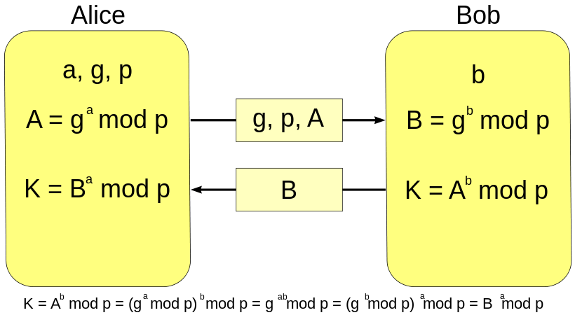
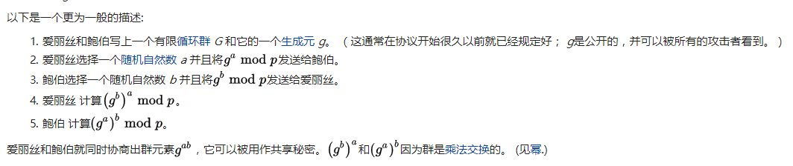

RLPx Encryption(RLPx加密)

之前介绍的discover节点发现协议， 因为承载的数据不是很重要，基本是明文传输的。 

每一个节点会开启两个同样的端口，一个是UDP端口，用来节点发现，一个是TCP端口，用来承载业务数据。 UDP的端口和TCP的端口的端口号是同样的。 这样只要通过UDP发现了端口，就等于可以用TCP来连接到对应的端口。

RLPx协议就定义了TCP链接的加密过程。

RLPx使用了(Perfect Forward Secrecy), 简单来说。 链接的两方生成生成随机的私钥，通过随机的私钥得到公钥。 然后双方交换各自的公钥， 这样双方都可以通过自己随机的私钥和对方的公钥来生成一个同样的共享密钥(shared-secret)。后续的通讯使用这个共享密钥作为对称加密算法的密钥。 这样来说。如果有一天一方的私钥被泄露，也只会影响泄露之后的消息的安全性， 对于之前的通讯是安全的(因为通讯的密钥是随机生成的，用完后就消失了)。

## 前向安全性(引用自维基百科)
前向安全或前向保密（英语：Forward Secrecy，缩写：FS），有时也被称为完美前向安全[1]（英语：Perfect Forward Secrecy，缩写：PFS），是密码学中通讯协议的安全属性，指的是长期使用的主密钥泄漏不会导致过去的会话密钥泄漏。[2]前向安全能够保护过去进行的通讯不受密码或密钥在未来暴露的威胁。[3]如果系统具有前向安全性，就可以保证万一密码或密钥在某个时刻不慎泄露，过去已经进行的通讯依然是安全，不会受到任何影响，即使系统遭到主动攻击也是如此。

### 迪菲-赫尔曼密钥交换
迪菲-赫尔曼密钥交换（英语：Diffie–Hellman key exchange，缩写为D-H） 是一种安全协议。它可以让双方在完全没有对方任何预先信息的条件下通过不安全信道创建起一个密钥。这个密钥可以在后续的通讯中作为对称密钥来加密通讯内容。公钥交换的概念最早由瑞夫·墨克（Ralph C. Merkle）提出，而这个密钥交换方法，由惠特菲尔德·迪菲（Bailey Whitfield Diffie）和马丁·赫尔曼（Martin Edward Hellman）在1976年首次发表。马丁·赫尔曼曾主张这个密钥交换方法，应被称为迪菲-赫尔曼-墨克密钥交换（英语：Diffie–Hellman–Merkle key exchange）。

- 迪菲－赫尔曼密钥交换的同义词包括:
- 迪菲－赫尔曼密钥协商
- 迪菲－赫尔曼密钥创建
- 指数密钥交换
- 迪菲－赫尔曼协议

虽然迪菲－赫尔曼密钥交换本身是一个匿名（无认证）的密钥交换协议，它却是很多认证协议的基础，并且被用来提供传输层安全协议的短暂模式中的完备的前向安全性。

#### 描述
迪菲－赫尔曼通过公共信道交换一个信息，就可以创建一个可以用于在公共信道上安全通信的共享秘密（shared secret）。
以下解释它的过程（包括算法的数学部分）：

最简单，最早提出的这个协议使用一个质数p的整数模n乘法群以及其原根g。下面展示这个算法，绿色表示非秘密信息, 红色粗体表示秘密信息：

## p2p/rlpx.go源码解读
这个文件实现了RLPx的链路协议。

链接联系的大致流程如下：

1. doEncHandshake() 通过这个方法来完成交换密钥，创建加密信道的流程。如果失败，那么链接关闭。
2. doProtoHandshake() 这个方法来进行协议特性之间的协商，比如双方的协议版本，是否支持Snappy加密方式等操作。

链接经过这两次处理之后，就算建立起来了。因为TCP是流式的协议。所有RLPx协议定义了分帧的方式。所有的数据都可以理解为一个接一个的rlpxFrame。 rlpx的读写都是通过rlpxFrameRW对象来进行处理。

### doEncHandshake
链接的发起者被称为initiator。链接的被动接受者被成为receiver。 这两种模式下处理的流程是不同的。完成握手后。 生成了一个sec.可以理解为拿到了对称加密的密钥。 然后创建了一个newRLPXFrameRW帧读写器。完成加密信道的创建过程。

	func (t *rlpx) doEncHandshake(prv *ecdsa.PrivateKey, dial *discover.Node) (discover.NodeID, error) {
		var (
			sec secrets
			err error
		)
		if dial == nil {
			sec, err = receiverEncHandshake(t.fd, prv, nil)
		} else {
			sec, err = initiatorEncHandshake(t.fd, prv, dial.ID, nil)
		}
		if err != nil {
			return discover.NodeID{}, err
		}
		t.wmu.Lock()
		t.rw = newRLPXFrameRW(t.fd, sec)
		t.wmu.Unlock()
		return sec.RemoteID, nil
	}

initiatorEncHandshake 首先看看链接的发起者的操作。首先通过makeAuthMsg创建了authMsg。 然后通过网络发送给对端。然后通过readHandshakeMsg读取对端的回应。 最后调用secrets创建了共享秘密。

	// initiatorEncHandshake negotiates a session token on conn.
	// it should be called on the dialing side of the connection.
	//
	// prv is the local client's private key.
	func initiatorEncHandshake(conn io.ReadWriter, prv *ecdsa.PrivateKey, remoteID discover.NodeID, token []byte) (s secrets, err error) {
		h := &encHandshake{initiator: true, remoteID: remoteID}
		authMsg, err := h.makeAuthMsg(prv, token)
		if err != nil {
			return s, err
		}
		authPacket, err := sealEIP8(authMsg, h)
		if err != nil {
			return s, err
		}
		if _, err = conn.Write(authPacket); err != nil {
			return s, err
		}
	
		authRespMsg := new(authRespV4)
		authRespPacket, err := readHandshakeMsg(authRespMsg, encAuthRespLen, prv, conn)
		if err != nil {
			return s, err
		}
		if err := h.handleAuthResp(authRespMsg); err != nil {
			return s, err
		}
		return h.secrets(authPacket, authRespPacket)
	}

makeAuthMsg。这个方法创建了initiator的handshake message。 首先对端的公钥可以通过对端的ID来获取。所以对端的公钥对于发起连接的人来说是知道的。 但是对于被连接的人来说，对端的公钥应该是不知道的。

	// makeAuthMsg creates the initiator handshake message.
	func (h *encHandshake) makeAuthMsg(prv *ecdsa.PrivateKey, token []byte) (*authMsgV4, error) {
		rpub, err := h.remoteID.Pubkey()
		if err != nil {
			return nil, fmt.Errorf("bad remoteID: %v", err)
		}
		h.remotePub = ecies.ImportECDSAPublic(rpub)
		// Generate random initiator nonce.
		// 生成一个随机的初始值， 是为了避免重放攻击么？ 还是为了避免通过多次连接猜测密钥？
		h.initNonce = make([]byte, shaLen)
		if _, err := rand.Read(h.initNonce); err != nil {
			return nil, err
		}
		// Generate random keypair to for ECDH.
		//生成一个随机的私钥
		h.randomPrivKey, err = ecies.GenerateKey(rand.Reader, crypto.S256(), nil)
		if err != nil {
			return nil, err
		}
	
		// Sign known message: static-shared-secret ^ nonce
		// 这个地方应该是直接使用了静态的共享秘密。 使用自己的私钥和对方的公钥生成的一个共享秘密。
		token, err = h.staticSharedSecret(prv)
		if err != nil {
			return nil, err
		}
		//这里我理解用共享秘密来加密这个initNonce。 
		signed := xor(token, h.initNonce)
		// 使用随机的私钥来加密这个信息。
		signature, err := crypto.Sign(signed, h.randomPrivKey.ExportECDSA())
		if err != nil {
			return nil, err
		}
	
		msg := new(authMsgV4)
		copy(msg.Signature[:], signature)
		//这里把发起者的公钥告知对方。 这样对方使用自己的私钥和这个公钥可以生成静态的共享秘密。
		copy(msg.InitiatorPubkey[:], crypto.FromECDSAPub(&prv.PublicKey)[1:])
		copy(msg.Nonce[:], h.initNonce)
		msg.Version = 4
		return msg, nil
	}

	// staticSharedSecret returns the static shared secret, the result
	// of key agreement between the local and remote static node key.
	func (h *encHandshake) staticSharedSecret(prv *ecdsa.PrivateKey) ([]byte, error) {
		return ecies.ImportECDSA(prv).GenerateShared(h.remotePub, sskLen, sskLen)
	}

sealEIP8方法，这个方法是一个组包方法，对msg进行rlp的编码。 填充一些数据。 然后使用对方的公钥把数据进行加密。 这意味着只有对方的私钥才能解密这段信息。

	func sealEIP8(msg interface{}, h *encHandshake) ([]byte, error) {
		buf := new(bytes.Buffer)
		if err := rlp.Encode(buf, msg); err != nil {
			return nil, err
		}
		// pad with random amount of data. the amount needs to be at least 100 bytes to make
		// the message distinguishable from pre-EIP-8 handshakes.
		pad := padSpace[:mrand.Intn(len(padSpace)-100)+100]
		buf.Write(pad)
		prefix := make([]byte, 2)
		binary.BigEndian.PutUint16(prefix, uint16(buf.Len()+eciesOverhead))
	
		enc, err := ecies.Encrypt(rand.Reader, h.remotePub, buf.Bytes(), nil, prefix)
		return append(prefix, enc...), err
	}

readHandshakeMsg这个方法会从两个地方调用。 一个是在initiatorEncHandshake。一个就是在receiverEncHandshake。 这个方法比较简单。 首先用一种格式尝试解码。如果不行就换另外一种。应该是一种兼容性的设置。 基本上就是使用自己的私钥进行解码然后调用rlp解码成结构体。 结构体的描述就是下面的authRespV4,里面最重要的就是对端的随机公钥。 双方通过自己的私钥和对端的随机公钥可以得到一样的共享秘密。 而这个共享秘密是第三方拿不到的。

	
	// RLPx v4 handshake response (defined in EIP-8).
	type authRespV4 struct {
		RandomPubkey [pubLen]byte
		Nonce        [shaLen]byte
		Version      uint
	
		// Ignore additional fields (forward-compatibility)
		Rest []rlp.RawValue `rlp:"tail"`
	}

	func readHandshakeMsg(msg plainDecoder, plainSize int, prv *ecdsa.PrivateKey, r io.Reader) ([]byte, error) {
		buf := make([]byte, plainSize)
		if _, err := io.ReadFull(r, buf); err != nil {
			return buf, err
		}
		// Attempt decoding pre-EIP-8 "plain" format.
		key := ecies.ImportECDSA(prv)
		if dec, err := key.Decrypt(rand.Reader, buf, nil, nil); err == nil {
			msg.decodePlain(dec)
			return buf, nil
		}
		// Could be EIP-8 format, try that.
		prefix := buf[:2]
		size := binary.BigEndian.Uint16(prefix)
		if size < uint16(plainSize) {
			return buf, fmt.Errorf("size underflow, need at least %d bytes", plainSize)
		}
		buf = append(buf, make([]byte, size-uint16(plainSize)+2)...)
		if _, err := io.ReadFull(r, buf[plainSize:]); err != nil {
			return buf, err
		}
		dec, err := key.Decrypt(rand.Reader, buf[2:], nil, prefix)
		if err != nil {
			return buf, err
		}
		// Can't use rlp.DecodeBytes here because it rejects
		// trailing data (forward-compatibility).
		s := rlp.NewStream(bytes.NewReader(dec), 0)
		return buf, s.Decode(msg)
	}

handleAuthResp这个方法非常简单。

	func (h *encHandshake) handleAuthResp(msg *authRespV4) (err error) {
		h.respNonce = msg.Nonce[:]
		h.remoteRandomPub, err = importPublicKey(msg.RandomPubkey[:])
		return err
	}

最后是secrets函数，这个函数是在handshake完成之后调用。它通过自己的随机私钥和对端的公钥来生成一个共享秘密,这个共享秘密是瞬时的(只在当前这个链接中存在)。所以当有一天私钥被破解。 之前的消息还是安全的。

	// secrets is called after the handshake is completed.
	// It extracts the connection secrets from the handshake values.
	func (h *encHandshake) secrets(auth, authResp []byte) (secrets, error) {
		ecdheSecret, err := h.randomPrivKey.GenerateShared(h.remoteRandomPub, sskLen, sskLen)
		if err != nil {
			return secrets{}, err
		}
	
		// derive base secrets from ephemeral key agreement
		sharedSecret := crypto.Keccak256(ecdheSecret, crypto.Keccak256(h.respNonce, h.initNonce))
		aesSecret := crypto.Keccak256(ecdheSecret, sharedSecret)
		// 实际上这个MAC保护了ecdheSecret这个共享秘密。respNonce和initNonce这三个值
		s := secrets{
			RemoteID: h.remoteID,
			AES:      aesSecret,
			MAC:      crypto.Keccak256(ecdheSecret, aesSecret),
		}
	
		// setup sha3 instances for the MACs
		mac1 := sha3.NewKeccak256()
		mac1.Write(xor(s.MAC, h.respNonce))
		mac1.Write(auth)
		mac2 := sha3.NewKeccak256()
		mac2.Write(xor(s.MAC, h.initNonce))
		mac2.Write(authResp)
		//收到的每个包都会检查其MAC值是否满足计算的结果。如果不满足说明有问题。
		if h.initiator {
			s.EgressMAC, s.IngressMAC = mac1, mac2
		} else {
			s.EgressMAC, s.IngressMAC = mac2, mac1
		}
	
		return s, nil
	}

receiverEncHandshake函数和initiatorEncHandshake的内容大致相同。 但是顺序有些不一样。
	
	// receiverEncHandshake negotiates a session token on conn.
	// it should be called on the listening side of the connection.
	//
	// prv is the local client's private key.
	// token is the token from a previous session with this node.
	func receiverEncHandshake(conn io.ReadWriter, prv *ecdsa.PrivateKey, token []byte) (s secrets, err error) {
		authMsg := new(authMsgV4)
		authPacket, err := readHandshakeMsg(authMsg, encAuthMsgLen, prv, conn)
		if err != nil {
			return s, err
		}
		h := new(encHandshake)
		if err := h.handleAuthMsg(authMsg, prv); err != nil {
			return s, err
		}
	
		authRespMsg, err := h.makeAuthResp()
		if err != nil {
			return s, err
		}
		var authRespPacket []byte
		if authMsg.gotPlain {
			authRespPacket, err = authRespMsg.sealPlain(h)
		} else {
			authRespPacket, err = sealEIP8(authRespMsg, h)
		}
		if err != nil {
			return s, err
		}
		if _, err = conn.Write(authRespPacket); err != nil {
			return s, err
		}
		return h.secrets(authPacket, authRespPacket)
	}

### doProtocolHandshake
这个方法比较简单， 加密信道已经创建完毕。 我们看到这里只是约定了是否使用Snappy加密然后就退出了。

	// doEncHandshake runs the protocol handshake using authenticated
	// messages. the protocol handshake is the first authenticated message
	// and also verifies whether the encryption handshake 'worked' and the
	// remote side actually provided the right public key.
	func (t *rlpx) doProtoHandshake(our *protoHandshake) (their *protoHandshake, err error) {
		// Writing our handshake happens concurrently, we prefer
		// returning the handshake read error. If the remote side
		// disconnects us early with a valid reason, we should return it
		// as the error so it can be tracked elsewhere.
		werr := make(chan error, 1)
		go func() { werr <- Send(t.rw, handshakeMsg, our) }()
		if their, err = readProtocolHandshake(t.rw, our); err != nil {
			<-werr // make sure the write terminates too
			return nil, err
		}
		if err := <-werr; err != nil {
			return nil, fmt.Errorf("write error: %v", err)
		}
		// If the protocol version supports Snappy encoding, upgrade immediately
		t.rw.snappy = their.Version >= snappyProtocolVersion
	
		return their, nil
	}

### rlpxFrameRW 数据分帧
数据分帧主要通过rlpxFrameRW类来完成的。

	// rlpxFrameRW implements a simplified version of RLPx framing.
	// chunked messages are not supported and all headers are equal to
	// zeroHeader.
	//
	// rlpxFrameRW is not safe for concurrent use from multiple goroutines.
	type rlpxFrameRW struct {
		conn io.ReadWriter
		enc  cipher.Stream
		dec  cipher.Stream
	
		macCipher  cipher.Block
		egressMAC  hash.Hash
		ingressMAC hash.Hash
	
		snappy bool
	}

我们在完成两次握手之后。调用newRLPXFrameRW方法创建了这个对象。

	t.rw = newRLPXFrameRW(t.fd, sec)

然后提供ReadMsg和WriteMsg方法。这两个方法直接调用了rlpxFrameRW的ReadMsg和WriteMsg

	func (t *rlpx) ReadMsg() (Msg, error) {
		t.rmu.Lock()
		defer t.rmu.Unlock()
		t.fd.SetReadDeadline(time.Now().Add(frameReadTimeout))
		return t.rw.ReadMsg()
	}
	func (t *rlpx) WriteMsg(msg Msg) error {
		t.wmu.Lock()
		defer t.wmu.Unlock()
		t.fd.SetWriteDeadline(time.Now().Add(frameWriteTimeout))
		return t.rw.WriteMsg(msg)
	}

WriteMsg

	func (rw *rlpxFrameRW) WriteMsg(msg Msg) error {
		ptype, _ := rlp.EncodeToBytes(msg.Code)
	
		// if snappy is enabled, compress message now
		if rw.snappy {
			if msg.Size > maxUint24 {
				return errPlainMessageTooLarge
			}
			payload, _ := ioutil.ReadAll(msg.Payload)
			payload = snappy.Encode(nil, payload)
	
			msg.Payload = bytes.NewReader(payload)
			msg.Size = uint32(len(payload))
		}
		// write header
		headbuf := make([]byte, 32)
		fsize := uint32(len(ptype)) + msg.Size
		if fsize > maxUint24 {
			return errors.New("message size overflows uint24")
		}
		putInt24(fsize, headbuf) // TODO: check overflow
		copy(headbuf[3:], zeroHeader)
		rw.enc.XORKeyStream(headbuf[:16], headbuf[:16]) // first half is now encrypted
	
		// write header MAC
		copy(headbuf[16:], updateMAC(rw.egressMAC, rw.macCipher, headbuf[:16]))
		if _, err := rw.conn.Write(headbuf); err != nil {
			return err
		}
	
		// write encrypted frame, updating the egress MAC hash with
		// the data written to conn.
		tee := cipher.StreamWriter{S: rw.enc, W: io.MultiWriter(rw.conn, rw.egressMAC)}
		if _, err := tee.Write(ptype); err != nil {
			return err
		}
		if _, err := io.Copy(tee, msg.Payload); err != nil {
			return err
		}
		if padding := fsize % 16; padding > 0 {
			if _, err := tee.Write(zero16[:16-padding]); err != nil {
				return err
			}
		}
	
		// write frame MAC. egress MAC hash is up to date because
		// frame content was written to it as well.
		fmacseed := rw.egressMAC.Sum(nil)
		mac := updateMAC(rw.egressMAC, rw.macCipher, fmacseed)
		_, err := rw.conn.Write(mac)
		return err
	}

ReadMsg

	func (rw *rlpxFrameRW) ReadMsg() (msg Msg, err error) {
		// read the header
		headbuf := make([]byte, 32)
		if _, err := io.ReadFull(rw.conn, headbuf); err != nil {
			return msg, err
		}
		// verify header mac
		shouldMAC := updateMAC(rw.ingressMAC, rw.macCipher, headbuf[:16])
		if !hmac.Equal(shouldMAC, headbuf[16:]) {
			return msg, errors.New("bad header MAC")
		}
		rw.dec.XORKeyStream(headbuf[:16], headbuf[:16]) // first half is now decrypted
		fsize := readInt24(headbuf)
		// ignore protocol type for now
	
		// read the frame content
		var rsize = fsize // frame size rounded up to 16 byte boundary
		if padding := fsize % 16; padding > 0 {
			rsize += 16 - padding
		}
		framebuf := make([]byte, rsize)
		if _, err := io.ReadFull(rw.conn, framebuf); err != nil {
			return msg, err
		}
	
		// read and validate frame MAC. we can re-use headbuf for that.
		rw.ingressMAC.Write(framebuf)
		fmacseed := rw.ingressMAC.Sum(nil)
		if _, err := io.ReadFull(rw.conn, headbuf[:16]); err != nil {
			return msg, err
		}
		shouldMAC = updateMAC(rw.ingressMAC, rw.macCipher, fmacseed)
		if !hmac.Equal(shouldMAC, headbuf[:16]) {
			return msg, errors.New("bad frame MAC")
		}
	
		// decrypt frame content
		rw.dec.XORKeyStream(framebuf, framebuf)
	
		// decode message code
		content := bytes.NewReader(framebuf[:fsize])
		if err := rlp.Decode(content, &msg.Code); err != nil {
			return msg, err
		}
		msg.Size = uint32(content.Len())
		msg.Payload = content
	
		// if snappy is enabled, verify and decompress message
		if rw.snappy {
			payload, err := ioutil.ReadAll(msg.Payload)
			if err != nil {
				return msg, err
			}
			size, err := snappy.DecodedLen(payload)
			if err != nil {
				return msg, err
			}
			if size > int(maxUint24) {
				return msg, errPlainMessageTooLarge
			}
			payload, err = snappy.Decode(nil, payload)
			if err != nil {
				return msg, err
			}
			msg.Size, msg.Payload = uint32(size), bytes.NewReader(payload)
		}
		return msg, nil
	}

帧结构

	  normal = not chunked
	  chunked-0 = First frame of a multi-frame packet
	  chunked-n = Subsequent frames for multi-frame packet
	  || is concatenate
	  ^ is xor
	
	Single-frame packet:
	header || header-mac || frame || frame-mac
	
	Multi-frame packet:
	header || header-mac || frame-0 ||
	[ header || header-mac || frame-n || ... || ]
	header || header-mac || frame-last || frame-mac
	
	header: frame-size || header-data || padding
	frame-size: 3-byte integer size of frame, big endian encoded (excludes padding)
	header-data:
	    normal: rlp.list(protocol-type[, context-id])
	    chunked-0: rlp.list(protocol-type, context-id, total-packet-size)
	    chunked-n: rlp.list(protocol-type, context-id)
	    values:
	        protocol-type: < 2**16
	        context-id: < 2**16 (optional for normal frames)
	        total-packet-size: < 2**32
	padding: zero-fill to 16-byte boundary
	
	header-mac: right128 of egress-mac.update(aes(mac-secret,egress-mac) ^ header-ciphertext).digest
	
	frame:
	    normal: rlp(packet-type) [|| rlp(packet-data)] || padding
	    chunked-0: rlp(packet-type) || rlp(packet-data...)
	    chunked-n: rlp(...packet-data) || padding
	padding: zero-fill to 16-byte boundary (only necessary for last frame)
	
	frame-mac: right128 of egress-mac.update(aes(mac-secret,egress-mac) ^ right128(egress-mac.update(frame-ciphertext).digest))
	
	egress-mac: h256, continuously updated with egress-bytes*
	ingress-mac: h256, continuously updated with ingress-bytes*

因为加密解密算法我也不是很熟，所以这里的分析还不是很彻底。 暂时只是分析了大致的流程。还有很多细节没有确认。