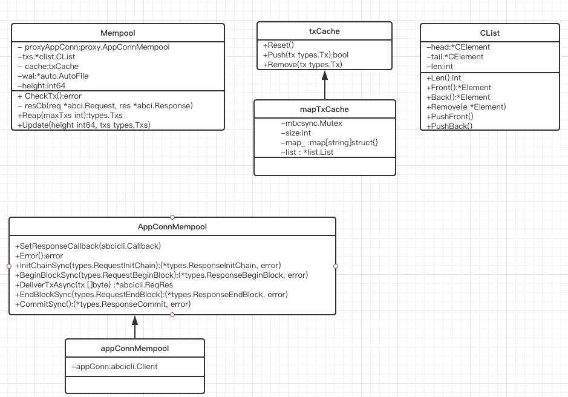
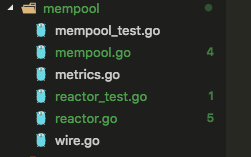

老规矩,先上图。


内存池的作用简而言之就是为了保存从其他peer或者自身受到的还未被打包的交易。

我们看一下mempool的文件夹。



所以我们关注的内存池的源码其实只有mempool.go和reactor.go文件。 从源文件名称应该可以看出来MemPool的成员方法是在mempool.go文件中， 和peer信息信息的交互应该是在reactor.go文件中的。

在mempool.go文件中看到这样的注释:
The mempool pushes new txs onto the proxyAppConn.
It gets a stream of (req, res) tuples from the proxy.
The mempool stores good txs in a concurrent linked-list.

Multiple concurrent go-routines can traverse this linked-list
safely by calling .NextWait() on each element.

So we have several go-routines:
1. Consensus calling Update() and Reap() synchronously
2. Many mempool reactor's peer routines calling CheckTx()
3. Many mempool reactor's peer routines traversing the txs linked list
4. Another goroutine calling GarbageCollectTxs() periodically

To manage these goroutines, there are three methods of locking.
1. Mutations to the linked-list is protected by an internal mtx (CList is goroutine-safe)
2. Mutations to the linked-list elements are atomic
3. CheckTx() calls can be paused upon Update() and Reap(), protected by .proxyMtx

总结一下:
1.共识引擎会调用mempool的Update()和Reap()方法去更新内存池中的交易
2.内存池在每次收到交易会首先放到交易cache中， 然后将交易提交给应用(通过ABCI), 决定交易是否可以放入交易池
3.内存池的Reactor在通过OnReceive回调函数接收到交易时，会调用CheckTx()
4.交易池是使用链表进行保存的.

先从创建内存池`NewMempool`开始。
```go
func NewMempool(
	config *cfg.MempoolConfig,
	proxyAppConn proxy.AppConnMempool,
	height int64,
	options ...MempoolOption,
) *Mempool {
// 初始化相关的成员变量
	mempool := &Mempool{
		config:        config,
		// 应用层连接 
		proxyAppConn:  proxyAppConn,
		txs:           clist.New(),  // 创建一个双向链表 用来保存交易
		counter:       0,
		height:        height,
		rechecking:    0,
		recheckCursor: nil,
		recheckEnd:    nil,
		logger:        log.NewNopLogger(),
		metrics:       NopMetrics(),
	}
	if config.CacheSize > 0 {
	// 内存池缓存 
		mempool.cache = newMapTxCache(config.CacheSize)
	} else {
		mempool.cache = nopTxCache{}
	}
	// 注意这个函数很重要 设置了代理连接的回调函数为resCb(req *abci.Request, res *abci.Response)
	// 可能当你看到这个不是很理解 可以先只有这个印象。
	// 因为交易池在收到交易后会把交易提交给APP 根据APP的返回来决定后续这个交易
	// 如何处理 所以在APP处理完提交的交易后回调mempool.resCb进而让mempool来继续决定当前交易如何处理
	proxyAppConn.SetResponseCallback(mempool.resCb)
	for _, option := range options {
		option(mempool)
	}
	return mempool
}
```
看一看被共识引擎调用的两个方法`Reap`和`Update`. 先入为主想一想共识引擎和内存池的关系，应该是从内存池取出交易-->执行交易--->打包交易--->告诉内存池应该移除的交易。
所以`Reap`作用应该就是从内存池中取出交易。 
看代码:
```go
func (mem *Mempool) Reap(maxTxs int) types.Txs {
// 设置并发控制 按理说此方法应该只能被串行调用
	mem.proxyMtx.Lock()
	defer mem.proxyMtx.Unlock()

	for atomic.LoadInt32(&mem.rechecking) > 0 {
		// 内存是否在重新检查 如果是 则延时一段时间继续查看
		time.Sleep(time.Millisecond * 10)
	}
// -1 表示不限制, 0表示没有
	txs := mem.collectTxs(maxTxs)
	return txs
}

func (mem *Mempool) collectTxs(maxTxs int) types.Txs {
	if maxTxs == 0 {
		return []types.Tx{}
	} else if maxTxs < 0 {
		maxTxs = mem.txs.Len()
	}
	txs := make([]types.Tx, 0, cmn.MinInt(mem.txs.Len(), maxTxs))
	// 遍历mempool.txs的链表 
	for e := mem.txs.Front(); e != nil && len(txs) < maxTxs; e = e.Next() {
		memTx := e.Value.(*mempoolTx)
		txs = append(txs, memTx.tx)
	}
	return txs
}

```
接下来看一看更新内存池中的交易`Update`
```go
func (mem *Mempool) Update(height int64, txs types.Txs) error {
	// 这一步不用多解释
	txsMap := make(map[string]struct{})
	for _, tx := range txs {
		txsMap[string(tx)] = struct{}{}
	}

	// Set height
	mem.height = height
	mem.notifiedTxsAvailable = false

	//一会跳到此函数看一下做了什么
	// 其实就是把共识引擎提交的交易列表中把在本地内存池的全部移除掉
	// 并返回移除的内存池
	goodTxs := mem.filterTxs(txsMap)
	
	// Recheck mempool txs if any txs were committed in the block
	// NOTE/XXX: in some apps a tx could be invalidated due to EndBlock,
	//	so we really still do need to recheck, but this is for debugging
	// 下面这个好像是为了重新检查一遍交易 但是目前只是调试状态 暂且忽略。 
	if mem.config.Recheck && (mem.config.RecheckEmpty || len(goodTxs) > 0) {
		mem.logger.Info("Recheck txs", "numtxs", len(goodTxs), "height", height)
		mem.recheckTxs(goodTxs)
		// At this point, mem.txs are being rechecked.
		// mem.recheckCursor re-scans mem.txs and possibly removes some txs.
		// Before mem.Reap(), we should wait for mem.recheckCursor to be nil.
	}
	mem.metrics.Size.Set(float64(mem.Size()))
	return nil
}
```
所以上面两个函数的功能很符合我们之前的猜想。
下面我们看一看一个非常重要的函数`CheckTx` 它把新的交易提交给APP， 然后决定是否被加入内存池中。
```go
func (mem *Mempool) CheckTx(tx types.Tx, cb func(*abci.Response)) (err error) {
	// 并发控制 也就是说当共识引擎在进行交易池读取和更新的时候 此函数应该是阻塞的。
	mem.proxyMtx.Lock()
	defer mem.proxyMtx.Unlock()
	
  // 如果已经超过了设置的内存池则放弃加入
	if mem.Size() >= mem.config.Size {
		return ErrMempoolIsFull
	}

	// 先加入内存池cache 如果cache中存在此交易则返回false
	if !mem.cache.Push(tx) {
		return ErrTxInCache
	}

	// 写入预写式日志中  关于cache和WAL后面在说明 
	if mem.wal != nil {
		// TODO: Notify administrators when WAL fails
		_, err := mem.wal.Write([]byte(tx))
		if err != nil {
			mem.logger.Error("Error writing to WAL", "err", err)
		}
		_, err = mem.wal.Write([]byte("\n"))
		if err != nil {
			mem.logger.Error("Error writing to WAL", "err", err)
		}
	}
	// END WAL

	// NOTE: proxyAppConn may error if tx buffer is full
	if err = mem.proxyAppConn.Error(); err != nil {
		return err
	}
	// 此时把交易传给proxyAppConn 
	reqRes := mem.proxyAppConn.CheckTxAsync(tx)
	if cb != nil {
		reqRes.SetCallback(cb)
	}

	return nil
}
```
上面这个函数我们看到交易被简单判断之后加入了cache，然后提交给你APP， 但是这个交易啥时候放入内存池中供共识引擎获取最终被打包的呢。
我们继续追踪当tx被传递给proxyAppConn做了哪些动作。 proxyAppConn是一个接口， golang中的接口其实有利有弊,实现接口很简单，可是对于阅读源码却真心有时候很困难， 因为你不知道最终是调用了那个实例，只能从最初的传递参数开始找起来。这里我们就不找了，就是前面框图里的appConnMempool， 这个对象有一个唯一的实例就是abcicli.Client。 而abcicli.Client也是一个接口, 现在我们不打算深入去追踪了，不然越追越远都忘记初衷了。 这里只说结论。 
abcicli.Client的一些实例会调用types.Application而type.Application就是需要用户自己实现的接口。 也被tendermint称之为ABCI(抽象二进制接口)。 也是就是只要实现了这几个接口， 你就创造了一个属于自己的区块链了。我想大家了解tendermint，可能最先了解的就是abci，只有极少的人会去研究代码， 然后才有更少的人看到这篇文章吧。 说远了，我们来看看appConnMempool.CheckTxAsync()做了什么。
```go
type appConnMempool struct {
	appConn abcicli.Client
}
// 直接调用abcicli.Client的CheckTxAsync 
func (app *appConnMempool) CheckTxAsync(tx []byte) *abcicli.ReqRes {
	return app.appConn.CheckTxAsync(tx)
}
// abcicli.Client是一个接口， 有好几个实例实现。代码在abci文件夹下。 我们关心localClient实例，它是一个直接和tendermint交互不需要创建socket的客户端。
type localClient struct {
	cmn.BaseService
	mtx *sync.Mutex
	// 注意types.Application 就是用户要做的内容
	types.Application
	Callback
}

func (app *localClient) CheckTxAsync(tx []byte) *ReqRes {
	app.mtx.Lock()
	// 看到没  终于找到你还好没放弃。 咳咳
	// 把交易传递给用户要实现的CheckTx函数
	res := app.Application.CheckTx(tx)
	app.mtx.Unlock()
	// 注意此处 app.callback 也就是说当交易被APP处理之后 会把交易和返回的内容封装一下传递给回调函数。
	// 还记得我在内存池示例创建时说的那个非常重要的函数不？ 不记得了 没关系 我在写一下
	// proxyAppConn.SetResponseCallback(mempool.resCb)
	// 所以说结果会被再次传递给mempool的resCb
	return app.callback(
		types.ToRequestCheckTx(tx),
		types.ToResponseCheckTx(res),
	)
}
```
显而易见我们该追踪`resCb`了
```go
func (mem *Mempool) resCb(req *abci.Request, res *abci.Response) {
	if mem.recheckCursor == nil {
	//我们只最终resCbNormal 正常情况只会到这里
		mem.resCbNormal(req, res)
	} else {
		mem.resCbRecheck(req, res)
	}
	mem.metrics.Size.Set(float64(mem.Size()))
}

func (mem *Mempool) resCbNormal(req *abci.Request, res *abci.Response) {
	switch r := res.Value.(type) {
	case *abci.Response_CheckTx:
	  // 这里进行一次转换 是因为回调之时进行了封装
		tx := req.GetCheckTx().Tx
		if r.CheckTx.Code == abci.CodeTypeOK {
		// 总之只有我们自己实现的ABIC返回结果的CODE为0才会进入这里
			mem.counter++
			memTx := &mempoolTx{
				counter: mem.counter,
				height:  mem.height,
				tx:      tx,
			}
			// 这个流程应该比较清楚了 把刚才提交的交易加入交易池中
			mem.txs.PushBack(memTx)
			mem.logger.Info("Added good transaction", "tx", TxID(tx), "res", r, "total", mem.Size())
			// 同时设置为通知交易有效 这个功能好像是在共识引擎上有用 在分析consensus源码时候说明
			mem.notifyTxsAvailable()
		} else {
			// 如果APP任务交易错误 那么就把这个交易从cache中移除掉。
			mem.logger.Info("Rejected bad transaction", "tx", TxID(tx), "res", r)

			// remove from cache (it might be good later)
			mem.cache.Remove(tx)
		}
	default:
		// ignore other messages
	}
}
```
到了这里我们看看mempool实现的功能应该已经满足了条件， 那这个CheckTx会在哪里被调用呢。 一个是我们调用接口时通过API接口广播交易还有一个就是在自身Reactor中接收到其他peer的广播。
我们在看看mempool实现的Reactor。Reactor在P2P源码分析的时候已经进行说明， mempool的Reactor的实现代码很明朗，我们只需要看看`AddPeer`和`Receive`做了什么。
```go
// 从P2P源码分析里面我们知道了这个函数是在P2P的MConnecttion中当收到peer发送的消息之后被调用的。
func (memR *MempoolReactor) Receive(chID byte, src p2p.Peer, msgBytes []byte) {
// 所以流程就是先解码消息 看能否正确解码
	msg, err := decodeMsg(msgBytes)
	if err != nil {
	  // 
		memR.Logger.Error("Error decoding message", "src", src, "chId", chID, "msg", msg, "err", err, "bytes", msgBytes)
		// 出错了 告诉Switch 移除掉这个peer
		memR.Switch.StopPeerForError(src, err)
		return
	}
	memR.Logger.Debug("Receive", "src", src, "chId", chID, "msg", msg)

	switch msg := msg.(type) {
	case *TxMessage:
	// 确认消息格式正确 调用CheckTx 试图将交易加入本地交易池
		err := memR.Mempool.CheckTx(msg.Tx, nil)
		if err != nil {
			memR.Logger.Info("Could not check tx", "tx", TxID(msg.Tx), "err", err)
		}
		// broadcasting happens from go routines per peer
	default:
		memR.Logger.Error(fmt.Sprintf("Unknown message type %v", reflect.TypeOf(msg)))
	}
}
```
在看看添加一个peer时做哪些事情
```go
func (memR *MempoolReactor) AddPeer(peer p2p.Peer) {
 // 启动一个goroutine 尝试把内存池中的交易实时广播到对应的peer
	go memR.broadcastTxRoutine(peer)
}

func (memR *MempoolReactor) broadcastTxRoutine(peer p2p.Peer) {
	if !memR.config.Broadcast {
		return
	}

	var next *clist.CElement
	for {
		// This happens because the CElement we were looking at got garbage
		// collected (removed). That is, .NextWait() returned nil. Go ahead and
		// start from the beginning.
		if next == nil {
			select {
			case <-memR.Mempool.TxsWaitChan(): // Wait until a tx is available
				if next = memR.Mempool.TxsFront(); next == nil {
					continue
				}
			case <-peer.Quit():
				return
			case <-memR.Quit():
				return
			}
		}
   // 执行到此处 说明已经从内存池中读取到一个交易
		memTx := next.Value.(*mempoolTx)
		// make sure the peer is up to date
		height := memTx.Height()
		if peerState_i := peer.Get(types.PeerStateKey); peerState_i != nil {
			peerState := peerState_i.(PeerState)
			peerHeight := peerState.GetHeight()
			if peerHeight < height-1 { // Allow for a lag of 1 block
				time.Sleep(peerCatchupSleepIntervalMS * time.Millisecond)
				continue
			}
		}
		// 发送交易给peer
		msg := &TxMessage{Tx: memTx.tx}
		success := peer.Send(MempoolChannel, cdc.MustMarshalBinaryBare(msg))
		if !success {
			time.Sleep(peerCatchupSleepIntervalMS * time.Millisecond)
			continue
		}

		select {
		case <-next.NextWaitChan():
			// see the start of the for loop for nil check
			next = next.Next()
		case <-peer.Quit():
			return
		case <-memR.Quit():
			return
		}
	}
}
```
我们在看看之前立的flag。
```
type mapTxCache struct {
	mtx  sync.Mutex
	size int
	map_ map[string]struct{}
	list *list.List 
}
所以内存池使用列表和map在维护cache。
Push: 通过map_判断是否存在 如果不存在则加入list和map_中
Remove: 从map_中移除成员
```
这里我觉得这个cache实现的不是很优雅， 从目前来看cache的唯一作用就是判断这个交易是否是重复提交。 没必要使用map和list组合。 也许是我考虑少了。反正目前代码就是这样写的。

在看看WAL(Write Ahead File)预写入日志， 一般是在事务时使用 就是在事务之前先写日志。 tendermint的WAL实现其实比较简单， 创建file句柄, 写入文件。
代码在libs/autofile/
```go
type AutoFile struct {
	ID            string
	Path          string
	ticker        *time.Ticker
	tickerStopped chan struct{} // closed when ticker is stopped
	mtx           sync.Mutex
	file          *os.File
}
// 创建一个AutoFile的对象
func OpenAutoFile(path string) (af *AutoFile, err error) {
	af = &AutoFile{
		ID:            cmn.RandStr(12) + ":" + path,
		Path:          path,
		// 1S 一个周期
		ticker:        time.NewTicker(autoFileOpenDuration),
		tickerStopped: make(chan struct{}),
	}
	// openFile 打开一个文件句柄 
	if err = af.openFile(); err != nil {
		return
	}
  // 启动processTicks任务 这个任务其实只做了一件事
  // 每隔1S尝试关闭关闭打开的文件句柄
	go af.processTicks()
	// 注册信号监控任务 目的就是当有SIGHUP信息时 尝试关闭所有的文件句柄 防止文件丢失
	sighupWatchers.addAutoFile(af)
	return
}

AutoFile:Write函数就是对外的接口 尝试写入内容 当文件句柄被关闭时重新打开在写入文件。
```
到了这里内存池的主要内容差不多就分析完成了。 在tendermint中的内存池其实算是比较简单的。 因为它为了提供一个通用的区块链平台，所以"内存池就真的是一个内存池".可能这话说起来比较绕， 因为在整个源码分析的过程中， 我们只看到了交易其实就是[]byte 在各个组件之间之间进行流转。 什么时候把这块数组放入内存池什么时候从内存池中移除。这些都很符合我们的想法和预期，不像在以太坊的内存池中要考虑各个账户的nonce，还要考虑pending和queue的不同状态。 


