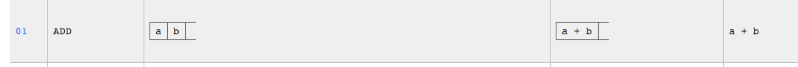
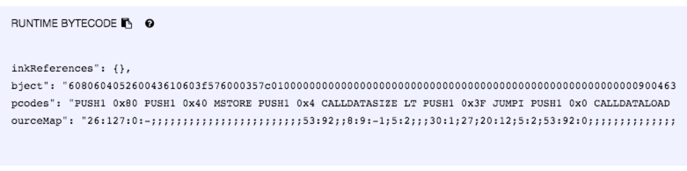

### evm概述
evm的操作码和其他汇编语言的指令码类似。 只是一般的CPU是哈弗架构或者冯诺依曼架构。 evm是基于栈式结构, 大端序的256bit的虚拟机。 每一个字节码是一个字节。也即是说evm的操作码指令集不会超过256个。 [这个网站](https://ethervm.io/)列出了evm的所有操作码，和相关的栈操作。
我们找出几个操作码来看一下。


ADD指令的十六进制数字表示为0x01 需要操作的栈的数量为两个。 最终入栈的数据剩下一个。
这样看起来好像没什么感觉， 我们来用一个简单的智能合约编译之后分析一下其运行流程。

### 一段简单的solidity合约流程分析

```solidity
pragma solidity ^0.4.25;
contract Helloworld {
    function add(uint256 a, uint256 b) pure public returns (uint256) {
        return a+b;
    } 
    
}
```
使用remix进行编译之后， 查看具体合约详情。我们贴一下汇编信息:

```
PUSH1 0x80 
PUSH1 0x40  
MSTORE  // memory[0x80:0x80+32]=0x40
CALLVALUE // 将msg.value压栈  此时栈中的数据为 [msg.value]
DUP1 // 复制一份  [msg.value, msg,value]
ISZERO PUSH2 0x10 JUMPI // 如果为0跳转到0x10的位置  0x10也就是tag1的位置 我们这个合约是不支持payable的 所以msg.value必须是0 
PUSH1 0x0 DUP1 REVERT 

tag1:
JUMPDEST POP ;清空栈
PUSH1 0xC5 
DUP1 
PUSH2 0x1F 
PUSH1 0x0 ; 此时栈的内容为[0xc5, 0xc5, 0x1f, 0x0]
CODECOPY  从内存地址0开始拷贝code便宜为0x1f之后的0xc5个字节的内容  也就是下面runtime的位置
PUSH1 0x0 此时栈的内容为[0xc5, 0x0]
RETURN 返回内存地址0到0xc5的内容 返回了runtime后面的智能合约代码
STOP 

runtime(0x1f的位置):
PUSH1 0x80 PUSH1 0x40 MSTORE PUSH1 0x4 CALLDATASIZE LT PUSH1 0x3F JUMPI PUSH1 0x0 CALLDATALOAD PUSH29 0x100000000000000000000000000000000000000000000000000000000 SWAP1 DIV PUSH4 0xFFFFFFFF AND DUP1 PUSH4 0x771602F7 EQ PUSH1 0x44 JUMPI JUMPDEST PUSH1 0x0 DUP1 REVERT JUMPDEST CALLVALUE DUP1 ISZERO PUSH1 0x4F JUMPI PUSH1 0x0 DUP1 REVERT JUMPDEST POP PUSH1 0x76 PUSH1 0x4 DUP1 CALLDATASIZE SUB DUP2 ADD SWAP1 DUP1 DUP1 CALLDATALOAD SWAP1 PUSH1 0x20 ADD SWAP1 SWAP3 SWAP2 SWAP1 DUP1 CALLDATALOAD SWAP1 PUSH1 0x20 ADD SWAP1 SWAP3 SWAP2 SWAP1 POP POP POP PUSH1 0x8C JUMP JUMPDEST PUSH1 0x40 MLOAD DUP1 DUP3 DUP2 MSTORE PUSH1 0x20 ADD SWAP2 POP POP PUSH1 0x40 MLOAD DUP1 SWAP2 SUB SWAP1 RETURN JUMPDEST PUSH1 0x0 DUP2 DUP4 ADD SWAP1 POP SWAP3 SWAP2 POP POP JUMP STOP LOG1 PUSH6 0x627A7A723058 KECCAK256 0xc8 0xab CREATE2 0xdc PUSH2 0xA37F DUP16 CALLCODE 0x2d SLOAD SWAP1 PUSH22 0xD6F7217B771B9A268A2A299F7CFBFE20FE435B002900
```

当我们部署一个智能合约的时候， 首先是应该对合约进行一系列的初始化 最后写入到以太坊数据库的智能合约代码是runtime之后的内容。
为了验证我们分析的正确性， 我们把直接分析的runtime之后的代码和remix返回的runtime的字节码对比发现是一致的。

也就是当合约部署完成后， 调用智能合约是从runtime之后开始的。

### 调用智能合约
```
// 假设input的内容为  0x771602f700000000000000000000000000000000000000000000000000000000000004580000000000000000000000000000000000000000000000000000000000002f59
PUSH1 0x80 PUSH1 0x40 MSTORE 
PUSH1 0x4 // [0x4]
CALLDATASIZE //[0x4, 68]
LT PUSH1 0x3F [0, 0x3f]  
JUMPI 情况为0 不跳转到0x3f 继续PC+1
PUSH1 0x0 
CALLDATALOAD 取出input[0:32]的内容
PUSH29 0x100000000000000000000000000000000000000000000000000000000 SWAP1 DIV PUSH4 0xFFFFFFFF AND DUP1 PUSH4 0x771602F7 EQ  这几步是将input[0:32]进行处理取出前四个字节判断是否和0x771602F7相等 如果相等跳转到0x44偏移的位置
PUSH1 0x44 JUMPI 
JUMPDEST PUSH1 0x0 DUP1 REVERT 

tag1(0x44的位置):
JUMPDEST CALLVALUE ;[msg.value]
DUP1 ;[0, 0]
ISZERO PUSH1 0x4F JUMPI ; 如果为0跳转到0x4f的偏移
PUSH1 0x0 DUP1 REVERT 

tag2(0x4f偏移的位置):
JUMPDEST POP 
PUSH1 0x76 PUSH1 0x4 DUP1 ; 栈中的数据[0x76, 0x04, 0x04]
CALLDATASIZE  [0x76, 0x04, 0x04,  0x44]
SUB ; [0x76, 0x04, 0x40]
DUP2; [0x76, 0x04, 0x40, 0x04]
ADD ; [0x76, 0x04, 0x44]
SWAP1; [0x76, 0x44, 0x04]
DUP1; [0x76, 0x44, 0x04, 0x04]
DUP1; [0x76, 0x44, 0x04, 0x04, 0x04]
CALLDATALOAD ; 取出input[0x04: 0x04+32] 内容 此时栈中的数据为[0x76, 0x44, 0x04, 0x04, 0x458]
SWAP1 ; [0x76, 0x44, 0x04, 0x458, 0x04]
PUSH1 0x20 ; [0x76, 0x44, 0x04, 0x458, 0x04, 0x20]
ADD ;  [0x76, 0x44, 0x04, 0x458, 0x24]
SWAP1; [0x76, 0x44, 0x04, 0x24, 0x458]
SWAP3 ;[0x76, 0x458, 0x04, 0x24, 0x44]
SWAP2 ;[0x76, 0x458, 0x44, 0x24, 0x04]
SWAP1 ;[0x76, 0x458, 0x44, 0x04, 0x24]
DUP1 ;[0x76, 0x458, 0x44, 0x04, 0x24, 0x24]
CALLDATALOAD ; 取出input[0x24:0x24+32内容] [0x76, 0x458, 0x44, 0x04, 0x24, 0x2f59]
SWAP1 ; [0x76, 0x458, 0x44, 0x04, 0x2f59, 0x24]
PUSH1 0x20; [0x76, 0x458, 0x44, 0x04, 0x2f59, 0x24, 0x20]
ADD ;[0x76, 0x458, 0x44, 0x04, 0x2f59, 0x44]
SWAP1 ;[0x76, 0x458, 0x44, 0x04, 0x44, 0x2f59]
SWAP3 ;[0x76, 0x458, 0x2f59, 0x04, 0x44, 0x44]
SWAP2 ;[0x76, 0x458, 0x2f59, 0x44, 0x44, 0x04]
SWAP1 ;[0x76, 0x458, 0x2f59, 0x44, 0x04, 0x44]
POP POP POP ;[0x76, 0x458, 0x2f59]
PUSH1 0x8C ;[0x76, 0x458, 0x2f59, 0x8C]
JUMP ; 跳转到0x8c偏移位置  [0x76, 0x458, 0x2f59]

tag4(0x76偏移的位置)
JUMPDEST PUSH1 0x40 ; [0x33b1, 0x40]
MLOAD; [0x33b1, 0x80]
DUP1 ; [0x33b1, 0x80, 0x80]
DUP3 ; [0x33b1, 0x80, 0x80, 0x33b1]
DUP2 ; [0x33b1, 0x80, 0x80, 0x33b1; 0x80]
MSTORE ;[0x33b1, 0x80, 0x80] //  memory[0x80:0x80+32]=0x33b1
PUSH1 0x20; [0x33b1, 0x80, 0x80, 0x20]
ADD ;[0x33b1, 0x80, 0xa0]
SWAP2 ;[0xa0, 0x80, 0x33b1]
POP POP ;[0xa0]
PUSH1 0x40;[0xa0, 0x40]
MLOAD ;[0xa0, 0x80]
DUP1 ;[0xa0, 0x80, 0x80]
SWAP2 ;[0x80, 0x80, 0xa0]
SUB ;[0x80, 0x20]
SWAP1 ;[0x20, 0x80]
RETURN ; 返回memory[0x80:0x80+32] 也就是0x33b1的值

tag5(0x8c偏移的位置):
JUMPDEST PUSH1 0x0 ; [0x76, 0x458, 0x2f59, 0x0]
DUP2 ; [0x76, 0x458, 0x2f59, 0x0, 0x2f59]
DUP4 ; [0x76, 0x458, 0x2f59, 0x0, 0x2f59, 0x458]
ADD ;  [0x76, 0x458, 0x2f59, 0x0, 0x33b1]
SWAP1 ;[0x76, 0x458, 0x2f59, 0x33b1, 0x0]
POP ; [0x76, 0x458, 0x2f59, 0x33b1]
SWAP3 ;[0x33b1, 0x458, 0x2f59, 0x76]
SWAP2 ;[0x33b1, 0x76, 0x2f59, 0x458]
POP POP; [0x33b1, 0x76]
JUMP;跳转到0x76偏移的位置 [0x33b1]
STOP LOG1 PUSH6 0x627A7A723058 KECCAK256 0xc8 0xab CREATE2 0xdc PUSH2 0xA37F DUP16 CALLCODE 0x2d SLOAD SWAP1 PUSH22 0xD6F7217B771B9A268A2A299F7CFBFE20FE435B002900
```

上述就是当调用add函数, 实参a=0x458, b=0x2f59 构造的交易input为0x771602f700000000000000000000000000000000000000000000000000000000000004580000000000000000000000000000000000000000000000000000000000002f59时， 整个的调用流程。 
总结一下流程:

1. 判断input是否大于4个字节
2. 取出32个字节内容经过转换判断前4个字节是否和hash(add(uint256, uint256))的值是否相同
3. 跳到tag1 判断交易的以太坊值是否为0 如果不为0直接中断  因为此合约不支持payable
4. 跳到tag2 整个tag2一直在进行各种变换 最终取出input的两个实参的值 然后跳到tag5
5. 在tag5又是一顿变换计算出结果 然后跳到tag4
6. 将tag5计算的结果保存到内存中 最后返回。


### 总结
整个汇编的流程特别复杂， 真的不是适合人类可读的。 只是为了分析一下字节码是怎么流转的， 每个操作码又是如何操作栈的。 这样我们接下来分析以太坊虚拟机就会有了基础， 分析起来就更容易一些。
