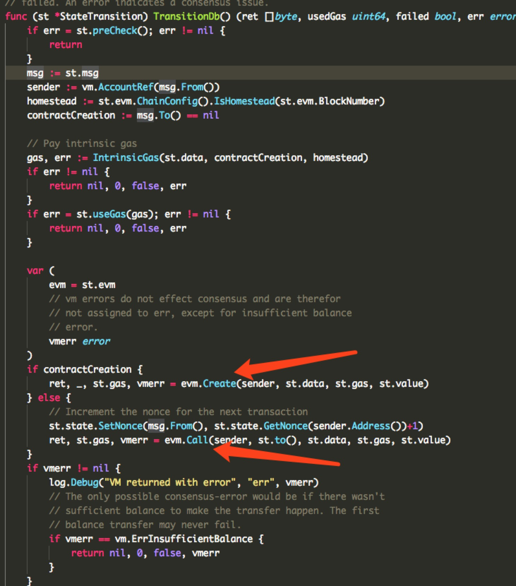

ethereum的虚拟机源码所有部分在core/vm下。 去除测试总共有24个源码文件。 整个vm调用的入口在go-ethereum/core/state_transaction.go中。 我们主要是为了分析虚拟机源码，所以关于以太坊是如何进行交易转账忽略过去。



从上面的截图我们可以看出， 当以太坊的交易中to地址为nil时， 意味着部署合约， 那么就会调用evm.Create方法。 
否则调用了evm.Call方法。 也就是说分析以太坊虚拟机源码时， 只要从这两个函数作为入口即可。


首先我们先看一下EVM数据结构:
```go
type EVM struct {
	// Context provides auxiliary blockchain related information
	Context
	// StateDB是状态存储接口。 这个接口非常重要。 可以肯定的说一直evm中的大部分工作都是围绕这次接口进行的。
	StateDB StateDB
	// 记录当前调用的深度
	depth int

	// 记录链的配置 主要是以太坊经理过几次分叉和提案 为了兼容之前的区块信息
	// 所以做了一些兼容 移植的时候我们只考虑最新版本的内容
	chainConfig *params.ChainConfig
	// 这个参数 对我们移植过程中的意义不是很大
	chainRules params.Rules
	// 这个是虚拟机的一些配置参数 是创建解释器的初始化参数 比如所有操作码对应的函数也是在此处配置的
	vmConfig Config

  // 解释器对象 它是整个进行虚拟机代码执行的地方。
	interpreter *Interpreter

  // 用来终止代码执行
	abort int32
	// callGasTemp holds the gas available for the current call. This is needed because the
	// available gas is calculated in gasCall* according to the 63/64 rule and later
	// applied in opCall*.
	callGasTemp uint64
}
```

先看一看创建EVM的方法
```go
func NewEVM(ctx Context, statedb StateDB, chainConfig *params.ChainConfig, vmConfig Config) *EVM {
	evm := &EVM{
		Context:     ctx,
		StateDB:     statedb,
		vmConfig:    vmConfig,
		chainConfig: chainConfig,
		chainRules:  chainConfig.Rules(ctx.BlockNumber),
	}

// 主要看这个地方 创建解释器 解释器是执行字节码的关键
	evm.interpreter = NewInterpreter(evm, vmConfig)
	return evm
}

func NewInterpreter(evm *EVM, cfg Config) *Interpreter {
  // 在这里设置 操作码对应的函数 
  // 主要原因是以太坊经历版本迭代之后 操作码有了一些变化
  // 我们移植的时候 这个地方只会保留最新版本的操作码表
	if !cfg.JumpTable[STOP].valid {
		switch {
		case evm.ChainConfig().IsConstantinople(evm.BlockNumber):
			cfg.JumpTable = constantinopleInstructionSet
		case evm.ChainConfig().IsByzantium(evm.BlockNumber):
			cfg.JumpTable = byzantiumInstructionSet
		case evm.ChainConfig().IsHomestead(evm.BlockNumber):
			cfg.JumpTable = homesteadInstructionSet
		default:
			cfg.JumpTable = frontierInstructionSet
		}
	}

	return &Interpreter{
		evm:      evm,
		cfg:      cfg,
		// gas表中记录了对应的执行操作需要花费的gas 移植的时候我们只保留一个
		gasTable: evm.ChainConfig().GasTable(evm.BlockNumber),
	}
}
```
接下来我们先分析部署合约的入口， 看一看整个合约部署的流程。
```go
// Create creates a new contract using code as deployment code.
func (evm *EVM) Create(caller ContractRef, code []byte, gas uint64, value *big.Int) (ret []byte, contractAddr common.Address, leftOverGas uint64, err error) {

  // 首先检测当前evm执行的深度 默认不应该超过1024  
	if evm.depth > int(params.CallCreateDepth) {
		return nil, common.Address{}, gas, ErrDepth
	}
	// 这个函数我们不在追踪 其功能就是检测是否调用方的金额大约value
	if !evm.CanTransfer(evm.StateDB, caller.Address(), value) {
		return nil, common.Address{}, gas, ErrInsufficientBalance
	}
	// 首先获取调用者的nonce 然后再更新调用者的nonce  这个如果熟悉以太坊交易流程的话应该知道nonce的作用。
	nonce := evm.StateDB.GetNonce(caller.Address())
	evm.StateDB.SetNonce(caller.Address(), nonce+1)

  // 下面这三句就是根据调用者地址 调用者nonce创建合约账户地址 并且判断是否这个合约地址确实没有部署过合约
	contractAddr = crypto.CreateAddress(caller.Address(), nonce)
	contractHash := evm.StateDB.GetCodeHash(contractAddr)
	if evm.StateDB.GetNonce(contractAddr) != 0 || (contractHash != (common.Hash{}) && contractHash != emptyCodeHash) {
		return nil, common.Address{}, 0, ErrContractAddressCollision
	}
	// 既然已经创建好了合约地址 那么就要为这个合约地址创建账户体系
	snapshot := evm.StateDB.Snapshot()
	// 所以下面这个函数在一直的时候我们的工作内容之一
	evm.StateDB.CreateAccount(contractAddr)
	if evm.ChainConfig().IsEIP158(evm.BlockNumber) {
		evm.StateDB.SetNonce(contractAddr, 1)
	}
	evm.Transfer(evm.StateDB, caller.Address(), contractAddr, value)

  // 创建一个合约对象 设置合约对象的参数 比如调用者 合约代码 合约hash的内容 
	contract := NewContract(caller, AccountRef(contractAddr), value, gas)
	contract.SetCallCode(&contractAddr, crypto.Keccak256Hash(code), code)

	if evm.vmConfig.NoRecursion && evm.depth > 0 {
		return nil, contractAddr, gas, nil
	}

	if evm.vmConfig.Debug && evm.depth == 0 {
		evm.vmConfig.Tracer.CaptureStart(caller.Address(), contractAddr, true, code, gas, value)
	}
	start := time.Now()

  // 将evm对象 合约对象传入run函数开始执行 此函数是核心 等一会分析到Call入口的时候最终也会调用此函数
	ret, err = run(evm, contract, nil)

  // 上述函数执行完成后返回的就是我前一章所说的初始化后的合约代码
  // 也就是我们在remix上看到runtime的字节码 以后调用合约代码其实质就是
  // 执行返回后的代码

  // 下面的流程主要是一些检查 把返回的字节码保存到此合约账户名下 这样以后调用合约代码才能加载成功
	maxCodeSizeExceeded := evm.ChainConfig().IsEIP158(evm.BlockNumber) && len(ret) > params.MaxCodeSize
	// if the contract creation ran successfully and no errors were returned
	// calculate the gas required to store the code. If the code could not
	// be stored due to not enough gas set an error and let it be handled
	// by the error checking condition below.
	if err == nil && !maxCodeSizeExceeded {
		createDataGas := uint64(len(ret)) * params.CreateDataGas
		if contract.UseGas(createDataGas) {
			evm.StateDB.SetCode(contractAddr, ret)
		} else {
			err = ErrCodeStoreOutOfGas
		}
	}

	// When an error was returned by the EVM or when setting the creation code
	// above we revert to the snapshot and consume any gas remaining. Additionally
	// when we're in homestead this also counts for code storage gas errors.
	if maxCodeSizeExceeded || (err != nil && (evm.ChainConfig().IsHomestead(evm.BlockNumber) || err != ErrCodeStoreOutOfGas)) {
		evm.StateDB.RevertToSnapshot(snapshot)
		if err != errExecutionReverted {
			contract.UseGas(contract.Gas)
		}
	}
	// Assign err if contract code size exceeds the max while the err is still empty.
	if maxCodeSizeExceeded && err == nil {
		err = errMaxCodeSizeExceeded
	}
	if evm.vmConfig.Debug && evm.depth == 0 {
		evm.vmConfig.Tracer.CaptureEnd(ret, gas-contract.Gas, time.Since(start), err)
	}
	return ret, contractAddr, contract.Gas, err
}
```

所以我们下面就开始主要分析run函数
```go
func run(evm *EVM, contract *Contract, input []byte) ([]byte, error) {
	if contract.CodeAddr != nil {
	  // 首先会进入下面这个代码执行  它会根据给定的合约地址来判断是否是以太坊内部已经保存的合约
	  // 如果是创建新合约 肯定不是内置合约
		precompiles := PrecompiledContractsHomestead
		if evm.ChainConfig().IsByzantium(evm.BlockNumber) {
			precompiles = PrecompiledContractsByzantium
		}
		if p := precompiles[*contract.CodeAddr]; p != nil {
			return RunPrecompiledContract(p, input, contract)
		}
	}
	// 所以最后我们最终到这里 此时input参数为nil
	return evm.interpreter.Run(contract, input)
}

// 解释器的Run函数才是真正执行合约代码的地方
// 为了凸显主流程 我们隐藏部分内容
func (in *Interpreter) Run(contract *Contract, input []byte) (ret []byte, err error) {
	if in.intPool == nil {
		in.intPool = poolOfIntPools.get()
		defer func() {
			poolOfIntPools.put(in.intPool)
			in.intPool = nil
		}()
	}
	
	// 下面这些变量应该说满足了一个字节码执行的所有条件
	// 有操作码 内存 栈 PC计数器 
	// 强烈建议使用debug工具去跟踪一遍执行的流程 
	// 其实它的执行流程就和上一章我们人肉执行的流程一样
	var (
		op    OpCode        // current opcode
		mem   = NewMemory() // bound memory
		stack = newstack()  // local stack
		pc   = uint64(0) // program counter
		cost uint64
		pcCopy  uint64 // needed for the deferred Tracer
		gasCopy uint64 // for Tracer to log gas remaining before execution
		logged  bool   // deferred Tracer should ignore already logged steps
	)
	contract.Input = input

	// Reclaim the stack as an int pool when the execution stops
	defer func() { in.intPool.put(stack.data...) }()

  // 开始循环PC计数执行 直到有中止执行或者跳出循环
	for atomic.LoadInt32(&in.evm.abort) == 0 {
    // 根据PC计数器获取操作码
		op = contract.GetOp(pc)
		// 根据操作码获取对应的操作函数
		operation := in.cfg.JumpTable[op]
  
    // 验证栈中的数据是否符合操作码需要的数据
		if err := operation.validateStack(stack); err != nil {
			return nil, err
		}
		// If the operation is valid, enforce and write restrictions
		if err := in.enforceRestrictions(op, operation, stack); err != nil {
			return nil, err
		}

		var memorySize uint64
		// 有些指令是需要额外的内存消耗 在jump_table.go文件中可以看到他们具体每个操作码的对应的额外内存消耗计算
		// 并不是所有的指令都需要计算消耗的内存 
		// memorySize指向对应的计算消耗内存的函数 根据消耗的内存来计算消费的gas
		if operation.memorySize != nil {
			memSize, overflow := bigUint64(operation.memorySize(stack))
			if overflow {
				return nil, errGasUintOverflow
			}
			if memorySize, overflow = math.SafeMul(toWordSize(memSize), 32); overflow {
				return nil, errGasUintOverflow
			}
		}
		// 计算此操作花费的gas数量
		cost, err = operation.gasCost(in.gasTable, in.evm, contract, stack, mem, memorySize)
		if err != nil || !contract.UseGas(cost) {
			return nil, ErrOutOfGas
		}
		if memorySize > 0 {
			mem.Resize(memorySize)
		}

		// 开始执行此操作码对应的操作函数 同时会返回执行结果同时也会更新PC计数器 
		// 大部分的操作码对应的操作函数都是在instructions.go中可以找得到
		res, err := operation.execute(&pc, in.evm, contract, mem, stack)
    // 如果这个操作码是一个返回参数 那么就把需要的内容写入returnData
    // 按理说应该是只有return参数才会有范湖
		if operation.returns {
			in.returnData = res
		}

    // 到这里也就意味着一个操作码已经执行完成了 应该根据这次的执行结果来决定下一步的动作
    // 1. 如果执行出错了 直接返回错误
    // 2. 如果只能合约代码中止了(比如断言失败) 那么直接返回执行结果 
    // 3. 如果是暂停指令 则直接返回结果
    // 4. 如果操作符不是一个跳转 则直接PC指向下一个指令 继续循环执行
		switch {
		case err != nil:
			return nil, err
		case operation.reverts:
			return res, errExecutionReverted
		case operation.halts:
			return res, nil
		case !operation.jumps:
			pc++
		}
	}
	return nil, nil
}

```

到了这里整个部署合约流程就完成了, 部署合约时是从evm.Create->run->interper.run 然后在执行codeCopy指令后把runtime的内容返回出来。
在evm.Create函数中我们也看到了当run执行完成后会把runtime的合约代码最终设置到合约地址名下。 整个合约部署就算完成了。

分析完合约创建接着就该分析合约调用代码了。 调用智能合约和部署在以太坊交易上看来就是to的地址不在是nil而是一个具体的合约地址了。 
同时input的内容不再是整个合约编译后的字节码了而是调用函数和对应的实参组合的内容。 这里就涉及到另一个东西那就是abi的概念。此处我不打算详细说明， abi描述了整个接口的详细信息， 根据abi可以解包和打包input调用的数据。

```go
// 忽略一些隐藏了主线的内容
func (evm *EVM) Call(caller ContractRef, addr common.Address, input []byte, gas uint64, value *big.Int) (ret []byte, leftOverGas uint64, err error) {

	var (
		to       = AccountRef(addr)
		snapshot = evm.StateDB.Snapshot()
	)
	// 首先要判断这个合约地址是否存在 如果不存在是否是内置的合约 
	if !evm.StateDB.Exist(addr) {
		precompiles := PrecompiledContractsHomestead
		if evm.ChainConfig().IsByzantium(evm.BlockNumber) {
			precompiles = PrecompiledContractsByzantium
		}
		if precompiles[addr] == nil && evm.ChainConfig().IsEIP158(evm.BlockNumber) && value.Sign() == 0 {
			// Calling a non existing account, don't do antything, but ping the tracer
			if evm.vmConfig.Debug && evm.depth == 0 {
				evm.vmConfig.Tracer.CaptureStart(caller.Address(), addr, false, input, gas, value)
				evm.vmConfig.Tracer.CaptureEnd(ret, 0, 0, nil)
			}
			return nil, gas, nil
		}
		evm.StateDB.CreateAccount(addr)
	}
	// 执行进行以太币的转账过程
	evm.Transfer(evm.StateDB, caller.Address(), to.Address(), value)

  // 是不是很熟悉 不管是部署合约还是调用合约都要先创建合约对象 把合约加载出来挂到合约对象下
	contract := NewContract(caller, to, value, gas)
	contract.SetCallCode(&addr, evm.StateDB.GetCodeHash(addr), evm.StateDB.GetCode(addr))

	start := time.Now()

  // 依然是调用run函数来执行代码 不同之处在于这次的input不在是nil了 而是交易的input内容
  // 在上一节中我们看到CALLDATALOAD这个指令会用到input的内容
	ret, err = run(evm, contract, input)

	if err != nil {
		evm.StateDB.RevertToSnapshot(snapshot)
		if err != errExecutionReverted {
			contract.UseGas(contract.Gas)
		}
	}
	// 最终返回执行结果
	return ret, contract.Gas, err
}

```
应该说到了这里只能合约流程就完事了， 可是也许你会好奇命名evm里面有那么多的内容没有分析到。 但是整个流程确实就是这些。 其他的比如栈对象是如何模拟的， 内存是如何模拟的。 操作码对应的操作函数，及其相关gas花费怎么计算的都没有说明。 可是我觉得首先知道整个流程和原理。阅读这些就比较容易了， 因为我们知道目的和原理， 就会明白它的那些代码的作用了。 如果我上去就说那些东西， 整个主线就会被淹没了。 

最后还有一个比较重要的接口要说明一下， 它是我们接下来移植中要重点修改的内容。
```go
type StateDB interface {
  // 创建账户函数 表明evm需要你执行创建一个新的账户体系
	CreateAccount(common.Address)

  // 减去一个账户的余额
	SubBalance(common.Address, *big.Int)
	// 添加一个账户的余额
	AddBalance(common.Address, *big.Int)
	// 获取一个账户的余额
	GetBalance(common.Address) *big.Int
  // 获取账户的nonce 因为以太坊要根据nonce在决定交易的执行顺序和合约地址的生成
	GetNonce(common.Address) uint64
	// 更新合约的nonce
	SetNonce(common.Address, uint64)

  // 获取合约地址的整个合约代码的hash值
	GetCodeHash(common.Address) common.Hash
	// 获取合约代码
	GetCode(common.Address) []byte
	// 设置合约代码
	SetCode(common.Address, []byte)
	// 获取合约代码的大小
	GetCodeSize(common.Address) int
  // 获取和添加偿还金额
	AddRefund(uint64)
	GetRefund() uint64
  // 注意这两个函数很重要 其实质就是相当于数据库的select和update 
  // 一个智能合约的全局静态数据的读取和写入就是通过这两个函数
	GetState(common.Address, common.Hash) common.Hash
	SetState(common.Address, common.Hash, common.Hash)

  // 合约账户自杀 或者是否已经自杀 主要是以太坊的一个机制 自杀的合约会给与退费
	Suicide(common.Address) bool
	HasSuicided(common.Address) bool

  // 判断一个合约是否存在
	Exist(common.Address) bool
	// 判断合约是否为空
	// is defined according to EIP161 (balance = nonce = code = 0).
	Empty(common.Address) bool

	RevertToSnapshot(int)
	Snapshot() int

  // 此函数就是在我们在智能合约中执行emit命令时调用的
	AddLog(*types.Log)
	AddPreimage(common.Hash, []byte)

  // 这个接口在evm中没有使用到 我们可以写一个空函数
	ForEachStorage(common.Address, func(common.Hash, common.Hash) bool)
}
```


到此整个evm分析就结束了, 下一节进行移植evm时，涉及到应该更改的代码在详细说明， 需要实现的StateDB的每一个函数在具体描述。


