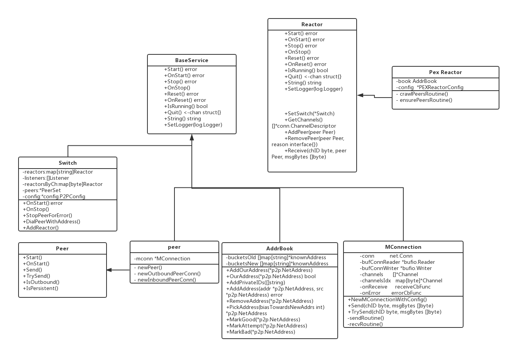

## 基本组件说明

P2P 模块涉及的最重要的组件如上图所示， 上述的 UML 图并没有列出某个类的所有属性和方法，只是列举了我认为比较重要的部分。 第一眼看到上面的类图我猜应该是什么也看不出来。 再仔细看我想依然是云山雾绕不知道整个 P2P 的流程。 所以类图只是给大家一个基本的组件印象。让大家能大致猜测一下各个组件的功能。 现在我们不妨按着上面的类图去大胆猜一猜上述的各个组件的功能。

我们先从 Switch 这个开始， switch 给我的第一个印象是交换机的意思， 将网口的信息进行互相的交换。 在 tendermint 里我们发现它实现了 BaseServer 的接口。 其实 Baseserver 就是一个通用的服务管理接口， 在 tendermint 中到处可见这个接口的实现。 主要作用就是让服务能实现统一的启动和停止。 所以说 Switch 启动的入口就应该是 Onstart()中。 switch 里面拥有了 AddReactor 方法，那是不是应该认为所有的 Reactor 的实例与 P2P 的交互是通过这个组件完成的呢？ 它还拥有 DialPeerWithAddress 方法，那是不是他还管理着创建新 Peer 的功能呢。 到这里可能你对 Reactor 是啥感到疑惑，简而言之它就是和整个 P2P 网络进行交互的组件， 在 Tendermint 中有 6 个 Reactor 实例分别是 MEMPOOL,BLOCKCHAIN,CONSENSUS,EVIDENCE,PEX. 其中 PEX 我认为是一个比较特殊的 Reactor，因为他还是和 P2P 有关联的一个组件。 关于 Reactor 不了解没有关系，后面我会介绍。

接着我们看看 Peer 这个组件，这个类中有 Mconnect 成员，Peer 应该就是代表这个对等体。它实现了 OnStart,Send 方法，所以启动入口应该也是 OnStart，Send 方法应该就是想往对等体发送消息的方法。 可是作为一个 Peer 不能只发送消息不接收消息吧。 为啥没有看到 Recv 之类的函数呢。 别急，后面我也会在正确的时间来说明。

Mconnnect 应该就比较好理解了，它应该就是维护了网络连接，进行底层的网络数据传输功能了。 其实它不仅做了网络传输，还做了很多其他事情。这里先卖个关子，反正说多了也不一定记得住。

AddrBook 应该就是维护 peer 信息，记录连接的 peer。查找可用的 peer 了。

## MConnecttion 源码分析:

为啥会首先分析 MConnecttion？ 因为它是最底层的部分。 消息的写入和读取都是通过此组件完成的。

函数`NewMConnectionWithConfig`分析:

```go
func NewMConnectionWithConfig(conn net.Conn, chDescs []*ChannelDescriptor, onReceive receiveCbFunc, onError errorCbFunc, config MConnConfig) *MConnection {
	if config.PongTimeout >= config.PingInterval {
		panic("pongTimeout must be less than pingInterval (otherwise, next ping will reset pong timer)")
	}

	mconn := &MConnection{
		conn:          conn,
		bufConnReader: bufio.NewReaderSize(conn, minReadBufferSize),
		bufConnWriter: bufio.NewWriterSize(conn, minWriteBufferSize),
		sendMonitor:   flow.New(0, 0),
		recvMonitor:   flow.New(0, 0),
		send:          make(chan struct{}, 1),
		pong:          make(chan struct{}, 1),
		onReceive:     onReceive,
		onError:       onError,
		config:        config,
	}

	// Create channels
	var channelsIdx = map[byte]*Channel{}
	var channels = []*Channel{}

	for _, desc := range chDescs {
		channel := newChannel(mconn, *desc)
		channelsIdx[channel.desc.ID] = channel
		channels = append(channels, channel)
	}
	mconn.channels = channels
	mconn.channelsIdx = channelsIdx

	mconn.BaseService = *cmn.NewBaseService(nil, "MConnection", mconn)

	// maxPacketMsgSize() is a bit heavy, so call just once
	mconn._maxPacketMsgSize = mconn.maxPacketMsgSize()

	return mconn
}
```

上述函数创建了 MConnecttion 的对象实例, conn 是 TCP 连接成功返回的对象， chDescs 用于创建通道，通道在 MConnecttion 中用处巨大。 onReceive 是当读取到数据之后进行回调, onError 是错误发生时的回调。
特别要注意到` bufConnReader: bufio.NewReaderSize(conn, minReadBufferSize), bufConnWriter: bufio.NewWriterSize(conn, minWriteBufferSize),`是将 net.Con 封装成 bufio 的读写，这样可以方便了用类似文件 IO 的形式来对 TCP 流进行读写操作。
接下来就是根据 chDescs 创建通道。我们看一下通道的成员

```go
type Channel struct {
	conn          *MConnection
	desc          ChannelDescriptor
	sendQueue     chan []byte
	sendQueueSize int32 // atomic.
	recving       []byte
	sending       []byte
	recentlySent  int64 // exponential moving average

	maxPacketMsgPayloadSize int

	Logger log.Logger
}
```

sendQueue 是发送队列, recving 是接收缓冲区， sending 是发送缓冲区。 这里可以先说明的是 Peer 调用 Send 发送消息其实是调用 MConnecttion 的 Send 方法，那么 MConnecttion 的 Send 其实也只是把内容发送到 Channel 的 sendQueue 中, 然后会有专门的 routine 读取 Channel 进行实际的消息发送。

创建完 MConnecttion 实例之后，就像我们之前说的那样，应该会先启动它，我们来分析 OnStart 方法。

```go
func (c *MConnection) OnStart() error {
	if err := c.BaseService.OnStart(); err != nil {
		return err
	}
	c.quit = make(chan struct{})
	// 同步周期
	c.flushTimer = cmn.NewThrottleTimer("flush", c.config.FlushThrottle)
	// ping周期
	c.pingTimer = cmn.NewRepeatTimer("ping", c.config.PingInterval)
	c.pongTimeoutCh = make(chan bool, 1)
	c.chStatsTimer = cmn.NewRepeatTimer("chStats", updateStats)
	go c.sendRoutine()
	go c.recvRoutine()
	return nil
}
```

代码比较简单，创建两个 goroutine,一个发送任务循环，一个进行接收任务循环。 这就和我们之前的 Channel 作用对上了。 先分析`sendRoutine`

```go
func (c *MConnection) sendRoutine() {
	defer c._recover()

FOR_LOOP:
	for {
		var _n int64
		var err error
	SELECTION:
		select {
		case <-c.flushTimer.Ch:
			// NOTE: flushTimer.Set() must be called every time
			// something is written to .bufConnWriter.
			c.flush()
		case <-c.chStatsTimer.Chan():
			for _, channel := range c.channels {
				channel.updateStats()
			}
		case <-c.pingTimer.Chan():
			c.Logger.Debug("Send Ping")
			_n, err = cdc.MarshalBinaryWriter(c.bufConnWriter, PacketPing{})
			if err != nil {
				break SELECTION
			}
			c.sendMonitor.Update(int(_n))
			c.Logger.Debug("Starting pong timer", "dur", c.config.PongTimeout)
			c.pongTimer = time.AfterFunc(c.config.PongTimeout, func() {
				select {
				case c.pongTimeoutCh <- true:
				default:
				}
			})
			c.flush()
		case timeout := <-c.pongTimeoutCh:
			if timeout {
				c.Logger.Debug("Pong timeout")
				err = errors.New("pong timeout")
			} else {
				c.stopPongTimer()
			}
		case <-c.pong:
			c.Logger.Debug("Send Pong")
			_n, err = cdc.MarshalBinaryWriter(c.bufConnWriter, PacketPong{})
			if err != nil {
				break SELECTION
			}
			c.sendMonitor.Update(int(_n))
			c.flush()
		case <-c.quit:
			break FOR_LOOP
		case <-c.send:
			// Send some PacketMsgs
			eof := c.sendSomePacketMsgs()
			if !eof {
				// Keep sendRoutine awake.
				select {
				case c.send <- struct{}{}:
				default:
				}
			}
		}

		if !c.IsRunning() {
			break FOR_LOOP
		}
		if err != nil {
			c.Logger.Error("Connection failed @ sendRoutine", "conn", c, "err", err)
			c.stopForError(err)
			break FOR_LOOP
		}
	}

	// Cleanup
	c.stopPongTimer()
}
```

c.flushTimer.Ch 进行周期性的 flush，c.pingTimer.Chan()进行周期性的向 tcp 连接写入 ping 消息，c.pong 表示需要进行 pong 回复， 这个不是周期性的自动写入，是因为收到了对方发来的 ping 消息，这个通道的写入是在 recvRoutine 函数中进行的。我们在 recvRoutine 再分析它。 忽略掉其他内容，我们重点看一下 c.send， 也即是说当 c.send 有写入，我们就应该进行包发送了。 我们来看看`sendSomePacketMsgs` 做了哪些工作。 为了分析方便 删除了一些非主流程代码，并将分析内容写在注释中。

```
func (c *MConnection) sendPacketMsg() bool {

	for _, channel := range c.channels {
		// 检查channel.sendQueue 是否为0 channel.sending缓冲区是否为空 如果为空说明没有需要发送的内容了。
		// 如果缓冲区为空了 就要把channel.sendQueue内部排队的内容 移出一份到缓冲区中。
		if !channel.isSendPending() {
			continue
		}

	}
	if leastChannel == nil {
		return true
	}

	// 执行到这里说明有某个Channel内部有消息没发送 将消息发送出去
	_n, err := leastChannel.writePacketMsgTo(c.bufConnWriter)
	if err != nil {
		c.Logger.Error("Failed to write PacketMsg", "err", err)
		c.stopForError(err)
		return true
	}
	c.flushTimer.Set()
	return false
}

func (ch *Channel) writePacketMsgTo(w io.Writer) (n int64, err error) {
	var packet = ch.nextPacketMsg()
	// 将结构体进行二进制编码发送 这里不再进行深入探索。只需要明白返回的数据也必须使用对应的方法才能进行正确的解包。 因为TCP是流式的
	n, err = cdc.MarshalBinaryWriter(w, packet)
	ch.recentlySent += n
	return
}

func (ch *Channel) nextPacketMsg() PacketMsg {
/*
type PacketMsg struct {
	ChannelID byte
	EOF       byte // 1 means message ends here.
	Bytes     []byte
}
*/

// 构造消息报文  如果缓冲区的内容过大，就要构造多个包进行封装。 以EOF为1来表示这个报文已经被完全封装了
	packet := PacketMsg{}
	packet.ChannelID = byte(ch.desc.ID)
	maxSize := ch.maxPacketMsgPayloadSize
	packet.Bytes = ch.sending[:cmn.MinInt(maxSize, len(ch.sending))]
	if len(ch.sending) <= maxSize {
		packet.EOF = byte(0x01)
		ch.sending = nil
		atomic.AddInt32(&ch.sendQueueSize, -1) // decrement sendQueueSize
	} else {
		packet.EOF = byte(0x00)
		ch.sending = ch.sending[cmn.MinInt(maxSize, len(ch.sending)):]
	}
	return packet
}

```

到了这个我们就把 sendSomePacketMsgs 功能分析完成了。 大致流程就是从 Channel 的缓存区去数据，构造 PacketMsg，写入 TCP 连接中。如果一直有内容则一直去调用 sendSomePacketMsgs。

接着分析`recvRoutine`

```go
func (c *MConnection) recvRoutine() {
	defer c._recover()

FOR_LOOP:
	for {
		// 正如我上文说到的TCP是流式的，需要正确的协议才能解析出来正确的报文，所以读取报文是和上述发送报文必须相同的协议。
		_n, err = cdc.UnmarshalBinaryReader(c.bufConnReader, &packet, int64(c._maxPacketMsgSize))

		// 根据解析出来的报文类型做相关的操作。
		switch pkt := packet.(type) {
		case PacketPing:
			select {
			// 对方要求我们发送一个pong 所以置位pong标识， 在sendRoutine中做相应的动作。
			case c.pong <- struct{}{}:
			default:
			}
		case PacketPong:
			select {
			// 更新pong超时状态
			case c.pongTimeoutCh <- false:
			default:
			}
		case PacketMsg:
			channel, ok := c.channelsIdx[pkt.ChannelID]
      // 根据接收的报文，选择对应的Channel, 放入对应的接收缓存区中。 缓存区的作用是什么呢。
      // 在上文的发送报文中我们发现一个PacketMsg包中可能并没有包含完整的内容，只有EOF为1才标识发送完成了。
      // 所以下面这个函数其实就是先将接收到的内容放入缓存区，只有所有内容都收到之后才会组装成一个完整的内容。
			msgBytes, err := channel.recvPacketMsg(pkt)
			if err != nil {
				if c.IsRunning() {
					c.Logger.Error("Connection failed @ recvRoutine", "conn", c, "err", err)
					c.stopForError(err)
				}
				break FOR_LOOP
			}
			if msgBytes != nil {
				// 注意这个函数的调用非常重要，记得之前我说为啥只有Send没有Receive呢， 答案就在此处。
				// 也就是说MConnecttion会把接收到的完整消息通过回调的形式返回给上面。 这个onReceive回调和Reactor的OnReceive是啥关系呢
				// 以及这个ChannelID和Reactor又是啥关系呢 不着急， 后面我们慢慢分析。 反正可以确定的是MConnecttion通过这个回调函数把接收到的消息
				// 返回给你应用层。
				c.onReceive(pkt.ChannelID, msgBytes)
			}

		}
	}

```

到了这里 MConnecttion 的主要功能也就分析差不多了 总结起来就是通过 Send，TrySend 暴露的函数 把待发送的内容转入对应的通道，置位 c.send 标志。 在 sendRoutine 中进行消息处理和发送。
同时在 recevRoutine 中接收消息，处理消息。同时根据回调函数返回给上一层。 分析完 MConnecttion 大家可能还会有一些疑惑， 这个 Channel 到底是怎么创建的， 还有这个 Onreceive 回调函数和 Reactor 是如何对应的呢。 接下来我们分析 Peer 的部分就会慢慢的了解了。

## Peer 源码分析

peer 在 p2p 中表示一个对等体。 在 tendermint 中也是它和应用程序之间进行直接的消息交互。 peer 实现了 Peer 这个接口的定义。 所以我们流程依然是先看创建的实例的部分，然后进入 Onstart 入口分析启动流程。 接着对一些重要的函数进行探究。

创建实例函数`newPeer`

```go
func newPeer(
	pc peerConn,
	mConfig tmconn.MConnConfig,
	nodeInfo NodeInfo,
	reactorsByCh map[byte]Reactor,
	chDescs []*tmconn.ChannelDescriptor,
	onPeerError func(Peer, interface{}),
) *peer {

// peerConn 是传递参数。 它拥有了net.Conn成员变量
// 为什么会专门设置一个peerConn结构呢， 为啥不直接使用net.Conn
// 因为peer既可能是一个客户端的连接也可能是一个服务端的连接。
// 所有才有了这个结构。 peerConn的创建可以使用newOutboundPeerConn和
// newInboundPeerConn两个函数来创建。 这两个函数是在switch组件中被调用的。
// 当然 peer整个实例的创建都是在switch组件中调用的。
/*
type peerConn struct {
	outbound     bool
	persistent   bool
	config       *config.P2PConfig
	conn         net.Conn // source connection
	ip           net.IP
	originalAddr *NetAddress // nil for inbound connections
}
*/
	p := &peer{
		peerConn: pc,
		nodeInfo: nodeInfo,
		channels: nodeInfo.Channels,
		Data:     cmn.NewCMap(),
	}
// 创建MConnecttion实例这这个函数进行。
	p.mconn = createMConnection(
		pc.conn,
		p,
		reactorsByCh,
		chDescs,
		onPeerError,
		mConfig,
	)
	p.BaseService = *cmn.NewBaseService(nil, "Peer", p)
	return p
}
```

这个函数接收参数, 构造对象， 创建 MConnecttion 实例。 具体分析`createMConnection`

```go
func createMConnection(
	conn net.Conn,
	p *peer,
	reactorsByCh map[byte]Reactor,
	chDescs []*tmconn.ChannelDescriptor,
	onPeerError func(Peer, interface{}),
	config tmconn.MConnConfig,
) *tmconn.MConnection {

// 看到没？ 这里就是回调函数初始化的地方。 这里可以看到channel应该是和
// Reactor是一一对应的。 每一个chID应该对应一个MConnecttion的channel。 当收到PackMsg时，根据id区分出应该投递给
// 哪一个Reactor 然后调用对应的reactor.Receive将消息返还给上层应用。
	onReceive := func(chID byte, msgBytes []byte) {
		reactor := reactorsByCh[chID]
		if reactor == nil {
			panic(cmn.Fmt("Unknown channel %X", chID))
		}
		reactor.Receive(chID, p, msgBytes)
	}

// 这个错误回调看上去依然是根据参数传递过来的。 那么应该是在switch组件中才能看到对错误的处理方法。
	onError := func(r interface{}) {
		onPeerError(p, r)
	}

	return tmconn.NewMConnectionWithConfig(
		conn,
		chDescs,
		onReceive,
		onError,
		config,
	)
}
```

所以说`newPeer`主要的工作就是创建 MConnecttion 实例。

来看看 OnStart()做了什么

```go
func (p *peer) OnStart() error {
	if err := p.BaseService.OnStart(); err != nil {
		return err
	}
	err := p.mconn.Start()
	return err
}
```

so， 就是启动了 MConnecttion 而已。 MConnecttion 只有启动了，上文中我们知道 MConnecttion 启动之后才开启了两个 goroutine 的循环。

peer 的两个重要函数 Send 和 TrySend

```go
// Send msg bytes to the channel identified by chID byte. Returns false if the
// send queue is full after timeout, specified by MConnection.
func (p *peer) Send(chID byte, msgBytes []byte) bool {
	if !p.IsRunning() {
		return false
	} else if !p.hasChannel(chID) {
		return false
	}
	return p.mconn.Send(chID, msgBytes)
}

// TrySend msg bytes to the channel identified by chID byte. Immediately returns
// false if the send queue is full.
func (p *peer) TrySend(chID byte, msgBytes []byte) bool {
	if !p.IsRunning() {
		return false
	} else if !p.hasChannel(chID) {
		return false
	}
	return p.mconn.TrySend(chID, msgBytes)
}
```

解释很明显，一个阻塞一个非阻塞。 就是调用 MConnecttion 进行数据发送。
分析到这里，有人可能会想，peer 似乎没有做什么事情，大部分就是在调用 MConnecttion，为啥非要封装一层呢。 来我们继续看。
peer 的几个比较重要的函数
`func (p *peer) NodeInfo() NodeInfo` 返回 peer 的节点信息
`func (pc *peerConn) HandshakeTimeout( ourNodeInfo NodeInfo, timeout time.Duration, ) (peerNodeInfo NodeInfo, err error) ` 进行节点信息交换。

```
// 此函数是阻塞的， 它是在创建peer之后首次被调用的。 因为只有进行了节点交换， 我们才能保存对等体的信息内容。
func (pc *peerConn) HandshakeTimeout(
	ourNodeInfo NodeInfo,
	timeout time.Duration,
) (peerNodeInfo NodeInfo, err error) {
	// Set deadline for handshake so we don't block forever on conn.ReadFull
	if err := pc.conn.SetDeadline(time.Now().Add(timeout)); err != nil {
		return peerNodeInfo, cmn.ErrorWrap(err, "Error setting deadline")
	}

	var trs, _ = cmn.Parallel(
		func(_ int) (val interface{}, err error, abort bool) {
			_, err = cdc.MarshalBinaryWriter(pc.conn, ourNodeInfo)
			return
		},
		func(_ int) (val interface{}, err error, abort bool) {
			_, err = cdc.UnmarshalBinaryReader(
				pc.conn,
				&peerNodeInfo,
				int64(MaxNodeInfoSize()),
			)
			return
		},
	)
	if err := trs.FirstError(); err != nil {
		return peerNodeInfo, cmn.ErrorWrap(err, "Error during handshake")
	}

	// Remove deadline
	if err := pc.conn.SetDeadline(time.Time{}); err != nil {
		return peerNodeInfo, cmn.ErrorWrap(err, "Error removing deadline")
	}

	return peerNodeInfo, nil
}
```

到此我们就把 Peer 的内容给说完了， 是不是觉得有点不过瘾， peer 听上去这么牛逼的名词怎么才只有这么点内容。 其实也就这点内容。因为在 P2P 中，核心就是发现节点，广播内容， 接收内容。 总之通过 Peer 的 Send 和 TrySend 我们就可以向对方的 Peer 发送消息了。

## Switch 源码分析

switch 在之前我们猜测应该是有点交换机之意， 连接各个 Reactor，进行信息的交换。 代码看下来， 个人认为这个组件最大的任务就是和 Reactor 进行交互。调用 Reactor 的接口函数。同时也暴露自己的函数供 Reactor 来调用。 我们先看一下它的结构.

```go
type Switch struct {
// 继承基本服务 方便统一启动和停止
	cmn.BaseService
  // 接收P2P的配置文件 所以说P2P的启动入口应该就是先启动Switch实例
	config       *config.P2PConfig
	// 监听者列表 就是我们一般意义上在启动TCP服务端时候创建的那个listener 只是做了一次封装 对地址格式等内容做了一些处理
	// 封装成了对象 方便使用而已
	// Listener的代码在listener.go中
	listeners    []Listener
	// 所有的创建的Reactor集合
	reactors     map[string]Reactor
	// Reactor和通道之间的对应关系 也是通过这个传递给peer在往下传递到MConnecttion
	chDescs      []*conn.ChannelDescriptor
	reactorsByCh map[byte]Reactor
	// peer集合
	peers        *PeerSet
	dialing      *cmn.CMap
	reconnecting *cmn.CMap
	nodeInfo     NodeInfo // our node info
	nodeKey      *NodeKey // our node privkey
	addrBook     AddrBook

	filterConnByAddr func(net.Addr) error
	filterConnByID   func(ID) error

	mConfig conn.MConnConfig

	rng *cmn.Rand // seed for randomizing dial times and orders

	metrics *Metrics
}
```

看看`NewSwitch`创建实例对象做了什么工作。

```go
// NewSwitch creates a new Switch with the given config.
func NewSwitch(cfg *config.P2PConfig, options ...SwitchOption) *Switch {
	sw := &Switch{
		config:       cfg,
		reactors:     make(map[string]Reactor),
		chDescs:      make([]*conn.ChannelDescriptor, 0),
		reactorsByCh: make(map[byte]Reactor),
		peers:        NewPeerSet(),
		dialing:      cmn.NewCMap(),
		reconnecting: cmn.NewCMap(),
		metrics:      NopMetrics(),
	}

	// Ensure we have a completely undeterministic PRNG.
	sw.rng = cmn.NewRand()

	mConfig := conn.DefaultMConnConfig()
	mConfig.FlushThrottle = time.Duration(cfg.FlushThrottleTimeout) * time.Millisecond
	mConfig.SendRate = cfg.SendRate
	mConfig.RecvRate = cfg.RecvRate
	mConfig.MaxPacketMsgPayloadSize = cfg.MaxPacketMsgPayloadSize
	sw.mConfig = mConfig

	sw.BaseService = *cmn.NewBaseService(nil, "P2P Switch", sw)

	for _, option := range options {
		option(sw)
	}

	return sw
}
```

看上去就是初始化实例， 没啥太多动作。
我们依然来看看 OnStart 做了些什么动作。

```go
func (sw *Switch) OnStart() error {

// 首先调用Reactor 启动所有的Reactor
// Reactor 是一个接口，反正你只要实现此接口函数
// 那么函数中啥也不做也没关系。 不过如果啥也不做
// 这个Reactor也就没有什么实际意义了。
// 在创建Switch中 sw.reactors 里面是空的
// 那么这些Reactor是怎么添加进来的呢
// 所以Switch提供了一个方法叫做AddReactor 专门添加Reactor
// 上面也说了在tendermint里面有6个Reactor 它们是在node/node.go
// 文件中被添加的 类似于下面这样
/*
	sw.AddReactor("MEMPOOL", mempoolReactor)
	sw.AddReactor("BLOCKCHAIN", bcReactor)
	sw.AddReactor("CONSENSUS", consensusReactor)
	sw.AddReactor("EVIDENCE", evidenceReactor)
*/

  // 一会我们看看AddReactor方法做了哪些工作
	for _, reactor := range sw.reactors {
		err := reactor.Start()
		if err != nil {
			return cmn.ErrorWrap(err, "failed to start %v", reactor)
		}
	}
	// 这里就是启动本地socket监听了 同理也是有个AddListener方法添加listener对象
	// 实际在使用的过程中 一般只会在一个端口启动监听
	for _, listener := range sw.listeners {
		go sw.listenerRoutine(listener)
	}
	return nil
}
```

从上面的代码可以看出 在启动 Switch 之前应该先调用 AddReactor 和 AddListener。 而且应该是将所有的
Reactor 都添加完成再启动。否则的话后面添加的 Reactor 就不会启动了。
接下来看看`AddReactor`

```
func (sw *Switch) AddReactor(name string, reactor Reactor) Reactor {

// 调用reactor的GetChannels方法获取相关的通道描述
// 也就是说一个Reactor可以启用好几个通道 但是这个通道ID是所有Reactor
// 都不可以重复的。
	reactorChannels := reactor.GetChannels()
	for _, chDesc := range reactorChannels {
		chID := chDesc.ID
		if sw.reactorsByCh[chID] != nil {
			cmn.PanicSanity(fmt.Sprintf("Channel %X has multiple reactors %v & %v", chID, sw.reactorsByCh[chID], reactor))
		}
		sw.chDescs = append(sw.chDescs, chDesc)
		sw.reactorsByCh[chID] = reactor
	}
	sw.reactors[name] = reactor

	// 这个接口很重要 它把Switch的对象又传递给你Reactor 这样Reactor也可以调用Switch的函数了
	// 这回真的是你中有我我中有你了
	reactor.SetSwitch(sw)
	return reactor
}
```

启动 Switch 还有除了启动 Reactor 还开始了监听 socket 的任务。 我们来看看`listenerRoutine`

```go
func (sw *Switch) listenerRoutine(l Listener) {
	for {
	  // 等待一个TCP连接 不过多解释 写过Linux的socket网络编程的应该自然明白这个流程
		inConn, ok := <-l.Connections()
		if !ok {
			break
		}
    // 这一步大致就是判断是否连接数过多 如果太多就不让连接了，
		maxPeers := sw.config.MaxNumPeers - DefaultMinNumOutboundPeers
		if maxPeers <= sw.peers.Size() {
			sw.Logger.Info("Ignoring inbound connection: already have enough peers", "address", inConn.RemoteAddr().String(), "numPeers", sw.peers.Size(), "max", maxPeers)
			inConn.Close()
			continue
		}

		// 执行到这里就添加一个入栈连接peer 之前我们在peer源码分析的时候说到会有客户端连接和服务端连接
		// 这里就是服务端连接 我们会一直跟踪addInboundPeerWithConfig这个函数 因为它很重要
		err := sw.addInboundPeerWithConfig(inConn, sw.config)
		if err != nil {
			sw.Logger.Info("Ignoring inbound connection: error while adding peer", "address", inConn.RemoteAddr().String(), "err", err)
			continue
		}
	}
}
func (sw *Switch) addInboundPeerWithConfig(
	conn net.Conn,
	config *config.P2PConfig,
) error {
// 看见没 终于在这里调用了peer的newInboundPeerConn 本身作为服务端创建的连接
// 有了连接还不够 我们要创建peer才行。
	peerConn, err := newInboundPeerConn(conn, config, sw.nodeKey.PrivKey)
	if err != nil {
		conn.Close() // peer is nil
		return err
	}
	// 那么addPeer 应该会创建新peer 并加入peer集合中吧 我们继续跟踪
	if err = sw.addPeer(peerConn); err != nil {
		peerConn.CloseConn()
		return err
	}
	return nil
}

// 这个代码非常长 我们做一下精简
func (sw *Switch) addPeer(pc peerConn) error {

	// 看这里 看这里 创建新peer之前我们必须要进行节点之间的信息交换 获取到对方的节点信息
	peerNodeInfo, err := pc.HandshakeTimeout(sw.nodeInfo, time.Duration(sw.config.HandshakeTimeout))
	if err != nil {
		return err
	}
	peerID := peerNodeInfo.ID
	// 验证节点有效性
	if err := peerNodeInfo.Validate(); err != nil {
		return err
	}
	// 这一步很重要 防止自己连接自己
	if sw.nodeKey.ID() == peerID {
		addr := peerNodeInfo.NetAddress()
		sw.addrBook.RemoveAddress(addr)
		sw.addrBook.AddOurAddress(addr)
		return ErrSwitchConnectToSelf{addr}
	}

	// 防止多次连接
	if sw.peers.Has(peerID) {
		return ErrSwitchDuplicatePeerID{peerID}
	}

	// 检查协议之间是否兼容
	if err := sw.nodeInfo.CompatibleWith(peerNodeInfo); err != nil {
		return err
	}

 // 当当当~~~~ 终于可以创建一个新的peer了 参数分别是TCP连接 连接配置  节点信息 Reactor 通道描述 错误回调
	peer := newPeer(pc, sw.mConfig, peerNodeInfo, sw.reactorsByCh, sw.chDescs, sw.StopPeerForError)

	// All good. Start peer
	if sw.IsRunning() {
	// startInitPeer 比较重要 我们继续跟踪这个函数
		if err = sw.startInitPeer(peer); err != nil {
			return err
		}
	}

  // 最后把peer加入switch自己维护的peer集合中
	if err := sw.peers.Add(peer); err != nil {
		return err
	}
	return nil
}

func (sw *Switch) startInitPeer(peer *peer) error {
 //  是的没毛病 既然创建了peer实例就要启动它 --> 启动Mconnection
	err := peer.Start() // spawn send/recv routines
	if err != nil {
		// Should never happen
		sw.Logger.Error("Error starting peer", "peer", peer, "err", err)
		return err
	}
	// 这一步非常必要 把新的peer传给你每一个Reactor 所以Reactor应该自己也要维护一个peer集合
	// 这里我们在引申想一下 既然创建了新peer 并把新的peer抛给了Reactor 那么应用层就可以和这个Peer之间进行消息交互了
	// 可是如果和这个peer进行交互出错了 肯定应该删除这个peer的
	// 后面我们会看这个peer错误处理的地方
	for _, reactor := range sw.reactors {
		reactor.AddPeer(peer)
	}
	return nil
}

```

到了这里 这个监听 socket 的任务分析就算完事了， 总结起来就是作为服务端接受一个新的 socket 连接， 先交换节点信息， 进行一系列检查， 然后创建新的 peer， 启动新的 peer。 将新 peer 传递给每一个 Reactor。 可是这个只有入栈的 peer 创建， 总该有出栈的 peer 去创建吧。 总不能我只提供服务， 不获取吧。

这个时候我想换个方法分析， 添加入栈 peer 的时候是调用了函数`addInboundPeerWithConfig`那么添加出栈函数应该就是`addOutboundPeerWithConfig`。
我么来先分析这个函数看看它是不是添加出栈函数。

```go
func (sw *Switch) addOutboundPeerWithConfig(
	addr *NetAddress,
	config *config.P2PConfig,
	persistent bool,
) error {
  // 这个很符合我们的预期 调用了peer的newOutboundPeerConn 创建新的出栈socket连接
	peerConn, err := newOutboundPeerConn(
		addr,
		config,
		persistent,
		sw.nodeKey.PrivKey,
	)
	if err != nil {
		if persistent {
			go sw.reconnectToPeer(addr)
		}
		return err
	}
// 看到没 所以还是调用了addPeer函数 继续添加peer的那一套流程
	if err := sw.addPeer(peerConn); err != nil {
		peerConn.CloseConn()
		return err
	}
	return nil
}
```

看来很符合我的猜想啊， 信心又增加了不少呢。 咳咳咳， 继续继续。 `addOutboundPeerWithConfig`只被`DialPeerWithAddress`来调用， 这个函数看名字就知道通过地址来连接一个 Peer，所以很明显是创建一个出栈的 peer。 那它是再在哪调用的呢。 现在先说结论， 它是在 PEX 这个 Reactor 中被调用的。 暂时我们先放一放。在分析 PEX 源码的时候再探究它。 先解决 Switch 中一些其他的疑问。

第一个疑问, 在 peer 中我们好像找到了当有消息回来时的 OnReceive 的回调但是没有找到 OnErr 的回调。
第二个疑问, 如果我们的 Reactor 发现某个 peer 出错了想移除它应该怎么做。

两个疑问合为一个， 关键就在`StopPeerForError`这个函数。 来， 继续追踪下去。

```go
func (sw *Switch) StopPeerForError(peer Peer, reason interface{}) {
  // 名称暴露了一切 停止并且移除peer
	sw.stopAndRemovePeer(peer, reason)

//  特殊peer处理 就是说如果我认为这个地址应该持续连接 就会进行重连
	if peer.IsPersistent() {
		addr := peer.OriginalAddr()
		if addr == nil {
			addr = peer.NodeInfo().NetAddress()
		}
		go sw.reconnectToPeer(addr)
	}
}

func (sw *Switch) stopAndRemovePeer(peer Peer, reason interface{}) {
// 先从Switch自己维护的peer集合中删除这个peer
	sw.peers.Remove(peer)
	sw.metrics.Peers.Add(float64(-1))
	// 调用peer的stop 这个我没有说明 就是关闭socket连接 做一些收尾工作
	peer.Stop()

	// 注意看这里 调用所有的Reactor 告诉所有的Reactor 你要移除这个peer了
	for _, reactor := range sw.reactors {
		reactor.RemovePeer(peer, reason)
	}
}
```

所以说当有 Peer 错误发生时应该调用 Switch 的 StopPeerForError 把这个 peer 移除掉。
所以上面我说 SetSwitch 让 Reactor 你中有我我中有你， 在这里就显示出作用了。
上面的疑惑一其实也就解除了， OnErr 的回调也是这个函数. 没毛病，设计的非常好。 厉害厉害。

到了这里， Switch 的分析就差不多结束了。 但是 Switch 里面还是有很多公共方法我没有说明， 因为它们大致都很简单， 有的通过名字都能看出功能是什么。 所以也没必要花费时间去说明它。总结 Switch 的主要功能就是监听 TCP 连接，维护新 peer 的创建和删除，调用 Reactor 的各种回调处理。同时也将 Switch 传递给 Reactor。供给 Reactor 进行调用。

## PEX 源码分析

分析到这里， 我们大致明白了 tendermint 的 P2P 是如何向对等体发送消息， 如何将接收到的消息返回对等体的。可是 P2P 还有一个非常重要的功能就是进行节点发现。 如果不能发现节点，那这个 P2P 也就没有什么意义。 所以 PEX 的作用就是进行节点发现工作的。 当然 PEX 也是一个 Reactor 的具体实现。 分析完这个内容我们不仅会了解节点是如何发现的，而且也会了解一个 Reactor 是到底都实现了哪些内容。

先看创建实例`NewPEXReactor`的代码

```go
type PEXReactor struct {
	p2p.BaseReactor

	book              AddrBook
	config            *PEXReactorConfig
	ensurePeersPeriod time.Duration // TODO: should go in the config

	// maps to prevent abuse
	requestsSent         *cmn.CMap // ID->struct{}: unanswered send requests
	lastReceivedRequests *cmn.CMap // ID->time.Time: last time peer requested from us

	seedAddrs []*p2p.NetAddress

	attemptsToDial sync.Map // address (string) -> {number of attempts (int), last time dialed (time.Time)}
}
// 这个函数是在tendermint启动node节点的时候调用的， 创建一个AddrBook实例 然后将实例传递给此函数返回一个PEX的Reactor实例。
并注册到Switch中。
func NewPEXReactor(b AddrBook, config *PEXReactorConfig) *PEXReactor {
	r := &PEXReactor{
		book:                 b,
		config:               config,
		ensurePeersPeriod:    defaultEnsurePeersPeriod,
		requestsSent:         cmn.NewCMap(),
		lastReceivedRequests: cmn.NewCMap(),
	}
	r.BaseReactor = *p2p.NewBaseReactor("PEXReactor", r)
	return r
}
```

先进入 OnStart 代码看看做了哪些动作。

```go
func (r *PEXReactor) OnStart() error {
 // 启动地址簿 后面分析addrbook的时候再研究
	err := r.book.Start()
	if err != nil && err != cmn.ErrAlreadyStarted {
		return err
	}
  // 检查配置的种子节点格式是否正确
	numOnline, seedAddrs, err := r.checkSeeds()
	if err != nil {
		return err
	} else if numOnline == 0 && r.book.Empty() {
		return errors.New("Address book is empty, and could not connect to any seed nodes")
	}

	r.seedAddrs = seedAddrs

  // 根据配置文件自己是否是种子模式来启动不同的routine
	if r.config.SeedMode {
		go r.crawlPeersRoutine()
	} else {
		go r.ensurePeersRoutine()
	}
	return nil
}
// 先分析作为种子模式时 的情况
// 每隔30S调用一次crawlPeers和attemptDisconnects
func (r *PEXReactor) crawlPeersRoutine() {
	r.crawlPeers()

	// Fire periodically
	ticker := time.NewTicker(defaultCrawlPeersPeriod)

	for {
		select {
		case <-ticker.C:
		  // 这个函数内容比较简单 查看每一个peer和自己连接是时长 如果超过3个小时 就断开
			r.attemptDisconnects()
			r.crawlPeers()
		case <-r.Quit():
			return
		}
	}
}

func (r *PEXReactor) crawlPeers() {
// 此函数从地址簿中获取所有存在的地址 然后根据最后一次尝试连接的时间进行排序
	peerInfos := r.getPeersToCrawl()

	now := time.Now()
	// Use addresses we know of to reach additional peers
	for _, pi := range peerInfos {
		// 如果上次尝试连接的时间和此处相差不到2分钟 则不进行连接
		if now.Sub(pi.LastAttempt) < defaultCrawlPeerInterval {
			continue
		}
		// 尝试和这个地址进行一次连接
		err := r.Switch.DialPeerWithAddress(pi.Addr, false)
		if err != nil {
		// 如果连接失败了 更新最后一次尝试连接的时间和次数
			r.book.MarkAttempt(pi.Addr)
			continue
		}

		peer := r.Switch.Peers().Get(pi.Addr.ID)
		if peer != nil {
		// 如果连接成功了 就想这个地址发送一个报文 这个报文的目的就是请求此peer知道的的peer
			r.RequestAddrs(peer)
		}
	}
}
```

总结一下作为种子模式的 pex 就是每隔一段时间就会检查当前 peer 集合中是否有连接时间超过 3 小时的 peer， 如果有，除非设置了一直连接否则就断开。 然后去爬去新的节点。 如果从地址簿中爬去到新的节点就发送一份请求地址交换的报文过去。

接着看一下作为非种子节点时的流程。

```go
// 每个一段时间调用ensurePeers
func (r *PEXReactor) ensurePeersRoutine() {
	var (
		seed   = cmn.NewRand()
		jitter = seed.Int63n(r.ensurePeersPeriod.Nanoseconds())
	)

	// Randomize first round of communication to avoid thundering herd.
	// If no potential peers are present directly start connecting so we guarantee
	// swift setup with the help of configured seeds.
	if r.hasPotentialPeers() {
		time.Sleep(time.Duration(jitter))
	}

	// fire once immediately.
	// ensures we dial the seeds right away if the book is empty
	r.ensurePeers()

	// fire periodically
	ticker := time.NewTicker(r.ensurePeersPeriod)
	for {
		select {
		case <-ticker.C:
			r.ensurePeers()
		case <-r.Quit():
			ticker.Stop()
			return
		}
	}
}


func (r *PEXReactor) ensurePeers() {
// 获取当前正在连接的peer的信息
	var (
		out, in, dial = r.Switch.NumPeers()
		numToDial     = defaultMinNumOutboundPeers - (out + dial)
	)
	if numToDial <= 0 {
		return
	}


  // 下面目的好像是从地址簿中根据偏差值挑出需要数量的peer地址 然后进行连接。
  // 这个挑取的算法暂时没有仔细阅读。 宗旨是从地址簿中找到一些peer地址然后超时拨号连接。
	// bias to prefer more vetted peers when we have fewer connections.
	// not perfect, but somewhate ensures that we prioritize connecting to more-vetted
	// NOTE: range here is [10, 90]. Too high ?
	newBias := cmn.MinInt(out, 8)*10 + 10

	toDial := make(map[p2p.ID]*p2p.NetAddress)
	// Try maxAttempts times to pick numToDial addresses to dial
	maxAttempts := numToDial * 3

	for i := 0; i < maxAttempts && len(toDial) < numToDial; i++ {
		try := r.book.PickAddress(newBias)
		if try == nil {
			continue
		}
		if _, selected := toDial[try.ID]; selected {
			continue
		}
		if dialling := r.Switch.IsDialing(try.ID); dialling {
			continue
		}
		if connected := r.Switch.Peers().Has(try.ID); connected {
			continue
		}
		// TODO: consider moving some checks from toDial into here
		// so we don't even consider dialing peers that we want to wait
		// before dialling again, or have dialed too many times already
		r.Logger.Info("Will dial address", "addr", try)
		toDial[try.ID] = try
	}

	// Dial picked addresses
	for _, addr := range toDial {
	 // 启动一个routine 进行单独拨号 一会单独最终它
		go r.dialPeer(addr)
	}

	// If we need more addresses, pick a random peer and ask for more.
	// 这个函数是为了补充地址簿的数量 如果地址簿中存储的peer地址过少 就会执行下面的代码
	if r.book.NeedMoreAddrs() {
		peers := r.Switch.Peers().List()
		peersCount := len(peers)
		if peersCount > 0 {
			peer := peers[cmn.RandInt()%peersCount] // nolint: gas
			r.Logger.Info("We need more addresses. Sending pexRequest to random peer", "peer", peer)
			// 同样向相邻的节点请求更多的地址
			r.RequestAddrs(peer)
		}
	}

	// If we are not connected to nor dialing anybody, fallback to dialing a seed.
	if out+in+dial+len(toDial) == 0 {
		r.Logger.Info("No addresses to dial nor connected peers. Falling back to seeds")
		// 这个函数比较简单 就是根据配置的种子地址 调用r.Switch.DialPeerWithAddress(seedAddr, false) 尝试连接peer
		r.dialSeeds()
	}
}

// 来追踪 根据地址簿提供的地址进行拨号的流程
func (r *PEXReactor) dialPeer(addr *p2p.NetAddress) {
// 从地址簿中找出这个地址最后一次尝试连接的时间和尝试连接的次数
	attempts, lastDialed := r.dialAttemptsInfo(addr)

// 如果这个地址尝试的次数过多的话 就标记为坏的地址 其实就是从地址簿中移除掉
	if attempts > maxAttemptsToDial {
		r.Logger.Error("Reached max attempts to dial", "addr", addr, "attempts", attempts)
		r.book.MarkBad(addr)
		return
	}

	//判断尝试次数计算下次尝试时间 如果时间未到不进行尝试连接
	// 换句话说就是尝试的次数越多 下次尝试连接的间隔越长
	if attempts > 0 {
		jitterSeconds := time.Duration(cmn.RandFloat64() * float64(time.Second)) // 1s == (1e9 ns)
		backoffDuration := jitterSeconds + ((1 << uint(attempts)) * time.Second)
		sinceLastDialed := time.Since(lastDialed)
		if sinceLastDialed < backoffDuration {
			r.Logger.Debug("Too early to dial", "addr", addr, "backoff_duration", backoffDuration, "last_dialed", lastDialed, "time_since", sinceLastDialed)
			return
		}
	}
  // 这里就比较明白了 进行连接。
	err := r.Switch.DialPeerWithAddress(addr, false)
	if err != nil {
		r.Logger.Error("Dialing failed", "addr", addr, "err", err, "attempts", attempts)
		// 如果是校验失败了 就直接从地址簿移除 根本不给尝试的机会 主要目的应该是防止一些恶意的攻击
		if _, ok := err.(p2p.ErrSwitchAuthenticationFailure); ok {
			r.book.MarkBad(addr)
			r.attemptsToDial.Delete(addr.DialString())
		} else {
			r.book.MarkAttempt(addr)
			// FIXME: if the addr is going to be removed from the addrbook (hard to
			// tell at this point), we need to Delete it from attemptsToDial, not
			// record another attempt.
			// record attempt
			r.attemptsToDial.Store(addr.DialString(), _attemptsToDial{attempts + 1, time.Now()})
		}
	} else {
		// cleanup any history
		r.attemptsToDial.Delete(addr.DialString())
	}
}
```

所以总结一下作为非种子节点其实就是一直进行连接， 尽量保存足够的连接数量。 如果数量不够就先从地址簿从取一些地址进行连接。 连接每一个地址的过程就如上面的表述的流程一样。 如果地址簿发现保存的地址数量太少就会尝试向已知的 peer 发送请求新 peer 的报文请求。如果这个时候还是没有足够的 peer 就只能向种子节点去请求了。

分析到这里我们应该有一些疑问， 如果每一个 PEX 只有发送请求新节点的报文好像不够吧，它也应该做出回应啊， 既然要做出回应，在之前的分析中我们知道如果想回应一个 Read 的数据，Reactor 就要在 Receive 里做文章喽， 所以我们只需要看看 PEX 的 Receive 是怎么做的就好了。

```go
func (r *PEXReactor) Receive(chID byte, src Peer, msgBytes []byte) {
	msg, err := decodeMsg(msgBytes)
	if err != nil {
		r.Logger.Error("Error decoding message", "src", src, "chId", chID, "msg", msg, "err", err, "bytes", msgBytes)
		r.Switch.StopPeerForError(src, err)
		return
	}
	r.Logger.Debug("Received message", "src", src, "chId", chID, "msg", msg)

	switch msg := msg.(type) {
	case *pexRequestMessage:
		// 看到这个消息类型 就是我们刚才发生请求更多peer的报文 先进行错误处理
		if err := r.receiveRequest(src); err != nil {
			r.Switch.StopPeerForError(src, err)
			return
		}
		if r.config.SeedMode {
		//  如果我们是种子节点 我们就发生一些节点列表过去
			r.SendAddrs(src, r.book.GetSelectionWithBias(biasToSelectNewPeers))
			// 发送完成后 断开和这个peer的连接 也就是说如果我们尝试连接种子节点 种子节点在回复更多peer之后就会关闭连接 因为维护每一个
			//socket是要消耗资源的
			r.Switch.StopPeerGracefully(src)
		} else {
		// 如果不是种子节点 发送完自身一直的节点列表之后 就保持连接
			r.SendAddrs(src, r.book.GetSelection())
		}

	case *pexAddrsMessage:
		// 这个消息表示收到了具体的peer列表 尝试加入地址簿中 这个函数还做了一个特别的动作就是 如果里面有种子节点 立刻尝试和种子节点进行一次连接
		if err := r.ReceiveAddrs(msg.Addrs, src); err != nil {
			r.Switch.StopPeerForError(src, err)
			return
		}
	default:
		r.Logger.Error(fmt.Sprintf("Unknown message type %v", reflect.TypeOf(msg)))
	}
}
```

所以 PEX 的 Receive 主要功能就是处理了从其他 peer 接收到相应的报文做相应的处理。 然后我们顺便看看 PEX 的其接口。
`GetChannels`返回了 PEX 的通道描述 ID 为 0 优先级为 1
`AddPeer` 当新 peer 加入之后， 如果地址簿保存的数量太少就尝试向这个 peer 请求更多 peer
`RemovePeer`做一些辅助动作

到此， 整个 PEX 流程就算完成了。
