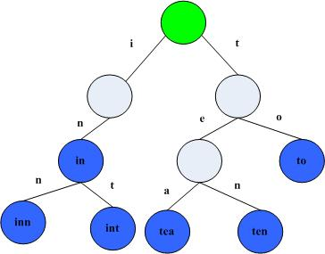
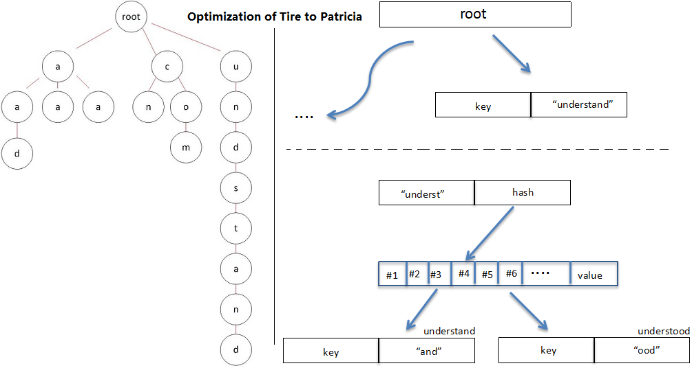
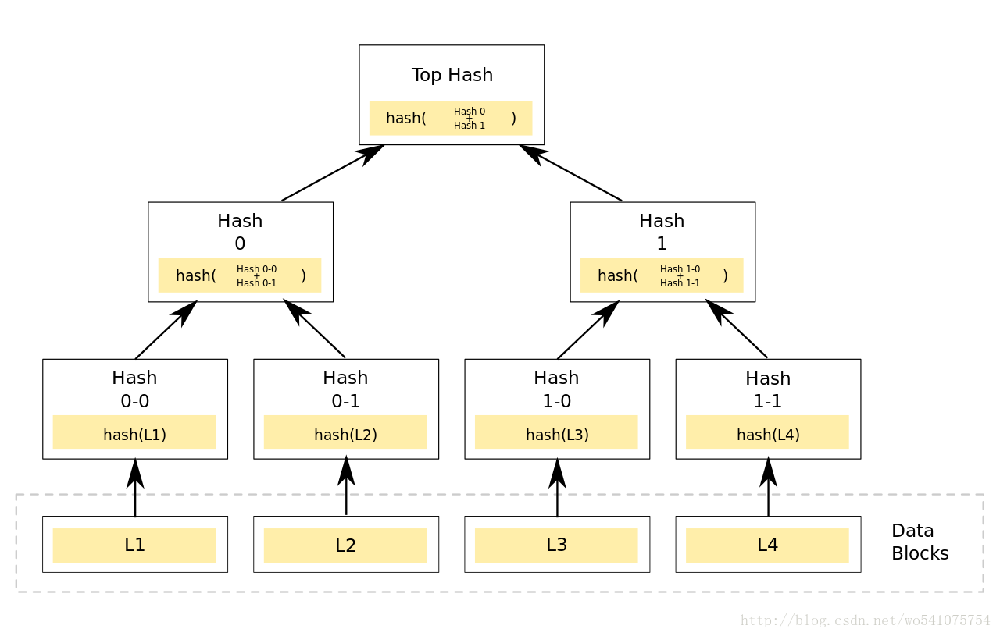
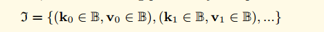
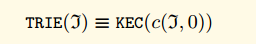
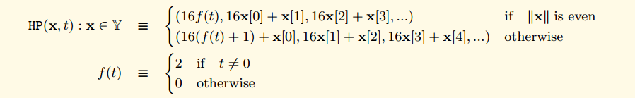

包trie 实现了Merkle Patricia Tries，这里用简称MPT来称呼这种数据结构，这种数据结构实际上是一种Trie树变种，MPT是以太坊中一种非常重要的数据结构，用来存储用户账户的状态及其变更、交易信息、交易的收据信息。MPT实际上是三种数据结构的组合，分别是Trie树， Patricia Trie， 和Merkle树。下面分别介绍这三种数据结构。

## Trie树 (引用介绍 http://dongxicheng.org/structure/trietree/)
Trie树，又称字典树，单词查找树或者前缀树，是一种用于快速检索的多叉树结构，如英文字母的字典树是一个26叉树，数字的字典树是一个10叉树。

Trie树可以利用字符串的公共前缀来节约存储空间。如下图所示，该trie树用10个节点保存了6个字符串：tea，ten，to，in，inn，int：

在该trie树中，字符串in，inn和int的公共前缀是“in”，因此可以只存储一份“in”以节省空间。当然，如果系统中存在大量字符串且这些字符串基本没有公共前缀，则相应的trie树将非常消耗内存，这也是trie树的一个缺点。

Trie树的基本性质可以归纳为：

- 根节点不包含字符，除根节点以外每个节点只包含一个字符。
- 从根节点到某一个节点，路径上经过的字符连接起来，为该节点对应的字符串。
- 每个节点的所有子节点包含的字符串不相同。

## Patricia Tries (前缀树)
前缀树跟Trie树的不同之处在于Trie树给每一个字符串分配一个节点，这样将使那些很长但又没有公共节点的字符串的Trie树退化成数组。在以太坊里面会由黑客构造很多这种节点造成拒绝服务攻击。前缀树的不同之处在于如果节点公共前缀，那么就使用公共前缀，否则就把剩下的所有节点插入同一个节点。Patricia相对Tire的优化正如下图：

上图存储的8个Key Value对，可以看到前缀树的特点。

|Key           | value |
| ------------- | ---: |
|6c0a5c71ec20bq3w|5     |
|6c0a5c71ec20CX7j|27    |
|6c0a5c71781a1FXq|18    |
|6c0a5c71781a9Dog|64    |
|6c0a8f743b95zUfe|30    |
|6c0a8f743b95jx5R|2     |
|6c0a8f740d16y03G|43    |
|6c0a8f740d16vcc1|48    |

## Merkle树 (参考 http://blog.csdn.net/wo541075754/article/details/54632929）
Merkle Tree，通常也被称作Hash Tree，顾名思义，就是存储hash值的一棵树。Merkle树的叶子是数据块(例如，文件或者文件的集合)的hash值。非叶节点是其对应子节点串联字符串的hash。

Merkle Tree的主要作用是当我拿到Top Hash的时候，这个hash值代表了整颗树的信息摘要，当树里面任何一个数据发生了变动，都会导致Top Hash的值发生变化。 而Top Hash的值是会存储到区块链的区块头里面去的， 区块头是必须经过工作量证明。 这也就是说我只要拿到一个区块头，就可以对区块信息进行验证。 更加详细的信息请参考那个博客。有详细的介绍。

## 以太坊的MPT
每一个以太坊的区块头包含三颗MPT树，分别是

- 交易树
- 收据树(交易执行过程中的一些数据)
- 状态树(账号信息， 合约账户和用户账户)

下图中是两个区块头，其中state root，tx root receipt root分别存储了这三棵树的树根，第二个区块显示了当账号 175的数据变更(27 -> 45)的时候，只需要存储跟这个账号相关的部分数据，而且老的区块中的数据还是可以正常访问。(这个有点类似与函数式编程语言中的不可变的数据结构的实现)

详细结构为

## 黄皮书形式化定义(Appendix D. Modified Merkle Patricia Tree)

正式地，我们假设输入值J，包含Key Value对的集合（Key Value都是字节数组）：

当处理这样一个集合的时候，我们使用下面的这样标识表示数据的 Key和Value(对于J集合中的任意一个I， I0表示Key， I1表示Value)

对于任何特定的字节，我们可以表示为对应的半字节（nibble），其中Y集合在Hex-Prefix Encoding中有说明，意为半字节（4bit）集合（之所以采用半字节，其与后续说明的分支节点branch node结构以及key中编码flag有关）

我们定义了TRIE函数，用来表示树根的HASH值（其中c函数的第二个参数，意为构建完成后树的层数。root的值为0）

我们还定义一个函数n，这个trie的节点函数。 当组成节点时，我们使用RLP对结构进行编码。 作为降低存储复杂度的手段，对于RLP少于32字节的节点，我们直接存储其RLP值， 对于那些较大的，我们存储其HASH节点。
我们用c来定义节点组成函数：

以类似于基数树的方式，当Trie树从根遍历到叶时，可以构建单个键值对。 Key通过遍历累积，从每个分支节点获取单个半字节（与基数树一样）。 与基数树不同，在共享相同前缀的多个Key的情况下，或者在具有唯一后缀的单个Key的情况下，提供两个优化节点。的情况下，或者在具有唯一后缀的单个密钥的情况下，提供两个优化节点。 因此，当遍历时，可能从其他两个节点类型，扩展和叶中的每一个潜在地获取多个半字节。在Trie树中有三种节点：

- **叶子节点(Leaf):** 叶子节点包含两个字段， 第一个字段是剩下的Key的半字节编码,而且半字节编码方法的第二个参数为true， 第二个字段是Value
- **扩展节点(Extention):** 扩展节点也包含两个字段， 第一个字段是剩下的Key的可以至少被两个剩下节点共享的部分的半字节编码，第二个字段是n(J,j)
- **分支节点(Branch):** 分支节点包含了17个字段，其前16个项目对应于这些点在其遍历中的键的十六个可能的半字节值中的每一个。第17个字段是存储那些在当前结点结束了的节点(例如， 有三个key,分别是 (abc ,abd, ab) 第17个字段储存了ab节点的值)

分支节点只有在需要的时候使用， 对于一个只有一个非空 key value对的Trie树，可能不存在分支节点。 如果使用公式来定义这三种节点， 那么公式如下：
图中的HP函数代表Hex-Prefix Encoding，是一种半字节编码格式，RLP是使用RLP进行序列化的函数。

对于上图的三种情况的解释

- 如果当前需要编码的KV集合只剩下一条数据，那么这条数据按照第一条规则进行编码。
- 如果当前需要编码的KV集合有公共前缀，那么提取最大公共前缀并使用第二条规则进行处理。
- 如果不是上面两种情况，那么使用分支节点进行集合切分，因为key是使用HP进行编码的，所以可能的分支只有0-15这16个分支。可以看到u的值由n进行递归定义，而如果有节点刚好在这里完结了，那么第17个元素v就是为这种情况准备的。

对于数据应该如何存储和不应该如何存储， 黄皮书中说明没有显示的定义。所以这是一个实现上的问题。我们简单的定义了一个函数来把J映射为一个Hash。 我们认为对于任意一个J，只存在唯一一个Hash值。

### 黄皮书的形式化定义(Hex-Prefix Encoding)--十六进制前缀编码
十六进制前缀编码是将任意数量的半字节编码为字节数组的有效方法。它能够存储附加标志，当在Trie树中使用时(唯一会使用的地方)，会在节点类型之间消除歧义。

它被定义为从一系列半字节（由集合Y表示）与布尔值一起映射到字节序列（由集合B表示）的函数HP：

因此，第一个字节的高半字节包含两个标志; 最低bit位编码了长度的奇偶位，第二低的bit位编码了flag的值。 在偶数个半字节的情况下，第一个字节的低半字节为零，在奇数的情况下为第一个半字节。 所有剩余的半字节（现在是偶数）适合其余的字节。

## 源码实现
### trie/encoding.go
encoding.go主要处理trie树中的三种编码格式的相互转换的工作。 三种编码格式分别为下面的三种编码格式。

- **KEYBYTES encoding**这种编码格式就是原生的key字节数组，大部分的Trie的API都是使用这边编码格式
- **HEX encoding** 这种编码格式每一个字节包含了Key的一个半字节，尾部接上一个可选的'终结符','终结符'代表这个节点到底是叶子节点还是扩展节点。当节点被加载到内存里面的时候使用的是这种节点，因为它的方便访问。
- **COMPACT encoding** 这种编码格式就是上面黄皮书里面说到的Hex-Prefix Encoding，这种编码格式可以看成是*HEX encoding**这种编码格式的另外一种版本，可以在存储到数据库的时候节约磁盘空间。

简单的理解为：将普通的字节序列keybytes编码为带有t标志与奇数个半字节nibble标志位的keybytes
- keybytes为按完整字节（8bit）存储的正常信息
- hex为按照半字节nibble（4bit）储存信息的格式。供compact使用
- 为了便于作黄皮书中Modified Merkle Patricia Tree的节点的key，编码为偶数字节长度的hex格式。其第一个半字节nibble会在低的2个bit位中，由高到低分别存放t标志与奇数标志。经compact编码的keybytes，在增加了hex的t标志与半字节nibble为偶数个（即完整的字节）的情况下，便于存储

代码实现，主要是实现了这三种编码的相互转换，以及一个求取公共前缀的方法。

	func hexToCompact(hex []byte) []byte {
		terminator := byte(0)
		if hasTerm(hex) {
			terminator = 1
			hex = hex[:len(hex)-1]
		}
		buf := make([]byte, len(hex)/2+1)
		buf[0] = terminator << 5 // the flag byte
		if len(hex)&1 == 1 {
			buf[0] |= 1 << 4 // odd flag
			buf[0] |= hex[0] // first nibble is contained in the first byte
			hex = hex[1:]
		}
		decodeNibbles(hex, buf[1:])
		return buf
	}
	
	func compactToHex(compact []byte) []byte {
		base := keybytesToHex(compact)
		base = base[:len(base)-1]
		// apply terminator flag
		if base[0] >= 2 { // TODO 先将keybytesToHex输出的末尾结束标志删除后，再通过判断头半个字节的标志位t加回去。操作冗余
			base = append(base, 16)
		}
		// apply odd flag
		chop := 2 - base[0]&1
		return base[chop:]
	}
	
	func keybytesToHex(str []byte) []byte {
		l := len(str)*2 + 1
		var nibbles = make([]byte, l)
		for i, b := range str {
			nibbles[i*2] = b / 16
			nibbles[i*2+1] = b % 16
		}
		nibbles[l-1] = 16
		return nibbles
	}
	
	// hexToKeybytes turns hex nibbles into key bytes.
	// This can only be used for keys of even length.
	func hexToKeybytes(hex []byte) []byte {
		if hasTerm(hex) {
			hex = hex[:len(hex)-1]
		}
		if len(hex)&1 != 0 {
			panic("can't convert hex key of odd length")
		}
		key := make([]byte, (len(hex)+1)/2) // TODO 对于一个已经判断为偶数的len(hex)在整除2的同时加1，为无效的+1逻辑
		decodeNibbles(hex, key)
		return key
	}
	
	func decodeNibbles(nibbles []byte, bytes []byte) {
		for bi, ni := 0, 0; ni < len(nibbles); bi, ni = bi+1, ni+2 {
			bytes[bi] = nibbles[ni]<<4 | nibbles[ni+1]
		}
	}
	
	// prefixLen returns the length of the common prefix of a and b.
	func prefixLen(a, b []byte) int {
		var i, length = 0, len(a)
		if len(b) < length {
			length = len(b)
		}
		for ; i < length; i++ {
			if a[i] != b[i] {
				break
			}
		}
		return i
	}
	
	// hasTerm returns whether a hex key has the terminator flag.
	func hasTerm(s []byte) bool {
		return len(s) > 0 && s[len(s)-1] == 16
	}

### 数据结构
node的结构，可以看到node分为4种类型， fullNode对应了黄皮书里面的分支节点，shortNode对应了黄皮书里面的扩展节点和叶子节点(通过shortNode.Val的类型来判断当前节点是叶子节点(shortNode.Val为valueNode)还是拓展节点(通过shortNode.Val指向下一个node))。

	type node interface {
		fstring(string) string
		cache() (hashNode, bool)
		canUnload(cachegen, cachelimit uint16) bool
	}
	
	type (
		fullNode struct {
			Children [17]node // Actual trie node data to encode/decode (needs custom encoder)
			flags    nodeFlag
		}
		shortNode struct {
			Key   []byte
			Val   node
			flags nodeFlag
		}
		hashNode  []byte
		valueNode []byte
	)

trie的结构， root包含了当前的root节点， db是后端的KV存储，trie的结构最终都是需要通过KV的形式存储到数据库里面去，然后启动的时候是需要从数据库里面加载的。 originalRoot 启动加载的时候的hash值，通过这个hash值可以在数据库里面恢复出整颗的trie树。cachegen字段指示了当前Trie树的cache时代，每次调用Commit操作的时候，会增加Trie树的cache时代。 cache时代会被附加在node节点上面，如果当前的cache时代 - cachelimit参数 大于node的cache时代，那么node会从cache里面卸载，以便节约内存。 其实这就是缓存更新的LRU算法， 如果一个缓存在多久没有被使用，那么就从缓存里面移除，以节约内存空间。

	// Trie is a Merkle Patricia Trie.
	// The zero value is an empty trie with no database.
	// Use New to create a trie that sits on top of a database.
	//
	// Trie is not safe for concurrent use.
	type Trie struct {
		root         node
		db           Database
		originalRoot common.Hash
	
		// Cache generation values.
		// cachegen increases by one with each commit operation.
		// new nodes are tagged with the current generation and unloaded
		// when their generation is older than than cachegen-cachelimit.
		cachegen, cachelimit uint16
	}

###Trie树的插入，查找和删除
Trie树的初始化调用New函数，函数接受一个hash值和一个Database参数，如果hash值不是空值的化，就说明是从数据库加载一个已经存在的Trie树， 就调用trei.resolveHash方法来加载整颗Trie树，这个方法后续会介绍。 如果root是空，那么就新建一颗Trie树返回。

	func New(root common.Hash, db Database) (*Trie, error) {
		trie := &Trie{db: db, originalRoot: root}
		if (root != common.Hash{}) && root != emptyRoot {
			if db == nil {
				panic("trie.New: cannot use existing root without a database")
			}
			rootnode, err := trie.resolveHash(root[:], nil)
			if err != nil {
				return nil, err
			}
			trie.root = rootnode
		}
		return trie, nil
	}

Trie树的插入，这是一个递归调用的方法，从根节点开始，一直往下找，直到找到可以插入的点，进行插入操作。参数node是当前插入的节点， prefix是当前已经处理完的部分key， key是还没有处理玩的部分key,  完整的key = prefix + key。 value是需要插入的值。 返回值bool是操作是否改变了Trie树(dirty)，node是插入完成后的子树的根节点， error是错误信息。

- 如果节点类型是nil(一颗全新的Trie树的节点就是nil的),这个时候整颗树是空的，直接返回shortNode{key, value, t.newFlag()}， 这个时候整颗树的跟就含有了一个shortNode节点。 
- 如果当前的根节点类型是shortNode(也就是叶子节点)，首先计算公共前缀，如果公共前缀就等于key，那么说明这两个key是一样的，如果value也一样的(dirty == false)，那么返回错误。 如果没有错误就更新shortNode的值然后返回。如果公共前缀不完全匹配，那么就需要把公共前缀提取出来形成一个独立的节点(扩展节点),扩展节点后面连接一个branch节点，branch节点后面看情况连接两个short节点。首先构建一个branch节点(branch := &fullNode{flags: t.newFlag()}),然后再branch节点的Children位置调用t.insert插入剩下的两个short节点。这里有个小细节，key的编码是HEX encoding,而且末尾带了一个终结符。考虑我们的根节点的key是abc0x16，我们插入的节点的key是ab0x16。下面的branch.Children[key[matchlen]]才可以正常运行，0x16刚好指向了branch节点的第17个孩子。如果匹配的长度是0，那么直接返回这个branch节点，否则返回shortNode节点作为前缀节点。
- 如果当前的节点是fullNode(也就是branch节点)，那么直接往对应的孩子节点调用insert方法,然后把对应的孩子节点只想新生成的节点。
- 如果当前节点是hashNode, hashNode的意思是当前节点还没有加载到内存里面来，还是存放在数据库里面，那么首先调用 t.resolveHash(n, prefix)来加载到内存，然后对加载出来的节点调用insert方法来进行插入。

插入代码

	func (t *Trie) insert(n node, prefix, key []byte, value node) (bool, node, error) {
		if len(key) == 0 {
			if v, ok := n.(valueNode); ok {
				return !bytes.Equal(v, value.(valueNode)), value, nil
			}
			return true, value, nil
		}
		switch n := n.(type) {
		case *shortNode:
			matchlen := prefixLen(key, n.Key)
			// If the whole key matches, keep this short node as is
			// and only update the value.
			if matchlen == len(n.Key) {
				dirty, nn, err := t.insert(n.Val, append(prefix, key[:matchlen]...), key[matchlen:], value)
				if !dirty || err != nil {
					return false, n, err
				}
				return true, &shortNode{n.Key, nn, t.newFlag()}, nil
			}
			// Otherwise branch out at the index where they differ.
			branch := &fullNode{flags: t.newFlag()}
			var err error
			_, branch.Children[n.Key[matchlen]], err = t.insert(nil, append(prefix, n.Key[:matchlen+1]...), n.Key[matchlen+1:], n.Val)
			if err != nil {
				return false, nil, err
			}
			_, branch.Children[key[matchlen]], err = t.insert(nil, append(prefix, key[:matchlen+1]...), key[matchlen+1:], value)
			if err != nil {
				return false, nil, err
			}
			// Replace this shortNode with the branch if it occurs at index 0.
			if matchlen == 0 {
				return true, branch, nil
			}
			// Otherwise, replace it with a short node leading up to the branch.
			return true, &shortNode{key[:matchlen], branch, t.newFlag()}, nil
	
		case *fullNode:
			dirty, nn, err := t.insert(n.Children[key[0]], append(prefix, key[0]), key[1:], value)
			if !dirty || err != nil {
				return false, n, err
			}
			n = n.copy()
			n.flags = t.newFlag()
			n.Children[key[0]] = nn
			return true, n, nil
	
		case nil:
			return true, &shortNode{key, value, t.newFlag()}, nil
	
		case hashNode:
			// We've hit a part of the trie that isn't loaded yet. Load
			// the node and insert into it. This leaves all child nodes on
			// the path to the value in the trie.
			rn, err := t.resolveHash(n, prefix)
			if err != nil {
				return false, nil, err
			}
			dirty, nn, err := t.insert(rn, prefix, key, value)
			if !dirty || err != nil {
				return false, rn, err
			}
			return true, nn, nil
	
		default:
			panic(fmt.Sprintf("%T: invalid node: %v", n, n))
		}
	}

Trie树的Get方法，基本上就是很简单的遍历Trie树，来获取Key的信息。

	func (t *Trie) tryGet(origNode node, key []byte, pos int) (value []byte, newnode node, didResolve bool, err error) {
		switch n := (origNode).(type) {
		case nil:
			return nil, nil, false, nil
		case valueNode:
			return n, n, false, nil
		case *shortNode:
			if len(key)-pos < len(n.Key) || !bytes.Equal(n.Key, key[pos:pos+len(n.Key)]) {
				// key not found in trie
				return nil, n, false, nil
			}
			value, newnode, didResolve, err = t.tryGet(n.Val, key, pos+len(n.Key))
			if err == nil && didResolve {
				n = n.copy()
				n.Val = newnode
				n.flags.gen = t.cachegen
			}
			return value, n, didResolve, err
		case *fullNode:
			value, newnode, didResolve, err = t.tryGet(n.Children[key[pos]], key, pos+1)
			if err == nil && didResolve {
				n = n.copy()
				n.flags.gen = t.cachegen
				n.Children[key[pos]] = newnode
			}
			return value, n, didResolve, err
		case hashNode:
			child, err := t.resolveHash(n, key[:pos])
			if err != nil {
				return nil, n, true, err
			}
			value, newnode, _, err := t.tryGet(child, key, pos)
			return value, newnode, true, err
		default:
			panic(fmt.Sprintf("%T: invalid node: %v", origNode, origNode))
		}
	}

Trie树的Delete方法，暂时不介绍，代码根插入比较类似

### Trie树的序列化和反序列化
序列化主要是指把内存表示的数据存放到数据库里面， 反序列化是指把数据库里面的Trie数据加载成内存表示的数据。 序列化的目的主要是方便存储，减少存储大小等。 反序列化的目的是把存储的数据加载到内存，方便Trie树的插入，查询，修改等需求。

Trie的序列化主要才作用了前面介绍的Compat Encoding和 RLP编码格式。 序列化的结构在黄皮书里面有详细的介绍。

Trie树的使用方法在trie_test.go里面有比较详细的参考。 这里我列出一个简单的使用流程。首先创建一个空的Trie树，然后插入一些数据，最后调用trie.Commit()方法进行序列化并得到一个hash值(root), 也就是上图中的KEC(c(J,0))或者是TRIE(J)。

	func TestInsert(t *testing.T) {
		trie := newEmpty()
		updateString(trie, "doe", "reindeer")
		updateString(trie, "dog", "puppy")
		updateString(trie, "do", "cat")
		root, err := trie.Commit()
	}

下面我们来分析下Commit()的主要流程。 经过一系列的调用，最终调用了hasher.go的hash方法。

	func (t *Trie) Commit() (root common.Hash, err error) {
		if t.db == nil {
			panic("Commit called on trie with nil database")
		}
		return t.CommitTo(t.db)
	}
	// CommitTo writes all nodes to the given database.
	// Nodes are stored with their sha3 hash as the key.
	//
	// Committing flushes nodes from memory. Subsequent Get calls will
	// load nodes from the trie's database. Calling code must ensure that
	// the changes made to db are written back to the trie's attached
	// database before using the trie.
	func (t *Trie) CommitTo(db DatabaseWriter) (root common.Hash, err error) {
		hash, cached, err := t.hashRoot(db)
		if err != nil {
			return (common.Hash{}), err
		}
		t.root = cached
		t.cachegen++
		return common.BytesToHash(hash.(hashNode)), nil
	}
	
	func (t *Trie) hashRoot(db DatabaseWriter) (node, node, error) {
		if t.root == nil {
			return hashNode(emptyRoot.Bytes()), nil, nil
		}
		h := newHasher(t.cachegen, t.cachelimit)
		defer returnHasherToPool(h)
		return h.hash(t.root, db, true)
	}

下面我们简单介绍下hash方法，hash方法主要做了两个操作。 一个是保留原有的树形结构，并用cache变量中， 另一个是计算原有树形结构的hash并把hash值存放到cache变量中保存下来。

计算原有hash值的主要流程是首先调用h.hashChildren(n,db)把所有的子节点的hash值求出来，把原有的子节点替换成子节点的hash值。 这是一个递归调用的过程，会从树叶依次往上计算直到树根。然后调用store方法计算当前节点的hash值，并把当前节点的hash值放入cache节点，设置dirty参数为false(新创建的节点的dirty值是为true的)，然后返回。

返回值说明， cache变量包含了原有的node节点，并且包含了node节点的hash值。 hash变量返回了当前节点的hash值(这个值其实是根据node和node的所有子节点计算出来的)。

有一个小细节： 根节点调用hash函数的时候， force参数是为true的，其他的子节点调用的时候force参数是为false的。 force参数的用途是当||c(J,i)||<32的时候也对c(J,i)进行hash计算，这样保证无论如何也会对根节点进行Hash计算。
	
	// hash collapses a node down into a hash node, also returning a copy of the
	// original node initialized with the computed hash to replace the original one.
	func (h *hasher) hash(n node, db DatabaseWriter, force bool) (node, node, error) {
		// If we're not storing the node, just hashing, use available cached data
		if hash, dirty := n.cache(); hash != nil {
			if db == nil {
				return hash, n, nil
			}
			if n.canUnload(h.cachegen, h.cachelimit) {
				// Unload the node from cache. All of its subnodes will have a lower or equal
				// cache generation number.
				cacheUnloadCounter.Inc(1)
				return hash, hash, nil
			}
			if !dirty {
				return hash, n, nil
			}
		}
		// Trie not processed yet or needs storage, walk the children
		collapsed, cached, err := h.hashChildren(n, db)
		if err != nil {
			return hashNode{}, n, err
		}
		hashed, err := h.store(collapsed, db, force)
		if err != nil {
			return hashNode{}, n, err
		}
		// Cache the hash of the node for later reuse and remove
		// the dirty flag in commit mode. It's fine to assign these values directly
		// without copying the node first because hashChildren copies it.
		cachedHash, _ := hashed.(hashNode)
		switch cn := cached.(type) {
		case *shortNode:
			cn.flags.hash = cachedHash
			if db != nil {
				cn.flags.dirty = false
			}
		case *fullNode:
			cn.flags.hash = cachedHash
			if db != nil {
				cn.flags.dirty = false
			}
		}
		return hashed, cached, nil
	}

hashChildren方法,这个方法把所有的子节点替换成他们的hash，可以看到cache变量接管了原来的Trie树的完整结构，collapsed变量把子节点替换成子节点的hash值。

- 如果当前节点是shortNode, 首先把collapsed.Key从Hex Encoding 替换成 Compact Encoding, 然后递归调用hash方法计算子节点的hash和cache，这样就把子节点替换成了子节点的hash值，
- 如果当前节点是fullNode, 那么遍历每个子节点，把子节点替换成子节点的Hash值，
- 否则的化这个节点没有children。直接返回。

代码

	// hashChildren replaces the children of a node with their hashes if the encoded
	// size of the child is larger than a hash, returning the collapsed node as well
	// as a replacement for the original node with the child hashes cached in.
	func (h *hasher) hashChildren(original node, db DatabaseWriter) (node, node, error) {
		var err error
	
		switch n := original.(type) {
		case *shortNode:
			// Hash the short node's child, caching the newly hashed subtree
			collapsed, cached := n.copy(), n.copy()
			collapsed.Key = hexToCompact(n.Key)
			cached.Key = common.CopyBytes(n.Key)
	
			if _, ok := n.Val.(valueNode); !ok {
				collapsed.Val, cached.Val, err = h.hash(n.Val, db, false)
				if err != nil {
					return original, original, err
				}
			}
			if collapsed.Val == nil {
				collapsed.Val = valueNode(nil) // Ensure that nil children are encoded as empty strings.
			}
			return collapsed, cached, nil
	
		case *fullNode:
			// Hash the full node's children, caching the newly hashed subtrees
			collapsed, cached := n.copy(), n.copy()
	
			for i := 0; i < 16; i++ {
				if n.Children[i] != nil {
					collapsed.Children[i], cached.Children[i], err = h.hash(n.Children[i], db, false)
					if err != nil {
						return original, original, err
					}
				} else {
					collapsed.Children[i] = valueNode(nil) // Ensure that nil children are encoded as empty strings.
				}
			}
			cached.Children[16] = n.Children[16]
			if collapsed.Children[16] == nil {
				collapsed.Children[16] = valueNode(nil)
			}
			return collapsed, cached, nil
	
		default:
			// Value and hash nodes don't have children so they're left as were
			return n, original, nil
		}
	}

store方法，如果一个node的所有子节点都替换成了子节点的hash值，那么直接调用rlp.Encode方法对这个节点进行编码，如果编码后的值小于32，并且这个节点不是根节点，那么就把他们直接存储在他们的父节点里面，否者调用h.sha.Write方法进行hash计算， 然后把hash值和编码后的数据存储到数据库里面，然后返回hash值。

可以看到每个值大于32的节点的值和hash都存储到了数据库里面，

	func (h *hasher) store(n node, db DatabaseWriter, force bool) (node, error) {
		// Don't store hashes or empty nodes.
		if _, isHash := n.(hashNode); n == nil || isHash {
			return n, nil
		}
		// Generate the RLP encoding of the node
		h.tmp.Reset()
		if err := rlp.Encode(h.tmp, n); err != nil {
			panic("encode error: " + err.Error())
		}
	
		if h.tmp.Len() < 32 && !force {
			return n, nil // Nodes smaller than 32 bytes are stored inside their parent
		}
		// Larger nodes are replaced by their hash and stored in the database.
		hash, _ := n.cache()
		if hash == nil {
			h.sha.Reset()
			h.sha.Write(h.tmp.Bytes())
			hash = hashNode(h.sha.Sum(nil))
		}
		if db != nil {
			return hash, db.Put(hash, h.tmp.Bytes())
		}
		return hash, nil
	}

Trie的反序列化过程。还记得之前创建Trie树的流程么。 如果参数root的hash值不为空，那么就会调用rootnode, err := trie.resolveHash(root[:], nil) 方法来得到rootnode节点。 首先从数据库里面通过hash值获取节点的RLP编码后的内容。 然后调用decodeNode来解析内容。

	func (t *Trie) resolveHash(n hashNode, prefix []byte) (node, error) {
		cacheMissCounter.Inc(1)
	
		enc, err := t.db.Get(n)
		if err != nil || enc == nil {
			return nil, &MissingNodeError{NodeHash: common.BytesToHash(n), Path: prefix}
		}
		dec := mustDecodeNode(n, enc, t.cachegen)
		return dec, nil
	}
	func mustDecodeNode(hash, buf []byte, cachegen uint16) node {
		n, err := decodeNode(hash, buf, cachegen)
		if err != nil {
			panic(fmt.Sprintf("node %x: %v", hash, err))
		}
		return n
	}

decodeNode方法，这个方法根据rlp的list的长度来判断这个编码到底属于什么节点，如果是2个字段那么就是shortNode节点，如果是17个字段，那么就是fullNode，然后分别调用各自的解析函数。

	// decodeNode parses the RLP encoding of a trie node.
	func decodeNode(hash, buf []byte, cachegen uint16) (node, error) {
		if len(buf) == 0 {
			return nil, io.ErrUnexpectedEOF
		}
		elems, _, err := rlp.SplitList(buf)
		if err != nil {
			return nil, fmt.Errorf("decode error: %v", err)
		}
		switch c, _ := rlp.CountValues(elems); c {
		case 2:
			n, err := decodeShort(hash, buf, elems, cachegen)
			return n, wrapError(err, "short")
		case 17:
			n, err := decodeFull(hash, buf, elems, cachegen)
			return n, wrapError(err, "full")
		default:
			return nil, fmt.Errorf("invalid number of list elements: %v", c)
		}
	}

decodeShort方法，通过key是否有终结符号来判断到底是叶子节点还是中间节点。如果有终结符那么就是叶子结点，通过SplitString方法解析出来val然后生成一个shortNode。 不过没有终结符，那么说明是扩展节点， 通过decodeRef来解析剩下的节点，然后生成一个shortNode。

	func decodeShort(hash, buf, elems []byte, cachegen uint16) (node, error) {
		kbuf, rest, err := rlp.SplitString(elems)
		if err != nil {
			return nil, err
		}
		flag := nodeFlag{hash: hash, gen: cachegen}
		key := compactToHex(kbuf)
		if hasTerm(key) {
			// value node
			val, _, err := rlp.SplitString(rest)
			if err != nil {
				return nil, fmt.Errorf("invalid value node: %v", err)
			}
			return &shortNode{key, append(valueNode{}, val...), flag}, nil
		}
		r, _, err := decodeRef(rest, cachegen)
		if err != nil {
			return nil, wrapError(err, "val")
		}
		return &shortNode{key, r, flag}, nil
	}

decodeRef方法根据数据类型进行解析，如果类型是list，那么有可能是内容<32的值，那么调用decodeNode进行解析。 如果是空节点，那么返回空，如果是hash值，那么构造一个hashNode进行返回，注意的是这里没有继续进行解析，如果需要继续解析这个hashNode，那么需要继续调用resolveHash方法。 到这里decodeShort方法就调用完成了。

	func decodeRef(buf []byte, cachegen uint16) (node, []byte, error) {
		kind, val, rest, err := rlp.Split(buf)
		if err != nil {
			return nil, buf, err
		}
		switch {
		case kind == rlp.List:
			// 'embedded' node reference. The encoding must be smaller
			// than a hash in order to be valid.
			if size := len(buf) - len(rest); size > hashLen {
				err := fmt.Errorf("oversized embedded node (size is %d bytes, want size < %d)", size, hashLen)
				return nil, buf, err
			}
			n, err := decodeNode(nil, buf, cachegen)
			return n, rest, err
		case kind == rlp.String && len(val) == 0:
			// empty node
			return nil, rest, nil
		case kind == rlp.String && len(val) == 32:
			return append(hashNode{}, val...), rest, nil
		default:
			return nil, nil, fmt.Errorf("invalid RLP string size %d (want 0 or 32)", len(val))
		}
	}

decodeFull方法。根decodeShort方法的流程差不多。

	
	func decodeFull(hash, buf, elems []byte, cachegen uint16) (*fullNode, error) {
		n := &fullNode{flags: nodeFlag{hash: hash, gen: cachegen}}
		for i := 0; i < 16; i++ {
			cld, rest, err := decodeRef(elems, cachegen)
			if err != nil {
				return n, wrapError(err, fmt.Sprintf("[%d]", i))
			}
			n.Children[i], elems = cld, rest
		}
		val, _, err := rlp.SplitString(elems)
		if err != nil {
			return n, err
		}
		if len(val) > 0 {
			n.Children[16] = append(valueNode{}, val...)
		}
		return n, nil
	}

### Trie树的cache管理
Trie树的cache管理。 还记得Trie树的结构里面有两个参数， 一个是cachegen,一个是cachelimit。这两个参数就是cache控制的参数。 Trie树每一次调用Commit方法，会导致当前的cachegen增加1。
	
	func (t *Trie) CommitTo(db DatabaseWriter) (root common.Hash, err error) {
		hash, cached, err := t.hashRoot(db)
		if err != nil {
			return (common.Hash{}), err
		}
		t.root = cached
		t.cachegen++
		return common.BytesToHash(hash.(hashNode)), nil
	}

然后在Trie树插入的时候，会把当前的cachegen存放到节点中。

	func (t *Trie) insert(n node, prefix, key []byte, value node) (bool, node, error) {
				....
				return true, &shortNode{n.Key, nn, t.newFlag()}, nil
			}

	// newFlag returns the cache flag value for a newly created node.
	func (t *Trie) newFlag() nodeFlag {
		return nodeFlag{dirty: true, gen: t.cachegen}
	}

如果 trie.cachegen - node.cachegen > cachelimit，就可以把节点从内存里面卸载掉。 也就是说节点经过几次Commit，都没有修改，那么就把节点从内存里面卸载，以便节约内存给其他节点使用。

卸载过程在我们的 hasher.hash方法中， 这个方法是在commit的时候调用。如果方法的canUnload方法调用返回真，那么就卸载节点，观察他的返回值，只返回了hash节点，而没有返回node节点，这样节点就没有引用，不久就会被gc清除掉。 节点被卸载掉之后，会用一个hashNode节点来表示这个节点以及其子节点。 如果后续需要使用，可以通过方法把这个节点加载到内存里面来。

	func (h *hasher) hash(n node, db DatabaseWriter, force bool) (node, node, error) {
		if hash, dirty := n.cache(); hash != nil {
			if db == nil {
				return hash, n, nil
			}
			if n.canUnload(h.cachegen, h.cachelimit) {
				// Unload the node from cache. All of its subnodes will have a lower or equal
				// cache generation number.
				cacheUnloadCounter.Inc(1)
				return hash, hash, nil
			}
			if !dirty {
				return hash, n, nil
			}
		}

canUnload方法是一个接口，不同的node调用不同的方法。

	// canUnload tells whether a node can be unloaded.
	func (n *nodeFlag) canUnload(cachegen, cachelimit uint16) bool {
		return !n.dirty && cachegen-n.gen >= cachelimit
	}
	
	func (n *fullNode) canUnload(gen, limit uint16) bool  { return n.flags.canUnload(gen, limit) }
	func (n *shortNode) canUnload(gen, limit uint16) bool { return n.flags.canUnload(gen, limit) }
	func (n hashNode) canUnload(uint16, uint16) bool      { return false }
	func (n valueNode) canUnload(uint16, uint16) bool     { return false }
	
	func (n *fullNode) cache() (hashNode, bool)  { return n.flags.hash, n.flags.dirty }
	func (n *shortNode) cache() (hashNode, bool) { return n.flags.hash, n.flags.dirty }
	func (n hashNode) cache() (hashNode, bool)   { return nil, true }
	func (n valueNode) cache() (hashNode, bool)  { return nil, true }

### proof.go Trie树的默克尔证明
主要提供两个方法，Prove方法获取指定Key的proof证明， proof证明是从根节点到叶子节点的所有节点的hash值列表。 VerifyProof方法，接受一个roothash值和proof证明和key来验证key是否存在。

Prove方法，从根节点开始。把经过的节点的hash值一个一个存入到list中。然后返回。
	
	// Prove constructs a merkle proof for key. The result contains all
	// encoded nodes on the path to the value at key. The value itself is
	// also included in the last node and can be retrieved by verifying
	// the proof.
	//
	// If the trie does not contain a value for key, the returned proof
	// contains all nodes of the longest existing prefix of the key
	// (at least the root node), ending with the node that proves the
	// absence of the key.
	func (t *Trie) Prove(key []byte) []rlp.RawValue {
		// Collect all nodes on the path to key.
		key = keybytesToHex(key)
		nodes := []node{}
		tn := t.root
		for len(key) > 0 && tn != nil {
			switch n := tn.(type) {
			case *shortNode:
				if len(key) < len(n.Key) || !bytes.Equal(n.Key, key[:len(n.Key)]) {
					// The trie doesn't contain the key.
					tn = nil
				} else {
					tn = n.Val
					key = key[len(n.Key):]
				}
				nodes = append(nodes, n)
			case *fullNode:
				tn = n.Children[key[0]]
				key = key[1:]
				nodes = append(nodes, n)
			case hashNode:
				var err error
				tn, err = t.resolveHash(n, nil)
				if err != nil {
					log.Error(fmt.Sprintf("Unhandled trie error: %v", err))
					return nil
				}
			default:
				panic(fmt.Sprintf("%T: invalid node: %v", tn, tn))
			}
		}
		hasher := newHasher(0, 0)
		proof := make([]rlp.RawValue, 0, len(nodes))
		for i, n := range nodes {
			// Don't bother checking for errors here since hasher panics
			// if encoding doesn't work and we're not writing to any database.
			n, _, _ = hasher.hashChildren(n, nil)
			hn, _ := hasher.store(n, nil, false)
			if _, ok := hn.(hashNode); ok || i == 0 {
				// If the node's database encoding is a hash (or is the
				// root node), it becomes a proof element.
				enc, _ := rlp.EncodeToBytes(n)
				proof = append(proof, enc)
			}
		}
		return proof
	}

VerifyProof方法，接收一个rootHash参数，key参数，和proof数组， 来一个一个验证是否能够和数据库里面的能够对应上。

	// VerifyProof checks merkle proofs. The given proof must contain the
	// value for key in a trie with the given root hash. VerifyProof
	// returns an error if the proof contains invalid trie nodes or the
	// wrong value.
	func VerifyProof(rootHash common.Hash, key []byte, proof []rlp.RawValue) (value []byte, err error) {
		key = keybytesToHex(key)
		sha := sha3.NewKeccak256()
		wantHash := rootHash.Bytes()
		for i, buf := range proof {
			sha.Reset()
			sha.Write(buf)
			if !bytes.Equal(sha.Sum(nil), wantHash) {
				return nil, fmt.Errorf("bad proof node %d: hash mismatch", i)
			}
			n, err := decodeNode(wantHash, buf, 0)
			if err != nil {
				return nil, fmt.Errorf("bad proof node %d: %v", i, err)
			}
			keyrest, cld := get(n, key)
			switch cld := cld.(type) {
			case nil:
				if i != len(proof)-1 {
					return nil, fmt.Errorf("key mismatch at proof node %d", i)
				} else {
					// The trie doesn't contain the key.
					return nil, nil
				}
			case hashNode:
				key = keyrest
				wantHash = cld
			case valueNode:
				if i != len(proof)-1 {
					return nil, errors.New("additional nodes at end of proof")
				}
				return cld, nil
			}
		}
		return nil, errors.New("unexpected end of proof")
	}
	
	func get(tn node, key []byte) ([]byte, node) {
		for {
			switch n := tn.(type) {
			case *shortNode:
				if len(key) < len(n.Key) || !bytes.Equal(n.Key, key[:len(n.Key)]) {
					return nil, nil
				}
				tn = n.Val
				key = key[len(n.Key):]
			case *fullNode:
				tn = n.Children[key[0]]
				key = key[1:]
			case hashNode:
				return key, n
			case nil:
				return key, nil
			case valueNode:
				return nil, n
			default:
				panic(fmt.Sprintf("%T: invalid node: %v", tn, tn))
			}
		}
	}

### security_trie.go 加密的Trie
为了避免刻意使用很长的key导致访问时间的增加， security_trie包装了一下trie树， 所有的key都转换成keccak256算法计算的hash值。同时在数据库里面存储hash值对应的原始的key。

	type SecureTrie struct {
		trie             Trie    //原始的Trie树
		hashKeyBuf       [secureKeyLength]byte   //计算hash值的buf
		secKeyBuf        [200]byte               //hash值对应的key存储的时候的数据库前缀
		secKeyCache      map[string][]byte      //记录hash值和对应的key的映射
		secKeyCacheOwner *SecureTrie // Pointer to self, replace the key cache on mismatch
	}

	func NewSecure(root common.Hash, db Database, cachelimit uint16) (*SecureTrie, error) {
		if db == nil {
			panic("NewSecure called with nil database")
		}
		trie, err := New(root, db)
		if err != nil {
			return nil, err
		}
		trie.SetCacheLimit(cachelimit)
		return &SecureTrie{trie: *trie}, nil
	}
	
	// Get returns the value for key stored in the trie.
	// The value bytes must not be modified by the caller.
	func (t *SecureTrie) Get(key []byte) []byte {
		res, err := t.TryGet(key)
		if err != nil {
			log.Error(fmt.Sprintf("Unhandled trie error: %v", err))
		}
		return res
	}
	
	// TryGet returns the value for key stored in the trie.
	// The value bytes must not be modified by the caller.
	// If a node was not found in the database, a MissingNodeError is returned.
	func (t *SecureTrie) TryGet(key []byte) ([]byte, error) {
		return t.trie.TryGet(t.hashKey(key))
	}
	func (t *SecureTrie) CommitTo(db DatabaseWriter) (root common.Hash, err error) {
		if len(t.getSecKeyCache()) > 0 {
			for hk, key := range t.secKeyCache {
				if err := db.Put(t.secKey([]byte(hk)), key); err != nil {
					return common.Hash{}, err
				}
			}
			t.secKeyCache = make(map[string][]byte)
		}
		return t.trie.CommitTo(db)
	}
